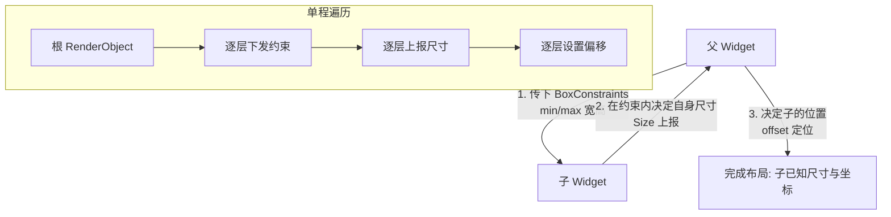

# 07 · 布局 Widget（Layout Widgets）
> 掌握 Row/Column/Container/Expanded/Stack，并吃透 Flutter 布局的黄金三句：约束向下、尺寸向上、父级定位。

## 📖 知识讲解

### 1. 线性布局：Row 与 Column
`Row`（横向）和 `Column`（纵向）把子项沿**主轴（main axis）**排列，垂直方向是**交叉轴（cross axis）**。

- `mainAxisAlignment`：主轴对齐。常用 `start / center / end / spaceBetween / spaceAround / spaceEvenly`。
- `crossAxisAlignment`：交叉轴对齐。常用 `start / center / end / stretch`。
- `mainAxisSize`：主轴占多大。`max`（默认，尽量占满父级）/ `min`（刚好包住子项）。想让 Column「包裹内容」而非撑满时改成 `min`。

> 记忆：Row 主轴是水平的，所以 `mainAxisAlignment` 管左右；Column 主轴是垂直的，管上下。

### 2. 万能盒子：Container
`Container` 是组合型便捷 Widget，集边距、尺寸、装饰于一身：
- `padding`：内边距（内容与边框之间）。
- `margin`：外边距（边框与外部之间）。
- `decoration`：`BoxDecoration`，设背景色、圆角、边框、渐变、阴影（用 `decoration` 时不要再单独设 `color`，二者冲突）。

### 3. 弹性分配：Expanded / Flexible / Spacer（只能用在 Row/Column/Flex 内）
- `Expanded`：按 `flex` 比例瓜分剩余空间，并**强制填满**分到的份额（相当于 `Flexible(fit: FlexFit.tight)`）。
- `Flexible`：按 `flex` 比例分配，但**允许子项比份额更小**（`fit: FlexFit.loose`）。
- `Spacer`：一个纯弹性空白，等价于 `Expanded(child: SizedBox())`，用来把两侧内容推开。

### 4. 层叠布局：Stack / Positioned
`Stack` 让子项**层叠堆放**（后写的在上层）。
- 非定位子项由 `alignment` 统一对齐。
- 用 `Positioned` 包裹子项并设 `top/right/bottom/left` 精确定位；`Positioned.fill` 让子项铺满整个 Stack。

### 5. 布局三步原则（最重要）
Flutter 布局是一次单程遍历，遵循三句话：
1. **约束向下传递（constraints go down）**：父 Widget 把「最小/最大宽高」约束（`BoxConstraints`）传给子 Widget。
2. **尺寸向上返回（sizes go up）**：子 Widget 在约束范围内决定自己的尺寸，回报给父级。
3. **父级定位（parent sets position）**：父 Widget 拿到子尺寸后，决定把子放在哪个坐标。

关键推论：**一个 Widget 的大小同时由「父给的约束」和「它自己想要多大」共同决定**。所以经常出现「我给 Container 设了 `width:100` 却不生效」——因为父级给的是紧约束（tight），Container 只能服从父级。理解这条能解决绝大多数「布局不如预期」的困惑。

## 🔄 流程图 / 原理图

约束传递（constraints go down, sizes go up）：



## 💻 代码说明

`main.dart` 用一个 `Column` 纵向堆了三块，覆盖全部要点：

- **Container 块**：演示 `margin` + `padding` + `decoration`（圆角边框背景）。
- **Row 块**：在一行里放 `Expanded(flex:2)`、`Flexible(flex:1)`、`Spacer()` 和一个固定宽度盒子，直观看到弹性分配与固定尺寸的差异。
- **Stack 块**：用 `Positioned.fill` 铺底、`Positioned` 放左上/右下角徽标、`Center` 放居中文字，展示层叠定位。
- `Column` 用 `crossAxisAlignment: stretch` 让子项横向铺满；第三块用 `Expanded` 吃掉剩余高度。
- `_box` / `_badge` 是辅助方法，避免重复样式代码。

## ▶️ 运行方式

```bash
flutter create demo
cd demo
cp ../07-layout-widgets/main.dart lib/main.dart
flutter run
```

进阶调试建议：运行后在 IDE 打开 **Flutter DevTools → Layout Explorer / Widget Inspector**，能可视化每个节点收到的约束与实际尺寸，是理解「约束向下、尺寸向上」的最佳工具。

## ⚠️ 常见坑 / 最佳实践

- **「设了宽高不生效」**：多半是父级下发了紧约束（tight）。想强行指定尺寸可用 `SizedBox`、`ConstrainedBox`、或外面套 `Align`/`Center` 放松约束。
- **Row/Column 溢出（黄黑警戒条 RenderFlex overflow）**：子项总尺寸超过可用主轴空间。用 `Expanded`/`Flexible` 分配，或换成可滚动的 `ListView`/`SingleChildScrollView`。
- **`Expanded`/`Flexible` 用错地方**：它们**只能**作为 `Row`/`Column`/`Flex` 的直接子项，放别处会报错。
- **`Container` 同时设 `color` 和 `decoration`**：会抛断言。颜色请放进 `BoxDecoration(color: ...)`。
- **无约束里放无界子项**：如在 `Column` 里直接放另一个纵向 `ListView` 会报「无界高度」，需用 `Expanded` 或给定高度。
- **`Stack` 里全是 `Positioned`**：Stack 自身可能收缩到最小，注意给 Stack 一个明确尺寸（如放进 `Expanded` 或 `SizedBox`）。

## 🔗 官方文档

- 布局构建教程：https://docs.flutter.dev/ui/layout
- 理解约束（Understanding constraints）：https://docs.flutter.dev/ui/layout/constraints
- 布局类 Widget 目录：https://docs.flutter.dev/ui/widgets/layout
- Flex / Expanded API：https://api.flutter.dev/flutter/widgets/Expanded-class.html
