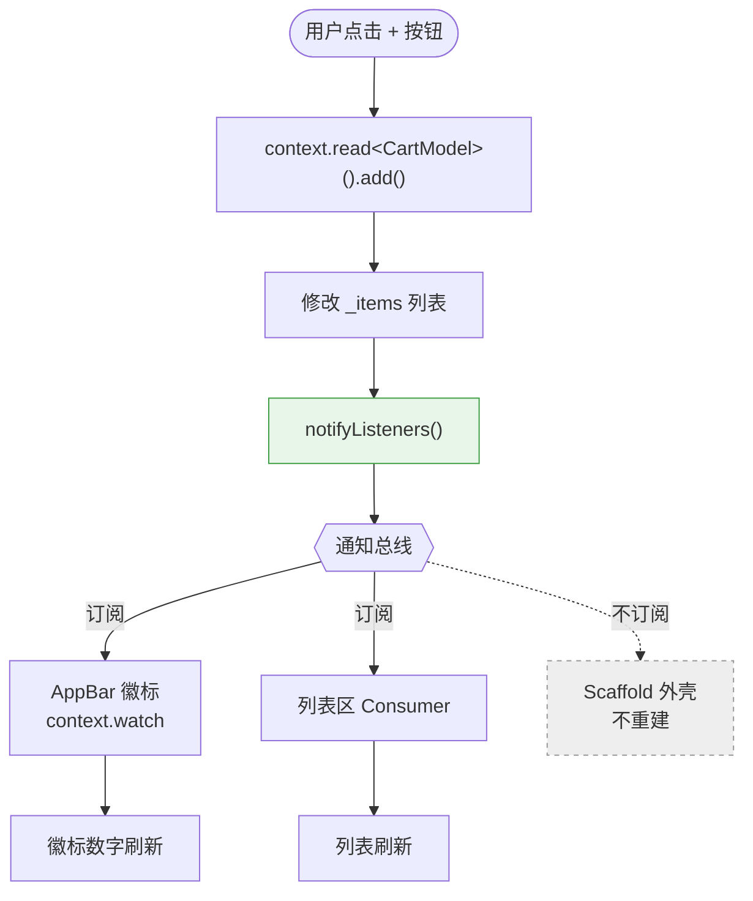
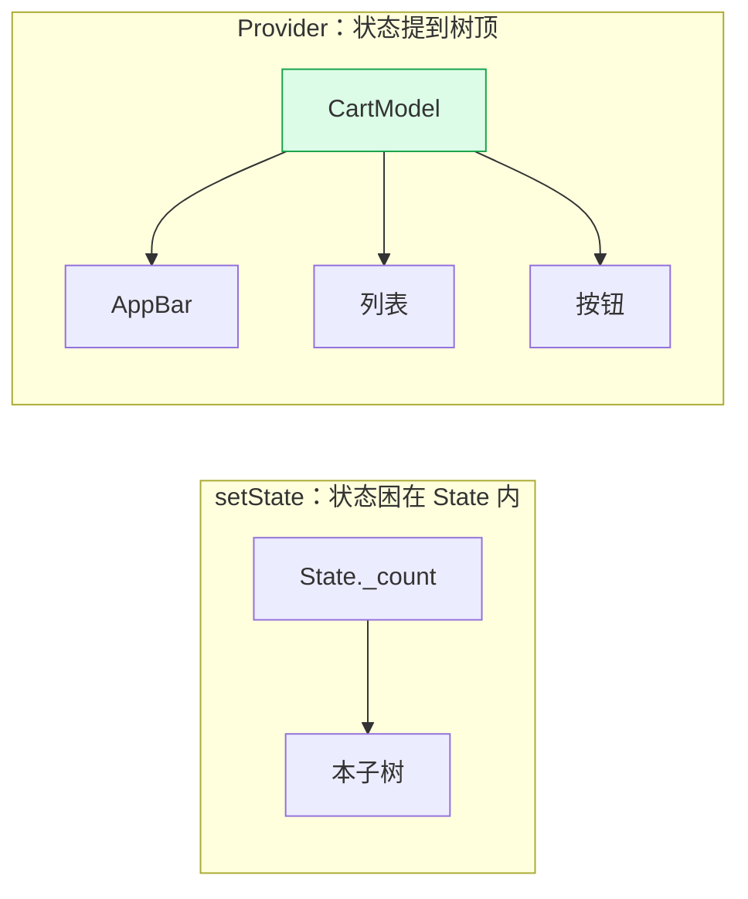

# 08 · 状态管理（State Management）
> 当状态需要「跨多个 Widget 共享」或「层级很深」时，裸 `setState` 会失控。本模块用 Provider（官方推荐入门方案）把状态抽出 Widget，并对照 setState 与 Riverpod。

## 📖 知识讲解

### 1. 为什么 setState 不够用
`setState` 只能重建**当前 State 的子树**，状态也只活在这个 State 里。一旦：
- 兄弟组件要共享同一状态，或
- 状态要从顶层「穿透」多层传到深处（**prop drilling** 属性逐层透传），

setState 就要靠层层回调 + 构造参数传递，代码迅速腐化。解决思路是把状态**提升出 Widget 树**，让任意节点直接订阅。

### 2. Provider = InheritedWidget 的易用封装
Flutter 底层用 **InheritedWidget** 实现「沿树向下高效共享数据」。Provider 在其之上封装，配合 `ChangeNotifier` 提供三件套：
- **`ChangeNotifier`**：可监听的状态容器；改数据后调 `notifyListeners()` 广播「我变了」。
- **`ChangeNotifierProvider`**：在树的某个祖先节点**创建并提供**这个 model，后代都能取到同一实例。
- **读取三方式**：
  | 用法 | 是否订阅重建 | 场景 |
  |---|---|---|
  | `context.watch<T>()` | 是 | 在 build 里读值，值变要重建 |
  | `Consumer<T>(builder:)` | 是（仅包裹范围） | 精确缩小重建范围 |
  | `context.read<T>()` | 否 | 在回调里调方法（如按钮 onPressed） |

### 3. 关键性能点：缩小重建范围
`notifyListeners()` 只会重建**订阅了它的 widget**（`watch`/`Consumer`），不订阅的（`read`、外层 Scaffold）不动。把 `Consumer` 包在真正需要变化的最小子树上，是 Provider 的核心优化手段。

### 4. 三种方案定位
| 方案 | 适用 | 特点 |
|---|---|---|
| **setState** | 单个 Widget 内部的局部状态 | 最简单，零依赖；不跨组件 |
| **Provider** | 中小型 App 的共享状态 | 官方推荐入门；依赖 BuildContext |
| **Riverpod** | 中大型；要可测试/编译期安全 | 不依赖 context、全局 provider、支持 autoDispose |

## 🔄 流程图 / 原理图

Provider 数据流与重建范围：



对比 setState 与 Provider 的状态归属：



## 💻 代码说明

`main.dart` 用 Provider 实现购物车：

- **`CartModel extends ChangeNotifier`**：`_items` 私有，仅暴露 `List.unmodifiable` 只读视图；`count`/`totalPrice` 是**派生状态**（getter 计算，无需另存）。每个改动方法结尾调 `notifyListeners()`。
- **注入**：`main()` 里 `ChangeNotifierProvider(create: (_) => CartModel(), child: MyApp())` 把 model 放在树顶。
- **订阅**：AppBar 徽标用 `context.watch<CartModel>().count`；列表区用 `Consumer<CartModel>` 只重建这一块。
- **触发**：三个按钮的 `onPressed` 用 `context.read<CartModel>()` 拿到 model 调 `add/removeLast/clear`——**回调里用 read，不订阅、不重建**。
- 运行时看控制台：点按钮时 `Consumer.build` 会打印，而 `CartPage.build` 外壳基本不重建，直观体现「按需重建」。
- 文件末尾以注释给出**等价 Riverpod 写法**（`NotifierProvider` + `ProviderScope` + `ref.watch`），仅对照不编译。

## ▶️ 运行方式

```bash
flutter create demo
cd demo
flutter pub add provider           # 安装 Provider 依赖（关键）
cp ../08-state-management/main.dart lib/main.dart
flutter run
```

想跑注释里的 Riverpod 版本，则改装 `flutter pub add flutter_riverpod` 并按注释改写。

## ⚠️ 常见坑 / 最佳实践

- **改了数据忘了 `notifyListeners()`**：UI 不刷新，最常见的「明明改了却不动」。
- **在 `build` 外或回调里用 `watch`**：`watch` 只能在 `build` 方法内调用；回调（onPressed）里要用 `read`，否则报错。
- **直接暴露可变内部集合**：外部拿到 `_items` 直接 `add` 会绕过 `notifyListeners`；用 `List.unmodifiable` 或复制返回。
- **Consumer 包太大**：把整页包进 Consumer 会让整页随状态重建，失去精细重建的意义；只包会变的最小子树。
- **在 build 里 `create` model**：应交给 `Provider` 的 `create` 管理生命周期，别在 build 里 `new`，否则每次重建都新建、状态丢失。
- **多个状态**：用 `MultiProvider` 组合多个 Provider，别嵌套一大堆。
- **Provider vs Riverpod**：新项目若看重可测试性与编译期安全，可直接上 Riverpod；它不依赖 `BuildContext`，避免了「provider not found」类 context 错误。

## 🔗 官方文档

- 状态管理总览（含选型）：https://docs.flutter.dev/data-and-backend/state-mgmt/intro
- 简单状态管理 · setState：https://docs.flutter.dev/data-and-backend/state-mgmt/simple
- Provider 官方指南：https://docs.flutter.dev/data-and-backend/state-mgmt/simple#provider
- provider 包：https://pub.dev/packages/provider
- InheritedWidget：https://api.flutter.dev/flutter/widgets/InheritedWidget-class.html
- Riverpod 官网：https://riverpod.dev
