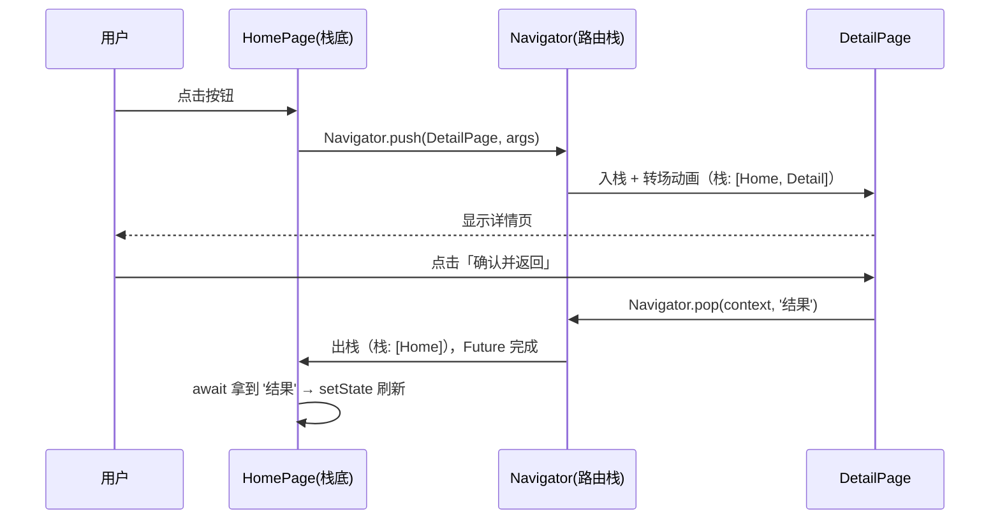

# 09 · 导航与路由（Navigation & Routing）
> 用 Navigator 管理页面栈，实现页面跳转、命名路由传参与返回值，并了解声明式路由 go_router。

## 📖 知识讲解

Flutter 的页面（Route）由 `Navigator` 以「栈」的形式管理：新页面 **push（入栈）** 盖在旧页面之上，**pop（出栈）** 则回到上一页。栈顶就是用户当前看到的页面。

### 1. 匿名路由：Navigator.push / pop
最直接的跳转方式，配合 `MaterialPageRoute`（提供平台化的进出场转场动画）：

```dart
Navigator.push(context, MaterialPageRoute(
  builder: (context) => const DetailPage(message: 'hello'),
));
Navigator.pop(context); // 返回上一页
```
- 传参：直接通过目标页构造函数传（类型安全，最推荐）。
- `MaterialPageRoute` 在 Android 上是纵向滑入、iOS 上是横向滑入的平台化动画。

### 2. 命名路由：routes 表 + pushNamed + onGenerateRoute
把路由集中登记，用字符串名字跳转，适合中大型 App 统一管理：

```dart
MaterialApp(
  routes: { '/': (c) => HomePage() },          // 静态、无参路由
  onGenerateRoute: (settings) { ... },          // 动态/带参路由的工厂
)
Navigator.pushNamed(context, '/detail', arguments: '参数');
```
- **命名路由传参**：`pushNamed` 的 `arguments` 会放进 `settings.arguments`，在 `onGenerateRoute` 里取出并强转类型后再构造页面。
- `routes` 表适合无参路由；带参数的路由放到 `onGenerateRoute` 里处理更清晰，也能做 404 兜底。

### 3. 路由返回值：await Navigator.push
`push` / `pushNamed` 返回一个 `Future`，会在目标页 `pop` 时以「pop 的第二个参数」完成：

```dart
final result = await Navigator.push<String>(context, route);
// 目标页：Navigator.pop(context, '结果值');
```
- 若用户点系统返回键直接退出，`result` 为 `null`，务必判空。
- 异步 await 之后再用 `context` / `setState`，先检查 `if (!mounted) return;`。

### 4. 声明式路由简介：go_router
官方推荐的进阶路由方案，适合 Web/深链接（URL）、嵌套路由、重定向等复杂场景：

```dart
// flutter pub add go_router
final router = GoRouter(routes: [
  GoRoute(path: '/', builder: (c, s) => const HomePage()),
  GoRoute(path: '/detail/:id', builder: (c, s) => DetailPage(id: s.pathParameters['id']!)),
]);
MaterialApp.router(routerConfig: router);
// 跳转：context.go('/detail/42') 或 context.push('/detail/42')
```
- `context.go` 会替换整个栈（适合底部导航切换）；`context.push` 是压栈（可返回）。
- 相比命令式 Navigator，go_router 把「URL ↔ 页面」映射声明化，天然支持浏览器地址栏与深链接。

## 🔄 流程图 / 原理图



## 💻 代码说明

- `MaterialApp` 同时配置了 `routes`（登记 `/` 首页）与 `onGenerateRoute`（处理 `/detail` 带参路由并做 404 兜底）。
- 首页是 `StatefulWidget`，因为要在拿到返回值后 `setState` 刷新展示。
- `_openByPush`：匿名路由，参数走构造函数；`_openByPush`/`_openByNamed` 都 `await` push 的返回值，并在 `if (!mounted) return;` 后 `setState`。
- `_openByNamed`：命名路由，参数放 `arguments`，由 `onGenerateRoute` 里 `settings.arguments as String?` 取回。
- `DetailPage` 通过 `Navigator.pop(context, '...')` 把用户选择回传给首页。

## ▶️ 运行方式

```bash
flutter create demo
cd demo
# 用本模块的 main.dart 覆盖 lib/main.dart
flutter run
```
如需体验 go_router，执行 `flutter pub add go_router` 后按上文「4.」改造。

## ⚠️ 常见坑 / 最佳实践

- **await 后用 context 前先判 mounted**：跳转返回是异步的，页面可能已被销毁，否则触发 `use_build_context_synchronously` 告警甚至崩溃。
- **pop 返回值可能为 null**：用户按系统返回键不会带值，务必判空（`result ?? 默认值`）。
- **arguments 类型不安全**：`settings.arguments` 是 `Object?`，强转前最好判空/判类型，避免运行时异常。
- **不要在 build 里直接 push**：跳转应放在事件回调（如 onPressed）里，避免构建期触发导航。
- **命名路由 vs go_router**：纯 App 内简单跳转用 Navigator 足够；涉及 Web URL、深链接、复杂嵌套时选 go_router。

## 🔗 官方文档

- Navigation and routing 概览：https://docs.flutter.dev/ui/navigation
- 传参给命名路由：https://docs.flutter.dev/cookbook/navigation/navigate-with-arguments
- 返回数据给上一页：https://docs.flutter.dev/cookbook/navigation/returning-data
- go_router 包：https://pub.dev/packages/go_router
