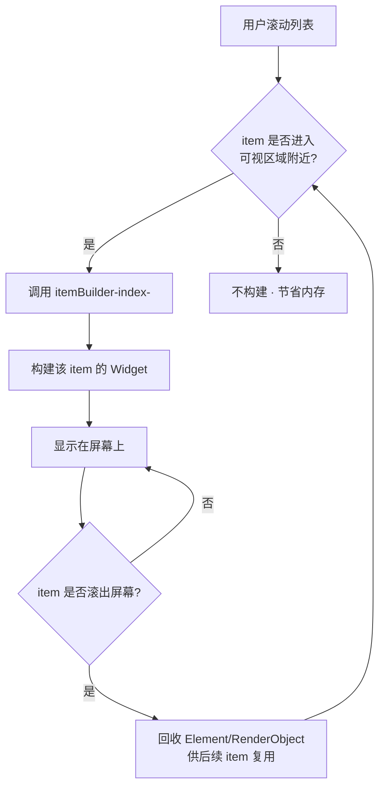

# 10 · 列表与滚动（Lists & Scrolling）
> 用 ListView.builder 懒加载长列表，配合分隔线、网格、Sliver 和下拉刷新，构建高性能滚动界面。

## 📖 知识讲解

滚动是移动端最高频的交互。Flutter 提供从简单到强大的一整套滚动组件。

### 1. ListView：默认构造 vs builder 懒加载
```dart
// 默认构造：一次性构建所有 children，适合「少量、已知」的静态列表
ListView(children: [Text('a'), Text('b'), Text('c')]);

// builder 构造：懒加载，只在 item 进入可视区域附近时才调用 itemBuilder
ListView.builder(
  itemCount: 10000,
  itemBuilder: (context, index) => ListTile(title: Text('第 $index 项')),
);
```
- **默认构造** 会立即构建全部子 Widget，列表一长就会卡顿甚至 OOM。
- **builder 构造** 是懒加载 + 回收复用：滚出屏幕的 item 会被回收，滚入的按需构建。**长列表/无限列表必须用 builder。**

### 2. ListView.separated：带分隔线
在 `itemBuilder` 之外多一个 `separatorBuilder`，在相邻 item 之间插入分隔（如 `Divider`），同样是懒加载。

### 3. GridView.builder：网格布局
```dart
GridView.builder(
  gridDelegate: const SliverGridDelegateWithFixedCrossAxisCount(
    crossAxisCount: 2,     // 每行 2 列
    mainAxisSpacing: 8,    // 纵向间距
    crossAxisSpacing: 8,   // 横向间距
    childAspectRatio: 1.5, // 子项宽高比
  ),
  itemCount: 100,
  itemBuilder: (context, index) => Card(child: Center(child: Text('$index'))),
);
```
- `SliverGridDelegateWithFixedCrossAxisCount`：固定列数；
- `SliverGridDelegateWithMaxCrossAxisExtent`：按最大宽度自动决定列数（更适合自适应/Web）。

### 4. CustomScrollView + Sliver（简介）
当一个页面里要混合「可折叠标题栏 + 列表 + 网格」并共享同一个滚动，用 `CustomScrollView` 组合多个 Sliver：
```dart
CustomScrollView(slivers: [
  SliverAppBar(expandedHeight: 200, flexibleSpace: FlexibleSpaceBar(title: Text('标题'))), // 可滚动折叠的顶栏
  SliverList(delegate: SliverChildBuilderDelegate((c, i) => ListTile(title: Text('$i')), childCount: 50)),
]);
```
- Sliver 是「可滚动区域内的一段」，`SliverAppBar` 能随滚动展开/收起，是实现视差顶栏的标准做法。

### 5. 下拉刷新：RefreshIndicator
```dart
RefreshIndicator(
  onRefresh: () async { await fetchData(); }, // 必须返回 Future
  child: ListView.builder(...),
);
```
- `onRefresh` 返回的 `Future` 完成后，刷新圈才会收起。
- 被包裹的 child 必须是可滚动且滚动方向为竖直的组件。

## 🔄 流程图 / 原理图



## 💻 代码说明

- 数据源 `_items` 初始 30 条，真实场景来自网络。
- 用 `ListView.separated`：`itemBuilder` 构建每个 `ListTile`，`separatorBuilder` 在相邻项间插入 `Divider`——两者都是懒加载。
- 外层 `RefreshIndicator` 提供下拉刷新，`_onRefresh` 用 `Future.delayed` 模拟网络，完成后 `setState` 替换数据。
- `if (!mounted) return;`：异步刷新完成后操作 `setState` 前判活，避免页面已销毁时报错。

## ▶️ 运行方式

```bash
flutter create demo
cd demo
# 用本模块的 main.dart 覆盖 lib/main.dart
flutter run
```
运行后向下拖动列表触发刷新，可见列表项文本变为「刷新后…」。

## ⚠️ 常见坑 / 最佳实践

- **长列表禁用默认 ListView(children:...)**：会一次性构建全部子项，卡顿/内存暴涨；一律用 `.builder`/`.separated`。
- **item 尽量固定高度**：不定高列表滚动时需反复测量，性能差；能定高就用 `itemExtent` 提升性能。
- **RefreshIndicator 的 onRefresh 必须 await 完成**：否则刷新圈会立刻消失，体验割裂。
- **给 item 加 Key 需谨慎**：动态增删/排序时用 `ValueKey` 帮助框架正确复用；否则默认按位置复用即可。
- **嵌套滚动别用 shrinkWrap+physics 硬凑**：多区域共享滚动优先用 `CustomScrollView + Sliver`，性能更好。

## 🔗 官方文档

- 列表与网格 Cookbook：https://docs.flutter.dev/cookbook/lists
- 长列表（ListView.builder）：https://docs.flutter.dev/cookbook/lists/long-lists
- 网格列表 GridView：https://docs.flutter.dev/cookbook/lists/grid-lists
- Sliver / CustomScrollView：https://docs.flutter.dev/ui/layout/scrolling/slivers
- 下拉刷新 RefreshIndicator：https://docs.flutter.dev/cookbook/effects/download-button（滚动效果）与 https://api.flutter.dev/flutter/material/RefreshIndicator-class.html
