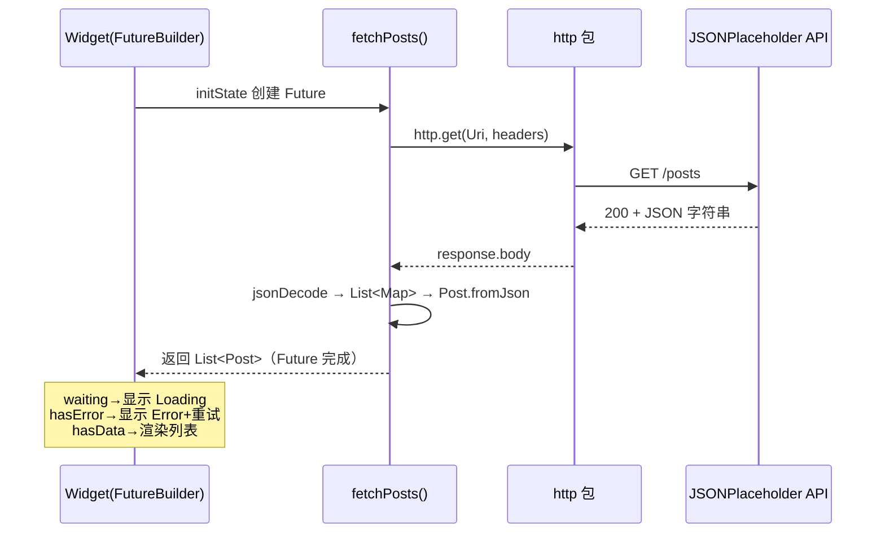

# 11 · 网络与 JSON（Network & HTTP / JSON）
> 用 http 包发请求、jsonDecode + fromJson 解析 JSON，并用 FutureBuilder 优雅处理加载/错误/数据三态。

## 📖 知识讲解

移动端离不开网络。Flutter 官方推荐用 [`http`](https://pub.dev/packages/http) 包做基础 HTTP，配合 `dart:convert` 解析 JSON，再用 `FutureBuilder` 把异步结果映射成界面。

### 1. http 包：get / post / headers
```dart
import 'package:http/http.dart' as http;

// GET
final res = await http.get(
  Uri.parse('https://jsonplaceholder.typicode.com/posts'),
  headers: {'Accept': 'application/json'},
);

// POST
final res2 = await http.post(
  Uri.parse('https://jsonplaceholder.typicode.com/posts'),
  headers: {'Content-Type': 'application/json'},
  body: jsonEncode({'title': 'hi', 'body': '...', 'userId': 1}),
);
```
- URL 必须包成 `Uri`（`Uri.parse(...)`）。
- 用 `response.statusCode` 判断成功（一般 2xx），`response.body` 是响应字符串。

### 2. JSON 解析：jsonDecode → Map → fromJson 工厂
```dart
final List<dynamic> list = jsonDecode(response.body);       // 字符串 → Dart 对象
final posts = list.map((e) => Post.fromJson(e)).toList();   // Map → 强类型模型
```
- `jsonDecode` 返回 `dynamic`：对象→`Map<String,dynamic>`，数组→`List<dynamic>`。
- **手写 `factory Post.fromJson(Map<String,dynamic> json)`** 是小型项目的标准做法；大型项目可用 `json_serializable` 代码生成。
- 取字段时显式 `as int`/`as String` 便于早暴露类型问题。

### 3. FutureBuilder：loading / error / data 三态
`FutureBuilder` 监听一个 `Future`，用 `snapshot` 描述当前状态，自动重建界面：
```dart
FutureBuilder<List<Post>>(
  future: _postsFuture,
  builder: (context, snapshot) {
    if (snapshot.connectionState == ConnectionState.waiting) return Loading();
    if (snapshot.hasError) return Error(snapshot.error);
    return DataList(snapshot.data!);
  },
);
```
- **loading**：`connectionState == waiting`；
- **error**：`snapshot.hasError`（请求内抛异常即进入此分支）；
- **data**：`snapshot.hasData` / `snapshot.data`。
- **关键坑**：`future` 要在 `initState` 里创建并存字段，**不要在 build 里直接调 `fetchPosts()`**，否则每次重建都重新发请求。

## 🔄 流程图 / 原理图



## 💻 代码说明

- `Post` 模型 + `factory Post.fromJson`：把 JSON Map 映射为强类型对象。
- `fetchPosts()`：`http.get` 带 `Accept` 头；`statusCode==200` 才解析，否则 `throw Exception` 让 FutureBuilder 走 error 分支；`.take(20)` 限制条数。
- `_postsFuture` 在 `initState` 里赋值一次；`_retry()` 重新赋值 + `setState` 触发重建实现「重试」。
- `FutureBuilder` 的 builder 依次判断 `waiting`（转圈）、`hasError`（错误页 + 重试按钮）、data（`ListView.separated` 渲染）。

## ▶️ 运行方式

```bash
flutter create demo
cd demo
flutter pub add http          # 添加 http 依赖
# 用本模块的 main.dart 覆盖 lib/main.dart
flutter run                   # 真机/模拟器
# 或跑到 Chrome：flutter run -d chrome
```

**网络权限 / 平台注意：**
- **Android**：需在 `android/app/src/main/AndroidManifest.xml` 的 `<manifest>` 下声明网络权限：
  ```xml
  <uses-permission android:name="android.permission.INTERNET"/>
  ```
  且 Android 9+ 默认禁止明文 HTTP（本示例用的是 HTTPS，无需额外配置；若访问 http:// 需配置 `usesCleartextTraffic`）。
- **Web（-d chrome）**：目标接口需允许 **CORS**。JSONPlaceholder 已开启 CORS，可直接跑；访问不带 CORS 的接口会在浏览器被拦截。
- **iOS/macOS**：macOS 还需在 `*.entitlements` 打开 `com.apple.security.network.client`。

## ⚠️ 常见坑 / 最佳实践

- **别在 build 里创建 Future**：会导致每次 setState/重建都重发请求；放 `initState` 或用状态管理缓存。
- **一定判 statusCode**：`http` 不会因 4xx/5xx 抛异常，需手动判断并抛错。
- **JSON 类型强转要稳**：字段可能为 null 或类型不符，`as int` 前考虑用 `json['id'] as int? ?? 0` 兜底。
- **Web 端 CORS**：跑 `-d chrome` 时接口无 CORS 头会被浏览器拦截，这是浏览器限制而非代码错误。
- **进阶用 Dio**：需要拦截器、超时、重试、上传进度时，`dio` 比 `http` 更强大。

## 🔗 官方文档

- 从网络取数据：https://docs.flutter.dev/cookbook/networking/fetch-data
- 后台解析 JSON：https://docs.flutter.dev/cookbook/networking/background-parsing
- JSON 与序列化：https://docs.flutter.dev/data-and-backend/serialization/json
- http 包：https://pub.dev/packages/http
