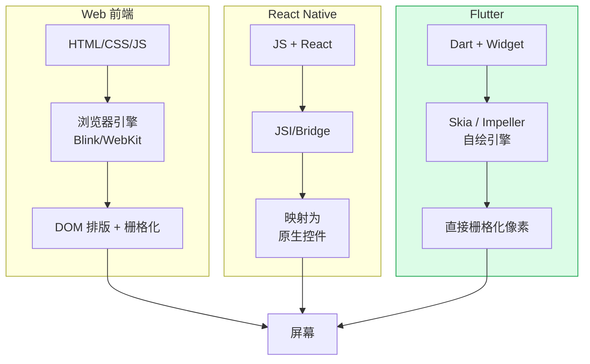
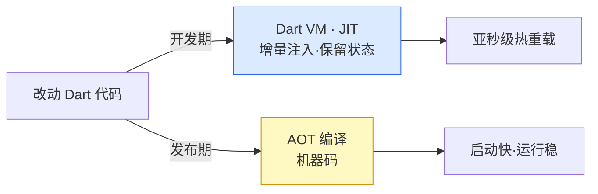

# 12 · Flutter 与 Web / React Native 对比 + 环境搭建（Flutter vs Web / RN）
> 收尾模块。横向对比 Flutter 与「Web 前端」「React Native」的渲染与开发范式，并给出环境搭建 + 热重载的完整上手流程。本模块**以文档为主，demo 为辅**。

## 📖 知识讲解

### 1. 三种技术的渲染路线（最本质的区别）
| | 谁负责画像素 | UI 树映射 |
|---|---|---|
| **Web 前端**（HTML/CSS/JS） | **浏览器引擎**（Blink/WebKit）解析 DOM + CSS 排版并栅格化 | 你写 DOM，浏览器渲染 |
| **React Native** | **平台原生控件**（UIView / android.view） | JS 描述 → 桥接 → 映射成**真实原生控件** |
| **Flutter** | **自带渲染引擎**（Skia / Impeller）**自己画**每个像素 | Widget → Element → RenderObject，绕过原生控件与 DOM |

一句话：**Web 交给浏览器画，RN 交给原生控件画，Flutter 自己画**。Flutter 因此在所有平台**像素级一致**，不受各端控件差异影响（详见工程根目录《[原理详解.md](../原理详解.md)》三棵树一节）。

### 2. Flutter vs Web 前端
- **布局模型**：Web 用 CSS（盒模型、Flexbox、Grid、文档流）；Flutter 用 **Widget 组合**（`Row`/`Column`/`Flex`/`Stack`），约束自上而下传、尺寸自下而上返（constraints go down, sizes go up）。
- **语言/类型**：Web 用 JS/TS；Flutter 用 **Dart**（AOT 编成机器码，sound null safety）。
- **样式**：Web 靠外部 CSS 层叠；Flutter **无 CSS**，样式即 Widget 参数（`TextStyle`、`BoxDecoration`），就近声明。
- **Flutter 也能编 Web**：`flutter build web` 产出 HTML+JS/Wasm，用 CanvasKit/Skwasm 在 `<canvas>` 上自绘。适合「一套代码顺带出 Web」，但**首屏体积、SEO、可访问性**不如原生 Web。

### 3. Flutter vs React Native
| 维度 | React Native | Flutter |
|---|---|---|
| 语言 | JS/TS + React | Dart |
| 渲染 | 映射到**原生控件** | **自绘引擎**（Skia/Impeller） |
| 一致性 | 随各端控件略有差异 | 各端**像素一致** |
| 通信 | 新架构 JSI 直连（旧版走异步 Bridge） | Dart 直接驱动引擎，无桥 |
| 生态 | 复用庞大 npm/JS 生态 | pub.dev + 官方全家桶 |
| 性能 | 接近原生（重列表/动画偶有掉帧） | AOT + 自绘，动画/滚动稳定 60/120fps |

RN 胜在**复用 React/JS 生态与原生观感**；Flutter 胜在**一致性、性能与自带渲染**。

### 4. 平台自适应
同一份 Flutter 代码可在运行时判断平台做适配：
- `kIsWeb`：是否在 Web。
- `defaultTargetPlatform`：当前目标平台枚举。
- `Theme.of(context).platform`：**做 UI 适配优先用它**（可被覆盖，便于测试/统一风格）。
- 官方 `Cupertino*`（iOS 风）与 `Material*`（Android/通用）两套控件按需切换。

### 5. 热重载（Hot Reload）为何这么快
Flutter 开发期用 **Dart VM 的 JIT**：改代码后只把**改动的类/函数**增量注入正在运行的 VM，**保留当前 App 状态**（如已输入的表单、已滚动的位置），亚秒级看到效果。发布期则切 **AOT** 编成机器码保证性能。这与 Web 的 HMR 思路相近，但 Flutter 连原生 UI 一起热重载。

## 🔄 流程图 / 原理图

三种技术的渲染路线对比：



热重载 JIT / 发布 AOT 双模式：



## 💻 代码说明

`main.dart` 是「平台自适应」小 demo：
- `_platformLabel`：用 `kIsWeb` + `defaultTargetPlatform` 打印当前运行平台。
- `isCupertino`：用 `Theme.of(context).platform` 判断，iOS/macOS 渲染 `CupertinoButton.filled`，其余渲染 Material 的 `FilledButton`——**同一份逻辑、按平台出不同原生化风格**，正是「一套代码多端自适应」的缩影。
- 用 `flutter run -d chrome` 与 `-d macos`（或真机）分别跑，能直观看到平台标签与按钮风格随平台变化。

## ▶️ 运行方式

### 环境搭建（一次）
```bash
# 1. 安装 Flutter SDK（含 Dart），把 flutter/bin 加进 PATH
flutter --version                 # 确认 Flutter 3.x / Dart 3.x
flutter doctor                    # 逐项检查：Android SDK / Xcode / Chrome / 设备
flutter doctor --android-licenses # 首次需同意 Android 许可

flutter devices                   # 列出可用设备（模拟器/真机/chrome/macos）
```

### 运行本 demo（体验同码多端 + 热重载）
```bash
flutter create demo
cd demo
cp ../12-flutter-vs-web-rn/main.dart lib/main.dart
flutter run              # 选设备运行
flutter run -d chrome    # 跑 Web，观察平台标签变为 Web
flutter run -d macos     # 跑桌面（需已装桌面支持）
# 运行中：改代码存盘或按 r 热重载（保留状态），R 热重启，q 退出
```

## ⚠️ 常见坑 / 最佳实践

- **不要用 `dart:io` 的 `Platform` 判断 Web**：`Platform.isXxx` 在 Web 上会抛异常；判断 Web 一律用 `kIsWeb`。
- **UI 适配用 `Theme.of(context).platform` 而非 `defaultTargetPlatform`**：前者可被覆盖，便于统一风格与测试。
- **Flutter Web ≠ 传统 Web**：自绘方案首屏体积大、SEO/可访问性弱；重内容型站点仍建议用真正的 Web 前端。
- **热重载不是万能**：改了 `main()`、全局变量初始值、`initState` 逻辑、或枚举/类结构，需要**热重启（R）**甚至重新 `flutter run` 才生效。
- **别指望复用 Web 的 CSS/DOM 知识直接套 Flutter**：Flutter 无 CSS、无 DOM，布局靠 Widget 约束模型，需重新建立心智模型。
- **选型建议**：已有 React/JS 团队且要原生观感 → RN；追求多端一致 + 高性能自绘 + 全家桶 → Flutter；纯内容站/强 SEO → Web 前端。

## 🔗 官方文档

- Flutter 面向 Web 开发者：https://docs.flutter.dev/get-started/flutter-for/web-devs
- Flutter 面向 RN 开发者：https://docs.flutter.dev/get-started/flutter-for/react-native-devs
- 架构总览（渲染管线）：https://docs.flutter.dev/resources/architectural-overview
- 安装与环境：https://docs.flutter.dev/get-started/install
- 热重载：https://docs.flutter.dev/tools/hot-reload
- 平台自适应设计：https://docs.flutter.dev/ui/adaptive-responsive
- Flutter Web 支持：https://docs.flutter.dev/platform-integration/web
