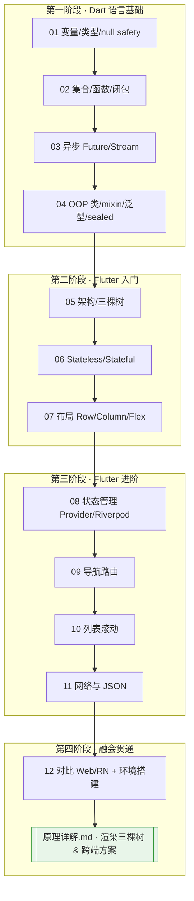
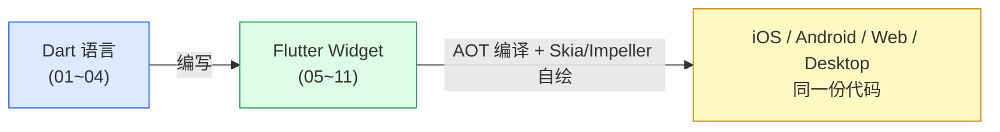

# 24 · Dart 语言 + Flutter 跨端（Dart & Flutter）

> 进阶工程 · 跨端层。用 **Dart 3** 语言 + **Flutter 3** 框架，一套代码自绘渲染到 iOS / Android / Web / Desktop。
> 本工程既讲 **Dart 语言**（前 4 个模块），也讲 **Flutter UI 框架**（后 8 个模块），并配一篇《[原理详解.md](./原理详解.md)》讲透三棵树渲染机制与跨端方案对比。

- 目标版本：**Dart 3.12** / **Flutter 3.44**（近版本，sound null safety 内置）。
- 对照官方：[dart.dev](https://dart.dev/language) · [docs.flutter.dev](https://docs.flutter.dev)。

---

## 📚 模块索引

| 编号 | 模块 | 类型 | 一句话 | 运行 |
|------|------|------|--------|------|
| 01 | [dart-basics](./01-dart-basics/) | Dart | 变量 / 类型 / null safety | `dart run` |
| 02 | [dart-collections-functions](./02-dart-collections-functions/) | Dart | 集合 / 函数 / 箭头 / 闭包 | `dart run` |
| 03 | [dart-async](./03-dart-async/) | Dart | Future / async·await / Stream | `dart run` |
| 04 | [dart-oop](./04-dart-oop/) | Dart | 类 / 构造 / mixin / 泛型 / sealed | `dart run` |
| 05 | [flutter-intro](./05-flutter-intro/) | Flutter | 架构 / 一切皆 Widget / 三棵树渲染 | `flutter run` |
| 06 | [stateless-stateful](./06-stateless-stateful/) | Flutter | 两种 Widget / build / setState | `flutter run` |
| 07 | [layout-widgets](./07-layout-widgets/) | Flutter | Row/Column/Container/Flex 布局 | `flutter run` |
| 08 | [state-management](./08-state-management/) | Flutter | setState / Provider / Riverpod 对比 | `flutter run` |
| 09 | [navigation-routing](./09-navigation-routing/) | Flutter | 页面导航 / 命名路由 / 传参返回 | `flutter run` |
| 10 | [lists-scrolling](./10-lists-scrolling/) | Flutter | ListView / GridView / Sliver | `flutter run` |
| 11 | [network-http](./11-network-http/) | Flutter | http 请求 / JSON / FutureBuilder | `flutter run` |
| 12 | [flutter-vs-web-rn](./12-flutter-vs-web-rn/) | 对比 | 与 Web/RN 对比 + 环境搭建热重载 | 文档 |

> ⭐ 工程根目录另有 **[《原理详解.md》](./原理详解.md)**：Dart 语言特性、Flutter 三棵树（Widget/Element/RenderObject）渲染原理、Skia/Impeller 自绘、与 React Native 桥接方案对比，多图讲透 how/why。

---

## 🗺️ 学习路线



---

## 🧩 两条主线的关系



Dart 是 Flutter 的官方语言（AOT 编译成机器码保证性能、JIT 支持热重载）；Flutter 用 Dart 声明式描述 UI，自带渲染引擎绕过原生控件，因此一套 UI 能像素级一致地跑在所有平台。

---

## ▶️ 快速开始

### Dart 模块（01~04，纯 Dart）
```bash
# 安装 Dart SDK（或随 Flutter 一起装）
dart --version                 # 确认 Dart 3.x
cd 01-dart-basics
dart run main.dart             # 直接运行，无需 Flutter
```

### Flutter 模块（05~12）
本工程 Flutter 模块只提供**核心 widget 源码片段**（避免每个模块塞一份庞大脚手架）。运行步骤统一：
```bash
# 一次性环境检查
flutter --version              # 确认 Flutter 3.x
flutter doctor                 # 检查 Android/iOS/Chrome 工具链

# 每个模块：新建工程 → 覆盖 lib/main.dart → 跑起来
flutter create demo
cd demo
cp ../05-flutter-intro/main.dart lib/main.dart   # 用对应模块的 .dart 覆盖
flutter pub add provider       # 若该模块 README 要求装依赖
flutter run                    # 选设备；或 flutter run -d chrome 跑 Web
# 运行中：按 r 热重载，R 热重启，q 退出
```

> 各模块 README 的「▶️ 运行方式」会写明该模块具体需要装的依赖（如 `http` / `provider` / `flutter_riverpod`）。

---

## 🔗 官方文档

- Dart 语言：https://dart.dev/language
- Dart null safety：https://dart.dev/null-safety
- Flutter 官方文档：https://docs.flutter.dev
- Flutter 面向 Web 开发者：https://docs.flutter.dev/get-started/flutter-for/web-devs
- Flutter 架构总览：https://docs.flutter.dev/resources/architectural-overview
