# 原理详解 · Dart 语言 & Flutter 渲染机制 & 跨端方案对比

> 本文是本工程的核心交付物，讲**how / why / 底层机制**，而非"怎么用"。
> 覆盖：① Dart 语言为什么这样设计（AOT/JIT、null safety、事件循环）；② Flutter **三棵树**（Widget / Element / RenderObject）渲染原理；③ Skia / Impeller 自绘引擎；④ 与 React Native「桥接」方案的本质区别；⑤ 常见误区。
> 目标版本：Dart 3.12 / Flutter 3.44。对照 [dart.dev](https://dart.dev) · [Flutter 架构总览](https://docs.flutter.dev/resources/architectural-overview)。

---

## 目录

1. [为什么 Flutter 选 Dart](#1-为什么-flutter-选-dart)
2. [Dart 语言的三个底层机制](#2-dart-语言的三个底层机制)
3. [Flutter 分层架构](#3-flutter-分层架构framework--engine--embedder)
4. [核心：Widget / Element / RenderObject 三棵树](#4-核心widget--element--renderobject-三棵树)
5. [一帧是怎么画出来的：build → layout → paint → composite](#5-一帧是怎么画出来的build--layout--paint--composite)
6. [布局协议：约束向下，尺寸向上，父级定位](#6-布局协议约束向下尺寸向上父级定位)
7. [Skia 与 Impeller：自绘引擎](#7-skia-与-impeller自绘引擎)
8. [热重载（Hot Reload）原理](#8-热重载hot-reload原理)
9. [跨端方案对比：Flutter vs React Native vs WebView](#9-跨端方案对比flutter-vs-react-native-vs-webview)
10. [常见误区](#10-常见误区)

---

## 1. 为什么 Flutter 选 Dart

Flutter 需要一门**同时满足"开发期高效迭代"和"生产期高性能"** 的语言，Dart 恰好两头都占：

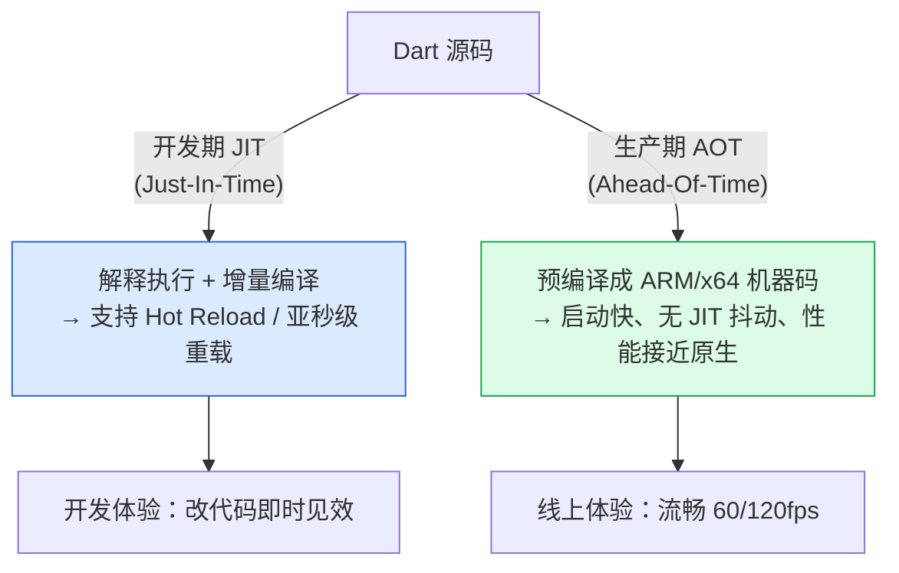

其它关键原因：
- **单线程 + 事件循环模型**：UI 天生是事件驱动，Dart 的 isolate + event loop 契合，且避免了多线程锁的复杂度（需要并行时用 Isolate，内存隔离、消息传递）。
- **无抢占式 GC 停顿感**：分代 GC 针对大量短生命周期对象（Flutter 每帧创建/丢弃海量 Widget）做了优化。
- **声明式友好**：Dart 语法简洁，支持把 UI 写成嵌套表达式（`Column(children: [...])`），没有 JSX 那样的模板/语言二元割裂。

---

## 2. Dart 语言的三个底层机制

### 2.1 Sound Null Safety（健全的空安全）

Dart 3 起空安全**内置且强制**。"Sound（健全）"意味着：只要类型不是可空的（没有 `?`），编译器**保证**它在运行时绝不为 `null`——这是编译期静态保证，不是运行时检查。

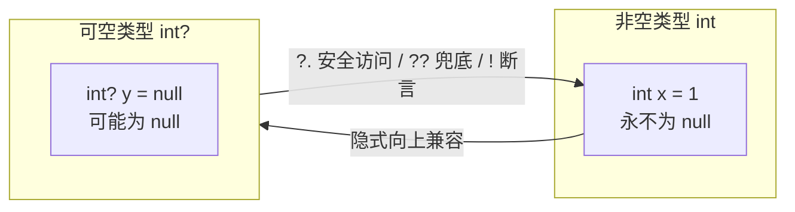

- `int?`：可空。`int`：非空。二者是**不同类型**。
- `?.`：前者为 null 则整体返回 null，不抛异常。
- `??` / `??=`：null 时取右值 / null 时才赋值。
- `!`：**断言**非空，若实际为 null 直接抛 `TypeError`（慎用）。
- `late`：承诺"稍后一定赋值再使用"，把非空变量的初始化延后（如依赖 `initState`）。

**为什么健全很值钱**：Kotlin 的空安全在与 Java 互操作时会漏（平台类型），而 Dart 没有历史包袱，整个类型系统闭环，编译器能真正消除大部分 NPE。

### 2.2 一切皆对象 + 事件循环

Dart 是**单线程**的，靠**事件循环**处理异步。关键：有**两个队列**，microtask 优先级高于 event。

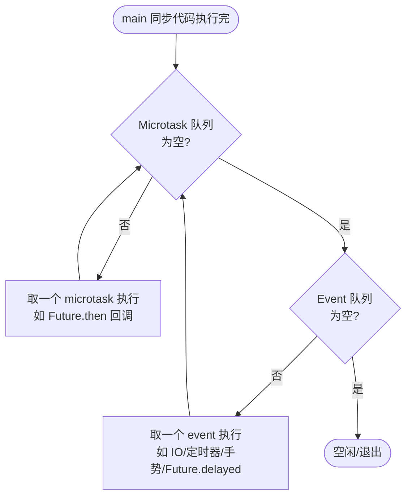

- `Future` = 一个"将来会有值"的对象；`await` = 挂起当前函数、把后续代码注册为回调，**不阻塞线程**。
- **microtask 会饿死 event**：若 microtask 里不断产生新 microtask，事件队列（含 UI 帧）永远轮不上——这是卡 UI 的隐蔽坑。
- `Stream` = 多个异步值的序列（`await for` / `listen`）；`Future` 只有一个值。

### 2.3 AOT vs JIT 双编译（见上一节图）

同一份 Dart 代码：`flutter run`（debug）走 JIT，`flutter build`（release）走 AOT。这解释了**为什么 debug 包比 release 包卡**——debug 是解释执行且带断言检查。

---

## 3. Flutter 分层架构（Framework / Engine / Embedder）

Flutter 是**自带引擎的自绘框架**，不依赖平台 UI 控件。分三层：

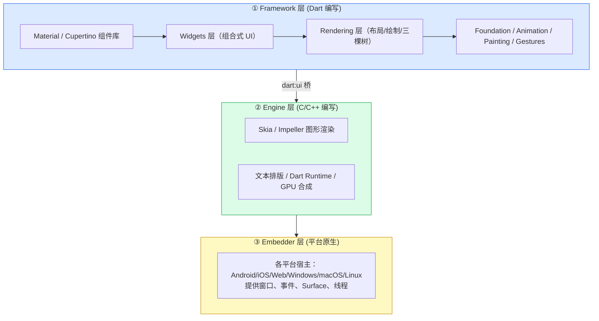

- **Framework（Dart）**：你写的 90% 代码在这层。组合式设计——复杂 UI 由简单 Widget 嵌套而成。
- **Engine（C++）**：核心是图形引擎（Skia/Impeller）、文本排版、Dart VM、以及 `dart:ui`（Dart 与 Engine 的边界 API）。
- **Embedder（原生）**：把 Flutter 嵌入具体平台，负责给它一块画布（Surface）、转发触摸/键盘事件、管理线程和生命周期。

**关键结论**：Flutter 只向平台要一块 **Canvas** 和 **事件流**，UI 上的每一个像素都是它自己画的，因此不同平台**像素级一致**，不受原生控件外观差异影响。

---

## 4. 核心：Widget / Element / RenderObject 三棵树

这是 Flutter 最重要的原理。开发者只写 Widget 树，但运行时其实**并行维护三棵树**，各司其职：

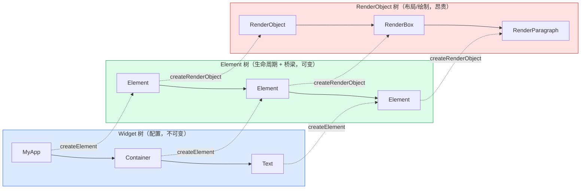

| 树 | 是什么 | 特点 | 谁创建 |
|----|--------|------|--------|
| **Widget** | UI 的**配置/描述**（蓝图） | **不可变**、极轻量、每次 build 大量新建又丢弃 | 开发者 |
| **Element** | Widget 在某位置的**实例**，连接另外两棵树 | **可变**、有生命周期、持有 State、负责 diff 复用 | `widget.createElement()` |
| **RenderObject** | 真正干活的：**布局、绘制、命中测试** | 重量级、尽量复用不重建 | `element.createRenderObject()` |

### 为什么要三棵而不是一棵？

因为 **Widget 极其廉价、每帧狂建，而 RenderObject 昂贵、要复用**。中间的 **Element** 是"稳定层"：它长期存活，负责判断新旧 Widget 能否复用同一个 Element/RenderObject。

**diff / 复用规则**（`Element.updateChild`）：当新 Widget 到来，Element 检查同位置旧 Widget：
- **`runtimeType` 相同 且 `key` 相同** → 复用 Element 和 RenderObject，只更新配置（最省）。
- 否则 → 废弃旧 Element 子树，新建。

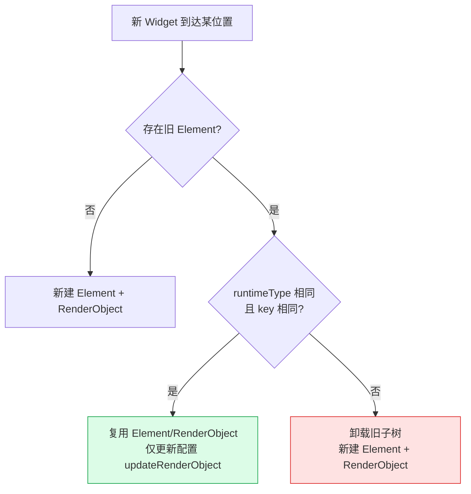

这解释了 **`Key` 的作用**：当列表项顺序变化或需要保持 State 时，`key` 帮 Element 正确匹配到"同一个"逻辑节点，避免状态错乱（经典坑：可勾选列表删除项后勾选态跳到别人身上——因为没给 key）。

### State 住在哪？

`StatefulWidget` 本身是**不可变**的，会被反复重建。真正持有可变状态的是 **State 对象**，而 State 挂在**长寿的 Element（StatefulElement）**上。所以 Widget 重建时 State 不丢失——这就是 setState 能保住计数值的底层原因。

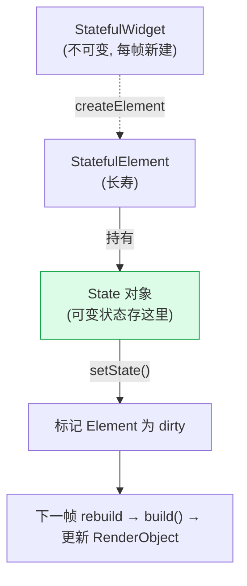

---

## 5. 一帧是怎么画出来的：build → layout → paint → composite

`setState()` 并不立即重绘，它只是**标记脏 + 请求一帧**。真正的工作在下一个 `vsync` 信号到来时，由 Engine 驱动一整条流水线：

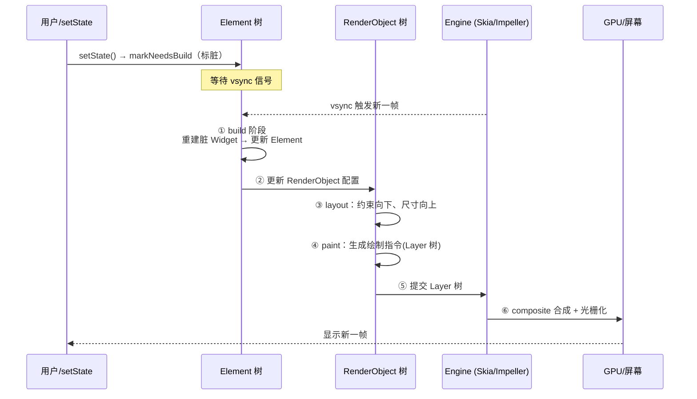

- **build**：只重建被标脏的 Element 子树（不是整棵树，这是性能关键）。
- **layout**：深度遍历 RenderObject，执行约束协议算尺寸和位置（下一节详解）。
- **paint**：把每个 RenderObject 画成绘制指令，产出 **Layer 树**（分层是为了让不动的层能被缓存复用）。
- **composite / raster**：Engine 把 Layer 合成，交 GPU 光栅化成像素。UI 线程（build/layout/paint）与 Raster 线程（合成）分离，互不阻塞。

> 60fps = 每帧 16.6ms 预算。build+layout+paint 超时就是**掉帧/卡顿**。因此 build 方法里别做重活、别在滚动时同步解码大图。

---

## 6. 布局协议：约束向下，尺寸向上，父级定位

Flutter 布局与 CSS **相反**，只需记住一句话（官方原话 *Constraints go down. Sizes go up. Parent sets position.*）：

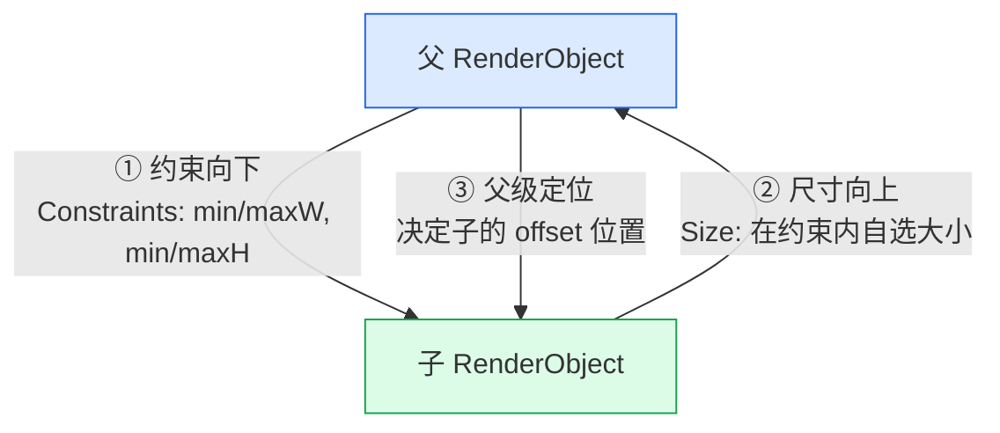

三步：
1. **父给子一个约束**（BoxConstraints：宽高的最小/最大范围）。
2. **子在约束范围内决定自己的尺寸**（子不能超出约束）。
3. **父决定子的位置**（子不知道也管不着自己在父里的坐标）。

**这解释了很多"诡异"现象**：
- 单纯给 `Container(width: 100)` 但父是紧约束（如充满屏幕的居中区）时可能不生效——约束优先级高于期望尺寸。
- `Row` 里放 `Row` 不加 `Expanded` 会 **overflow**：无界约束下子想要无限宽。`Expanded/Flexible` 的作用就是**分配剩余空间**（先给非弹性子布局，剩余空间按 flex 比例分给弹性子）。
- `LayoutBuilder` 能拿到父给的约束，用于响应式布局。

一条链上只有三个信息在流动：**约束（下行）、尺寸（上行）、位置（父定）**。父无法直接"读取"子的理想尺寸再反过来适应自己（除非子被设计成随内容收缩，如 `mainAxisSize: MainAxisSize.min`）。

---

## 7. Skia 与 Impeller：自绘引擎

Flutter 不用平台控件，UI 全靠自绘。绘制指令最终交给图形引擎光栅化：

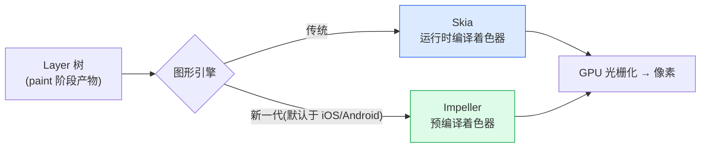

- **Skia**：Google 老牌 2D 图形库（Chrome、Android 也在用）。痛点：着色器在**运行时首次遇到时才编译**，导致"首次动画卡顿"（shader jank）。
- **Impeller**：Flutter 新引擎，**把着色器提前编译**（AOT），消除运行时编译抖动，并针对现代 GPU（Metal/Vulkan）重写。近版本 Flutter 中 **iOS/Android 已默认 Impeller**，Skia 逐步退役。
- 意义：无论哪个引擎，**Flutter 都自己画每个像素**，这是它与"桥接原生控件"方案的根本分界线。

---

## 8. 热重载（Hot Reload）原理

热重载靠 Dart 的 **JIT + VM 增量编译**：

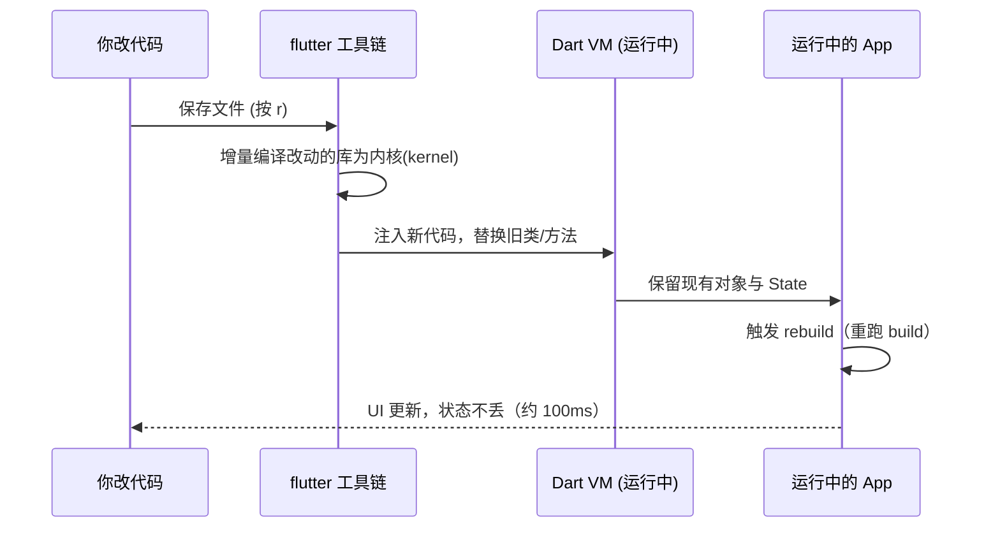

- **Hot Reload（r）**：注入新代码 + 重建 Widget 树，**保留 State**。改 UI 布局/文案最爽。
- **Hot Restart（R）**：重启 Dart VM，**清空 State**，但仍比冷启动快。
- **需要冷重启的情况**：改 `main()`、全局/静态初始化、`initState`、枚举/泛型结构、native 代码——因为这些不在"重跑 build 就能生效"的范围内。

---

## 9. 跨端方案对比：Flutter vs React Native vs WebView

三条技术路线的**本质差异在"UI 最终由谁渲染"**：

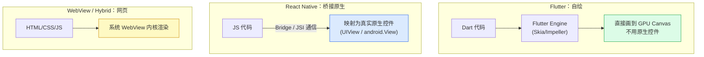

| 维度 | Flutter | React Native | WebView/Hybrid |
|------|---------|--------------|----------------|
| **UI 渲染** | 自绘引擎，自己画每个像素 | 映射为**真实原生控件** | 系统浏览器内核渲染 DOM |
| **语言** | Dart | JS/TS | JS/TS + HTML/CSS |
| **通信开销** | 无桥（Dart 直接调 Engine） | 早期 Bridge 序列化是瓶颈；新架构 JSI 直连改善 | JS ↔ Native 需桥 |
| **一致性** | 各平台**像素级一致** | 随原生控件走，平台间有差异 | 随 WebView 版本差异 |
| **性能** | 接近原生（AOT + GPU） | 逻辑好、复杂列表/动画受桥制约 | 一般，重交互易卡 |
| **原生观感** | 需自己模拟（Material/Cupertino） | 天然是原生控件，观感原生 | 最不原生 |
| **热重载** | 支持（JIT） | 支持（Fast Refresh） | 刷新即可 |
| **包体积** | 较大（带引擎） | 中等 | 最小 |
| **典型代表** | Flutter | React Native、Weex | Ionic、Cordova、各类小程序容器 |

**一句话总结**：
- **RN** = 把跨端代码"翻译"成原生控件，UI 归系统渲染 → 观感原生但受桥/控件差异约束。
- **Flutter** = 带上自己的画笔和画布，UI 全自绘 → 一致性与性能可控，代价是包体积和"非原生控件"。
- **WebView** = 直接跑网页 → 开发最快、性能最弱。

### React Native 的"桥"到底是什么

RN 里 JS 线程和原生 UI 线程是**两个世界**，早期靠 **Bridge** 异步传 JSON 消息（序列化/反序列化有开销，高频场景如滚动/手势易掉帧）。新架构用 **JSI（JavaScript Interface）** 让 JS 直接持有 C++ 对象引用、同步调用原生，大幅削弱了桥的瓶颈。而 **Flutter 根本没有这层桥**——Dart 编译后直接驱动 Engine，UI 数据不跨语言边界序列化，这是 Flutter 复杂动画/列表更稳的结构性原因。

---

## 10. 常见误区

| 误区 | 纠正 |
|------|------|
| "Widget 很重，别建太多" | 恰恰相反，Widget 是**廉价的不可变配置**，为重建而生。真正贵的是 RenderObject，而它被 Element 复用。 |
| "setState 立刻重绘" | setState 只**标脏 + 请求一帧**，真正 build/paint 在下个 vsync。 |
| "Flutter 用的是原生控件" | 不是。Flutter **自绘**，`Button` 是它自己画的，不是 `UIButton`/`android.Button`。 |
| "布局像 CSS，父适应子" | 相反：**约束向下、尺寸向上、父定位置**。Container 尺寸可能被父约束覆盖。 |
| "列表项状态错乱是 Flutter bug" | 是**没给 Key**：Element 按 runtimeType+key 复用，缺 key 会错配。 |
| "debug 卡 = Flutter 慢" | debug 是 **JIT + 断言**，release 是 **AOT**，性能差一个数量级，别拿 debug 评测。 |
| "async/await 开了新线程" | 没有。Dart **单线程事件循环**，await 只是挂起+回调；要并行用 **Isolate**。 |
| "Skia/Impeller 是两套 UI" | 都只是**图形后端**，上层 Widget/布局代码完全一致，只是光栅化实现不同。 |

---

## 🔗 官方文档

- Flutter 架构总览：https://docs.flutter.dev/resources/architectural-overview
- 深入布局约束：https://docs.flutter.dev/ui/layout/constraints
- Inside Flutter（三棵树/渲染管线）：https://docs.flutter.dev/resources/inside-flutter
- Impeller 渲染引擎：https://docs.flutter.dev/perf/impeller
- Hot reload：https://docs.flutter.dev/tools/hot-reload
- Dart 空安全：https://dart.dev/null-safety
- Dart 异步/事件循环：https://dart.dev/libraries/async/async-await
- Flutter for React Native devs：https://docs.flutter.dev/get-started/flutter-for/react-native-devs
