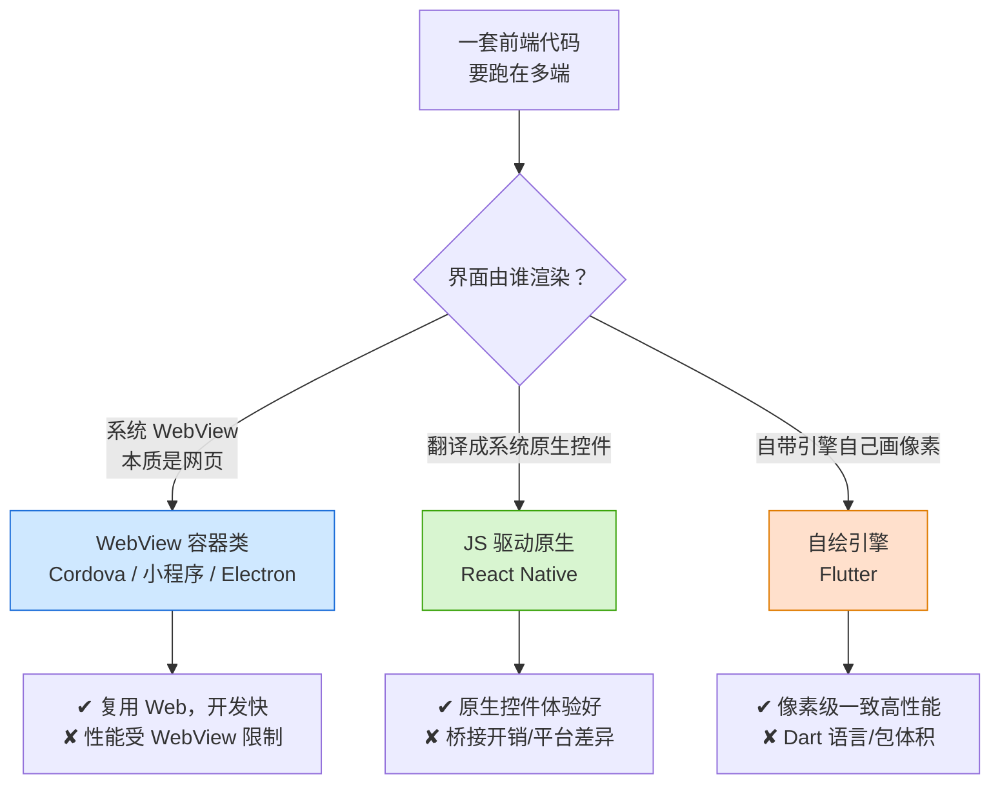
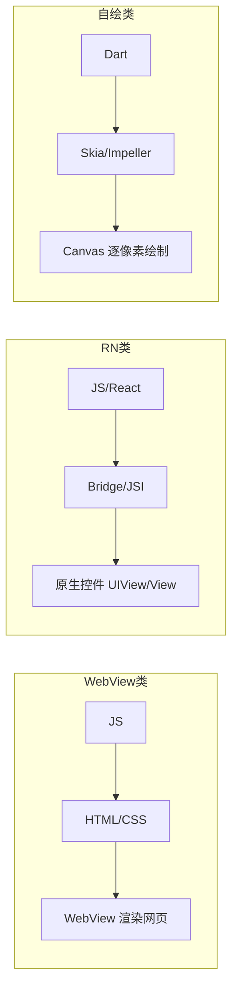

# 01 · 跨端方案全景（Cross-Platform Overview）

> 一句话：用**一套（或大部分）代码**跑在多个终端（iOS / Android / Web / 小程序 / 桌面）上，核心在于「JS/前端技术如何驱动不同平台的界面」。本模块横向对比三大流派：**WebView 容器类**、**JS 驱动原生（RN 类）**、**自绘引擎类（Flutter）**。

## 📖 知识讲解

「跨端」要解决的根本矛盾是：**一次开发，多端运行**，同时又想**接近原生的体验**。不同方案在「开发效率」和「运行体验」之间做取舍，形成三大技术流派：

### 1. WebView 容器类（Hybrid / 小程序 / Electron / Cordova）

- **原理**：界面本质是一个网页，运行在系统提供的 **WebView**（iOS 的 WKWebView、Android 的 WebView、桌面的 Chromium）里，通过 **JSBridge** 调用原生能力（相机、定位、文件等）。
- **代表**：Cordova/PhoneGap、微信小程序（双 WebView 变体）、Electron（内置 Chromium）、各类 Hybrid App。
- **优点**：完全复用 Web 技术栈（HTML/CSS/JS），开发成本最低，跨端一致性最好。
- **缺点**：受 WebView 性能限制，复杂动画/长列表容易卡；UI 是「网页感」而非「原生感」。

### 2. JS 驱动原生类（React Native / Weex）

- **原理**：用 JS 写逻辑，但界面**不是网页**——JS 通过桥接（旧架构 Bridge / 新架构 JSI）把「渲染指令」发给原生层，最终由**真正的原生控件**（iOS `UIView`、Android `View`）绘制。`<View>` → `UIView`/`ViewGroup`，`<Text>` → `UILabel`/`TextView`。
- **代表**：React Native、Weex（已停）。
- **优点**：UI 是原生控件，体验接近原生；仍用 JS/React 开发，效率高。
- **缺点**：桥接有开销（旧架构）；平台差异需处理；原生模块需懂两端。

### 3. 自绘引擎类（Flutter）

- **原理**：**不用系统控件，也不用 WebView**，自带渲染引擎（Skia/Impeller）在一块画布上**自己画每一个像素**。平台只提供一块 Canvas 和事件输入。
- **代表**：Flutter、Qt。
- **优点**：三端（甚至桌面/Web）像素级一致，性能高，不受平台控件限制。
- **缺点**：语言是 Dart（非 JS）；包体积较大；与原生生态融合需 Platform Channel。

### 一张表看懂

| 维度 | WebView 容器类 | JS 驱动原生（RN） | 自绘引擎（Flutter） |
| --- | --- | --- | --- |
| 界面由谁渲染 | 系统 WebView（网页） | 系统原生控件 | 自带引擎画像素 |
| 开发语言 | HTML/CSS/JS | JS/TS + React | Dart |
| 体验 | 网页感，中 | 接近原生，高 | 原生级，最高 |
| 一致性 | 高（同一份 Web） | 中（各端控件有差异） | 最高（自己画） |
| 典型代表 | 小程序 / Electron / Cordova | React Native | Flutter |
| 访问原生能力 | JSBridge | Bridge / JSI 原生模块 | Platform Channel |

## 🔄 流程图 / 原理图



三者「界面渲染方式」的本质差异：



## 💻 代码说明

本模块以**对比文档为主**（符合规范第八节：偏原理的知识点以图文为主）。同一个「Hello 世界 + 一个按钮」在三大流派里的写法直观对比：

```html
<!-- WebView 类（小程序 WXML / H5）：写的是标签 -->
<view class="box">Hello</view>
<button bindtap="onTap">点我</button>
```

```jsx
// JS 驱动原生类（React Native）：写的是「组件」，映射到原生控件
<View style={styles.box}>
  <Text>Hello</Text>
  <Button title="点我" onPress={onTap} />
</View>
```

```dart
// 自绘类（Flutter）：写的是 Widget，引擎自己画
Column(children: [
  Text('Hello'),
  ElevatedButton(onPressed: onTap, child: Text('点我')),
])
```

三者语法「看起来都像声明式 UI」，但**背后的渲染机制完全不同**——这正是理解跨端的关键，详见工程根目录《原理详解.md》。

## ▶️ 运行方式

本模块为概念对比，无需运行。后续模块分别给出各脚手架的可运行 demo：

- RN：`npx create-expo-app`（模块 02-04）
- 小程序：微信开发者工具（模块 05-06）
- Taro/uni-app：各自 CLI（模块 07-08）
- Electron：`npm create @quick-start/electron`（模块 09-10）

## ⚠️ 常见坑 / 最佳实践

- **没有「银弹」**：选型要看业务。重交互/游戏化 → Flutter；已有 React 团队/需要原生体验 → RN；投放/裂变/免安装 → 小程序；桌面工具 → Electron。
- **「一套代码多端」是理想，实际都需要平台适配**：条件编译、平台判断、原生模块几乎不可避免。
- **别把 Electron 当「省内存」方案**：内置整个 Chromium，一个空窗口就上百 MB 内存。
- **RN 不是 WebView**：常见误解。RN 的界面是**真原生控件**，只是逻辑用 JS 写。
- **小程序不是普通 H5**：它是「受限的双线程 Web」，逻辑层没有 DOM/window（见模块 05）。

## 🔗 官方文档

- React Native：https://reactnative.dev/
- 微信小程序框架：https://developers.weixin.qq.com/miniprogram/dev/framework/
- Taro：https://docs.taro.zone/
- uni-app：https://uniapp.dcloud.net.cn/
- Electron：https://www.electronjs.org/docs/latest/
- Flutter（对比参考，见工程 24-dart-flutter）：https://docs.flutter.dev/
