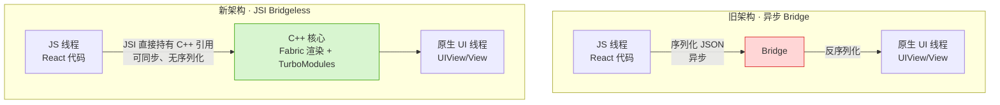
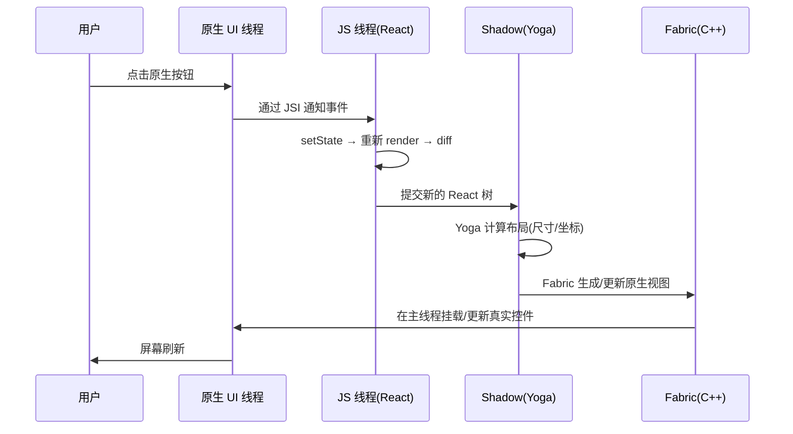

# 02 · React Native 架构入门（RN Architecture）

> 一句话：React Native 让你用 **React 写 JS**，界面却由**真正的原生控件**渲染。本模块讲透它的分层架构、JS 与原生如何桥接，以及 0.76+ 默认启用的**新架构（Fabric + TurboModules + JSI + Bridgeless）**。

## 📖 知识讲解

React Native（Meta 开源）的核心命题：**Learn once, write anywhere**。你写 React 组件，RN 把 `<View>`/`<Text>` 映射成 iOS/Android 的原生控件，因此**界面是原生的，逻辑是 JS 的**。

### 三个线程（Threads）

RN 应用运行时主要有三条线程协作：

1. **JS 线程（JavaScript Thread）**：跑你的 React 代码、业务逻辑、状态、diff。由 JS 引擎（Hermes / 旧 JSC）执行。
2. **原生 UI 线程（Main/UI Thread）**：真正绘制原生控件、响应手势，绝不能阻塞（阻塞就掉帧）。
3. **Shadow Thread（布局线程）**：用 **Yoga**（Flexbox 布局引擎，C++）计算每个节点的位置和尺寸，再交给 UI 线程绘制。

### 旧架构：异步 Bridge（Bridge）

早期 RN，JS 线程和原生线程通过一座**异步桥（Bridge）**通信：所有调用都要**序列化成 JSON** 传过去、再反序列化。

- 问题：**异步 + 序列化开销**。高频场景（滚动同步、动画、大数据）会成为瓶颈，还可能出现「三线程数据不同步」的视觉跳动。

### 新架构（New Architecture，0.76 起默认开启）

用 **JSI（JavaScript Interface）** 取代 Bridge，是最根本的变化：

- **JSI**：一层 C++ 接口，让 **JS 能直接持有并调用 C++ 对象的引用**（反之亦然），**去掉了序列化和异步桥**，可以做**同步调用**。
- **Fabric**：新的**渲染系统**，取代旧 UIManager。渲染逻辑用 C++ 重写，支持 React 18 并发特性（自动批处理、`startTransition`、`Suspense`），能同步测量与布局（可用 `useLayoutEffect`）。
- **TurboModules**：新一代**原生模块**，按需懒加载（用到才初始化），通过 JSI 同步/异步调用原生能力。
- **Bridgeless Mode（无桥模式）**：彻底移除异步 Bridge，全部走 JSI，新架构的最终形态。
- **Codegen**：根据 TS/Flow 类型定义**自动生成** JS 与原生之间的类型安全接口（用于 TurboModules / Fabric 组件）。

> Yoga 仍然是布局引擎（新架构下升级到 Yoga 2.x），负责把你的 Flexbox 样式算成具体坐标。

## 🔄 流程图 / 原理图

新旧架构对比：



一次「点击按钮 → 状态更新 → 界面刷新」的数据流（新架构）：



## 💻 代码说明

一个最小 RN 组件（新旧架构写法一样，架构对上层透明）：

```jsx
// App.js —— 逻辑用 JS/React 写，渲染的是原生控件
import { useState } from 'react';
import { View, Text, Button, StyleSheet } from 'react-native';

export default function App() {
  const [count, setCount] = useState(0);       // React 状态，跑在 JS 线程

  return (
    // <View> 最终变成 iOS 的 UIView / Android 的 ViewGroup（真原生控件）
    <View style={styles.container}>
      {/* <Text> → UILabel / TextView */}
      <Text style={styles.title}>点击了 {count} 次</Text>
      {/* <Button> → 原生按钮，点击事件经 JSI 回到 JS 线程 */}
      <Button title="加一" onPress={() => setCount(count + 1)} />
    </View>
  );
}

const styles = StyleSheet.create({
  container: { flex: 1, justifyContent: 'center', alignItems: 'center' },
  title: { fontSize: 24, marginBottom: 12 },
});
```

- `setState` 发生在 **JS 线程**；
- diff 后的新树提交给 **Shadow 线程**，Yoga 算好布局；
- **Fabric** 把结果映射成原生控件，**UI 线程**绘制。

## ▶️ 运行方式

用官方推荐的 Expo 脚手架最快（自动处理原生工程）：

```bash
# 创建项目
npx create-expo-app@latest MyRNApp
cd MyRNApp

# 启动开发服务器（会显示二维码）
npx expo start

# 手机装 Expo Go App 扫码，即可在真机看到原生界面
# 或按 i 开 iOS 模拟器 / a 开 Android 模拟器
```

把上面的 `App.js` 内容替换进去即可看到「加一」按钮。

> 查看当前是否新架构：`npx react-native info`，或看 `newArchEnabled`（0.76+ 默认 true）。

## ⚠️ 常见坑 / 最佳实践

- **RN ≠ WebView**：界面是原生控件，没有 DOM、没有 `document`/`window`，不能用 CSS 文件，只能用 `StyleSheet` 对象。
- **不要阻塞 UI 线程**：重计算放 JS 线程或 Native，主线程一卡就掉帧。
- **新架构需要原生模块适配**：老的 `NativeModules`（基于 Bridge）在 Bridgeless 下需迁移到 TurboModules，否则可能失效。
- **样式没有继承**：不像 CSS，父 `<View>` 的 `color` 不会传给子（`<Text>` 之间除外）。
- **Hermes 是默认引擎**：体积小、启动快，调试用 Flipper/React DevTools。
- **Expo vs 裸 RN**：入门用 Expo（免装 Xcode/AS 也能跑）；需要大量自定义原生代码再考虑 bare workflow 或 CLI。

## 🔗 官方文档

- RN 官网：https://reactnative.dev/
- 新架构说明：https://reactnative.dev/architecture/landing-page
- 架构概览（线程/渲染）：https://reactnative.dev/architecture/glossary
- Expo：https://docs.expo.dev/
- Yoga 布局引擎：https://www.yogalayout.dev/
