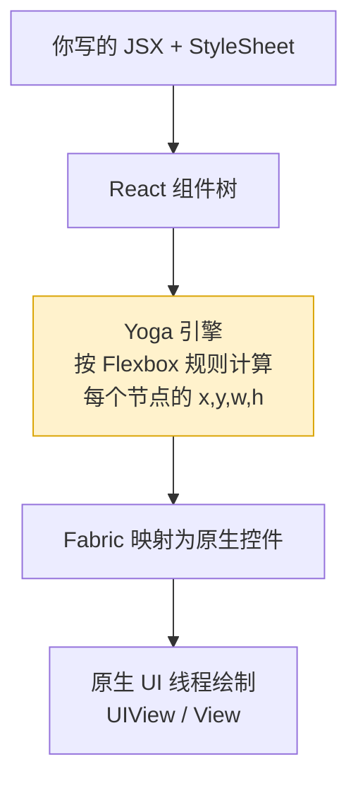
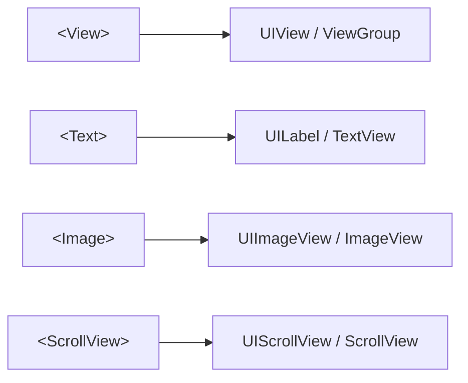

# 03 · RN 核心组件与 Flexbox 样式（Core Components & Style）

> 一句话：RN 没有 HTML 标签，用一组**核心组件**（`View`/`Text`/`Image`…）搭界面；没有 CSS 文件，用 **`StyleSheet` 对象 + Flexbox** 布局。本模块讲清最常用组件和 RN 版 Flexbox 的差异。

## 📖 知识讲解

### 核心组件（Core Components）

RN 的组件会被翻译成对应的原生控件：

| RN 组件 | 作用 | iOS / Android 原生对应 | Web 类比 |
| --- | --- | --- | --- |
| `View` | 布局容器 | `UIView` / `ViewGroup` | `<div>` |
| `Text` | 显示文字（**文字必须放这里面**） | `UILabel` / `TextView` | `<p>`/`<span>` |
| `Image` | 图片 | `UIImageView` / `ImageView` | `` |
| `ScrollView` | 可滚动容器（一次全渲染） | `UIScrollView` / `ScrollView` | `overflow:scroll` |
| `TextInput` | 输入框 | `UITextField` / `EditText` | `<input>` |
| `Pressable` | 可点击/按压（现代首选） | 手势识别 | `onclick` |
| `FlatList` | 长列表（懒加载，性能好） | `UITableView` / `RecyclerView` | 虚拟列表 |

### RN 版 Flexbox（和 Web 的关键差异）

RN 用 **Yoga** 引擎实现 Flexbox，语法像 Web，但有几处**默认值不同**：

- **`flexDirection` 默认是 `column`**（Web 默认 `row`）——因为手机屏幕是竖的。
- **默认所有 `View` 都是 flex 容器**，不用写 `display:flex`。
- **没有单位**：数值就是 **dp（密度无关像素）**，不写 `px`；`width:'100%'` 用字符串百分比。
- **样式不继承**：`View` 上设 `color` 不会传给子（`Text` 嵌套 `Text` 例外）。
- **属性用驼峰**：`backgroundColor`、`borderRadius`，值多为数字或字符串。
- 阴影分平台：iOS `shadowColor/shadowOpacity/shadowRadius`，Android `elevation`。

## 🔄 流程图 / 原理图



组件与原生控件的映射关系：



## 💻 代码说明

见同目录 [`App.js`](./App.js)，关键点：

- **`SafeAreaView`** 包最外层，避开刘海和状态栏。
- **`ScrollView`** 做可滚动页面，`contentContainerStyle` 设内容内边距。
- **`Text`** 必须包裹文字——`<View>Hello</View>` 会报错，只能 `<View><Text>Hello</Text></View>`。
- **`TextInput`** 用 `value` + `onChangeText` 做受控输入（注意是 `onChangeText`，不是 Web 的 `onChange`）。
- **`Pressable`** 的 `style` 可传函数 `({pressed}) => [...]`，实现按压反馈。
- **Flexbox 横排**：`flexDirection:'row'` + `justifyContent:'space-between'` 把三个色块均匀排开。

## ▶️ 运行方式

```bash
npx create-expo-app@latest RNStyleDemo
cd RNStyleDemo
# 用本模块 App.js 覆盖项目根目录的 App.js
npx expo start
# Expo Go 扫码，或按 i / a 打开模拟器
```

## ⚠️ 常见坑 / 最佳实践

- **文字必须包在 `<Text>` 里**，这是初学最常见报错。
- **别用 `ScrollView` 渲染长列表**——它会一次性渲染所有子项，几百条就卡。长列表用 **`FlatList`**（懒加载、回收复用）。
- **`flexDirection` 默认竖排**，横排记得显式写 `row`。
- **用 `StyleSheet.create`** 而不是内联对象——它能做校验、且引用稳定利于性能。
- **平台差异用 `Platform.select`** 或 `Platform.OS === 'ios'` 分支处理阴影等。
- **图片必须给宽高**，网络图 `source={{uri}}`，本地图 `require('./x.png')`。

## 🔗 官方文档

- 核心组件总览：https://reactnative.dev/docs/components-and-apis
- Flexbox 布局：https://reactnative.dev/docs/flexbox
- StyleSheet：https://reactnative.dev/docs/stylesheet
- FlatList：https://reactnative.dev/docs/flatlist
