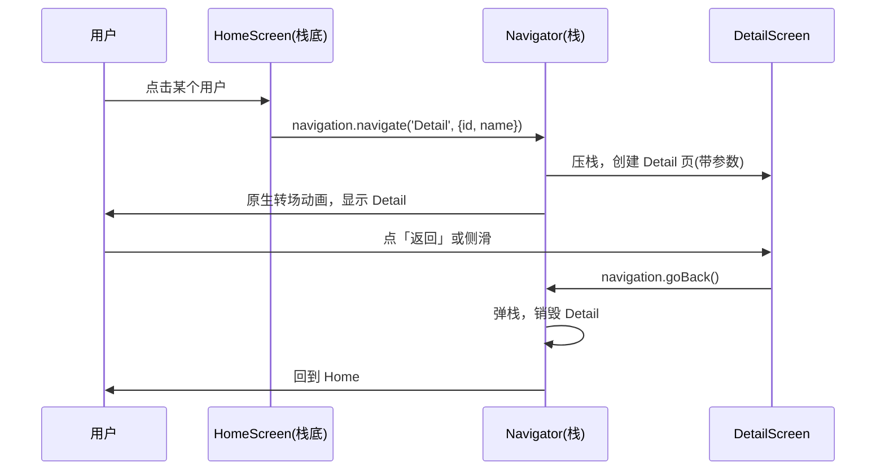
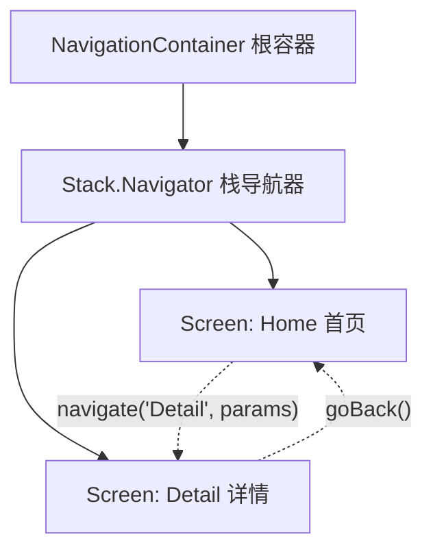

# 04 · RN 路由导航（React Navigation）

> 一句话：RN 没有浏览器的 URL/History，页面之间的跳转靠 **React Navigation** 这套「导航栈」库来管理。本模块用**原生栈（Native Stack）**演示页面跳转、传参、返回。

## 📖 知识讲解

Web 靠 URL + History 切页；RN 没有地址栏，页面切换是**把屏幕压入/弹出一个「栈」**（像一叠卡片），这就是 **React Navigation**（社区事实标准）。

### 核心概念

- **NavigationContainer**：整棵导航树的**根容器**，必须包在 App 最外层（类比 React Router 的 `BrowserRouter`）。
- **Navigator（导航器）**：定义一组页面的组织方式，常见三种：
  - **Native Stack**（`createNativeStackNavigator`）：栈式，进入压栈、返回弹栈，用**原生导航控件**（iOS 侧滑返回、原生转场动画），性能最好。
  - **Bottom Tabs**（`createBottomTabNavigator`）：底部标签切换。
  - **Drawer**（`createDrawerNavigator`）：侧滑抽屉菜单。
- **Screen（屏幕/路由）**：`<Stack.Screen name="Home" component={HomeScreen} />`，`name` 是路由名。
- **navigation prop**：每个页面组件自动收到，用来跳转：
  - `navigation.navigate('Detail', { id })` —— 跳转并传参
  - `navigation.goBack()` —— 返回上一页
  - `navigation.push('Detail')` —— 强制再压一个新页（可重复）
- **route prop**：`route.params` 读取上一页传来的参数（类比 `useParams`，但可传任意对象，不只是字符串）。

### Native Stack vs JS Stack

- **Native Stack**：底层用 iOS 的 `UINavigationController`、Android 的 Fragment，转场是原生的，**推荐首选**。
- **Stack（JS 版）**：纯 JS 实现动画，更可定制，但性能略逊。

## 🔄 流程图 / 原理图

导航栈的压栈/弹栈过程：



导航器/屏幕的树形结构：



## 💻 代码说明

见同目录 [`App.js`](./App.js)：

- 最外层 `<NavigationContainer>` 包裹整个应用。
- `<Stack.Navigator initialRouteName="Home">` 声明两个页面。
- `HomeScreen` 用 `FlatList` 渲染用户列表，点击 `navigation.navigate('Detail', {id, name})` **跳转 + 传参**。
- `DetailScreen` 用 `route.params` **接收参数**，`navigation.goBack()` 返回。
- `options={{ title: '首页' }}` 设置顶部原生导航栏标题。

## ▶️ 运行方式

```bash
# 1. 创建 Expo 项目
npx create-expo-app@latest RNNavDemo
cd RNNavDemo

# 2. 安装 React Navigation 及原生依赖（用 expo install 保证版本兼容）
npx expo install @react-navigation/native @react-navigation/native-stack \
    react-native-screens react-native-safe-area-context

# 3. 用本模块 App.js 覆盖，然后启动
npx expo start
```

## ⚠️ 常见坑 / 最佳实践

- **必须装 peer 依赖**：`react-native-screens` 和 `react-native-safe-area-context` 少一个就白屏/报错，用 `expo install` 自动匹配版本。
- **`NavigationContainer` 只能有一个**，且在最外层；嵌套的是 Navigator，不是 Container。
- **传参别传太大对象**：`params` 会随导航状态保存，传大数据用全局 state / 传 id 再自行取。
- **`navigate` vs `push`**：`navigate` 若目标已在栈里会回到它，`push` 总是新压一个（做「详情套详情」用 push）。
- **类型安全**：TS 项目给 `Stack` 定义 `ParamList` 类型，避免传错参数名。
- **深链接（Deep Linking）**：需要 URL 唤起 App 时配置 `linking`，把外部 URL 映射到路由。

## 🔗 官方文档

- React Navigation：https://reactnavigation.org/
- 快速开始：https://reactnavigation.org/docs/getting-started
- Native Stack：https://reactnavigation.org/docs/native-stack-navigator
- 传参：https://reactnavigation.org/docs/params
