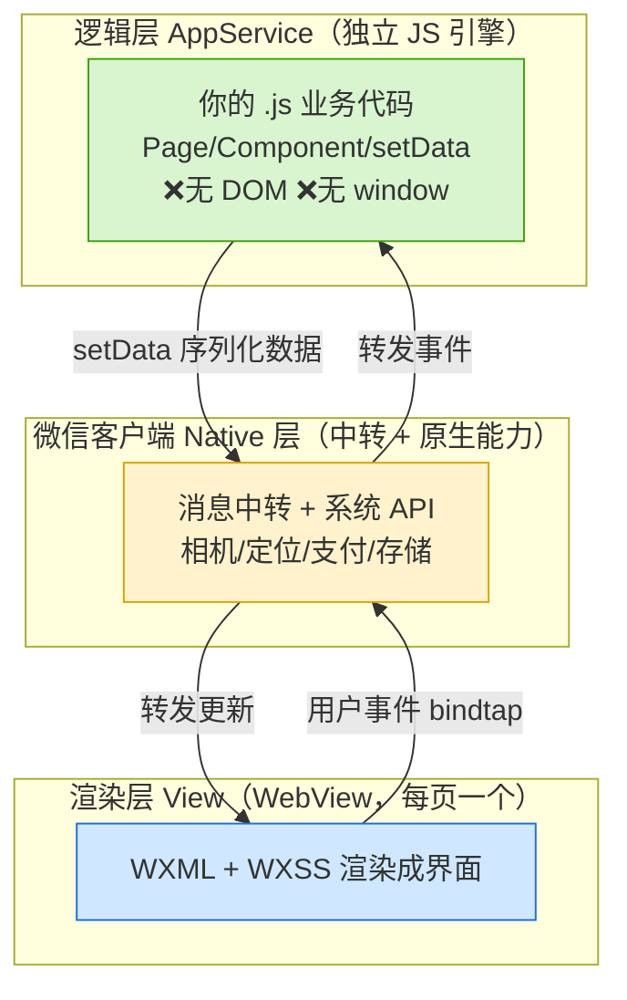
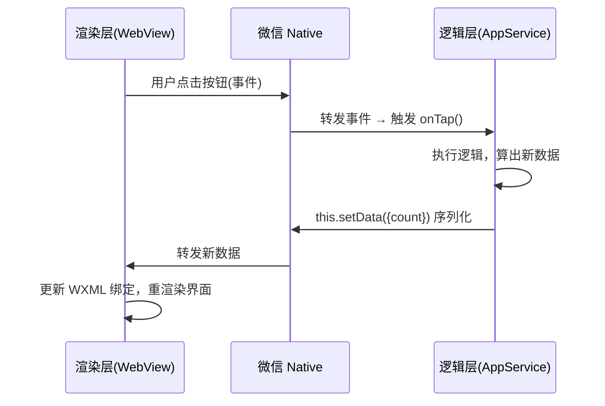

# 05 · 小程序双线程架构（Mini Program Dual-Thread）

> 一句话：微信小程序把「界面渲染」和「业务逻辑」**拆到两个独立线程**运行——**渲染层（WebView）** 和 **逻辑层（AppService）**，两者不能直接通信，必须经过微信客户端（Native）中转。理解这个设计是理解小程序一切「限制」的钥匙。

## 📖 知识讲解

### 双线程模型

普通网页是**单线程**：JS 逻辑和 DOM 渲染在同一个线程，JS 能直接操作 DOM。小程序**故意不这样**，它把运行环境拆成两条线程：

- **渲染层（View / WebView 线程）**：负责把 WXML/WXSS 渲染成界面。**每个页面一个 WebView**（所以小程序有页面栈上限）。运行在 WebView 里。
- **逻辑层（AppService 线程）**：跑你的 `.js` 业务代码（`Page`/`Component` 的逻辑、setData、事件处理）。运行在一个**独立的 JS 引擎**里（iOS 用 JavaScriptCore，Android 用 V8，开发者工具用 Chromium 内核）。
- 两条线程**都由微信客户端（Native 层）管理和中转**。

### 为什么这么设计？（关键）

单线程 Web 里 JS 能任意操作 DOM、跳转、改 window，这带来两个问题：**安全**（可被 XSS 注入、可乱跳链接、可读取用户数据）和**管控**（平台无法拦截）。小程序双线程的设计目的：

1. **安全隔离**：逻辑层**拿不到 DOM、没有 `window`/`document`、不能动态执行外部脚本**，杜绝了直接操作页面和注入攻击，平台可管控。
2. **性能**：逻辑执行（JS）不阻塞渲染（UI），滑动时 JS 再忙也不卡界面。
3. **一致体验**：渲染层受微信统一控制，跨机型表现一致。

代价：**逻辑层和渲染层不能直接传数据**，一切通信要**序列化后经 Native 中转**——这就是 `setData` 要谨慎、不能频繁传大数据的根本原因。

### 数据/事件如何流动

- **逻辑 → 渲染**：调用 `this.setData(data)`，数据被**序列化成字符串**，经 Native 转发给渲染层，渲染层用它更新 WXML 绑定的界面。
- **渲染 → 逻辑**：用户点击等事件，由渲染层捕获，**经 Native 转发**给逻辑层的事件处理函数（如 `bindtap` 绑定的方法）。

## 🔄 流程图 / 原理图

双线程架构总览：



一次点击更新界面的时序：



## 💻 代码说明

本模块以**架构讲解**为主，可运行的四文件 demo 见下一模块 [06-miniprogram-basics](../06-miniprogram-basics/)。这里对照理解「为什么逻辑层不能操作 DOM」：

```js
// ✅ 小程序里：数据驱动，逻辑层只改数据，不碰界面
Page({
  data: { count: 0 },
  onTap() {
    // 不能 document.querySelector（没有 DOM！）
    // 只能通过 setData 把数据「发」给渲染层
    this.setData({ count: this.data.count + 1 });
  },
});
```

```html
<!-- 渲染层：WXML 用 {{}} 绑定逻辑层的 data，事件用 bindtap 回传 -->
<view>点击了 {{count}} 次</view>
<button bindtap="onTap">加一</button>
```

对比普通网页 `document.getElementById('x').innerText = count`——小程序**做不到**，因为逻辑层根本看不到 DOM，这正是双线程隔离的体现。

## ▶️ 运行方式

架构模块无需单独运行，配合下一模块在**微信开发者工具**里体会：

```text
1. 下载安装「微信开发者工具」（stable 版）
2. 新建小程序项目（可用测试号 AppID）
3. 打开「调试器」，能看到 AppService(逻辑) 和 Wxml/渲染 分开的面板
4. 观察 setData 时数据从逻辑层流向渲染层
```

## ⚠️ 常见坑 / 最佳实践

- **逻辑层没有 DOM/BOM**：`window`、`document`、`localStorage` 都没有。存储用 `wx.setStorageSync`，跳转用 `wx.navigateTo`。
- **`setData` 是性能命门**：每次都要**序列化 + 跨线程传输**。别一次传几百 KB、别在 `onPageScroll` 里高频 setData，只传变化的字段。
- **页面栈有上限**（默认 10 层）：`navigateTo` 太多会栈溢出，用 `redirectTo`/`switchTab` 释放。
- **第三方 npm 包需构建**：逻辑层是受限环境，依赖 DOM 的库（如 jQuery）用不了，需「构建 npm」且包不能碰 DOM。
- **首屏是「注入 + 渲染」两步**：逻辑包下载注入 + 渲染层渲染，故有启动耗时，小程序包体积要控制（分包）。

## 🔗 官方文档

- 小程序框架总览：https://developers.weixin.qq.com/miniprogram/dev/framework/
- 运行环境 / 双线程：https://developers.weixin.qq.com/miniprogram/dev/framework/quickstart/framework.html
- 逻辑层：https://developers.weixin.qq.com/miniprogram/dev/framework/app-service/
- 视图层：https://developers.weixin.qq.com/miniprogram/dev/framework/view/
