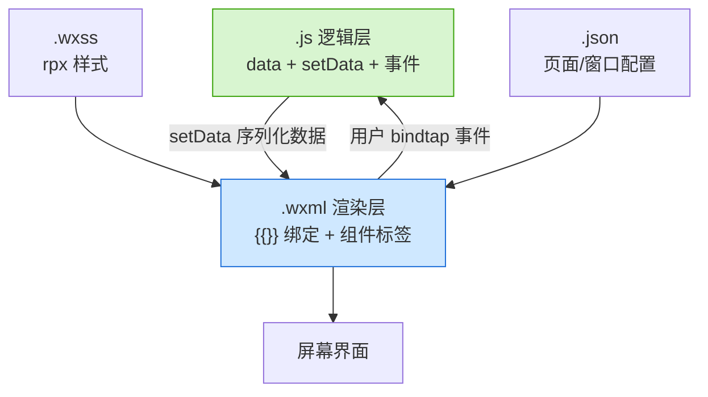
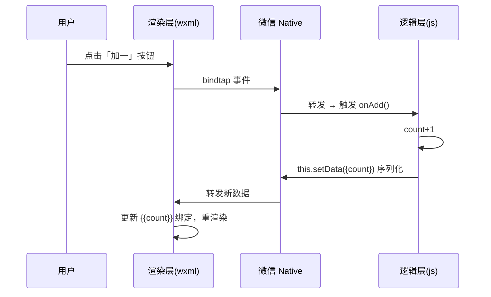

# 06 · 小程序基础四文件（Mini Program Basics）

> 一句话：一个小程序页面由 **`.js`（逻辑）+ `.wxml`（结构）+ `.wxss`（样式）+ `.json`（配置）** 四个文件组成，用 **数据绑定 `{{}}` + 事件 `bind*` + `setData`** 实现数据驱动界面。本模块用一个「计数器 + 待办列表」demo 把四大件讲清。

## 📖 知识讲解

### 四文件分工（对应 05 模块的双线程）

| 文件 | 类比 Web | 跑在哪 | 作用 |
| --- | --- | --- | --- |
| `.js` | JS | **逻辑层** AppService | `Page({data, 事件})`，`setData` 更新数据 |
| `.wxml` | HTML | **渲染层** WebView | 用小程序组件标签 + `{{}}` 绑定 |
| `.wxss` | CSS | 渲染层 | 样式，新增 `rpx` 单位做屏幕适配 |
| `.json` | 无 | 配置 | 页面/全局配置（标题、tabBar、组件） |

全局还有 `app.js` / `app.json` / `app.wxss` 三件（App 级）。

### 核心 API 与语法

- **`App({...})`**：注册小程序，`onLaunch` 生命周期、`globalData` 全局数据。
- **`Page({...})`**：注册页面。`data` 是数据源，`onLoad`/`onShow` 是生命周期，其余方法作事件处理。
- **`this.setData(obj)`**：**唯一**更新界面的方式——把数据序列化后跨线程发给渲染层。
- **WXML 指令**：`{{表达式}}` 绑定、`wx:for`/`wx:key` 列表、`wx:if`/`wx:elif`/`wx:else` 条件、`bindtap`/`bindinput` 事件。
- **`rpx`**：屏幕宽固定 750rpx，`1rpx = 屏宽/750`，自动适配。
- **`wx.*` API**：`wx.showToast`、`wx.showModal`、`wx.navigateTo`、`wx.setStorageSync`、`wx.request` 等原生能力，由 Native 层提供。

## 🔄 流程图 / 原理图

四文件如何协作渲染出界面：



`setData` 触发一次界面更新的时序：



## 💻 代码说明

四文件见本目录，关键点：

- [`pages/index/index.js`](./pages/index/index.js)：`data` 里放 `count`/`todos`/`inputValue`；`onAdd` 用 `setData` 加一；`onInput` 做受控输入；`onAddTodo` 用展开运算符更新数组；`onShowInfo` 调 `wx.showModal` 原生弹窗。
- [`pages/index/index.wxml`](./pages/index/index.wxml)：`{{title}}` 数据绑定、`wx:for` 遍历 `todos`、`wx:if="{{count>=5}}"` 条件渲染、`bindtap`/`bindinput` 绑事件。
- [`pages/index/index.wxss`](./pages/index/index.wxss)：尺寸全用 `rpx`。
- [`app.js`](./app.js) / [`app.json`](./app.json)：全局逻辑与页面注册。

## ▶️ 运行方式

```text
1. 下载安装「微信开发者工具」（stable 版）
2. 新建项目 → 选「不使用云服务」，AppID 填「测试号」
3. 把本目录四文件（app.* 与 pages/index/*）覆盖到新项目对应位置
4. 点击「编译」，模拟器即显示计数器与待办列表
5. 打开「调试器」可看到 AppService(逻辑) 与 WXML(渲染) 分离的面板
```

> 缺 `sitemap.json` 会有警告不影响运行；也可在 `app.json` 删掉 `sitemapLocation`。

## ⚠️ 常见坑 / 最佳实践

- **改 `data` 必须用 `setData`**：直接 `this.data.count = 1` 不会更新界面（逻辑层改了数据，渲染层不知道）。
- **`setData` 只传变化字段**：别整包传大对象，别在 `onPageScroll` 里高频调用。可用路径写法 `this.setData({'todos[0]': 'x'})` 局部更新。
- **没有 DOM/BOM**：`document`、`window`、`localStorage` 都没有，用 `wx.*` 替代。
- **标签是组件不是 HTML**：用 `<view>` 不是 `<div>`，`<text>` 包文字，图片用 `<image>`。
- **`rpx` 别和 `px` 混用**：统一用 `rpx` 才能自适应。
- **事件用 `bindtap` 不是 `onclick`**；阻止冒泡用 `catchtap`。

## 🔗 官方文档

- 小程序框架：https://developers.weixin.qq.com/miniprogram/dev/framework/
- WXML 语法：https://developers.weixin.qq.com/miniprogram/dev/reference/wxml/
- WXSS / rpx：https://developers.weixin.qq.com/miniprogram/dev/framework/view/wxss.html
- `Page` 构造器：https://developers.weixin.qq.com/miniprogram/dev/reference/api/Page.html
- `wx` API 索引：https://developers.weixin.qq.com/miniprogram/dev/api/
