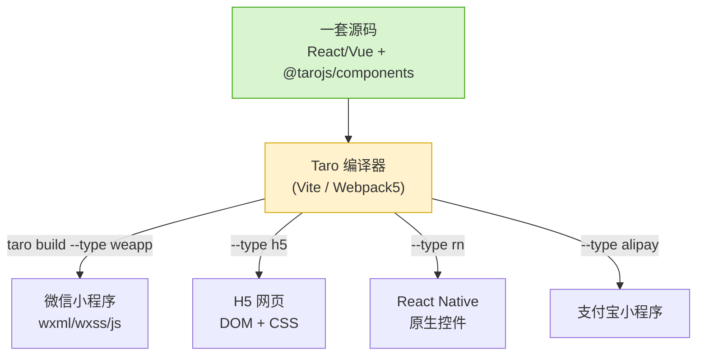
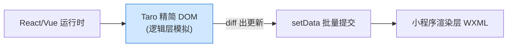

# 07 · Taro 一码多端（React/Vue → 小程序/H5/RN）

> 一句话：Taro 是京东开源的**跨端跨框架**框架，让你用**熟悉的 React 或 Vue 语法 + JSX/组件**写一套代码，通过**编译**同时产出微信/支付宝/抖音等各家**小程序 + H5 + React Native**。本模块用 React 语法写一个计数器 demo，讲清「一码多端」怎么做到。

## 📖 知识讲解

### Taro 是什么、怎么做到跨端

小程序各家语法互不兼容（微信 WXML、支付宝 AXML…），Taro 的思路是：**你写标准 React/Vue，Taro 编译器把它转成各端代码**。

- **Taro 3/4 是运行时 + 编译时结合**：不再像 Taro 1/2 那样做「JSX 静态转 WXML」（限制多），而是实现了一套**精简版 DOM/BOM API** 跑在小程序逻辑层，让 React/Vue 的运行时能在小程序里正常工作 → 支持完整的 React/Vue 语法（Hooks、动态渲染等）。
- **Taro 4.x**：支持 **React / Vue3 / Preact / Solid**，构建默认可选 **Vite**（更快）或 Webpack5，新增对鸿蒙（HarmonyOS）等端的支持。

### 核心概念

- **内置组件**：`View`/`Text`/`Button`/`Image`/`ScrollView`…（来自 `@tarojs/components`），编译时映射为各端标签（小程序 `<view>` / H5 `<div>` / RN 原生 View）。
- **统一 API**：`Taro.xxx`（来自 `@tarojs/taro`），如 `Taro.showToast`/`Taro.request`/`Taro.navigateTo`——各端自动映射到对应原生能力（微信端映射到 `wx.*`）。
- **配置即代码**：`app.config.js`（全局）/`index.config.js`（页面），编译成各端配置文件。
- **条件编译**：`process.env.TARO_ENV`（值为 `weapp`/`h5`/`rn`/`alipay`…）在编译时替换，做平台差异化分支。

## 🔄 流程图 / 原理图

一套代码如何变成多端产物：



Taro 3/4 运行时在小程序里的工作机制：



## 💻 代码说明

见 [`src/pages/index/index.jsx`](./src/pages/index/index.jsx)，关键点：

- 用 **React `useState`** 管理 `count`/`todos`——和普通 React 一模一样。
- 用 **`@tarojs/components`** 的 `View`/`Text`/`Button`/`Input` 而非 HTML 标签。
- 事件用 **`onClick`/`onInput`**（Taro 统一），列表用 **`todos.map()`**（React 写法，而非小程序 `wx:for`）。
- 调 **`Taro.showModal`/`Taro.showToast`** 跨端 API。
- **条件编译** `process.env.TARO_ENV === 'h5'` 做平台分支。
- [`src/app.config.js`](./src/app.config.js) 声明页面与窗口，一份配置多端通用。

## ▶️ 运行方式

```bash
# 安装 Taro CLI（近版本 4.x）
npm i -g @tarojs/cli

# 新建项目（交互式选 React + Vite）
taro init myApp
cd myApp
# 把本模块 src/ 下文件覆盖进去

# 跑微信小程序（产物用微信开发者工具打开 dist/）
taro build --type weapp --watch

# 跑 H5（浏览器直接看）
taro build --type h5 --watch
# 或 npm run dev:h5
```

## ⚠️ 常见坑 / 最佳实践

- **别用 HTML 标签**：必须用 `@tarojs/components` 的组件，否则小程序端编译不出来。
- **不是所有 Web API 都有**：小程序端没有真实 DOM，`document`/`window` 相关库（如直接操作 DOM 的动画库）在小程序端不可用；用 `Taro.*` 或平台判断。
- **样式有差异**：H5 是真 CSS，小程序端 WXSS 有选择器限制；复杂选择器（后代/属性）在小程序端可能失效。
- **尺寸单位**：Taro 默认按 750px 设计稿把 `px` 转 `rpx`（小程序）/`rem`（H5），别手写 `rpx`。
- **RN 端限制最多**：RN 没有 CSS 盒模型的全部特性，跨到 RN 时样式要额外验证。
- **优先条件编译而非运行时判断**：`process.env.TARO_ENV` 在编译期就 tree-shaking 掉无关分支，包更小。

## 🔗 官方文档

- Taro 官网：https://docs.taro.zone/
- 快速开始：https://docs.taro.zone/docs/GETTING-STARTED
- 内置组件库：https://docs.taro.zone/docs/components-desc
- Taro API：https://docs.taro.zone/docs/apis/about/desc
- 条件编译 / 环境变量：https://docs.taro.zone/docs/envs-debug
