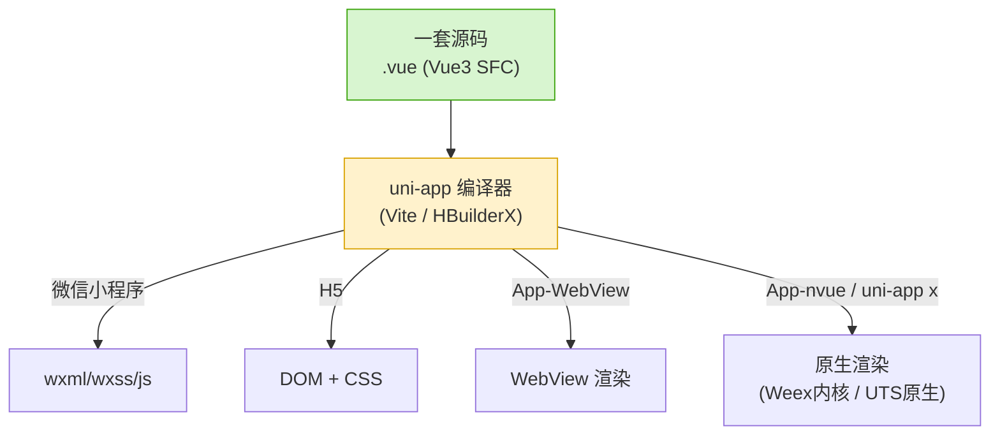
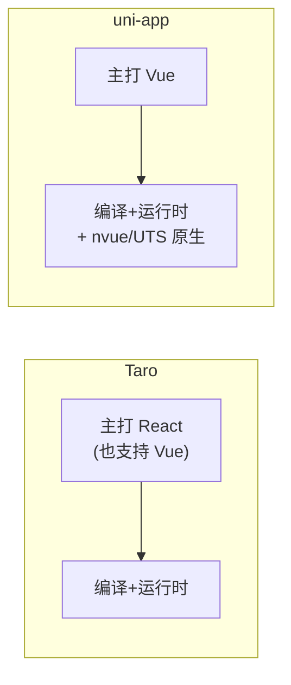

# 08 · uni-app 一码多端（Vue → 小程序/H5/App）

> 一句话：uni-app 是 DCloud 出品的**基于 Vue 语法**的跨端框架，用一套 Vue 代码同时产出**微信/支付宝等小程序 + H5 + iOS/Android App（含原生渲染）+ 快应用**。与 Taro（React 系为主）互为竞品，本模块用 **Vue3 `<script setup>`** 写同一个计数器 demo。

## 📖 知识讲解

### uni-app 是什么

- **语法即 Vue**：页面是 **`.vue` 单文件组件**，用 `template`/`script`/`style`，支持 Vue3 组合式 API（`ref`/`reactive`/`onMounted`）。会 Vue 就会 uni-app。
- **一套代码多端编译**：`HBuilderX` 或 CLI（Vite）把 `.vue` 编译成微信 WXML/WXSS、H5 的 DOM、App 端的原生渲染指令。
- **App 端两种渲染**：默认 WebView 渲染；`nvue`（native vue）用 **Weex 内核**做原生渲染，性能更好。新一代 **uni-app x** 则用自研 **UTS 语言**编译为纯原生（无 JS 引擎），更接近 Flutter/RN 的原生体验。

### 核心概念

- **内置组件**：`view`/`text`/`button`/`image`/`scroll-view`…（**全小写**，对齐小程序命名），编译到各端对应标签。
- **统一 API**：`uni.xxx`，如 `uni.request`/`uni.showToast`/`uni.navigateTo`——各端映射到原生能力（微信端→`wx.*`）。
- **配置**：`pages.json`（路由/导航/tabBar 全局配置）、`manifest.json`（应用标识/各端参数）。
- **条件编译**：用注释 `#ifdef MP-WEIXIN … #endif` 包住某端专属代码，编译期裁剪。

## 🔄 流程图 / 原理图

一套 Vue 代码编译到多端：



Taro vs uni-app 定位对比：



## 💻 代码说明

见 [`pages/index/index.vue`](./pages/index/index.vue)，关键点：

- **`<script setup>` + `ref`**：`count`/`todos`/`text` 都是 Vue3 响应式——和普通 Vue3 一致。
- **模板用内置组件**：`<view>`/`<text>`/`<button>`，事件 **`@click`**、双向绑定 **`v-model`**、列表 **`v-for`**、条件 **`v-if`**（纯 Vue 语法，比小程序原生更简洁）。
- **`uni.showModal`/`uni.showToast`**：跨端 API。
- **`rpx`** 样式单位做适配。
- [`pages.json`](./pages.json) 配路由与导航栏；[`main.js`](./main.js) 用 `createSSRApp` 创建实例；[`App.vue`](./App.vue) 放应用级生命周期。

## ▶️ 运行方式

**方式一（推荐入门）：HBuilderX 图形工具**

```text
1. 下载 HBuilderX（DCloud 官方 IDE）
2. 文件 → 新建 → 项目 → uni-app（Vue3）
3. 覆盖 pages/、App.vue、main.js、pages.json
4. 运行 → 运行到浏览器 / 运行到微信开发者工具 / 运行到手机
```

**方式二：Vite CLI**

```bash
# 创建 Vue3 + Vite 的 uni-app 项目
npx degit dcloudio/uni-preset-vue#vite my-uni-app
cd my-uni-app
npm install
# 覆盖 src/ 下文件
npm run dev:h5          # H5
npm run dev:mp-weixin   # 微信小程序（产物用微信开发者工具打开）
```

## ⚠️ 常见坑 / 最佳实践

- **组件名全小写**：用 `<view>` 不是 `<View>`（与 Taro 大写不同），对齐小程序。
- **条件编译用注释语法**：`// #ifdef H5 … // #endif`（JS）或 `<!-- #ifdef MP-WEIXIN --> … <!-- #endif -->`（模板），别用 `if(process.env)`。
- **小程序端限制**：无真实 DOM，依赖 `document`/`window` 的库不可用；WXSS 选择器有限制。
- **nvue 有额外限制**：原生渲染下只支持 Flex 布局、部分 CSS 属性，写法要按 nvue 文档。
- **`rpx` 单位**：跨端自适应用 `rpx`，App/H5 也支持。
- **`uni.request` 而非 `fetch`/`axios`**：小程序端没有 `fetch`，统一用 `uni.request` 才能多端跑。

## 🔗 官方文档

- uni-app 官网：https://uniapp.dcloud.net.cn/
- 快速上手：https://uniapp.dcloud.net.cn/quickstart-hx.html
- 内置组件：https://uniapp.dcloud.net.cn/component/
- uni API：https://uniapp.dcloud.net.cn/api/
- 条件编译：https://uniapp.dcloud.net.cn/tutorial/platform.html
- uni-app x（原生）：https://doc.dcloud.net.cn/uni-app-x/
