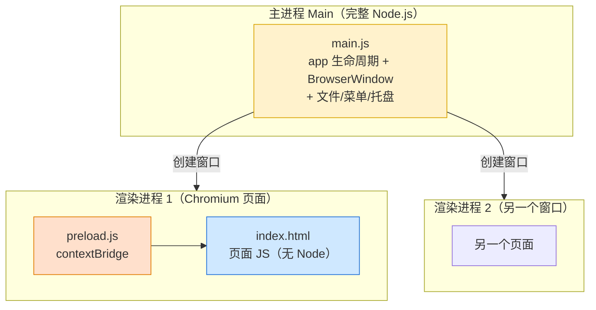
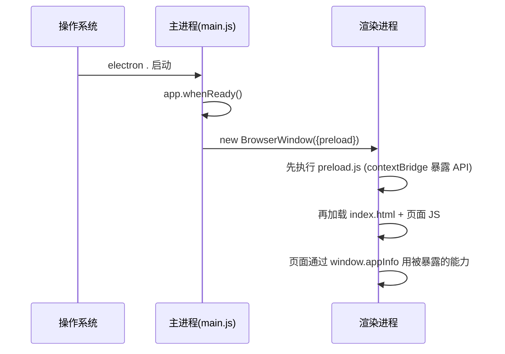

# 09 · Electron 进程模型入门（Electron Process Model）

> 一句话：Electron 用 **Chromium（渲染网页）+ Node.js（系统能力）** 打包成跨平台桌面应用。它是**多进程**架构：一个**主进程（Main）**管窗口和系统能力，每个窗口一个**渲染进程（Renderer）**跑网页，中间用**预加载脚本（Preload）**做安全桥接。VS Code、Slack、Discord 都是 Electron。

## 📖 知识讲解

Electron 直接继承了 **Chromium 的多进程模型**（见工程 18 浏览器原理）：

### 三种进程/脚本

| 角色 | 跑什么 | 能力 | 类比 |
| --- | --- | --- | --- |
| **主进程 Main** | `main.js`，完整 Node.js | 建窗口(`BrowserWindow`)、生命周期(`app`)、菜单/托盘/对话框、读写文件 | 浏览器的"浏览器进程" |
| **渲染进程 Renderer** | 你的 HTML/CSS/JS | 就是一个 Chromium 页面，**默认没有 Node** | 浏览器的"标签页进程" |
| **预加载 Preload** | `preload.js` | 页面加载前先跑，能用 Node，通过 `contextBridge` 有限暴露给页面 | 安全闸门 |

- **只有一个主进程**，它是入口（`package.json` 的 `main` 字段）。
- **每个 `BrowserWindow` 一个渲染进程**，互相隔离，崩溃不互相影响。
- 主进程能用 Node，渲染进程默认**不能**（`nodeIntegration:false`）——这是安全设计，防止网页里的 XSS 直接 `require('fs')` 删你硬盘。

### 三条安全基线（Electron 默认值，务必保持）

1. **`contextIsolation: true`**：预加载脚本与页面 JS 运行在隔离的 JS 上下文，页面拿不到预加载里的 Node 引用。
2. **`nodeIntegration: false`**：渲染进程默认没有 `require`/`process`。
3. **`contextBridge`**：唯一正规的暴露方式——把**白名单能力**挂到 `window`，页面只能用你允许的那几个函数。

## 🔄 流程图 / 原理图

进程模型总览：



启动流程时序：



## 💻 代码说明

- [`main.js`](./main.js)：`app.whenReady()` 后 `new BrowserWindow(...)`；`webPreferences` 里保持三条安全基线并指定 `preload`；`loadFile('index.html')` 加载界面；处理 `window-all-closed`/`activate`（macOS 习惯）。
- [`preload.js`](./preload.js)：`contextBridge.exposeInMainWorld('appInfo', {...})` 把版本号、平台等**只读信息**安全挂到页面 `window.appInfo`。
- [`index.html`](./index.html)：渲染进程页面，读 `window.appInfo`（而非 `require('electron')`）展示版本号，证明"页面没有直接碰 Node，只用了被暴露的白名单"。

## ▶️ 运行方式

```bash
cd 09-electron-intro
npm install      # 装 electron（较大，含 Chromium）
npm start        # electron . 启动，弹出桌面窗口显示版本号
```

> 真实项目推荐用官方脚手架：`npm create @quick-start/electron`（集成 Vite + Vue/React + electron-builder 打包）。

## ⚠️ 常见坑 / 最佳实践

- **别开 `nodeIntegration:true` + 关 `contextIsolation`**：等于把 Node 能力直接给了网页，一旦有 XSS 就是远程代码执行。始终用 preload + `contextBridge`。
- **主进程不能碰 DOM**：`document`/`window` 在主进程里不存在；DOM 只在渲染进程。
- **渲染进程不能直接建窗口/读文件**：这些是主进程能力，要用 IPC 请主进程做（见模块 10）。
- **内存不小**：内置整个 Chromium，空窗口也上百 MB，别当"省资源"方案。
- **加 CSP**：给页面设 `Content-Security-Policy`，限制脚本来源。
- **区分开发/生产**：开发常 `loadURL('http://localhost:5173')` 连 Vite；生产 `loadFile` 加载打包后的静态文件。

## 🔗 官方文档

- Electron 官网：https://www.electronjs.org/
- 进程模型：https://www.electronjs.org/docs/latest/tutorial/process-model
- 快速开始：https://www.electronjs.org/docs/latest/tutorial/quick-start
- 安全清单：https://www.electronjs.org/docs/latest/tutorial/security
- contextBridge：https://www.electronjs.org/docs/latest/api/context-bridge
