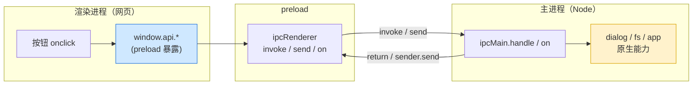
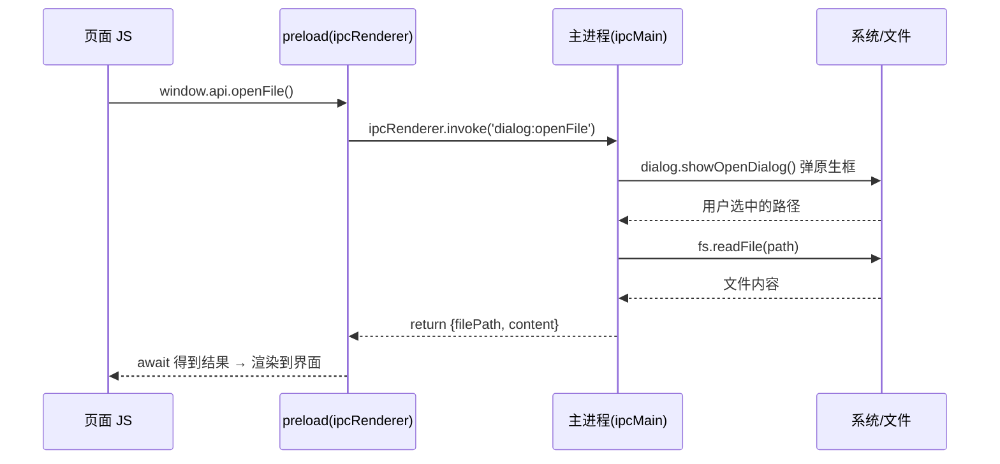

# 10 · Electron IPC 通信与 Web/原生混合（IPC & Hybrid）

> 一句话：渲染进程（网页）没有 Node，想读文件、弹原生对话框、拿系统路径，必须通过 **IPC（进程间通信）** 请主进程代劳。本模块讲透 Electron 两种 IPC 模式——**`invoke/handle`（请求-响应）** 和 **`send/on`（单向通知）**，并用 `contextBridge` 安全暴露，演示"网页界面 + 原生能力"的混合应用怎么搭。

## 📖 知识讲解

### 为什么需要 IPC

安全模型要求渲染进程默认没有 Node（`nodeIntegration:false`）。所以"读本地文件""弹系统对话框"这类**原生能力只能在主进程做**。渲染进程通过 IPC 发消息、主进程处理后回结果——这就是 Electron 应用"网页壳 + 原生内核"的黏合剂。

### 两种 IPC 模式

| 模式 | 渲染端 | 主进程端 | 用途 | 有返回值？ |
| --- | --- | --- | --- | --- |
| **请求-响应** | `ipcRenderer.invoke(ch, ...args)` → Promise | `ipcMain.handle(ch, fn)` | 读文件、查数据、调对话框 | ✅ await 拿返回 |
| **单向发送** | `ipcRenderer.send(ch, ...args)` | `ipcMain.on(ch, fn)` | 日志、通知、触发动作 | ❌ 无 |
| **主→渲染推送** | `ipcRenderer.on(ch, cb)` | `win.webContents.send(ch, ...)` 或 `event.sender.send(...)` | 进度、菜单点击、后台事件 | — |

> **首选 `invoke/handle`**：它是为"要返回值的异步调用"设计的，代码最干净。`send/on` 适合纯通知或主进程主动推。

### 安全：永远经 `contextBridge`

**不要**把整个 `ipcRenderer` 暴露给页面（`exposeInMainWorld('ipc', ipcRenderer)`）——那样页面能往任意通道发消息。正确做法是**只暴露具体业务函数**（`openFile`、`getAppInfo`），并在主进程 `handle` 里**校验参数**。

## 🔄 流程图 / 原理图

IPC 双向通信全貌：



`invoke/handle` 读文件的时序：



## 💻 代码说明

- [`main.js`](./main.js)：
  - `ipcMain.handle('dialog:openFile', ...)`：弹原生对话框 + `fs.readFile` 读文件后 `return`（invoke 模式）。
  - `ipcMain.handle('app:getInfo', ...)`：返回 `app.getName/getVersion/getPath`。
  - `ipcMain.on('renderer:log', ...)`：收到单向消息后用 `event.sender.send('main:reply', ...)` **回推**（send/on 模式）。
- [`preload.js`](./preload.js)：`contextBridge.exposeInMainWorld('api', {...})` 只暴露 `openFile`/`getAppInfo`/`log`/`onMainReply` 四个白名单函数，包住 `ipcRenderer`。
- [`index.html`](./index.html)：按钮调 `window.api.openFile()`（`await` 拿文件内容）、`window.api.log()`（send）、`window.api.onMainReply()`（订阅推送）。

## ▶️ 运行方式

```bash
cd 10-electron-ipc-hybrid
npm install
npm start
# 窗口里：点「打开文件」弹系统对话框并显示文件内容；
#         点「send 给主进程」，下方绿色行显示主进程回推的消息。
```

## ⚠️ 常见坑 / 最佳实践

- **别暴露整个 `ipcRenderer`**：只暴露具体函数，通道名和参数在主进程里校验，防止渲染端乱调。
- **`invoke` 对应 `handle`，`send` 对应 `on`**，别配错：`send` 没有返回值，想要返回值必须用 `invoke/handle`。
- **`handle` 里 `return` 的数据会被结构化克隆**：函数、DOM 节点等不可序列化的东西传不过去。
- **移除监听防泄漏**：长期存在的 `ipcRenderer.on` 记得在组件卸载时 `removeListener`。
- **主进程做重活别阻塞**：大文件/CPU 密集任务考虑 `utilityProcess` 或 worker，避免卡住应用。
- **路径与权限**：用 `app.getPath('userData')` 存配置，别硬编码路径；注意各平台差异。

## 🔗 官方文档

- 进程间通信 IPC：https://www.electronjs.org/docs/latest/tutorial/ipc
- `ipcMain`：https://www.electronjs.org/docs/latest/api/ipc-main
- `ipcRenderer`：https://www.electronjs.org/docs/latest/api/ipc-renderer
- `contextBridge`：https://www.electronjs.org/docs/latest/api/context-bridge
- `dialog`：https://www.electronjs.org/docs/latest/api/dialog
- 安全清单：https://www.electronjs.org/docs/latest/tutorial/security
