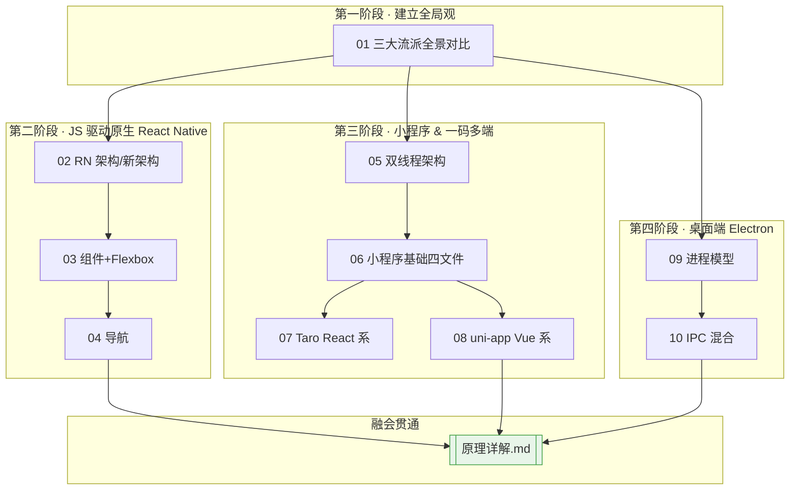
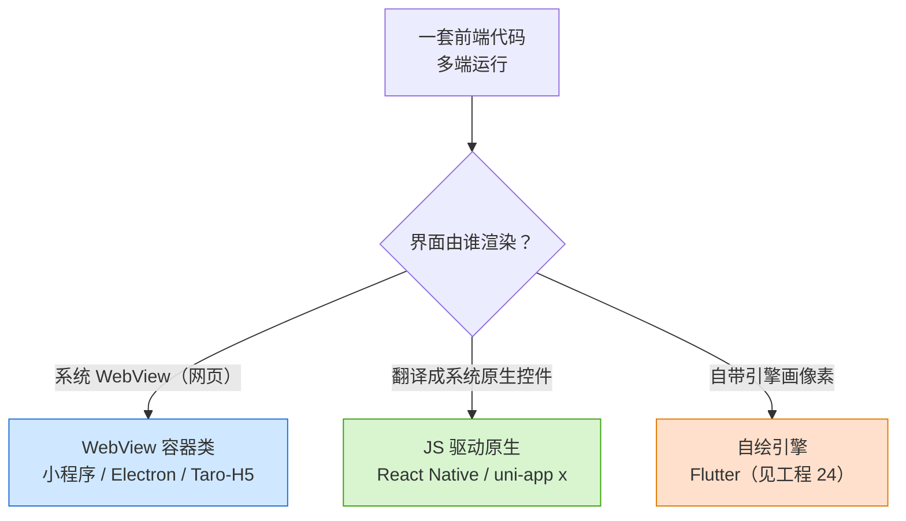

# 25 · 跨端开发（Cross-Platform Development）

> 进阶工程 · 跨端层。一套（或大部分）前端代码，跑到 **iOS / Android / 小程序 / H5 / 桌面**。
> 本工程横向覆盖跨端三大流派与主流框架：**React Native**（JS 驱动原生）、**微信小程序**（双线程 WebView）、**Taro / uni-app**（一码多端编译）、**Electron**（桌面），并配一篇《[原理详解.md](./原理详解.md)》讲透三大流派的渲染机制、小程序双线程、Electron 进程模型。

- 对照官方：[reactnative.dev](https://reactnative.dev/) · [微信小程序](https://developers.weixin.qq.com/miniprogram/dev/framework/) · [Taro](https://docs.taro.zone/) · [uni-app](https://uniapp.dcloud.net.cn/) · [Electron](https://www.electronjs.org/)。
- 姊妹工程：**24-dart-flutter**（自绘流派 Flutter），两者结合看全跨端版图。

---

## 📚 模块索引

| 编号 | 模块 | 流派 | 一句话 | 运行 |
|------|------|------|--------|------|
| 01 | [cross-platform-overview](./01-cross-platform-overview/) | 概念 | 跨端三大流派横向对比 | 文档 |
| 02 | [react-native-intro](./02-react-native-intro/) | JS 驱动原生 | RN 架构 / 三线程 / 新架构 JSI | 文档 |
| 03 | [rn-components-style](./03-rn-components-style/) | JS 驱动原生 | 核心组件 + Flexbox 样式 | Expo |
| 04 | [rn-navigation](./04-rn-navigation/) | JS 驱动原生 | React Navigation 栈导航传参 | Expo |
| 05 | [miniprogram-architecture](./05-miniprogram-architecture/) | WebView 双线程 | 小程序双线程架构原理 | 文档 |
| 06 | [miniprogram-basics](./06-miniprogram-basics/) | WebView 双线程 | 四文件 + 数据绑定 + setData | 微信开发者工具 |
| 07 | [taro](./07-taro/) | 编译一码多端 | Taro（React）→ 小程序/H5/RN | Taro CLI |
| 08 | [uniapp](./08-uniapp/) | 编译一码多端 | uni-app（Vue）→ 小程序/H5/App | HBuilderX / CLI |
| 09 | [electron-intro](./09-electron-intro/) | 桌面 WebView | Electron 进程模型（主/渲染/预加载） | `npm start` |
| 10 | [electron-ipc-hybrid](./10-electron-ipc-hybrid/) | 桌面 WebView | IPC 双向通信 + Web/原生混合 | `npm start` |

> ⭐ 工程根目录另有 **[《原理详解.md》](./原理详解.md)**：跨端三大流派（WebView 容器 / JS 驱动原生 RN / 自绘 Flutter）渲染机制对比、小程序双线程原理、Electron 进程模型，多图讲透 how/why。

---

## 🗺️ 学习路线

---

## 🧭 三大流派速览

| 维度 | WebView 容器类 | JS 驱动原生（RN） | 自绘引擎（Flutter，工程24） |
| --- | --- | --- | --- |
| 界面渲染者 | 系统 WebView | 系统原生控件 | 自带引擎画像素 |
| 语言 | HTML/CSS/JS | JS/TS + React | Dart |
| 体验 | 网页感 | 接近原生 | 原生级 |
| 代表 | 小程序 / Electron | React Native | Flutter |
| 本工程模块 | 05-10 | 02-04 | — |

---

## ⚙️ 环境与运行速查

| 技术 | 脚手架 / 工具 | 启动命令 |
| --- | --- | --- |
| React Native | Expo | `npx create-expo-app` → `npx expo start` |
| 微信小程序 | 微信开发者工具 | 导入项目 → 编译 |
| Taro | `@tarojs/cli` | `taro build --type weapp/h5 --watch` |
| uni-app | HBuilderX / Vite CLI | `npm run dev:h5` / `dev:mp-weixin` |
| Electron | `npm create @quick-start/electron` | `npm start` |

> 各模块 README 均含：📖 知识讲解 · 🔄 Mermaid 原理图 · 💻 代码说明 · ▶️ 运行方式 · ⚠️ 常见坑 · 🔗 官方文档。
