# 原理详解 · 跨端三大流派 & 小程序双线程 & Electron 进程模型

> 本文是本工程的核心交付物，讲 **how / why / 底层机制**，而非"怎么用"。
> 覆盖：① 跨端要解决的根本矛盾；② 三大流派（WebView 容器 / JS 驱动原生 RN / 自绘 Flutter）**界面到底由谁画**；③ React Native 新旧架构（Bridge → JSI/Fabric）；④ 小程序**双线程**为何这样设计、`setData` 为何是命门；⑤ Electron **进程模型**与安全边界；⑥ 编译型一码多端（Taro/uni-app）原理；⑦ 常见误区。
> 对照官方：[reactnative.dev/architecture](https://reactnative.dev/architecture/landing-page) · [微信小程序框架](https://developers.weixin.qq.com/miniprogram/dev/framework/) · [electronjs.org](https://www.electronjs.org/docs/latest/tutorial/process-model)。

---

## 目录

1. [跨端的根本矛盾：一次开发 vs 原生体验](#1-跨端的根本矛盾一次开发-vs-原生体验)
2. [核心分类维度：界面由谁渲染](#2-核心分类维度界面由谁渲染)
3. [三大流派逐个拆解](#3-三大流派逐个拆解)
4. [React Native：从 Bridge 到 JSI/Fabric](#4-react-native从-bridge-到-jsifabric)
5. [小程序双线程：为什么故意"自废武功"](#5-小程序双线程为什么故意自废武功)
6. [Electron 进程模型与安全边界](#6-electron-进程模型与安全边界)
7. [编译型一码多端：Taro / uni-app 原理](#7-编译型一码多端taro--uni-app-原理)
8. [横向大对比表](#8-横向大对比表)
9. [常见误区](#9-常见误区)

---

## 1. 跨端的根本矛盾：一次开发 vs 原生体验

所有跨端方案都在回答同一个问题：**如何用尽量少的代码，在尽量多的端上，得到尽量接近原生的体验？** 这三者互相拉扯：

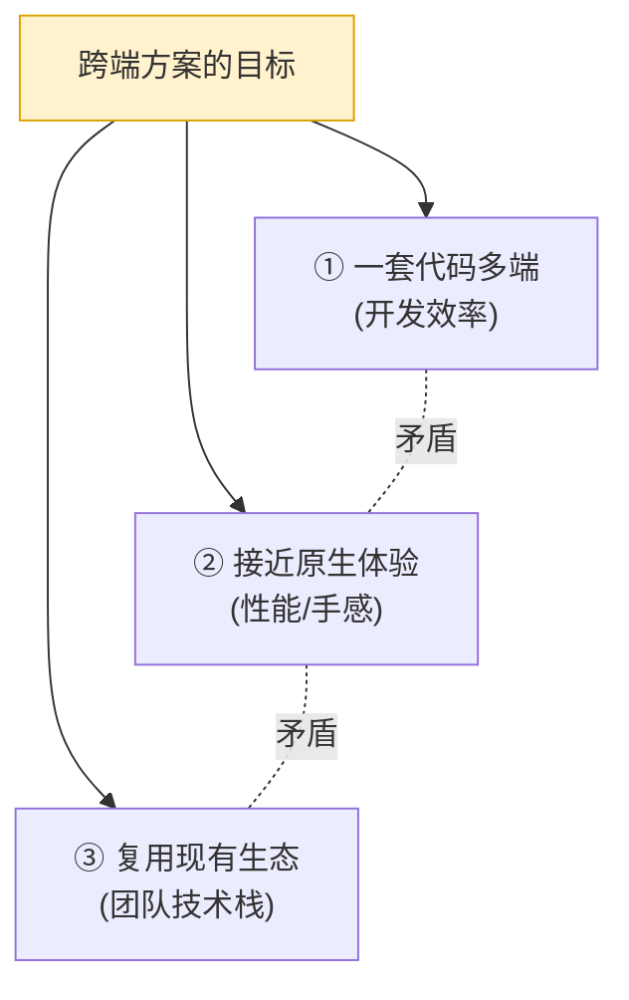

- 想**复用 Web 生态**（HTML/CSS/JS）→ 容易走 WebView，但性能受限。
- 想**接近原生体验** → 要么把 JS 翻译成原生控件（RN），要么干脆自己画（Flutter），但都要付出"桥接开销"或"换语言"的代价。

没有银弹。**理解一个方案，就是理解它在这三角里如何取舍。** 而取舍的技术核心，落在一个问题上——界面到底由谁渲染。

---

## 2. 核心分类维度：界面由谁渲染

跨端方案五花八门，但**只要问一句"最终屏幕上的像素是谁画的"，就能归类**：

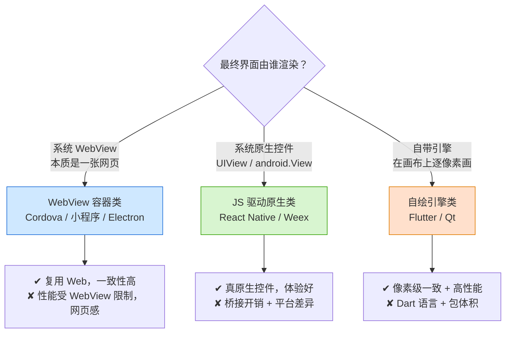

三条渲染路径的本质差异：

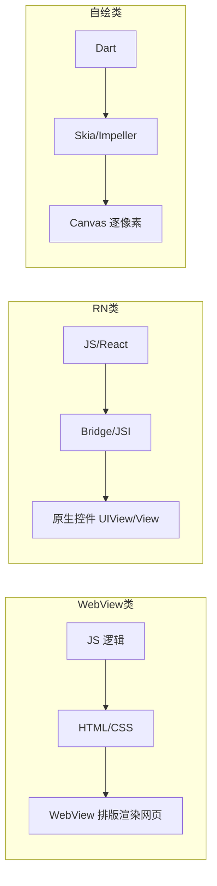

**同一段"Hello + 按钮"，三派写法看着都像声明式 UI，但底层完全不同**：

```html
<!-- WebView 类（小程序 WXML / H5）：写标签，WebView 渲染 -->
<view class="box">Hello</view>
<button bindtap="onTap">点我</button>
```
```jsx
// RN：写组件，映射到原生控件 UIView/UILabel
<View><Text>Hello</Text><Button title="点我" onPress={onTap} /></View>
```
```dart
// Flutter：写 Widget，引擎自己画每个像素
Column(children:[Text('Hello'), ElevatedButton(onPressed:onTap, child:Text('点我'))]);
```

---

## 3. 三大流派逐个拆解

### 3.1 WebView 容器类

**原理**：界面是一张真网页，跑在系统提供的 WebView（iOS `WKWebView`、Android `WebView`、桌面 Chromium）里；需要相机/定位/文件等原生能力时，通过 **JSBridge** 向原生层发消息。

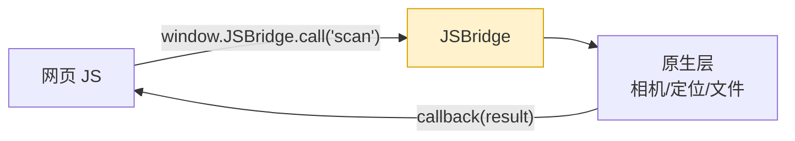

- **代表**：Cordova/PhoneGap、Ionic、微信小程序（双 WebView 变体）、Electron（内置 Chromium）。
- **优点**：完全复用 Web 技术栈，开发成本最低，一致性最好，可热更新。
- **缺点**：受 WebView 渲染性能限制，复杂动画/长列表易掉帧；是"网页感"而非"原生手感"；JSBridge 通信是异步字符串序列化，高频场景有开销。

### 3.2 JS 驱动原生类（React Native）

**原理**：逻辑用 JS 写，界面**不是网页**——JS 把"渲染意图"传给原生层，由**真正的原生控件**绘制。`<View>`→`UIView`/`ViewGroup`，`<Text>`→`UILabel`/`TextView`。布局用 **Yoga**（C++ Flexbox 引擎）计算坐标。详见 §4。

### 3.3 自绘引擎类（Flutter，工程 24）

**原理**：**不用系统控件，也不用 WebView**，自带渲染引擎（Skia/Impeller）在平台给的一块画布上**自己画每个像素**，平台只提供 Canvas + 事件输入。因此三端像素级一致、不受平台控件差异影响。代价是语言换成 Dart、包体积较大、与原生生态融合要 Platform Channel。（原理见工程 24《原理详解.md》的"三棵树"。）

---

## 4. React Native：从 Bridge 到 JSI/Fabric

RN 的运行时核心是**多线程协作**：

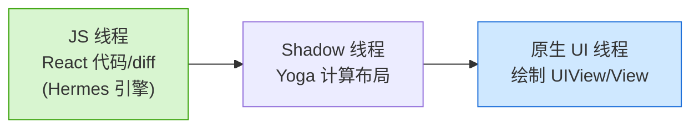

- **JS 线程**：跑业务逻辑、React 渲染与 diff。
- **Shadow 线程**：Yoga 把 Flexbox 样式算成具体坐标尺寸。
- **UI 线程**：真正绘制原生控件、响应手势——**绝不能阻塞**，一卡就掉帧。

### 旧架构：异步 Bridge

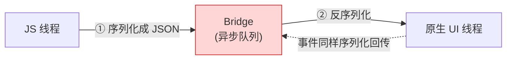

问题：**所有跨线程调用都要 JSON 序列化 + 异步排队**。滚动同步、手势跟随、大列表这类高频场景，Bridge 成为瓶颈，还会出现"三线程数据不同步"的视觉跳动。

### 新架构（0.76+ 默认）：JSI + Fabric + TurboModules + Bridgeless

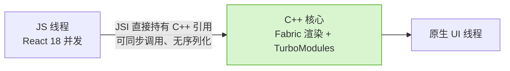

- **JSI（JavaScript Interface）**：一层 C++ 接口，让 **JS 直接持有并调用 C++ 对象引用**（反之亦然），**去掉序列化和异步桥**，可同步调用。这是最根本的变化。
- **Fabric**：新渲染系统（取代旧 UIManager），C++ 重写，支持 React 18 并发特性，可同步测量布局。
- **TurboModules**：新一代原生模块，**按需懒加载**，经 JSI 同步/异步调原生。
- **Bridgeless**：彻底移除异步 Bridge，全走 JSI，新架构最终形态。
- **Codegen**：按 TS/Flow 类型**自动生成**类型安全的 JS↔原生接口。

一次"点击→更新"的完整数据流（新架构）：

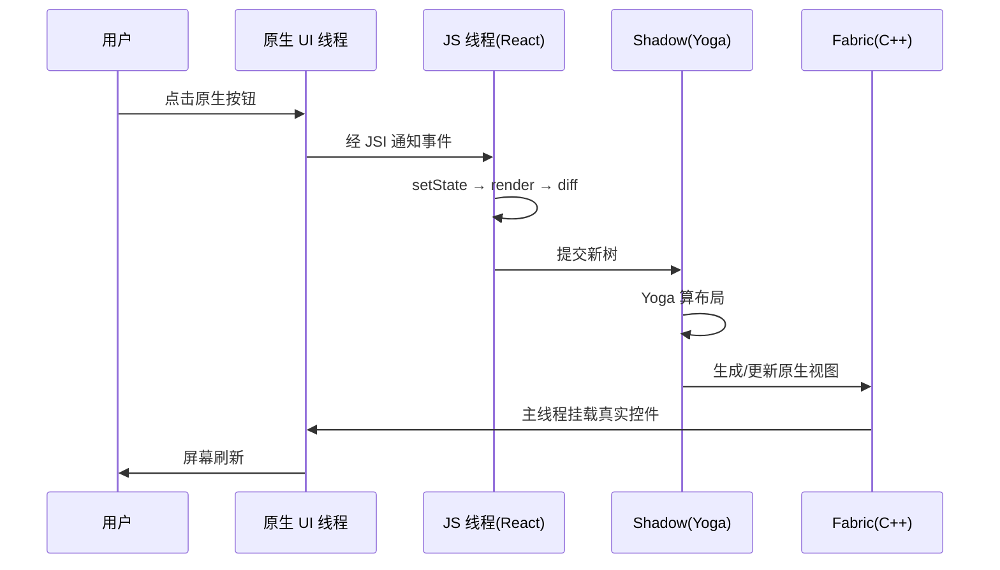

---

## 5. 小程序双线程：为什么故意"自废武功"

普通网页是**单线程**：JS 与 DOM 渲染同线程，JS 能任意操作 DOM。小程序**故意不这样**，拆成两条线程：

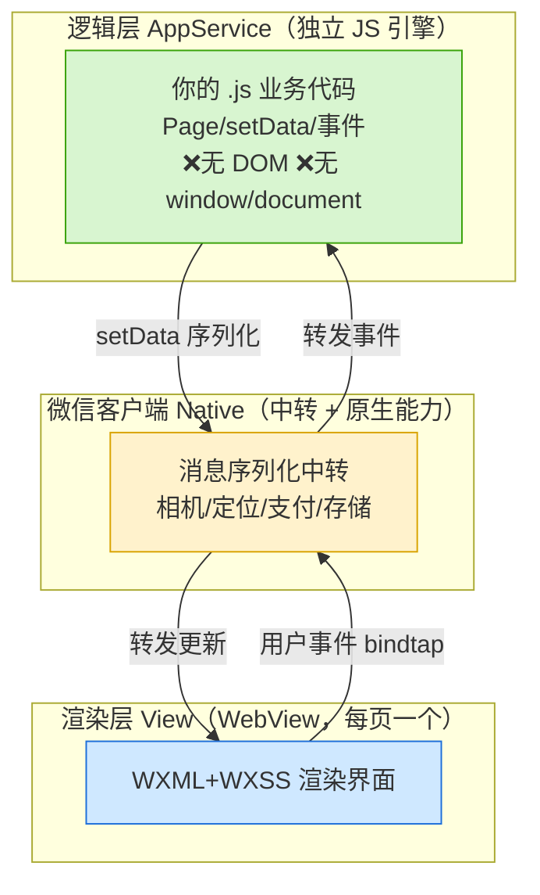

- **逻辑层**：跑在独立 JS 引擎（iOS 用 JavaScriptCore、Android 用 V8、开发者工具用 Chromium 内核）里，**没有 DOM、没有 `window`/`document`**。
- **渲染层**：每个页面一个 WebView，把 WXML/WXSS 渲染成界面。
- 两层**不能直接通信**，一切经 Native 层**序列化中转**。

### 为什么这样设计（关键 why）

单线程 Web 里 JS 能任意操作 DOM、跳转、读 `window` 数据，带来两大问题——**安全**（XSS 注入、乱跳链接、窃取用户数据）和**管控**（平台无法拦截）。双线程的三个目的：

1. **安全隔离**：逻辑层拿不到 DOM、不能执行动态外部脚本 → 杜绝直接注入攻击，平台可管控。
2. **性能隔离**：JS 逻辑再忙也不阻塞渲染线程，滑动不卡。
3. **一致体验**：渲染层受微信统一控制，跨机型表现一致。

### 代价：`setData` 是性能命门

因为两层物理隔离，**逻辑层每次更新界面都要**：把数据**序列化成字符串 → 经 Native 跨线程传 → 渲染层反序列化 → 更新 WXML 绑定**。

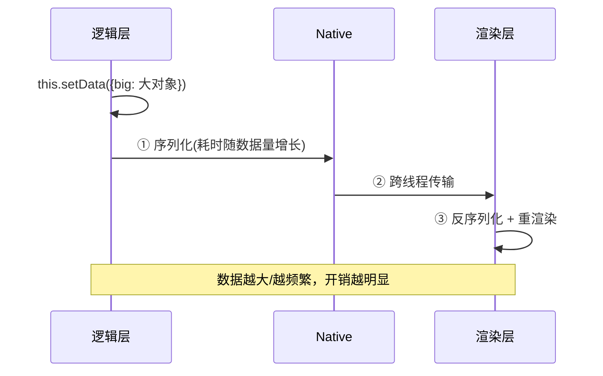

所以最佳实践：**只 setData 变化的字段、别传大对象、别在 `onPageScroll` 等高频回调里 setData**。这不是"约定俗成"，而是**双线程架构的物理必然**。

---

## 6. Electron 进程模型与安全边界

Electron = **Chromium（渲染 UI）+ Node.js（系统能力）**，直接继承 Chromium 的**多进程模型**：

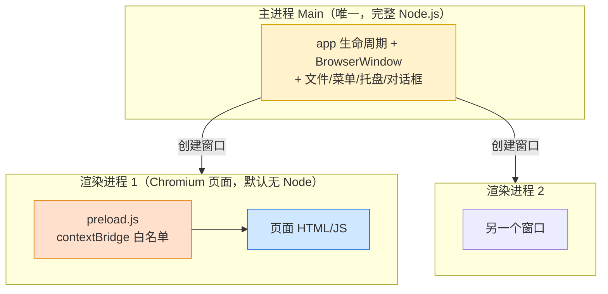

### 为什么要隔离（why）

如果渲染进程（网页）能直接用 Node，那么页面里任何一个 XSS 就能 `require('child_process').exec('rm -rf /')`。所以 Electron 的安全模型：

1. **`nodeIntegration:false`**：渲染进程默认没有 `require`/`process`。
2. **`contextIsolation:true`**：预加载脚本与页面 JS 处于**隔离的 JS 上下文**，页面拿不到预加载里的 Node 引用。
3. **`contextBridge`**：唯一正规暴露方式，只把**白名单函数**挂到 `window`。

### 原生能力靠 IPC

渲染进程要读文件、弹系统对话框，必须经 **IPC** 请主进程代劳：

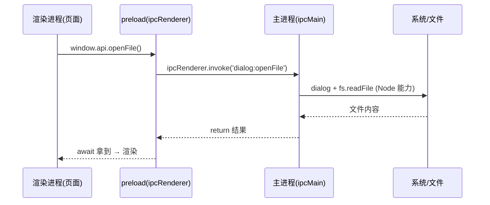

两种模式：**`invoke/handle`**（请求-响应，有返回值，首选）与 **`send/on`**（单向通知 + 主进程 `webContents.send` 回推）。详见模块 10。

---

## 7. 编译型一码多端：Taro / uni-app 原理

各家小程序语法互不兼容（微信 WXML、支付宝 AXML…），Taro/uni-app 的思路：**你写标准 React/Vue，编译器 + 运行时把它适配到各端**。

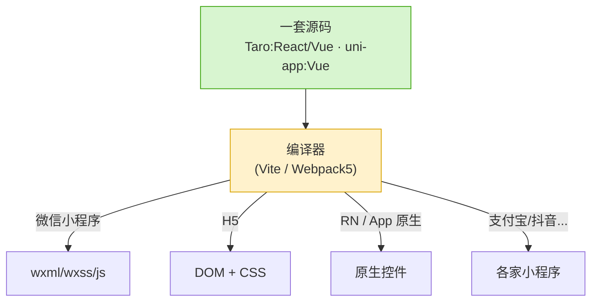

- **早期（Taro 1/2）**：JSX 静态转译成 WXML，限制多（不能随意用动态语法）。
- **现在（Taro 3/4、uni-app Vue3）**：**编译时 + 运行时结合**——实现一套**精简 DOM/BOM** 跑在小程序逻辑层，让 React/Vue 运行时能正常工作，再把虚拟 DOM 的更新**批量转成 `setData`** 提交给渲染层：

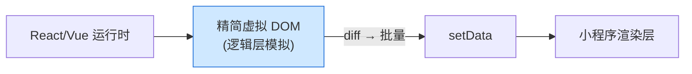

因此它们**本质仍受小程序双线程约束**（§5 的 `setData` 命门同样适用）。**平台差异**用条件编译解决：Taro 用 `process.env.TARO_ENV`（编译期 tree-shaking），uni-app 用 `#ifdef MP-WEIXIN … #endif`。

> **Taro vs uni-app**：Taro 主打 React（也支持 Vue），生态偏 React；uni-app 主打 Vue，且 App 端有 `nvue`/`uni-app x`（UTS 编原生）走"JS 驱动原生"路线，原生能力更强。

---

## 8. 横向大对比表

| 维度 | 小程序 | React Native | Taro/uni-app(小程序端) | Flutter(工程24) | Electron |
| --- | --- | --- | --- | --- | --- |
| 渲染者 | WebView | 原生控件 | WebView(小程序端) | 自绘引擎 | Chromium |
| 语言 | JS(受限) | JS+React | JS+React/Vue | Dart | JS(Web) |
| 目标端 | 微信生态 | iOS/Android | 多小程序+H5+App | 全端 | 桌面 |
| 体验 | 网页感 | 接近原生 | 同小程序 | 原生级 | 网页感 |
| 通信开销 | setData 序列化 | Bridge/JSI | setData | Platform Channel | IPC |
| 一致性 | 高 | 中 | 中 | 最高 | 高 |
| 典型应用 | 微信内小程序 | Discord/Shopify | 多端投放 | 阿里系 App | VSCode |

---

## 9. 常见误区

1. **"RN 是套壳 WebView"** ❌ — RN 界面是**真原生控件**，没有 DOM/`window`，只是逻辑用 JS 写。WebView 才是套壳。
2. **"小程序就是 H5"** ❌ — 小程序是**受限的双线程 Web**，逻辑层没有 DOM/BOM，`setData` 有序列化成本，和普通 H5 编程模型完全不同。
3. **"一套代码真能零改动多端"** ❌ — 平台适配（条件编译、平台判断、原生模块）几乎不可避免，尤其 RN 端和小程序端差异大。
4. **"Electron 省内存"** ❌ — 内置整个 Chromium，空窗口也上百 MB；它省的是"开发成本"不是"运行资源"。
5. **"Electron 渲染进程能直接读文件"** ❌ — 默认 `nodeIntegration:false`，必须经 IPC 请主进程，且应始终用 `contextBridge` 暴露白名单。
6. **"`setData` 随便调"** ❌ — 每次都跨线程序列化，高频/大对象会卡；只传变化字段。
7. **"Flutter/RN 谁都能替代谁"** ❌ — 重定制像素一致选 Flutter；已有 React 团队、要接原生生态选 RN；免安装/裂变选小程序；桌面工具选 Electron。**没有银弹，按业务选型。**

---

## 🔗 官方文档

- React Native 架构：https://reactnative.dev/architecture/landing-page
- RN 新架构：https://reactnative.dev/architecture/fabric-renderer
- 微信小程序框架：https://developers.weixin.qq.com/miniprogram/dev/framework/
- 小程序运行环境（双线程）：https://developers.weixin.qq.com/miniprogram/dev/framework/quickstart/framework.html
- Taro：https://docs.taro.zone/
- uni-app：https://uniapp.dcloud.net.cn/
- Electron 进程模型：https://www.electronjs.org/docs/latest/tutorial/process-model
- Electron IPC：https://www.electronjs.org/docs/latest/tutorial/ipc
- Electron 安全：https://www.electronjs.org/docs/latest/tutorial/security
- Flutter（自绘对比，工程 24）：https://docs.flutter.dev/resources/architectural-overview
