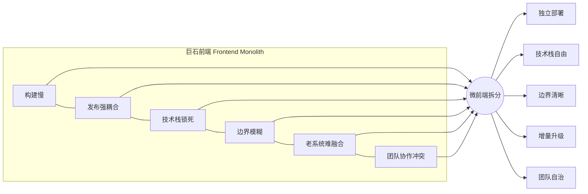
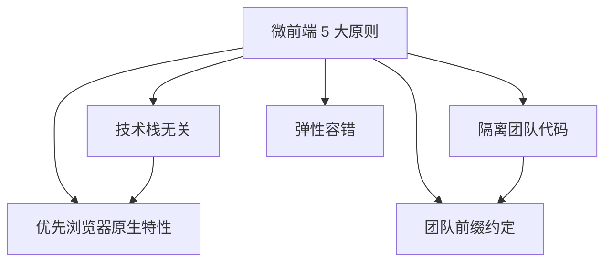

# 01 · 为什么需要微前端（Why Micro Frontends）
> 微前端把「巨石前端」按业务/团队拆成多个可独立开发、独立部署的子应用，用来解决大型前端在构建、发布、技术栈、团队协作上的规模化难题。

## 📖 知识讲解

### 1. 什么是巨石前端（Frontend Monolith）
随着单页应用（SPA）越做越大，前端往往演变成一个**巨型单体**：所有业务代码在同一个仓库、同一次构建、同一次发布里。当参与人数从几人涨到几十上百人时，这种结构会暴露 6 大痛点：

1. **构建慢**：一处小改动要重新构建整个巨型应用，本地启动和 CI 越来越慢。
2. **发布强耦合**：任一团队上线都要全量发布，一个 bug 会卡住所有团队。
3. **技术栈锁死**：全仓统一框架和版本，想升级 React/Vue 或引入新栈牵一发而动全身。
4. **代码边界模糊**：模块之间随意互相 `import`，久而久之谁都不敢删代码。
5. **老系统难融合**：新功能要接入遗留系统时，往往被迫沿用旧技术栈。
6. **团队协作冲突**：几十人改同一个仓库，合并冲突、互相踩踏频繁。

### 2. 微前端的定义与收益
> micro-frontends.org：把「微服务」的理念延伸到前端 —— 将一个网站或 Web 应用，看成由**多个独立团队各自拥有的功能特性**组合而成，每个团队端到端地负责自己那一块（从数据库到 UI）。

带来的收益：
- **独立开发 / 独立部署**：各团队自己的仓库、自己的流水线，上线互不阻塞。
- **技术栈自由**：不同子应用可用不同框架，并能各自独立升级。
- **边界清晰**：以「业务特性」而非「技术分层」切分，职责明确。
- **增量升级 / 融合老系统**：可以一块一块替换遗留代码，而不必推倒重来。
- **团队自治**：团队规模化后仍能保持交付效率。

### 3. micro-frontends.org 的 5 大核心原则
| 原则 | 中文 | 要点 |
| --- | --- | --- |
| Be Technology Agnostic | 技术栈无关 | 每个团队自由选框架、独立升级，容器不强制统一栈 |
| Isolate Team Code | 隔离团队代码 | 即使同框架也不共享运行时/全局状态，避免耦合 |
| Establish Team Prefixes | 团队前缀约定 | CSS 类名、事件名、localStorage、自定义元素统一加前缀防冲突 |
| Favor Native Browser Features over Custom APIs | 优先浏览器原生特性 | 优先用浏览器事件、Custom Elements 通信，而非发明复杂全局 API |
| Build a Resilient Site | 弹性容错 | 某个微前端挂掉不拖垮整站，用渐进增强保证核心可用 |

### 易错点
- 微前端**不是银弹**：小团队/小项目用它反而增加复杂度（运维、通信、重复依赖）。
- 别只做「技术拆分」（把 header、footer 拆开），核心是按**团队/业务纵向切分**。
- 拆分后要防止**样式泄漏**和**全局变量污染**，否则「隔离」名存实亡。

## 🔄 流程图 / 原理图

巨石前端的痛点如何被微前端化解：



5 大核心原则的关系：



## 💻 代码说明

demo 是一个**纯 HTML/CSS/原生 JS** 的可视化页面（`index.html`，无任何依赖）。关键设计：

1. **数据驱动两种视图**：把「团队/业务模块」抽象为 `teams` 数组，巨石视图与微前端视图共用同一份数据，只是渲染方式不同。
```js
const teams = [
  { name: '搜索团队', feature: '商品搜索 / 筛选', color: '#2563eb', stack: 'React' },
  // ...其他团队
];
```

2. **巨石视图 `renderMonolith()`**：用一个红色虚线大框（`.monolith`）把所有团队卡片圈在一起，表达「同一构建 / 同一发布」，并列出 6 大痛点。

3. **微前端视图 `renderMicro()`**：用网格把每个团队渲染成**独立卡片**，标注各自技术栈，外层是「容器 Shell」标签，表达「独立部署 + 技术栈自由」。

4. **交互**：点击顶部按钮在两视图间切换；点击任意团队卡片，`bindTeamClicks()` 会根据当前架构弹出该团队的独立性说明（微前端下强调独立部署，巨石下强调被绑死）。

5. **5 大原则卡片 `renderPrinciples()`**：把原则数组渲染成卡片网格，一屏看全。

## ▶️ 运行方式

免构建、免依赖：**用浏览器直接打开 `index.html`** 即可。

```bash
open index.html      # macOS
# 或双击文件，或拖进浏览器
```

## ⚠️ 常见坑 / 最佳实践
- **别为了微前端而微前端**：只有当团队规模、发布频率、技术栈异构成为真实痛点时才引入。
- **纵向切分而非横向**：按业务特性（搜索、购物车、订单）切，而不是按 header/footer 切。
- **从第一天就约定团队前缀**：CSS 前缀、事件命名空间、存储 key 前缀，后期再加成本极高。
- **优先浏览器原生通信**（CustomEvent / postMessage），少造全局共享状态这种耦合源。
- **容错设计**：单个子应用加载失败要有兜底 UI，不能白屏整站。

## 🔗 官方文档
- micro-frontends.org（含 5 大原则）：https://micro-frontends.org/
- Martin Fowler《Micro Frontends》：https://martinfowler.com/articles/micro-frontends.html
