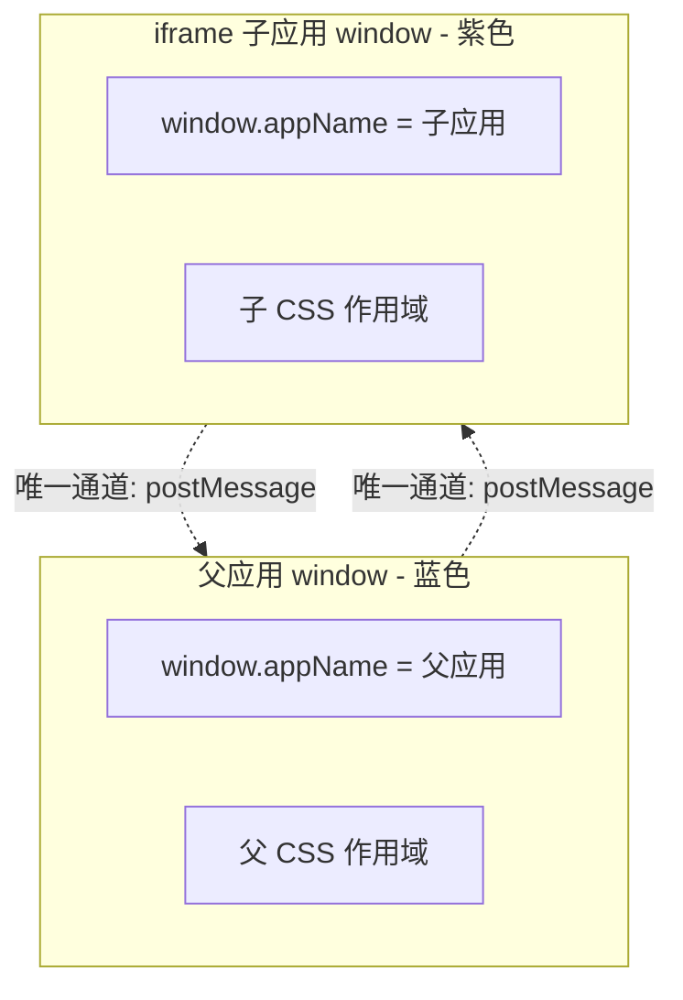
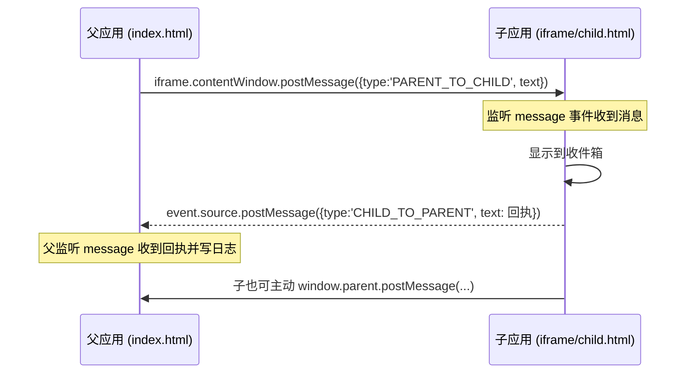

# 02 · iframe 微前端方案（Iframe Approach）
> iframe 是实现微前端最古老、隔离性最强的方式：把子应用当作一个独立文档嵌进页面，天然隔离但代价明显。本模块讲清它的隔离原理、7 大缺陷，以及何时仍是合理选择。

## 📖 知识讲解

### 1. iframe 为什么天然隔离
`<iframe>` 会加载一个**完整的独立文档**，它拥有：
- **独立的 `window` / `document`**：iframe 里的 `window` 与父页面的 `window` 是两个不同对象，全局变量互不覆盖。
- **独立的全局作用域**：子应用里 `var` / `window.xxx` 定义的东西不会污染父应用，反之亦然。
- **独立的 CSS 作用域**：子应用样式被限制在 iframe 内，不会泄漏到父页面（父的样式也进不去）。
- **独立的 JS 执行上下文**：子应用崩溃/死循环通常只影响它自己，不直接拖垮父应用。

正因如此，micro-frontends.org 也承认：如果你的首要诉求是「样式与脚本的强隔离」，iframe 简单直接。

### 2. iframe 作为微前端方案的 7 大缺陷
1. **URL 状态不同步 / 刷新丢状态**：iframe 内部导航不改变浏览器地址栏，刷新父页面后子应用状态丢失、无法通过 URL 还原。
2. **弹窗/遮罩被裁剪**：iframe 里的 modal、下拉、全屏遮罩无法覆盖到父页面区域，被限制在 iframe 边框内。
3. **DOM 割裂难共享**：父子 DOM 完全隔离，共享组件、拖拽跨界、统一滚动都很难做。
4. **路由与浏览器历史难同步**：前进/后退按钮与 iframe 内部路由割裂，历史记录管理复杂。
5. **加载慢 / 白屏**：每个 iframe 都要重新加载一整套文档与资源（框架运行时重复），首屏更慢。
6. **通信麻烦**：父子只能靠 `postMessage` 手动收发、序列化，缺少直接函数调用，复杂交互样板代码多。
7. **SEO / 可访问性差**：搜索引擎对 iframe 内容抓取弱，屏幕阅读器、焦点管理、深链接体验都打折。

### 3. 何时 iframe 仍是合理选择
- **强隔离需求**：需要严格沙箱，防止第三方代码污染或攻击主应用。
- **嵌入第三方系统**：内嵌你不可控的外部页面（支付、地图、客服、第三方后台）。
- **老系统快速整合**：把遗留系统「先包进来能用」，作为渐进迁移的过渡方案。

### 易错点
- 以为 iframe「自动」能和父应用共享登录态/主题 —— 实际需要显式通过 postMessage 或同源 Cookie 传递。
- 用 `iframe.contentWindow.xxx` 直接读子应用变量**只在同源时可行**；跨源会抛 `SecurityError`。
- `postMessage` 第二参数 `targetOrigin` 若图省事写 `'*'`，生产环境有信息泄漏风险，应写确切源。
- 接收方不校验 `event.origin` 会被恶意页面伪造消息攻击。

## 🔄 流程图 / 原理图

父子隔离边界：



postMessage 通信时序：



## 💻 代码说明

demo 由**同目录两个纯 HTML 文件**组成，无任何依赖：`index.html`（父应用）内嵌 `child.html`（子应用）。

**① 各自的全局作用域（隔离演示）**
父应用与子应用都声明了同名全局变量，但互不覆盖：
```js
// index.html（父）
window.appName = '父应用-Parent';
// child.html（子）—— 这是 iframe 的独立 window
window.appName = '子应用-Child';
```
父页面点「读取子应用变量」时，走 `iframe.contentWindow` 才能拿到子的值，证明它们是两个 window：
```js
const childName = iframe.contentWindow.appName; // "子应用-Child"
```
跨源时这行会抛 `SecurityError`——`try/catch` 里正好把这一强隔离特性演示出来。

**② 父 → 子 通信**
```js
iframe.contentWindow.postMessage({ type: 'PARENT_TO_CHILD', text }, '*');
```
子应用监听 `message` 事件收到后，显示到收件箱并**自动回执**：
```js
event.source.postMessage({ type: 'CHILD_TO_PARENT', text: '回执…' }, '*');
```

**③ 子 → 父 通信**
子应用也可主动向上发消息，`window.parent` 指向父窗口：
```js
window.parent.postMessage({ type: 'CHILD_TO_PARENT', text: '子应用主动打招呼' }, '*');
```
父应用统一在 `window.addEventListener('message', ...)` 里接收并写入日志面板。

**约定 `type` 字段**：因为一个页面可能收到各种来源的 message，用 `data.type` 区分是不是自己关心的消息，是 postMessage 的常用最佳实践。

## ▶️ 运行方式

免构建、免依赖：**用浏览器直接打开 `index.html`** 即可，`child.html` 会被自动嵌入。

```bash
open index.html      # macOS
```
操作：先点「读取父/子应用 window.appName」看隔离效果；再在输入框发消息看父子 postMessage 往返；也可点子应用里的按钮主动给父发消息。

> 提示：用 `file://` 直接打开时父子同源可正常通信；若改成从不同域名加载子应用，`iframe.contentWindow.appName` 会被浏览器拦截（正好印证跨源隔离），此时只能用 postMessage 通信。

## ⚠️ 常见坑 / 最佳实践
- **务必校验 `event.origin`**：只处理来自可信来源的消息，防伪造攻击。
- **`targetOrigin` 不要图省事写 `'*'`**：生产写子应用确切源，避免消息泄漏给恶意页面。
- **约定消息协议**：统一 `{ type, payload }` 结构，避免各团队消息互相误伤。
- **别指望 iframe 共享路由**：需要深链接/前进后退同步时，要手动把子应用路由映射到父 URL。
- **性能**：多个 iframe 会重复加载框架运行时，首屏偏慢；对性能敏感场景优先考虑 Module Federation / Web Components 等方案。
- **合理定位**：把 iframe 当「强隔离沙箱 / 嵌第三方 / 过渡老系统」的工具，而非默认微前端方案。

## 🔗 官方文档
- micro-frontends.org（The iframe approach 一节）：https://micro-frontends.org/
- Martin Fowler《Micro Frontends》：https://martinfowler.com/articles/micro-frontends.html
- MDN `window.postMessage`：https://developer.mozilla.org/zh-CN/docs/Web/API/Window/postMessage
- MDN `<iframe>`：https://developer.mozilla.org/zh-CN/docs/Web/HTML/Element/iframe
