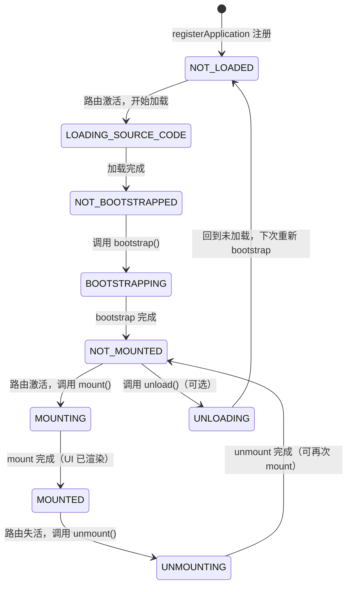
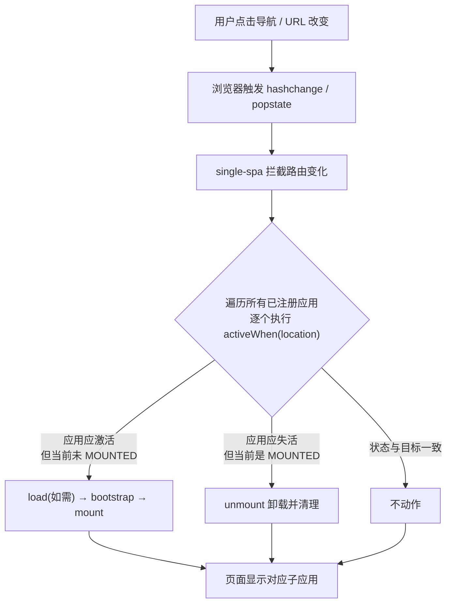

# 03 · single-spa（路由分发的顶层框架）
> single-spa 是最早的微前端顶层框架：它本身不渲染任何 UI，只做「按路由决定挂载 / 卸载哪个子应用」的调度，让多个独立子应用（可以是 React / Vue / Angular 等不同技术栈）共存于同一个页面。

## 📖 知识讲解

微前端要解决的问题：一个大型前端应用被拆成多个可独立开发、独立部署的子应用，但用户看到的是「一个」页面。谁来决定「当前该显示哪个子应用」？这就是 single-spa 的职责 —— 它是一个 **root-config（根配置 / 顶层框架）**，扮演「路由分发中心」。

### 核心概念

1. **root-config（主应用）**：只负责注册子应用 + 启动。它监听浏览器路由变化（`hashchange` / `popstate`），根据规则调度子应用。本身不写业务 UI。

2. **application（子应用）**：每个子应用必须导出以下 4 个**异步生命周期函数**（返回 Promise）。single-spa 在恰当时机调用它们：

   | 生命周期 | 触发时机 | 职责 |
   | --- | --- | --- |
   | `bootstrap` | 首次挂载前（只一次） | 一次性初始化 |
   | `mount` | 每次路由激活该应用 | 把 UI 渲染到容器 |
   | `unmount` | 每次路由失活该应用 | 卸载 UI、清理监听（防泄漏） |
   | `unload`（可选） | 需要彻底卸载时 | 回到「未加载」状态，下次重新 bootstrap |

### 核心 API

- **`registerApplication({ name, app, activeWhen })`**：注册一个子应用。
  - `name`：唯一标识。
  - `app`：子应用对象，或一个返回 Promise 的**加载函数**（如 `() => import('./app1.js')`，实现懒加载）。
  - `activeWhen`：**决定该子应用在哪些路由下激活**。可以是路径字符串（`'/app1'`）、函数（`location => boolean`）或它们的数组。
- **`start()`**：启动 single-spa。**在调用 start 之前，应用只会被加载 / bootstrap，但不会 mount**；调用 start 后才真正按路由挂载。

### single-spa 的应用状态机

一个子应用在其生命周期里会在多个状态间流转（`NOT_LOADED → LOADING → NOT_MOUNTED → MOUNTING → MOUNTED → UNMOUNTING → NOT_MOUNTED …`），single-spa 内部维护这个状态机，路由每次变化都会重新计算「谁该 mount、谁该 unmount」。

## 🔄 流程图 / 原理图

### 图 1：子应用生命周期状态机（stateDiagram-v2）



### 图 2：路由变化 → single-spa 调度流程（flowchart）



## 💻 代码说明

demo 只有一个 `index.html`（含内联脚本），关键片段：

1. **CDN 引入**（免 npm install），暴露全局 `singleSpa`：
   ```html
   <script src="https://cdn.jsdelivr.net/npm/single-spa@5.9.5/lib/umd/single-spa.min.js"></script>
   ```

2. **内联子应用对象**：`createInlineApp()` 返回一个实现了 `bootstrap / mount / unmount / unload` 的对象。真实项目里子应用是独立打包的 JS，但导出的生命周期形状完全一样。`mount` 里往指定容器 `innerHTML` 渲染 UI 并绑定事件，`unmount` 里清空容器、移除监听。

3. **注册两个子应用**：`app1` 的 `activeWhen` 为 `hash` 以 `#/app1` 开头，`app2` 为 `#/app2`。这样访问不同路由时，single-spa 自动挂载对应应用、卸载另一个。

4. **`singleSpa.start()`**：启动调度。之前只是注册，start 之后才真正按当前路由挂载。

打开控制台可看到 `[app1] bootstrap / mount / unmount` 等日志，直观理解生命周期调用时机。

## ▶️ 运行方式

> 用了 ES 模块 / 全局脚本，需通过 **HTTP 静态服务器** 打开（直接双击 `file://` 打开个别浏览器会限制脚本，推荐起服务）。

```bash
cd 26-micro-frontends/03-single-spa
npx serve .        # 或： python3 -m http.server 3000
```

然后浏览器访问终端提示的地址（如 `http://localhost:3000`），点击导航中的 App1 / App2 观察挂载与卸载。

## ⚠️ 常见坑 / 最佳实践

- **忘记调用 `start()`**：只 `registerApplication` 不 `start`，应用会被 bootstrap 但永远不 mount，页面看似「注册了却不显示」。
- **`unmount` 没清理干净**：不在 unmount 里移除 DOM、事件监听、定时器，会内存泄漏且切回来重复绑定。**unmount 必须与 mount 对称**。
- **生命周期必须返回 Promise**：single-spa 依赖 Promise 判断阶段是否完成；用 `async` 函数最省心。忘记 async / 未 resolve 会卡在某个状态。
- **`activeWhen` 用「前缀匹配」思维**：`'/app1'` 会匹配 `/app1`、`/app1/x`。多个应用路由前缀不要相互包含，否则会同时激活。
- **样式 / 全局变量冲突**：single-spa 本身**不做样式隔离和 JS 沙箱**，多个子应用的全局 CSS、`window` 变量会互相污染 —— 这正是 qiankun（见 04 模块）在其之上补齐的能力。
- **最佳实践**：子应用用 `single-spa-react` / `single-spa-vue` 等官方适配器自动生成生命周期，不用手写；root-config 保持「零业务」。

## 🔗 官方文档

- 快速开始：https://single-spa.js.org/docs/getting-started-overview
- 注册应用 API：https://single-spa.js.org/docs/api#registerapplication
- 子应用生命周期：https://single-spa.js.org/docs/building-applications
- 应用状态机（life cycle）：https://single-spa.js.org/docs/api#lifecyle-props
