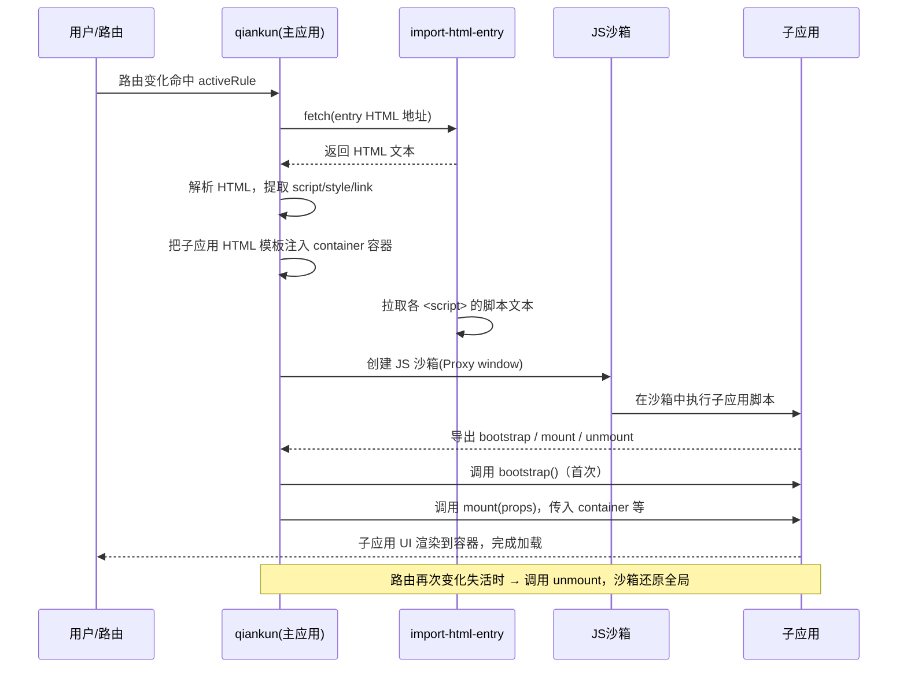

# 04 · qiankun（基于 single-spa 封装的微前端框架）
> qiankun 是蚂蚁开源、基于 single-spa 二次封装的微前端框架：补齐了 single-spa 缺失的 **HTML Entry 加载、JS 沙箱、样式隔离**，让微前端「开箱即用」——主应用只需 `registerMicroApps + start` 两行。

## 📖 知识讲解

single-spa（见 03 模块）解决了「按路由调度子应用」，但把三件麻烦事留给了开发者：怎么加载子应用资源、怎么隔离 JS 全局、怎么隔离 CSS。qiankun 在 single-spa 之上把这三件事都内置了。

### 核心 API（与 single-spa 几乎一致，但更简单）

- **`registerMicroApps(apps, lifeCycles?)`**：注册子应用数组，每个子应用配置：
  - `name`：唯一名称。
  - `entry`：**子应用的入口**。qiankun 用 **HTML Entry**（给 HTML 地址），这是与 single-spa 最大的区别。
  - `container`：子应用挂载到主应用的哪个 DOM 容器（选择器或元素）。
  - `activeRule`：路由匹配规则（字符串前缀或函数），命中即激活加载。
- **`start(opts?)`**：启动。常用配置：
  - `sandbox`：`true`（默认，Proxy 沙箱）/ `{ strictStyleIsolation }`（Shadow DOM 严格样式隔离）/ `{ experimentalStyleIsolation }`（给样式选择器加作用域前缀）。
  - `prefetch`：是否预加载未激活子应用的静态资源（默认 `true`）。

### HTML Entry vs JS Entry（关键区别）

| | single-spa | qiankun |
| --- | --- | --- |
| entry 给什么 | **JS Entry**：一个 JS 文件地址 | **HTML Entry**：一个 HTML 页面地址 |
| 谁解析 js/css | 开发者自己在 JS 里处理 | qiankun **自动** fetch HTML、解析并加载其中的 `<script>` / `<link>` |
| 子应用改造成本 | 较高 | 低（子应用本身几乎是一个可独立运行的页面） |

qiankun 内部用 `import-html-entry` 完成：`fetch(entry.html)` → 提取 `<script>`/`<style>`/`<link>` → 拉取脚本文本 → 在沙箱里执行 → 从执行结果里取出子应用导出的 `bootstrap/mount/unmount`。

### JS 沙箱与样式隔离

- **JS 沙箱**：子应用运行在代理过的 `window` 上，它对全局的修改被记录，卸载时还原，避免多个子应用互相污染 `window`。现代浏览器用 **Proxy 沙箱**，老浏览器降级为 **快照（snapshot）沙箱**。
- **样式隔离**：`strictStyleIsolation` 用 **Shadow DOM** 把子应用整体隔离；`experimentalStyleIsolation` 给子应用所有选择器加上 `[data-qiankun="name"]` 前缀，成本更低但非严格。

### 子应用的要求

子应用需导出 `bootstrap / mount / unmount` 生命周期。**用 webpack 构建时**要配置：`output.library` + `libraryTarget: 'umd'`（让 qiankun 能拿到导出）+ 运行时 `publicPath`（`__webpack_public_path__`，保证子应用静态资源路径正确）+ 允许跨域的 `Access-Control-Allow-Origin`。本 demo 免构建，直接把生命周期对象挂到 `window`，由 `import-html-entry` 识别。

## 🔄 流程图 / 原理图

### qiankun 加载子应用流程（sequenceDiagram）



## 💻 代码说明

demo 由三个文件组成，同源静态托管即可跑：

- **`index.html`（主应用 / 基座）**：
  1. CDN 引入 `qiankun`（UMD，暴露全局 `qiankun`，内部已打包 single-spa 与 import-html-entry）。
  2. `registerMicroApps([...])` 注册 `sub1`、`sub2`，`entry` 分别指向 `./sub1.html`、`./sub2.html`（HTML Entry），`container` 都是 `#subapp-container`，`activeRule` 按 hash 前缀匹配。
  3. `start({ sandbox: { experimentalStyleIsolation: true }, prefetch: false })` 启动。

- **`sub1.html` / `sub2.html`（子应用）**：各是一个可独立打开的页面，含自己的模板与样式。脚本里**只往 `window` 挂一个全局对象**（如 `window['sub1'] = { bootstrap, mount, unmount }`）——`import-html-entry` 执行脚本后识别这个新增全局，作为子应用导出的生命周期。`mount(props)` 从 `props.container` 拿到 qiankun 提供的挂载容器并渲染，`unmount` 里清空，保持对称。

### 关于「纯静态能跑通到什么程度」（如实说明）

- 用 `npx serve` 起服务后，主应用与两个子应用 **同源**，qiankun `fetch('./sub1.html')` 不受 CORS 限制，能真实完成「fetch HTML → 解析 → 沙箱执行 → 拿到生命周期 → mount」，切换导航能看到子应用内容切换、控制台打印生命周期日志。**打开页面不会报致命错，注册与加载逻辑是真实的。**
- 免构建的子应用通过「挂全局」被识别，适合教学演示。**生产环境**推荐用 webpack/vite 构建子应用并配置 `libraryTarget: 'umd'` + `publicPath` + CORS，才能获得完整的资源路径处理、沙箱与多实例能力。真实企业级子应用（React/Vue 独立工程）需各自构建后部署，无法只靠这几个静态文件覆盖。

## ▶️ 运行方式

> 必须起 **HTTP 静态服务器**：qiankun 通过 `fetch` 加载子应用 HTML，`file://` 协议下会被浏览器拦截。

```bash
cd 26-micro-frontends/04-qiankun
npx serve .        # 或： python3 -m http.server 3000
```

浏览器访问终端提示地址（如 `http://localhost:3000`），点击「加载子应用 1 / 2」，观察容器内容切换与控制台生命周期日志。

## ⚠️ 常见坑 / 最佳实践

- **用 `file://` 直接打开**：`fetch` 被拦截，子应用加载失败。**必须起静态服务器。**
- **子应用没导出生命周期 / 导出不到**：报 `application 'xxx' died ... export lifecycle`。webpack 子应用要配 `output.library` + `libraryTarget:'umd'`；免构建版要保证脚本执行后**只新增一个全局**且它就是生命周期对象。
- **子应用静态资源 404 / 路径错**：webpack 子应用要设运行时 `__webpack_public_path__ = window.__INJECTED_PUBLIC_PATH_BY_QIANKUN__`，否则以主应用域名去请求子应用资源。
- **跨域**：生产环境子应用与主应用不同源，子应用服务器要开 `Access-Control-Allow-Origin`，否则 qiankun fetch 不到 HTML。
- **样式仍然串了**：默认不开严格隔离。需要时用 `strictStyleIsolation`（Shadow DOM，但可能影响弹窗定位到 body 的组件）或 `experimentalStyleIsolation`（加前缀，兼容性更好）。
- **`container` 容器时机**：`activeRule` 命中时 `container` 必须已在 DOM 中存在，否则子应用无处挂载。
- **最佳实践**：主应用做「壳 + 路由 + 公共依赖」，子应用保持独立可运行；跨应用通信用 qiankun 的 `initGlobalState` 而非直接共享 `window`。

## 🔗 官方文档

- qiankun 官网 / 快速上手：https://qiankun.umijs.org/zh/guide/getting-started
- API（registerMicroApps / start）：https://qiankun.umijs.org/zh/api
- 主应用配置：https://qiankun.umijs.org/zh/guide/getting-started#%E4%B8%BB%E5%BA%94%E7%94%A8
- 子应用改造（webpack umd/publicPath）：https://qiankun.umijs.org/zh/guide/getting-started#%E5%BE%AE%E5%BA%94%E7%94%A8
- 沙箱与样式隔离说明：https://qiankun.umijs.org/zh/faq
