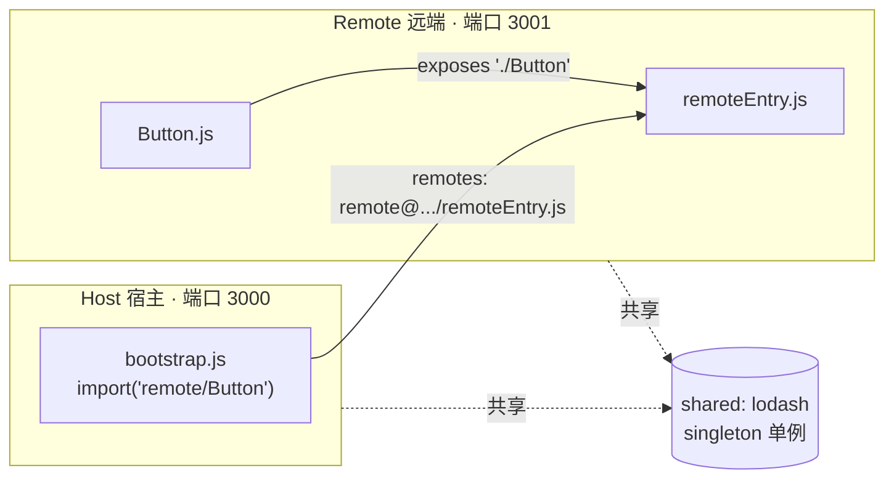
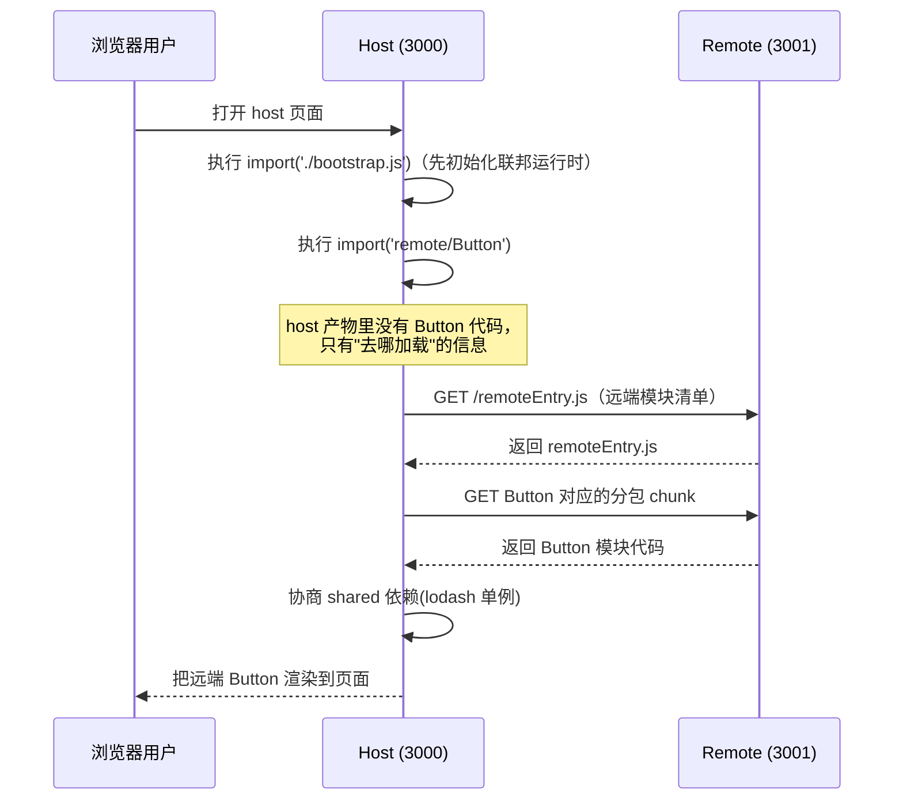

# 05 · 模块联邦（Module Federation）

> Module Federation 是 Webpack5 的编译期方案：让一个构建产物在**运行时**动态加载另一个**独立部署**的构建产物中暴露的模块，实现真正的「跨应用、跨团队共享代码」。

## 📖 知识讲解

### 它解决什么问题

传统微前端（如 iframe、single-spa、qiankun）解决的是「多个独立应用如何在一个页面里共存」。而 Module Federation（下称 MF）解决的是更细粒度的问题：**应用 A 如何在运行时直接 `import` 应用 B 里的某个模块/组件**，而且 A、B 各自独立构建、独立部署、独立发版，互不需要重新打包。

- 传统做法共享组件要发 npm 包 → B 更新组件后，A 必须升级依赖并**重新构建**才能拿到新版。
- MF 做法：B 把组件「暴露」出去，A 在**运行时**去拉取 → B 重新部署后，A **不用重新构建**，刷新页面就是最新版。

### 两个角色：host 与 remote

- **remote（远端 / 生产者）**：用 `exposes` 把内部模块暴露出去，构建时生成一份清单文件 `remoteEntry.js`。
- **host（宿主 / 消费者）**：用 `remotes` 声明要消费哪些远端，运行时通过对方的 `remoteEntry.js` 拉取模块。
- 角色是**相对**的：一个应用可以同时是 host 又是 remote（既消费别人、又被别人消费），这叫双向联邦。

### 核心插件 ModuleFederationPlugin 的字段

MF 是 Webpack5 内置能力，通过 `webpack.container.ModuleFederationPlugin` 配置：

| 字段 | 用于 | 说明 |
| --- | --- | --- |
| `name` | 两端 | 本应用在联邦中的全局唯一名字。host 的 remotes、远端地址里都要用它。 |
| `filename` | remote | 对外暴露的入口清单文件名，约定叫 `remoteEntry.js`。host 就是加载它来发现可用模块。 |
| `exposes` | remote | 暴露哪些模块。`{ './Button': './src/Button.js' }`，key 是对外路径，value 是本地文件。 |
| `remotes` | host | 消费哪些远端。`{ remote: 'remote@http://localhost:3001/remoteEntry.js' }`，格式为 `远端name@remoteEntry地址`。 |
| `shared` | 两端 | 共享的第三方依赖（如 react、lodash），避免被下载两份、并保证运行时单例。 |

### shared 的三个关键选项

`shared` 是 MF 最容易踩坑、也最能体现价值的地方：

- **`singleton: true`**：整个页面对该依赖只保留**一个实例**。像 React 这种「必须单例」的库（多份实例会导致 Hooks 报错）一定要开。谁先加载就用谁的版本。
- **`requiredVersion`**：声明本应用期望的版本范围（如 `'^18.0.0'`）。运行时会协商：若已加载的版本不满足，控制台给出警告（开了 singleton 时仍复用已有实例）。
- **`eager: true`**：不把该依赖单独拆成异步分包，而是同步打进主包。一般**不开**——开了会破坏 MF 的异步加载模型；这也是为什么入口要拆成 `index.js`（异步 import）+ `bootstrap.js` 两层。

### 运行时到底发生了什么

host 构建时并不知道 remote 里有什么，它只在产物里埋了「运行时去某个地址加载」的逻辑。真正执行 `import('remote/Button')` 时：

1. 浏览器请求 remote 的 `remoteEntry.js`（只在第一次加载，之后有缓存）；
2. `remoteEntry.js` 是一份「模块清单 + 加载器」，从中找到 `./Button` 对应的分包；
3. 下载该分包，协商 `shared` 依赖，返回模块给 host 使用。

## 🔄 流程图 / 原理图

### 图 1：概念关系（exposes / remotes / shared）



### 图 2：运行时加载时序



## 💻 代码说明

demo 在 `mf-example/` 下，分 `remote/`（生产者，3001）和 `host/`（消费者，3000）两个独立应用。

**remote 端 · `remote/webpack.config.js` 核心：**

```js
new ModuleFederationPlugin({
  name: 'remote',                 // 本远端唯一名
  filename: 'remoteEntry.js',     // 对外清单文件名
  exposes: { './Button': './src/Button.js' }, // 暴露 Button 模块
  shared: { lodash: { singleton: true, requiredVersion: '^4.17.21' } },
});
```

`remote/src/Button.js` 是被暴露的普通模块，`export default` 一个创建按钮 DOM 的函数——它完全不知道自己会被 host 远程加载，这正是解耦的体现。

**host 端 · `host/webpack.config.js` 核心：**

```js
new ModuleFederationPlugin({
  name: 'host',
  remotes: { remote: 'remote@http://localhost:3001/remoteEntry.js' }, // 消费 remote
  shared: { lodash: { singleton: true, requiredVersion: '^4.17.21' } },
});
```

`host/src/bootstrap.js` 里用 `import('remote/Button')` 在运行时拉取并使用：`'remote'` 对应 remotes 的 key，`'/Button'` 对应 remote exposes 的 `'./Button'`。

**为什么入口要拆两层（`index.js` → 异步 `import('./bootstrap.js')`）？**
MF 需要在执行业务代码前先异步初始化 `shared` 依赖。若入口直接同步使用共享依赖，会报 `Shared module is not available for eager consumption`。拆成「index.js 只做一件事：异步 import bootstrap」就绕开了这个问题。

## ▶️ 运行方式

> ⚠️ 这是**需要构建**的模块，本学习项目**未预装依赖**，请按下面步骤自行安装。需要开两个终端。

```bash
# 终端 1：先启动 remote（生产者），它要先跑起来对外提供 remoteEntry.js
cd 26-micro-frontends/05-module-federation/mf-example/remote
npm install
npm run dev        # 起在 http://localhost:3001

# 终端 2：再启动 host（消费者）
cd 26-micro-frontends/05-module-federation/mf-example/host
npm install
npm run dev        # 起在 http://localhost:3000
```

打开 `http://localhost:3000`，页面上那个绿色按钮就是**运行时从 3001 远程加载**来的。可在 DevTools 的 Network 面板看到 host 主动请求了 `remoteEntry.js` 及 Button 的分包，验证「运行时动态加载」。

## ⚠️ 常见坑 / 最佳实践

- **忘了拆 bootstrap**：入口直接写业务代码 → `Shared module is not available for eager consumption`。解决：入口 `index.js` 只写 `import('./bootstrap.js')`。
- **remote 没开 CORS**：host 跨域拉 `remoteEntry.js` 被浏览器拦。remote 的 devServer 要加 `headers: { 'Access-Control-Allow-Origin': '*' }`。
- **`publicPath` 写错或用了 `auto` 却部署到子路径**：remoteEntry 加载后按需拉分包时路径拼错。建议 remote 显式写成对外可访问的绝对地址。
- **shared 版本不一致**：React 这类必须单例的库，两端都要 `singleton: true`，否则可能加载两份实例导致 Hooks 报错。
- **启动顺序**：host 依赖 remote 的 `remoteEntry.js`，先起 remote 再起 host（生产环境则要保证 remote 已部署可访问）。
- **强耦合远端地址**：把 `remote@http://localhost:3001/...` 写死不利于多环境。进阶做法是用「动态 remotes / 运行时注册」按环境注入地址。

## 🔗 官方文档

- Webpack 官方 · Module Federation 概念：https://webpack.js.org/concepts/module-federation/
- Webpack 官方 · ModuleFederationPlugin 配置：https://webpack.js.org/plugins/module-federation-plugin/
- Module Federation 官网（含 MF2 运行时、跨框架）：https://module-federation.io/
- 官方示例仓库：https://github.com/module-federation/module-federation-examples
