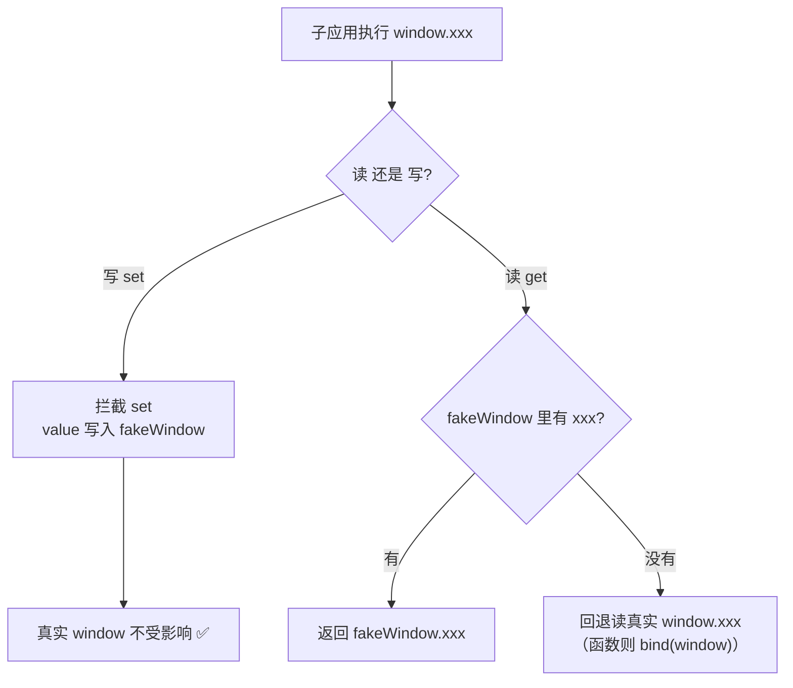
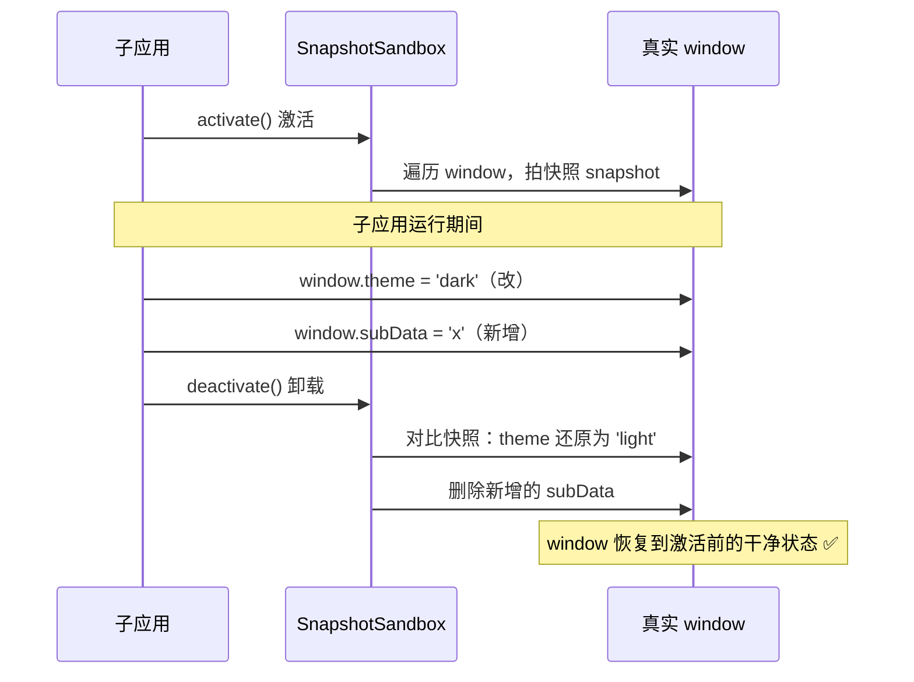

# 06 · JS 沙箱 / CSS 隔离（JS Sandbox & CSS Isolation）

> 微前端里多个子应用共享同一个 `window` / `document`，全局变量和 CSS 会互相污染。JS 沙箱负责隔离 JS 全局作用域，CSS 隔离负责隔离样式，二者是「让多个子应用安全共存」的地基。

## 📖 知识讲解

### 为什么要隔离

主应用和多个子应用跑在同一个页面、同一个 `window` 和 `document` 上：

- **JS 污染**：子应用 A 写了 `window.axios = xxx`、`window.timer = setInterval(...)`，卸载后没清理，子应用 B 就会读到脏数据、老定时器还在跑。全局变量、事件监听、定时器都会串味。
- **CSS 污染**：A 和 B 都写了 `.header { ... }`，后加载的会覆盖先加载的，样式互相打架。

隔离目标：让每个子应用「以为自己独占一个干净的 window 和一套独立的样式」。

### JS 沙箱：三种实现

#### 1）快照沙箱 SnapshotSandbox

- **原理**：`activate()` 激活时遍历 `window` 拍一张「快照」；子应用运行期间**直接改真实 window**；`deactivate()` 卸载时对比快照，把被改的属性还原、把新增的属性删掉。
- **优点**：不依赖 `Proxy`，**兼容 IE 等不支持 Proxy 的老环境**。
- **缺点**：直接读写真实 window，会临时污染；且遍历还原时**同一时刻只能有一个沙箱激活**（无法多实例并存）。

#### 2）Proxy 代理沙箱 ProxySandbox

- **原理**：用 `Proxy` 拦截 window 的读写。给每个子应用一个 `fakeWindow`，`set` 写操作落在 fakeWindow 上、**不碰真实 window**；`get` 读操作优先读 fakeWindow，读不到再回退真实 window。
- **优点**：真实 window 全程干净；每个子应用一个独立 fakeWindow，**天然支持多实例并存**。是 qiankun 现代浏览器下的默认方案。
- **缺点**：依赖 `Proxy`（IE 不支持）。

#### 3）legacy（单例代理沙箱）

介于两者之间的过渡实现：也用 Proxy，但仍作用在真实 window 上并记录 diff、卸载时还原，因此同样**只支持单实例**。qiankun 在「只有一个子应用」时会用它，多个子应用时用 ProxySandbox。

> qiankun 的选择逻辑：支持 Proxy 且多实例 → ProxySandbox；支持 Proxy 但单实例 → legacy；不支持 Proxy → SnapshotSandbox。

### CSS 隔离：三种手段

- **Shadow DOM（strictStyleIsolation 严格隔离）**：用 `element.attachShadow()` 给子应用套一个 Shadow DOM，内部样式**天然不外泄**、外部样式也进不来。隔离最彻底；缺点是弹窗/下拉这类挂到 `document.body` 的组件会「逃出」shadow，且第三方 UI 库可能在 shadow 内失效。
- **scoped 前缀 / 属性选择器改写（experimentalStyleIsolation 实验性隔离）**：不真的用 Shadow DOM，而是构建/运行时把子应用的每条 CSS 选择器加上一个专属属性前缀，如 `.header` 改写成 `div[data-qiankun="appA"] .header`，从而限定作用域。兼容性好、副作用小，是常用折中方案。
- **BEM / CSS Modules 约定**：靠命名约定（`appA-header`）或工具生成 hash 类名从源头避免冲突。简单但依赖团队自觉/构建工具。

## 🔄 流程图 / 原理图

### 图 1：Proxy 沙箱读写拦截流程



### 图 2：快照沙箱 activate / deactivate 时序



## 💻 代码说明

demo 是纯 `index.html`（浏览器直接打开，无需构建），三个例子都**真实可运行、有可见输出**：

**① Proxy 沙箱**（`createProxySandbox`）：`Proxy` 的 `set` 把写落到 `fakeWindow`，`get` 优先读 fakeWindow 再回退真实 window（对函数做 `bind(window)` 避免 this 报错），`has` 让 `in` 判断正确。点按钮后打印证明：`proxyWindow.appName` 有值，但 `window.appName` 仍是 `undefined`——真实 window 未被污染；再建第二个沙箱证明两个 fakeWindow 互不干扰（多实例）。

**② 快照沙箱**（`createSnapshotSandbox`）：`activate()` 遍历 `window` 拍快照；子应用改 `window.theme`、新增 `window.subAppData`；`deactivate()` 对比快照，还原被改的、删除新增的。输出打印出「还原了哪些、删除了哪些」，最终 `window.theme` 变回 `light`、`window.subAppData` 变回 `undefined`。

**③ Shadow DOM**（`runShadowDom`）：页面上先有一个外部 `.box`（灰色虚线），再用 `host.attachShadow({mode:'open'})` 创建 Shadow DOM，内部放**同名** `.box` 但写橙色样式。运行后两个同名 `.box` 样式互不干扰，并用 `document.querySelectorAll('.box')` 选不到 shadow 内部节点来证明作用域隔离。

## ▶️ 运行方式

**免构建**，浏览器直接打开即可：

```bash
# 方式一：直接双击 / 用浏览器打开
open 26-micro-frontends/06-js-css-isolation/index.html

# 方式二：起个静态服务器（可选）
cd 26-micro-frontends/06-js-css-isolation
npx serve .   # 或 python3 -m http.server
```

打开后依次点击三个按钮，观察黑框里的打印和页面上两个 `.box` 的样式差异。

## ⚠️ 常见坑 / 最佳实践

- **Proxy 沙箱读回退忘了 `bind`**：子应用调用 `proxyWindow.alert()` / `console.log()` 时，若直接返回真实函数，其内部 `this` 会指向 proxy 导致 `Illegal invocation`。对函数要 `real.bind(window)` 再返回。
- **只清理全局变量、不清理副作用**：定时器（`setInterval`）、事件监听（`addEventListener`）、动态插入的 `<script>/<style>` 都要在卸载时一并清理，否则内存泄漏、幽灵回调。
- **快照沙箱不能并存**：它操作真实 window，多个子应用同时激活会互相覆盖快照。要多实例必须用 ProxySandbox。
- **Shadow DOM 的「逃逸」问题**：Ant Design / Element 的 Message、Dropdown 等常把节点挂到 `document.body`，会跑出 shadow 边界导致样式丢失；这类场景改用 `experimentalStyleIsolation`（前缀改写）更省心。
- **前缀改写不是万能**：`experimentalStyleIsolation` 处理不了 `@font-face`、`:root` 变量、`position: fixed` 相对视口等全局性样式，仍可能泄漏。
- **最佳实践**：优先约定式隔离（CSS Modules / BEM）从源头避冲突；需要强隔离且无第三方弹层时用 Shadow DOM；有第三方 UI 库时用前缀改写方案折中。

## 🔗 官方文档

- MDN · Proxy：https://developer.mozilla.org/zh-CN/docs/Web/JavaScript/Reference/Global_Objects/Proxy
- MDN · 使用 Shadow DOM：https://developer.mozilla.org/zh-CN/docs/Web/API/Web_components/Using_shadow_DOM
- MDN · Element.attachShadow()：https://developer.mozilla.org/zh-CN/docs/Web/API/Element/attachShadow
- qiankun · 沙箱与样式隔离文档：https://qiankun.umijs.org/zh/api（`sandbox` / `strictStyleIsolation` / `experimentalStyleIsolation`）
- qiankun 沙箱源码：https://github.com/umijs/qiankun/tree/master/src/sandbox
