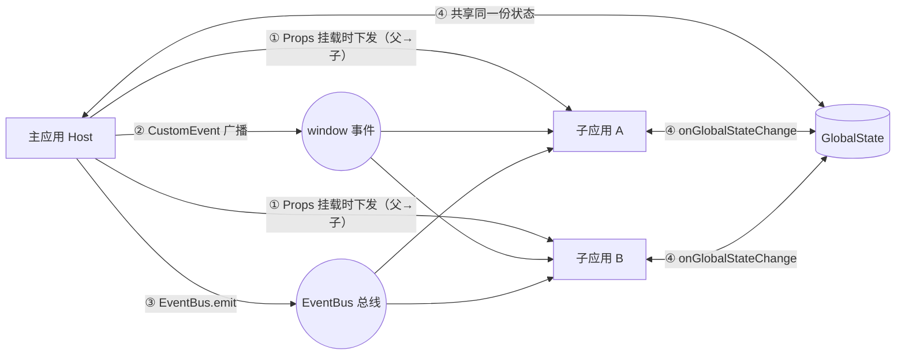
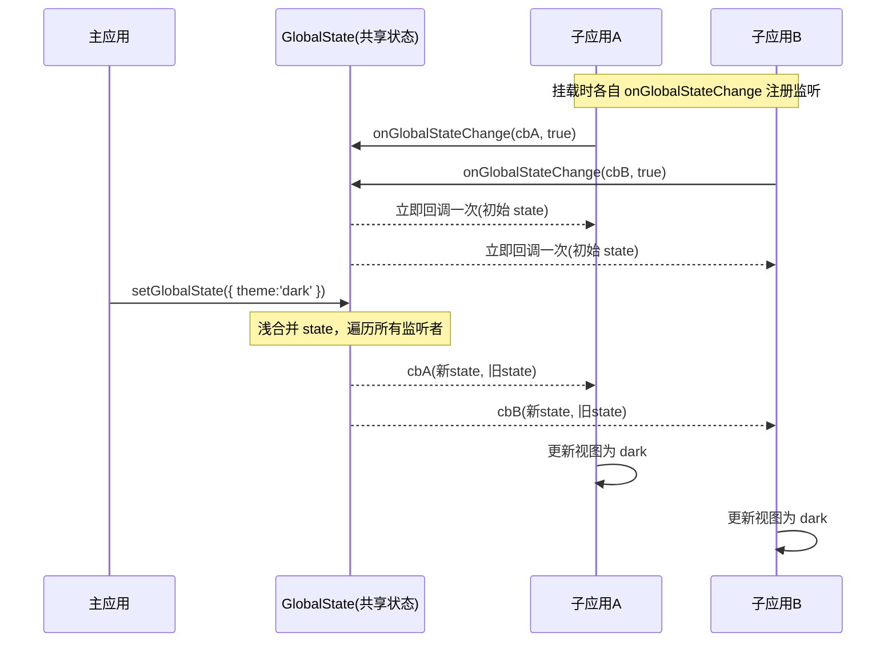

# 07 · 主子应用通信（App Communication）
> 微前端里主应用与子应用、子应用与子应用之间如何传数据、传事件——Props / CustomEvent / EventBus / 全局状态四种方式一次讲透。

## 📖 知识讲解

微前端把一个大应用拆成「主应用（基座）+ 多个子应用」。它们各自独立打包、独立运行，但用户看到的是同一个页面，所以**必须能互相通信**：主应用把登录态/主题下发给子应用，子应用把操作结果回传给主应用，子应用之间还要联动。常见有四种方式：

### ① Props（父传子，最常用）
主应用在**注册/挂载子应用时**通过 `props` 把数据和回调函数传进去，子应用在 `mount(props)` 生命周期里接收。

```js
// qiankun 注册子应用时下发 props
registerMicroApps([{
  name: 'app-a',
  entry: '//localhost:7101',
  container: '#sub',
  props: { user: currentUser, onLogout: () => {...} } // ← 下发数据 + 回调
}]);
// 子应用：export async function mount(props) { console.log(props.user) }
```
特点：**父 → 子**方向清晰、简单；但 props 是**挂载那一刻**的快照，之后主应用数据变了不会自动同步（要同步用下面的全局状态）。

### ② 自定义事件 CustomEvent（发布订阅，广播解耦）
利用浏览器原生的 `CustomEvent` + `window.dispatchEvent` / `window.addEventListener`，任何应用都能广播、任何应用都能监听，彼此**不需要知道对方存在**，天然解耦，适合跨应用广播通知。

```js
// 发送方（可以是任意应用）
window.dispatchEvent(new CustomEvent('micro:notify', { detail: { text: 'hi' } }));
// 接收方（可以是任意应用）
window.addEventListener('micro:notify', e => console.log(e.detail.text));
```
坑：卸载子应用时**必须 `removeEventListener`**，否则监听残留导致内存泄漏 / 重复响应。

### ③ 事件总线 EventBus（自己实现的发布订阅中心）
当不想污染 `window` 事件、想要更可控的 API（命名空间、一次性订阅、批量清理）时，自己实现一个 `on / emit / off` 的中心对象，挂到 `window` 上供所有应用取用。本质和 CustomEvent 一样是发布订阅，只是自己掌控。

### ④ 全局状态 initGlobalState（qiankun 提供，响应式共享）
qiankun 的 `initGlobalState(state)` 返回 `{ onGlobalStateChange, setGlobalState }`：主子应用**共享同一份状态**，任何一方 `setGlobalState(部分字段)` 更新后，所有 `onGlobalStateChange` 监听者都会收到 `(新状态, 旧状态)` 回调。适合登录信息、主题、语言这类需要**持续同步**的全局数据。

| 方式 | 方向 | 是否持续同步 | 典型场景 |
|------|------|--------------|----------|
| Props | 父 → 子 | 否（挂载快照） | 下发初始数据 / 回调 |
| CustomEvent | 任意 ↔ 任意 | 事件驱动 | 跨应用广播通知 |
| EventBus | 任意 ↔ 任意 | 事件驱动 | 自定义可控的发布订阅 |
| initGlobalState | 主 ↔ 子 共享 | 是（响应式） | 登录态 / 主题 / 语言 |

本 demo 用**纯原生 JS 手写**了 EventBus 与 mini 版 `initGlobalState`，并在一个页面里同时演示了四种方式，改一处、子应用实时响应。

## 🔄 流程图 / 原理图

四种通信方式的关系对比：



`setGlobalState → onGlobalStateChange` 通知时序：



## 💻 代码说明

- **手写 `EventBus`**（`class EventBus`）：`events` 是 `{ 事件名: [回调...] }`。`on` 注册并返回「取消订阅」函数；`emit` 遍历回调并 try/catch 防止一个回调抛错影响其他；`off` 用 `filter` 移除指定回调。
- **mini 版 `initGlobalState(initial)`**：闭包持有 `state` 和 `listeners`。`setGlobalState(partial)` 用 `{...state, ...partial}` 浅合并后遍历 `listeners`，把 `(新state, 旧state)` 都传出去；`onGlobalStateChange(cb, true)` 支持「立即触发一次」做初始化——与 qiankun 语义一致。
- **子应用工厂 `createChildApp(name)`**：暴露 `mount(props)` / `unmount()`。`mount` 里 ① 从 `props` 读用户名、④ `onGlobalStateChange` 订阅状态、③ `bus.on` 订阅总线、② `addEventListener` 订阅 window 事件；每个订阅都把「取消函数」推入 `disposers`，`unmount` 时统一调用，**杜绝内存泄漏**。
- **双向验证**：主应用本身也是订阅者（`onGlobalStateChange` 刷新自己并切换页面背景色，让全局状态「看得见」）；子应用 A 用 EventBus、子应用 B 用 CustomEvent 向主应用回执，证明通信是双向的。

## ▶️ 运行方式

免构建、无依赖，**直接用浏览器打开 `index.html` 即可**：

```bash
open 26-micro-frontends/07-app-communication/index.html
# 或在文件管理器里双击 index.html
```

操作建议：改「用户名」→ 点「重新挂载」看 props 下发；改「主题」为 `dark` → 看两个子应用与页面背景同步变化；点「count +1」看响应式状态；点「广播通知」看一条消息经 CustomEvent 与 EventBus 同时到达两个子应用；点子应用的「回执」按钮看反向通信。全过程在底部日志里带徽标呈现。

## ⚠️ 常见坑 / 最佳实践

- **卸载不清理订阅 = 内存泄漏 + 幽灵响应**：子应用 `unmount` 必须 `off` / `removeEventListener` 所有监听。本 demo 用 `disposers` 数组统一管理。
- **Props 不是响应式**：它只是挂载那一刻的快照，主应用后续改数据子应用不会自动更新；需要持续同步请用全局状态。
- **事件名要加命名空间前缀**（如 `micro:notify`），避免和第三方库、其他子应用的事件名撞车。
- **全局状态别当垃圾桶**：只放真正需要跨应用共享的（登录态/主题/语言）；塞太多会让应用间强耦合、难以独立开发。
- **setGlobalState 是浅合并**：嵌套对象会被整体替换，深层数据要自己先合并好再 set。
- **子子应用通信优先走事件/总线**，不要让子应用互相直接引用，破坏独立性。

## 🔗 官方文档

- qiankun 通信（initGlobalState）：https://qiankun.umijs.org/zh/cookbook
- MDN CustomEvent：https://developer.mozilla.org/zh-CN/docs/Web/API/CustomEvent
- MDN EventTarget.dispatchEvent：https://developer.mozilla.org/zh-CN/docs/Web/API/EventTarget/dispatchEvent
