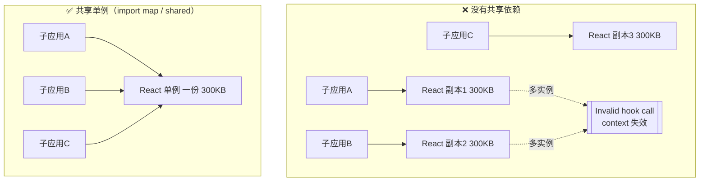
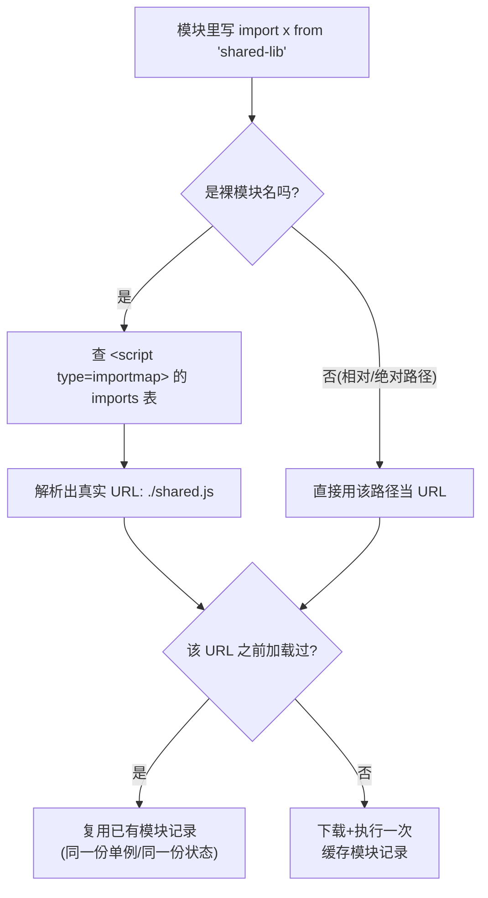

# 08 · 依赖共享 / 版本管理（Shared Dependencies）
> 多个子应用各自打包 React/Vue 会让用户重复下载好几份、还可能因多实例导致 hooks 报错——本模块讲清如何让子应用共享同一份依赖。

## 📖 知识讲解

### 为什么要共享依赖？
微前端里每个子应用独立打包。如果 A、B、C 各自把 React 打进自己的包：
1. **体积浪费**：用户要下载 3 份 React（每份几百 KB），首屏更慢。
2. **多实例致命 bug**：React / Vue 这类库依赖“**全局唯一实例**”。页面上同时存在两份 React，一个组件用 A 的 React、它的父 context 来自 B 的 React，就会出现 `Invalid hook call`、`context 取到 undefined`、`instanceof 判断失败`等诡异错误。
所以：**框架级依赖必须全站只有一份**。

### 方案一：Module Federation 的 `shared`（Webpack / Rspack）
在 `ModuleFederationPlugin` 里声明共享依赖，运行时多个应用协商、复用同一份：

```js
new ModuleFederationPlugin({
  shared: {
    react: {
      singleton: true,        // 强制全局唯一实例；React 这类【必须】开
      requiredVersion: '^18.2.0', // 版本约束，不满足会警告/回退
      eager: false,           // false=按需异步加载；true=打进初始包（同步可用但增大首包）
      strictVersion: false,   // true=版本不满足直接报错而非降级
    },
  },
})
```
- `singleton`：只允许一个实例，谁先加载用谁的，其余复用。React/Vue/react-router 必开。
- `requiredVersion` / `strictVersion`：版本管理。`strictVersion:true` 时版本不匹配直接抛错。
- `eager`：是否同步预加载。

### 方案二：externals + CDN（传统、简单）
把 React 设为构建 `externals`，不打进包，运行时从 CDN 全局变量取：

```js
// webpack.config.js
externals: { react: 'React', 'react-dom': 'ReactDOM' }
// html 里全局引一份 CDN：<script src=".../react.production.min.js"></script>
```
所有子应用共用 `window.React` 这一份。缺点：版本全站被 CDN 那份钉死，升级要一起动。

### 方案三：浏览器原生 import maps（无需打包器）
`<script type="importmap">` 把**裸模块名**映射到 URL。多个模块 `import x from 'lib'` 都被解析到同一个 URL，而**同一 URL 的 ES Module 只会执行一次、是单例**，于是天然共享：

```html
<script type="importmap">
{ "imports": { "react": "https://esm.sh/react@18.2.0" } }
</script>
<script type="module">import React from 'react'; /* 全站同一份 */</script>
```
优点：浏览器原生、免打包；换版本只改 map 一处。**本 demo 就用它演示。**

### 三种方案对比
| 方案 | 是否需构建 | 单例控制 | 版本管理 | 适用 |
|------|-----------|----------|----------|------|
| Module Federation shared | 需 Webpack/Rspack | `singleton` | `requiredVersion`/`strictVersion` | 主流工程化微前端 |
| externals + CDN | 需构建 | 靠全局变量天然唯一 | 手动统一 CDN 版本 | 老项目、简单场景 |
| import maps | 免构建 | 同 URL 天然单例 | 改 map 即换版本 | 原生 ESM、轻量场景 |

## 🔄 流程图 / 原理图

“各自加载副本” vs “共享单例”对比：



import map 解析裸模块名的流程：



## 💻 代码说明

- **`index.html`** 里的 `<script type="importmap">` 把裸名 `shared-lib` 映射到 `./shared.js`。
- **`shared.js`**：模拟被共享的库。模块级 `instanceId`（执行时生成的随机 ID）+ 私有 `count`，暴露 `increment/getCount/getInstanceId`。它 `console.log` 一次“模块被执行”，用来证明同一 URL 只执行一次。
- **`app-a.js` / `app-b.js`**：都 `import * as shared from 'shared-lib'`。A 先 `increment()` 两次；B 直接 `getCount()` 却读到 `2`（看到了 A 的修改）——**证明是同一实例**。
- **`shared-standalone.js` + `app-c-own-copy.js`**：C 直接 `import './shared-standalone.js'`（另一个文件 URL）。内容虽和 `shared.js` 一模一样，但 URL 不同，浏览器当成**另一个模块**执行，C 有独立的 `instanceId` 和从 0 开始的 `count`——**这就是“没共享、加载了副本”的反面教材**。
- **`main.js`**：基座入口，依次运行 A/B/C 并把结果打到页面；它自己也 `import 'shared-lib'`，`instanceId` 与 A/B 相同，证明主应用与子应用共享同一份。

预期结果：`A / B / main` 的 `instanceId` 完全相同、共享 `count` 累加到 `3`；`C` 的 `instanceId` 不同、`count` 独立从 0 开始。

## ▶️ 运行方式

> ⚠️ ES Module 和 import map **必须经 HTTP 加载**：Chrome 会以 CORS 理由拦截 `file://` 下的模块脚本，直接双击 `index.html` 会报错。请用任意静态服务器：

```bash
cd 26-micro-frontends/08-shared-dependencies

# 方式一：Python（macOS 自带，无需安装）
python3 -m http.server 5080
# 浏览器打开 http://localhost:5080

# 方式二：Node（如已装）
npx serve .        # 或 npx http-server .
```
打开后看页面「运行结果」面板，并打开浏览器控制台看 `[shared.js] 模块被执行` 只打印一次。本 demo 全部用**本地自建模块**，不依赖任何外网 CDN，断网也能跑。

## ⚠️ 常见坑 / 最佳实践

- **多实例引发的 hooks / context bug 最难排查**：React/Vue/react-router/状态库一律 `singleton:true`（MF）或映射到同一 URL（import map）。
- **`file://` 打不开**：ES module 受 CORS 限制，必须走本地服务器。
- **版本不兼容**：`singleton` 下若两个子应用要的大版本不同（React 17 vs 18），协商会失败或行为异常；用 `requiredVersion`/`strictVersion` 尽早暴露。
- **别共享不该共享的**：只共享框架级、无状态的公共库。把业务组件、带状态的模块也共享，会让子应用互相耦合、无法独立升级。
- **`eager:true` 慎用**：它把共享依赖打进初始包，虽同步可用但增大首屏体积，通常按需（`eager:false`）更好。
- **import map 只认裸名映射**：写相对路径（`./x.js`）不会走 map，会各自成一份；要共享就统一用裸名并只映射一次。

## 🔗 官方文档

- Webpack Module Federation Plugin：https://webpack.js.org/plugins/module-federation-plugin/
- Module Federation（shared 详解）：https://module-federation.io/configure/shared.html
- MDN 导入映射 import maps：https://developer.mozilla.org/zh-CN/docs/Web/HTML/Element/script/type/importmap
- MDN JavaScript modules：https://developer.mozilla.org/zh-CN/docs/Web/JavaScript/Guide/Modules
