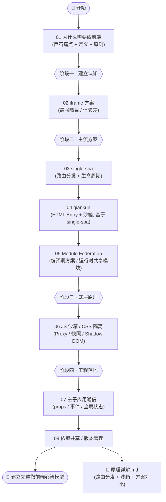
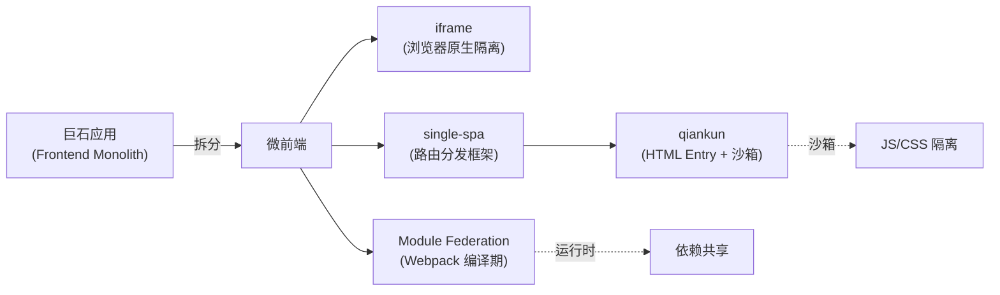

# 26 · 微前端（Micro Frontends）

> 当一个前端应用大到几十个团队一起改、一次发布要全量回归、技术栈想升级却牵一发动全身时，「微服务」的思想被搬到了前端——把巨石应用（Frontend Monolith）拆成多个**能独立开发、独立部署、运行时集成**的小应用。这就是**微前端**。本工程从「为什么需要微前端」讲起，依次讲透 iframe 方案、single-spa、qiankun、Module Federation，并深入 JS 沙箱 / CSS 隔离、主子应用通信、依赖共享等核心原理，全程对照官方文档。

## 📚 这个工程讲什么

微前端要回答一个核心问题：**如何让多个独立的前端应用，在同一个浏览器页面里像一个应用一样协同工作？**

它要同时满足几组看似矛盾的诉求：

- **独立** vs **集成**：每个子应用能被独立团队用不同技术栈开发、独立部署上线，但用户看到的是一个无缝的整体。
- **隔离** vs **共享**：子应用之间 JS 全局变量、CSS 样式互不污染（隔离），但 React/Vue 等公共依赖又希望只加载一份（共享）。
- **自治** vs **通信**：子应用各自为政，但主子应用、子应用之间又需要传参、传事件、共享登录态。

本工程围绕这些矛盾，讲清主流方案的取舍：**iframe**（最强隔离但体验差）→ **single-spa**（路由分发框架）→ **qiankun**（基于 single-spa 的开箱即用方案，HTML Entry + 沙箱）→ **Module Federation**（Webpack 编译期方案，运行时共享模块）。

对照的权威来源：[micro-frontends.org](https://micro-frontends.org/)、[single-spa 官方文档](https://single-spa.js.org/)、[qiankun 官方文档](https://qiankun.umijs.org/)、[Webpack Module Federation 文档](https://webpack.js.org/concepts/module-federation/)。

## 🗂 模块索引

| 模块 | 知识点 | 你将学会 | 运行方式 |
| --- | --- | --- | --- |
| [01](./01-why-micro-frontend/) | 为什么需要微前端 | 巨石应用 6 大痛点、微前端定义与收益、5 大原则 | 浏览器打开 |
| [02](./02-iframe-approach/) | iframe 方案 | iframe 天然隔离的原理、7 大缺陷、何时仍可用 | 浏览器打开 |
| [03](./03-single-spa/) | single-spa | 生命周期（bootstrap/mount/unmount/unload）、registerApplication、activeWhen | `npx serve` |
| [04](./04-qiankun/) | qiankun | 基于 single-spa、HTML Entry、registerMicroApps/start、沙箱、样式隔离 | `npx serve` |
| [05](./05-module-federation/) | Module Federation | ModuleFederationPlugin、exposes/remotes/shared、运行时加载 remoteEntry | `npm run dev` / 浏览器 |
| [06](./06-js-css-isolation/) | JS 沙箱 / CSS 隔离 | Proxy 沙箱、快照沙箱、Shadow DOM、scoped 前缀原理 | 浏览器打开 |
| [07](./07-app-communication/) | 主子应用通信 | props、事件总线、CustomEvent、全局状态（initGlobalState） | 浏览器打开 |
| [08](./08-shared-dependencies/) | 依赖共享 / 版本管理 | 为什么要共享、singleton/requiredVersion、externals、共享的坑 | 浏览器打开 |

## 🧭 学习路线

建议按编号顺序学习，整体分四个阶段：**建立认知 → 主流方案 → 底层原理 → 工程落地**。



方案之间的关系：



## ▶️ 运行说明

各模块运行方式不同，README 内都有说明：

```bash
# 纯 HTML / 免构建的模块（01、02、06、07、08）：直接浏览器打开 index.html
# 含 ES Module import 的模块（03 single-spa、04 qiankun 原理 demo）：需本地服务器
cd 26-micro-frontends/03-single-spa
npx serve .            # 然后访问终端提示的地址

# Module Federation（05）：需 Webpack 构建，两个应用分别启动
cd 26-micro-frontends/05-module-federation/mf-example
# 见该目录 README 的 npm 说明
```

环境要求：现代浏览器（Chrome/Edge/Firefox 最新版）；涉及构建的模块需 Node.js 18+。

## ⚠️ 学习建议

- 微前端**不是银弹**。只有当团队规模、发布频率、技术栈异构真的成为瓶颈时才值得引入；小项目上微前端往往得不偿失。先读 01 想清楚「要不要用」。
- 重点吃透 **06 沙箱/隔离** 和工程根目录的 **《原理详解.md》**——「JS 全局怎么隔离」「CSS 怎么不打架」「qiankun 和 Module Federation 到底差在哪」是微前端的灵魂，也是面试高频。
- single-spa 是「地基」，qiankun 是「地基上的精装房」。先理解 03 再看 04，qiankun 的很多概念（生命周期、activeRule）都来自 single-spa。
- Module Federation 与 qiankun 不是互斥的：前者解决「模块级」共享，后者解决「应用级」集成，实际项目常常组合使用。

## 🔗 权威文档

- [micro-frontends.org](https://micro-frontends.org/)（微前端概念奠基文）
- [single-spa 官方文档](https://single-spa.js.org/docs/getting-started-overview)
- [qiankun 官方文档](https://qiankun.umijs.org/)
- [Webpack · Module Federation](https://webpack.js.org/concepts/module-federation/)
- [Martin Fowler · Micro Frontends](https://martinfowler.com/articles/micro-frontends.html)
</content>
</invoke>
