# 微前端 · 原理详解（How & Why）

> 本文不讲「怎么用某个 API」，而是讲透微前端的**本质、内部机制与源码级原理**：微前端到底是什么、路由如何分发、子应用如何被加载与执行、JS 沙箱怎么隔离全局、CSS 怎么不打架、qiankun 与 Module Federation 的根本区别在哪。配大量 Mermaid 图，对照 single-spa / qiankun / Webpack 官方实现。

---

## 一、本质：微前端 = 运行时集成多个独立应用

先给一句话定义（对照 [micro-frontends.org](https://micro-frontends.org/)）：

> **微前端是一种架构风格：把一个前端应用拆分成多个可以由独立团队、用独立技术栈、独立开发和部署的小应用，并在运行时（或构建时）把它们组合（integrate）成一个对用户无缝的整体。**

关键词拆解：

- **独立开发/部署**：子应用有自己的仓库、自己的 CI/CD、自己的上线节奏。这是微前端相对「巨石应用」的最大收益。
- **技术栈无关**：子应用 A 用 React，子应用 B 用 Vue，子应用 C 是 10 年前的 jQuery 老系统——都能共存。
- **运行时集成（Run-time Integration）**：这是绝大多数现代微前端方案（single-spa/qiankun/Module Federation）的核心。用户访问时，浏览器动态把各子应用的 JS/CSS 拉下来、拼到同一个页面。

集成的三种时机（[micro-frontends.org](https://micro-frontends.org/) 归纳）：

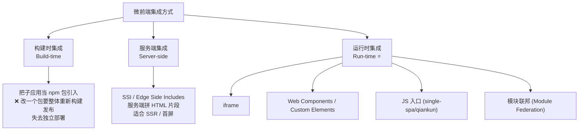

> 为什么「构建时集成」通常不算真正的微前端？因为把子应用发成 npm 包、主应用 `import` 进来，一旦子应用改动，主应用必须重新 `npm install` + 重新构建 + 重新部署——**独立部署这个核心收益就没了**。真正的微前端强调运行时把独立部署的产物组合起来。

---

## 二、为什么会有微前端：巨石应用的痛

一个前端 SPA 长大后会退化成 **Frontend Monolith（前端巨石）**：

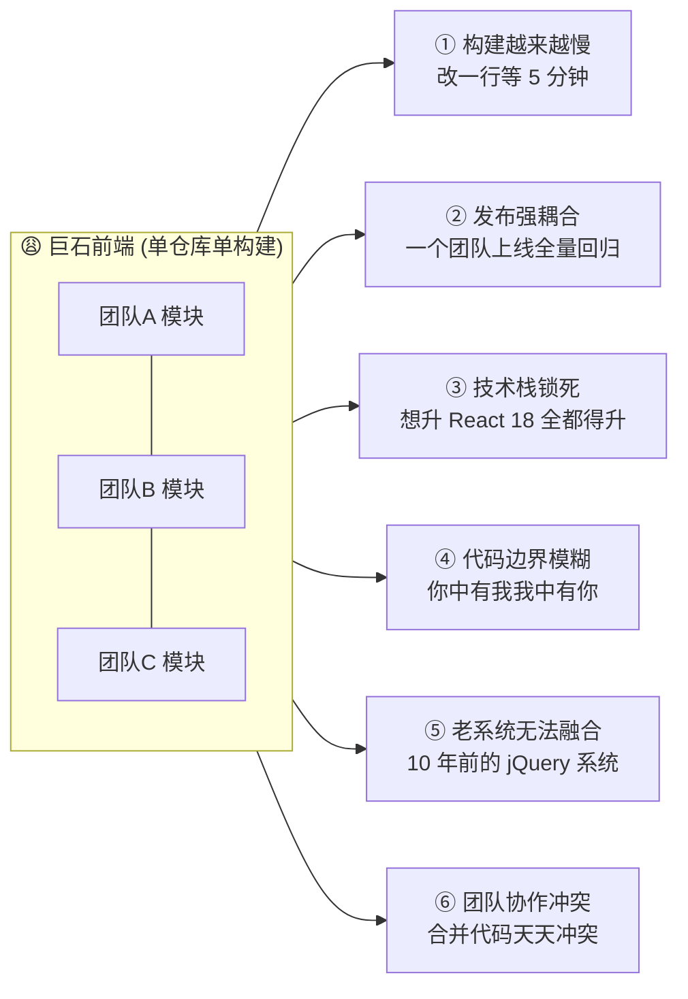

微前端用「运行时集成」把这些痛点转化为：各团队独立仓库、独立构建（快）、独立发布（解耦）、独立选型（自由），老系统也能作为一个子应用挂进来。代价是**引入了隔离、通信、依赖共享等新的复杂度**——本文后面的原理都在解决这些新复杂度。

---

## 三、路由分发：single-spa 的核心机制

现代微前端的「运行时集成」，本质是一套**基于路由的应用调度器**。single-spa 是这套机制的开山之作，qiankun 直接基于它。

### 3.1 三个生命周期状态

single-spa 把每个子应用（application）看成一个有生命周期的状态机（对照官方 [Lifecycle](https://single-spa.js.org/docs/building-applications/)，子应用必须导出 3 个异步函数）：

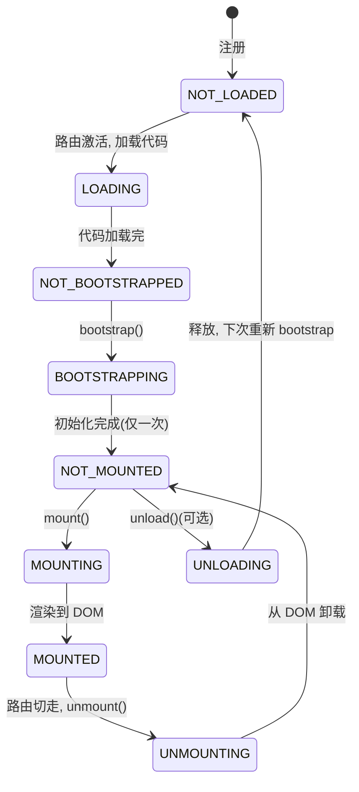

- **bootstrap()**：只执行一次的一次性初始化（如注入全局样式）。
- **mount(props)**：每次子应用被激活时调用，负责把自己渲染到 DOM（如 `ReactDOM.render` / `app.mount`）。
- **unmount(props)**：每次子应用被切走时调用，负责清理 DOM、解绑事件、销毁实例。
- **unload()**（可选）：把子应用退回 `NOT_LOADED`，下次会重新 bootstrap。

### 3.2 注册与激活：registerApplication + activeWhen

```js
// single-spa 官方 API 签名
singleSpa.registerApplication({
  name: 'app-react',                          // 唯一名称
  app: () => System.import('app-react'),       // loading function：返回带生命周期的 Promise
  activeWhen: '/react',                        // 活跃条件：路由匹配时激活
  customProps: { authToken: 'xxx' },           // 传给子应用的 props
});
singleSpa.start();                             // 启动，开始监听路由
```

`start()` 之后，single-spa 做的核心事情是**劫持路由 + 在每次路由变化时做 reroute（重新调度）**：

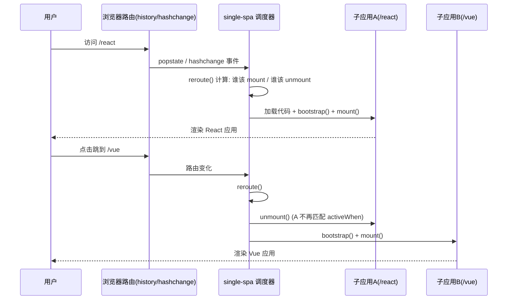

**原理精髓**：single-spa 重写了 `window.history.pushState/replaceState` 并监听 `popstate`/`hashchange`。任何路由变化都会触发 `reroute()`——它比较「当前路由该激活哪些应用」和「现在挂载着哪些应用」，对差集执行 mount / unmount。这就是「路由分发（routing）」，也是微前端「切页面 = 切子应用」的底层实现。

伪码还原 `reroute` 的核心逻辑：

```js
function reroute() {
  const appsToUnmount = mountedApps.filter(app => !app.activeWhen(location));
  const appsToMount   = registeredApps.filter(app => app.activeWhen(location) && !isMounted(app));

  return Promise.all(appsToUnmount.map(unmountApp))          // 先卸载不该在的
    .then(() => Promise.all(appsToMount.map(app =>           // 再挂载该在的
      loadApp(app).then(bootstrapApp).then(mountApp)
    )));
}
```

---

## 四、qiankun：在 single-spa 之上补齐两块拼图

single-spa 只解决了「路由分发 + 生命周期调度」，但留下两个大坑：**① 子应用怎么加载（你得自己配 SystemJS / import-map）；② 子应用之间不隔离（全局变量、样式互相污染）**。qiankun（[官方文档](https://qiankun.umijs.org/)）在 single-spa 基础上补齐了这两块：

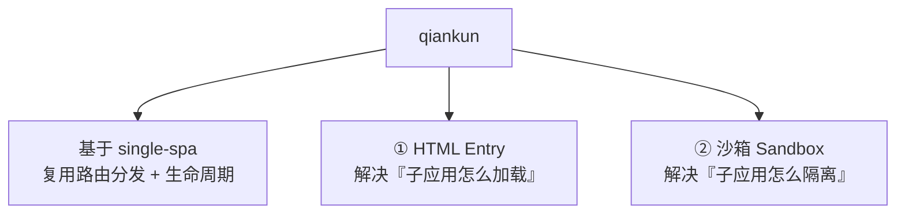

### 4.1 HTML Entry：像用 iframe 一样简单

single-spa 的 JS Entry 要求你手动把子应用打成一个 UMD 的 JS 入口。qiankun 改成 **HTML Entry**：你只需提供子应用的 URL（一个 HTML 页面），qiankun 会：

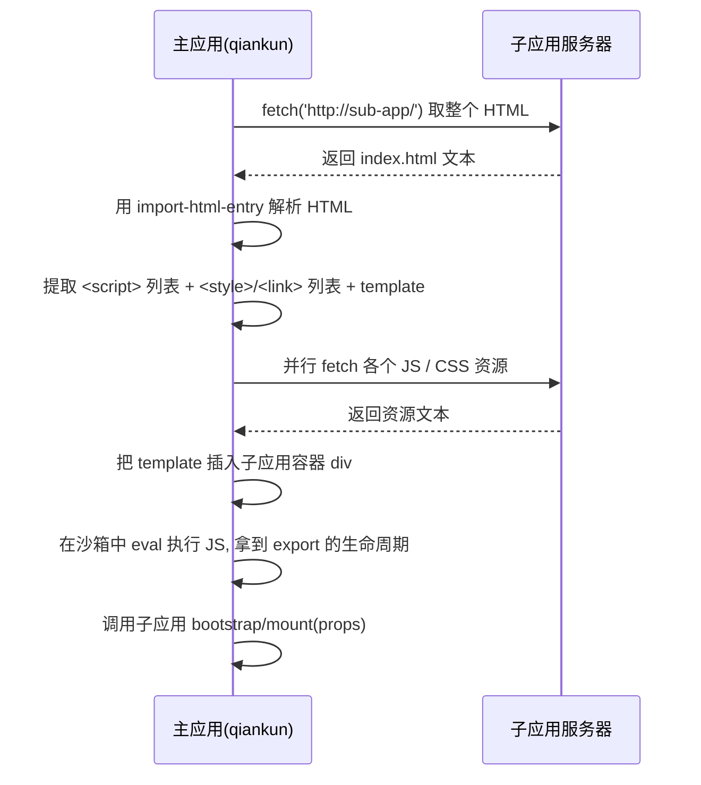

核心库是 [`import-html-entry`](https://github.com/kuitos/import-html-entry)。它 `fetch` 子应用 HTML，用正则/DOM 解析出所有脚本和样式，把 HTML 的 `<body>` 作为模板插入容器，再把脚本在沙箱里执行。子应用因此**必须导出 `bootstrap`/`mount`/`unmount` 三个生命周期**，并且打包成 UMD、开启跨域、配置 `publicPath`。

配置对照（qiankun 官方 API）：

```js
import { registerMicroApps, start, initGlobalState } from 'qiankun';

registerMicroApps([
  {
    name: 'react-app',
    entry: '//localhost:7100',          // ← HTML Entry：给个 URL 就行
    container: '#subapp-container',      // 子应用挂载点
    activeRule: '/react',                // 复用 single-spa 的 activeWhen
    props: { token: 'xxx' },
  },
]);
start({ sandbox: { strictStyleIsolation: true }, prefetch: true });
```

### 4.2 qiankun 的沙箱（见第五、六章详解）

`start({ sandbox: true })` 会为每个子应用创建一个 JS 沙箱和一套样式隔离机制。这是 qiankun 相对 single-spa 最有价值的增强，下面单独展开。

---

## 五、JS 沙箱原理：隔离 window 全局

问题：子应用 A 执行 `window.$ = jQuery`，子应用 B 也执行 `window.$ = 别的`，或者 A 注册了一堆全局定时器/事件监听，切走时没清理——**全局环境被污染**。JS 沙箱就是给每个子应用一个「看起来是 window、其实是隔离副本」的环境。qiankun 有三代沙箱实现：

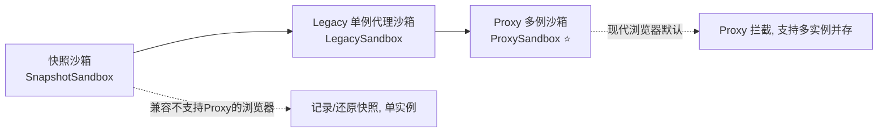

### 5.1 快照沙箱（SnapshotSandbox）— 兼容方案

不支持 `Proxy` 的老浏览器用它。思路是「**存档/读档**」：

```js
class SnapshotSandbox {
  active() {
    this.snapshot = {};
    // 1. 进入子应用前，把当前 window 所有属性拍个快照存起来
    for (const prop in window) this.snapshot[prop] = window[prop];
    // 2. 把上次子应用修改过的属性还原回去
    Object.keys(this.modifyPropsMap).forEach(p => { window[p] = this.modifyPropsMap[p]; });
  }
  inactive() {
    this.modifyPropsMap = {};
    // 3. 子应用退出时，对比现在的 window 和快照，记录被改动的属性，并还原 window
    for (const prop in window) {
      if (window[prop] !== this.snapshot[prop]) {
        this.modifyPropsMap[prop] = window[prop];   // 记住子应用改了啥
        window[prop] = this.snapshot[prop];          // 把 window 还原干净
      }
    }
  }
}
```

**缺陷**：① 直接改真实 `window`，只是进出时存档还原，所以**只能有一个子应用运行**（单例）；② 遍历整个 `window` 性能差。

### 5.2 Proxy 沙箱（ProxySandbox）— 现代默认

支持 `Proxy` 时用它，**不碰真实 window**，而是给每个子应用一个 `Proxy` 假 window。读写全被拦截：

```js
function createProxySandbox() {
  const fakeWindow = {};                        // 子应用私有的「变更记录」
  const proxy = new Proxy(window, {
    get(target, key) {
      // 读：先看子应用自己的 fakeWindow，没有再回落到真 window
      return key in fakeWindow ? fakeWindow[key] : target[key];
    },
    set(target, key, value) {
      // 写：只写进 fakeWindow，绝不污染真实 window！
      fakeWindow[key] = value;
      return true;
    },
    has(target, key) { return key in fakeWindow || key in target; },
  });
  return proxy;   // 子应用代码在 with(proxy){...} 里执行
}
```

qiankun 把子应用脚本包进 `(function(window){ with(window){ 子应用代码 } })(proxy)` 执行，于是子应用里所有裸露的全局变量访问都落到 proxy 上：

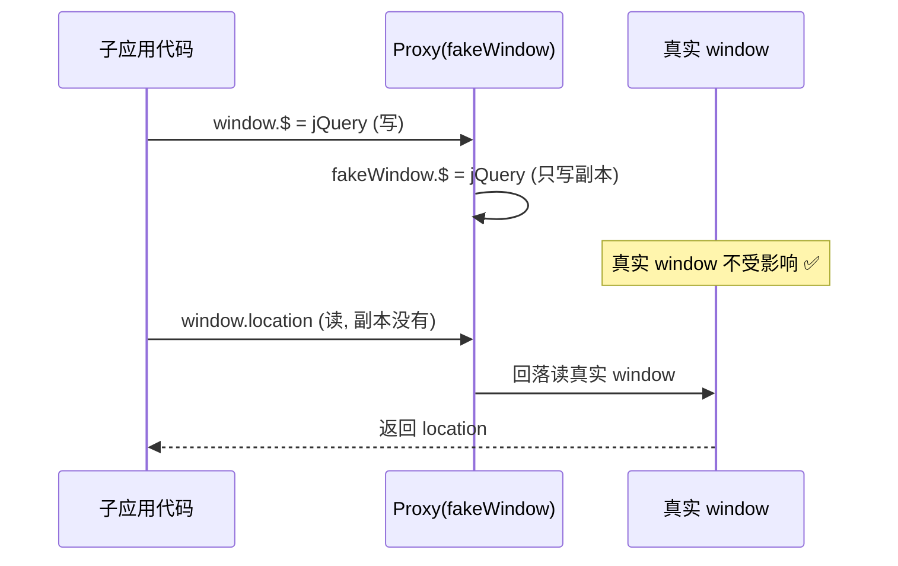

**优势**：① 真 window 干净，**多个子应用可并存**（每个一个 Proxy）；② 卸载子应用时直接丢弃 fakeWindow，天然清理。这也是 qiankun 支持 `singular: false` 多实例的基础。

> 注意：定时器、事件监听、动态创建的 DOM 这些「副作用」，qiankun 还会额外劫持 `setTimeout/setInterval/addEventListener/appendChild` 等，在 unmount 时统一清理——沙箱不只是拦 window 属性。

---

## 六、CSS 隔离原理：让样式不打架

JS 隔离了，样式还会打架：子应用 A 写 `.btn{color:red}`，子应用 B 写 `.btn{color:blue}`，谁后加载谁生效。三种主流隔离手段：

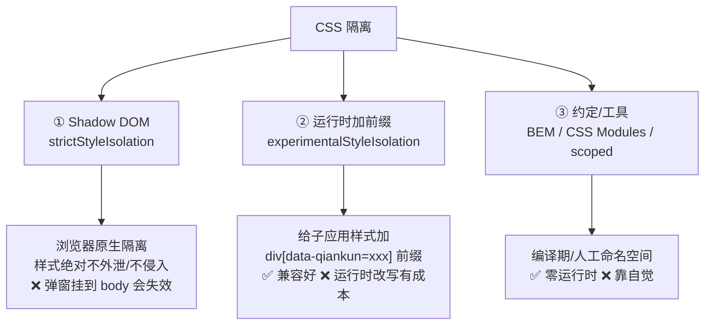

### 6.1 Shadow DOM（qiankun `strictStyleIsolation: true`）

把子应用挂到一个 `attachShadow` 出来的 Shadow Root 里。Shadow DOM 是浏览器原生的**样式边界**：里面的样式出不去、外面的样式进不来。

```js
const host = document.querySelector('#subapp');
const shadow = host.attachShadow({ mode: 'open' });
shadow.innerHTML = `<style>.btn{color:red}</style><button class="btn">子应用按钮</button>`;
// 这个 .btn 的样式被封死在 shadow 里，不影响外部同名 .btn
```

**缺陷**：子应用里用 `document.body.appendChild` 弹出的 Dialog/Message（很多 UI 库这么干）会挂到 Shadow 外面，样式就丢了——这是 qiankun `strictStyleIsolation` 最常见的坑。

### 6.2 运行时加前缀（qiankun `experimentalStyleIsolation: true`）

不改 DOM 结构，而是把子应用的每条 CSS 规则加上一个属性选择器前缀，模拟 Vue `scoped` 的效果：

```css
/* 子应用原始样式 */
.btn { color: red; }
/* qiankun 改写后（div[data-qiankun="react-app"] 是子应用根容器） */
div[data-qiankun="react-app"] .btn { color: red; }
```

这样样式只在子应用根节点内部生效，不会泄漏到主应用或其它子应用。原理和 Vue SFC `<style scoped>`（给元素加 `data-v-xxx` 属性 + 属性选择器）、CSS Modules（把类名哈希成 `.btn_a1b2c3`）一脉相承——**都是用命名空间制造隔离**。

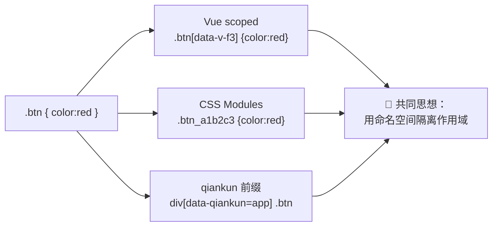

---

## 七、Module Federation：另一条技术路线

前面 single-spa/qiankun 是「**应用级**」集成——把整个子应用当黑盒挂载。Webpack 5 的 **Module Federation（模块联邦）**走的是完全不同的「**模块级**」共享路线（对照 [Webpack 官方文档](https://webpack.js.org/concepts/module-federation/)）。

### 7.1 核心概念：Host / Remote / Shared

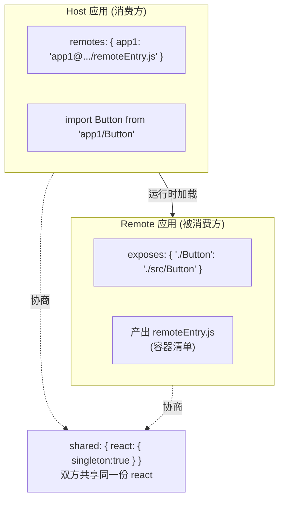

- **Remote（远程）**：用 `exposes` 暴露自己的模块（一个组件、一个函数、一整个应用），Webpack 为它生成一个入口清单文件 `remoteEntry.js`（即「容器 container」）。
- **Host（宿主）**：用 `remotes` 声明要消费哪些远程，然后像普通 `import` 一样 `import Button from 'app1/Button'`。
- **Shared（共享）**：`shared` 声明公共依赖（react/vue/lodash），运行时双方**协商只用一份**，避免重复下载。

### 7.2 运行时机制：容器的 init / get

`remoteEntry.js` 暴露一个容器对象，含两个方法：`init(sharedScope)` 和 `get(moduleName)`。Host 加载 Remote 的流程：

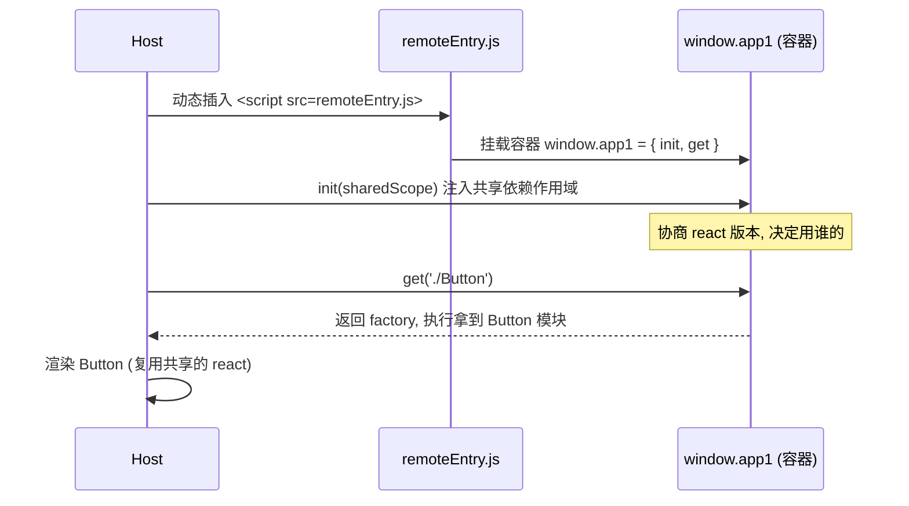

`shared` 的版本协商用到几个关键字段（Webpack 官方选项）：

- `singleton: true`：全局只允许一个实例（React 这种带内部状态的库**必须**开，否则「多个 React」会报 hooks 错误）。
- `requiredVersion` / `strictVersion`：声明/强制版本约束，不满足会告警或报错。
- `eager: true`：同步打进主 chunk（否则默认异步加载，需要 `import('./bootstrap')` 异步边界）。

### 7.3 与「构建时集成」的本质区别

Module Federation 虽然是 Webpack 编译期配置，但**产物是运行时才组装**的：Host 构建时并不知道 Remote 的代码，只在浏览器运行时才去拉 `remoteEntry.js`。所以它属于**运行时集成**，Remote 可以独立部署更新，Host 无需重新构建——这才符合微前端的独立部署要求。

---

## 八、qiankun vs Module Federation：到底怎么选

这是微前端最高频的对比题。二者不是替代关系，而是**不同粒度、不同哲学**：

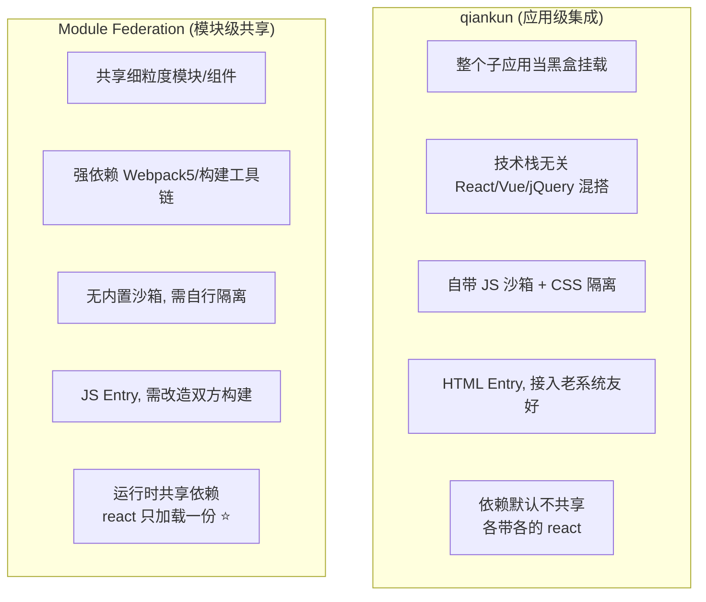

| 维度 | qiankun | Module Federation |
| --- | --- | --- |
| 集成粒度 | **应用级**（整个子应用） | **模块级**（组件/函数/应用皆可） |
| 技术底座 | 基于 single-spa，运行时 fetch HTML | 基于 Webpack 5 编译期 + 运行时容器 |
| 加载方式 | HTML Entry（给 URL） | JS Entry（remoteEntry.js） |
| 隔离 | **内置** JS 沙箱 + CSS 隔离 | **无内置**，需自行处理全局/样式冲突 |
| 依赖共享 | 默认不共享（可手动 externals） | **原生 `shared` 运行时共享**，主打卖点 |
| 技术栈异构 | 强（连 jQuery 老系统都能挂） | 弱（双方最好同栈、同构建工具） |
| 接入老系统 | 友好（几乎无侵入） | 不友好（要改 Webpack 配置） |
| 典型场景 | 多个异构团队应用聚合、老系统迁移 | 同栈多应用共享组件/依赖、设计系统分发 |

**一句话选型**：要「**把多个独立应用（尤其异构/老系统）聚合成一个平台**」，选 qiankun（隔离开箱即用）；要「**多个同栈应用之间共享组件、共享依赖、减少重复加载**」，选 Module Federation。两者也能组合：qiankun 做应用级集成外壳，内部子应用之间用 MF 共享公共依赖。

---

## 九、常见误区

- ❌ **「微前端 = iframe」**。iframe 只是最原始的一种；主流是 single-spa/qiankun/MF 的 JS 运行时集成。iframe 隔离最强但通信、路由、体验代价大（见模块 02）。
- ❌ **「上了微前端性能就好」**。恰恰相反：多个子应用各带一份 React，首屏可能更慢。性能收益来自**独立部署/团队解耦**，性能优化要靠依赖共享（模块 08）、预加载等额外手段。
- ❌ **「qiankun 沙箱能隔离一切」**。沙箱隔离的是 `window` 全局；但子应用往 `document.body` 挂的弹窗、写死的全局 CSS、`window` 上的原型链修改等仍可能泄漏。隔离是「大幅缓解」不是「绝对隔离」。
- ❌ **「Module Federation 的 shared 无脑开 singleton」**。singleton 会强制全局一个版本，若两个应用需要不兼容的大版本，反而会运行时报错。要理解版本协商机制（模块 08）。
- ❌ **「所有项目都该上微前端」**。微前端是**组织架构问题的技术解**。团队少、发布不频繁、技术栈统一的项目，用微前端只会徒增复杂度。先问「痛不痛」，再决定用不用（模块 01）。

## 🔗 权威文档

- [micro-frontends.org](https://micro-frontends.org/)
- [single-spa · Overview & Lifecycle](https://single-spa.js.org/docs/getting-started-overview)
- [qiankun · 文档 & API](https://qiankun.umijs.org/api)
- [import-html-entry（qiankun HTML Entry 核心库）](https://github.com/kuitos/import-html-entry)
- [Webpack · Module Federation](https://webpack.js.org/concepts/module-federation/)
- [Martin Fowler · Micro Frontends](https://martinfowler.com/articles/micro-frontends.html)
</content>
