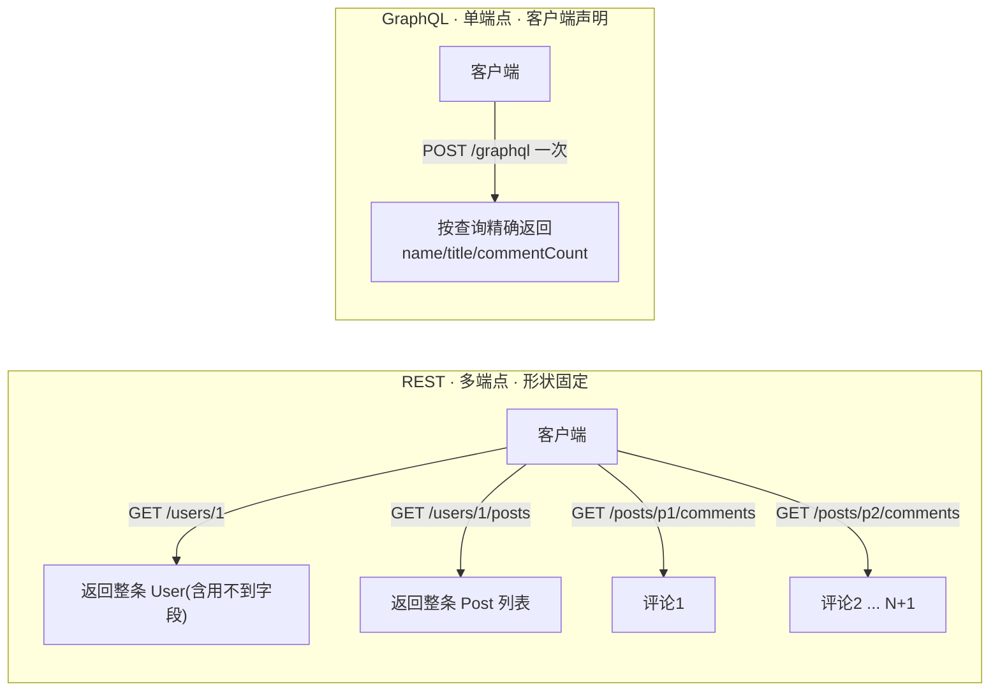
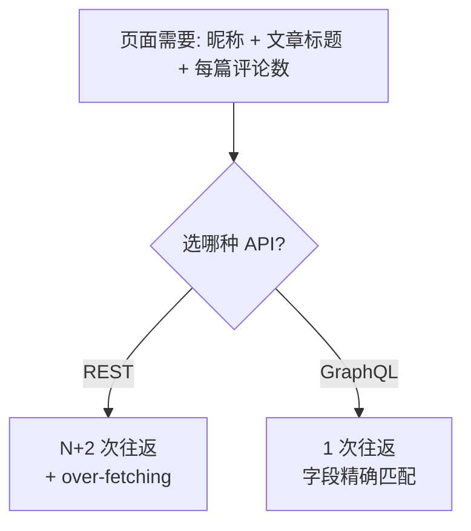

# 01 · REST vs GraphQL（对比与取舍）

> GraphQL 是一种「由客户端声明所需数据形状」的 API 查询语言。本模块用同一份数据对比 REST 与 GraphQL，讲清 GraphQL 到底解决了 REST 的什么痛点。

## 📖 知识讲解

REST 以「资源 + 端点」为中心：`/users/1`、`/users/1/posts`、`/posts/p1/comments` 各是一个 URL，每个端点返回**固定形状**的整条资源。这带来两个经典问题：

- **over-fetching（过度获取）**：端点把整条资源都吐出来，前端只用其中几个字段，其余（`email`/`body`/`cover`…）白白传输。
- **under-fetching（获取不足）+ N+1**：一个页面要的数据分散在多个端点，前端得发多次请求；渲染「每篇文章的评论数」时甚至要对 N 篇文章各发一次请求（1 次列表 + N 次详情）。

GraphQL 换了一种思路（对照 [graphql.org/learn](https://graphql.org/learn/)）：

- **单一端点**：整个服务只有一个 URL（通常 `/graphql`）。
- **客户端声明字段**：查询长什么样，返回就长什么样——要 `name title commentCount` 就只返回这三样，**不多不少**。
- **一次请求拿到嵌套图**：`user → posts → commentCount` 一趟返回，天然解决 under-fetching。

代价：服务端要维护一套强类型 Schema + Resolver，缓存、限流、鉴权比 REST 复杂。GraphQL 不是替代 REST，而是在「数据关系复杂、客户端多样、字段诉求多变」时更优。

## 🔄 流程图 / 原理图





## 💻 代码说明

`demo.mjs` 用纯函数模拟 REST 三个端点并统计「往返次数 / 吐出字段量」，再用 `graphql` 库真跑一次等价查询：

- REST 侧：`getUser` + `getPostsByUser` + 对每篇文章 `getCommentsByPost` → 往返 = N+2，且 `countFields` 统计出大量前端用不到的字段。
- GraphQL 侧：`buildSchema` 定义 `User/Post/Query`，查询只声明 `name / posts{title commentCount}`，一次 `graphql()` 调用返回精确数据。
- 运行后对比两侧打印的「往返次数」和「字段量」，直观看到差距。

## ▶️ 运行方式

```bash
cd 27-graphql
npm install        # 安装 graphql 等依赖（仅首次）
npm run 01         # 或 node 01-rest-vs-graphql/demo.mjs
```

## ⚠️ 常见坑 / 最佳实践

- **别把 GraphQL 当银弹**：简单 CRUD、以缓存为核心（CDN/HTTP 缓存）的公开 API，REST 往往更省心。
- GraphQL 把「多次请求」变成「一次复杂查询」，复杂度从网络层转移到了服务端解析层——**N+1 问题依然存在**，只是搬到了 Resolver 里（见 05、08 章 DataLoader）。
- GraphQL 默认走 `POST`，天然的 HTTP 缓存失效，需要 Apollo Client 归一化缓存或持久化查询（persisted queries）来补。

## 🔗 官方文档

- [GraphQL 官方 · Introduction](https://graphql.org/learn/)
- [GraphQL 官方 · Thinking in Graphs](https://graphql.org/learn/thinking-in-graphs/)
- [GraphQL vs REST（graphql.org best practices）](https://graphql.org/learn/best-practices/)
