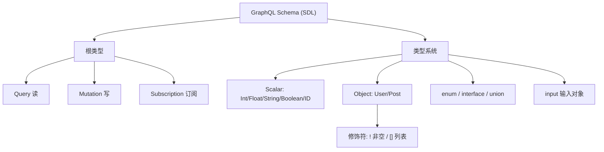

# 02 · Schema 与类型系统（Type System / SDL）

> GraphQL 服务的能力边界由一份**强类型 Schema** 定义。Schema 用 SDL（Schema Definition Language）书写，是前后端之间的「契约」。

## 📖 知识讲解

对照 [graphql.org/learn/schema](https://graphql.org/learn/schema/)，Schema 由这些构件组成：

- **标量 Scalar**：内置 `Int`/`Float`/`String`/`Boolean`/`ID`，可自定义（如 `DateTime`）。
- **对象类型 Object type**：由字段组成，如 `type User { id: ID! name: String! }`。
- **修饰符**：
  - `!` = **Non-Null（非空）**：`String!` 保证不为 null。
  - `[]` = **List（列表）**：`[Post!]!` 外层 `!` 表示列表本身非空，内层 `!` 表示元素非空。
- **枚举 enum**：取值受限集合，如 `enum PostStatus { DRAFT PUBLISHED }`。
- **接口 interface / 联合 union**：多态；`interface` 共享字段，`union` 表示「几种类型之一」。
- **输入类型 input**：作为参数传入的对象（Mutation 常用），不能有 Resolver。
- **三个根类型**：`Query`（读）、`Mutation`（写）、`Subscription`（订阅）——它们是所有查询的入口。

Schema 天生支持**内省（Introspection）**：客户端可以查询 `__schema` / `__type` 得到完整类型信息，GraphiQL、Apollo Sandbox 的自动补全和文档就靠它。

## 🔄 流程图 / 原理图



## 💻 代码说明

`demo.mjs`：

- 用 `buildSchema(sdl)` 把一段 SDL 文本编译成可执行的 `GraphQLSchema`（含 `enum`、`!`、`[String!]!`、带参字段 `posts(status)`）。
- `printSchema(schema)` 再把编译结果打印回标准 SDL，验证类型系统。
- 跑一条内省查询 `{ __schema { types { name kind } } }`，过滤掉内置 `__` 类型后打印本 Schema 定义的所有类型，演示「Schema 自我描述」。

## ▶️ 运行方式

```bash
cd 27-graphql
npm install
npm run 02         # node 02-schema-types/demo.mjs
```

## ⚠️ 常见坑 / 最佳实践

- **`[Post!]!` 的两个 `!` 含义不同**：内层管元素、外层管列表本身，别混。
- Non-Null 字段一旦 Resolver 返回 `null`，会把错误「冒泡」到最近的可空父字段并把它整个置 null——设计时谨慎用 `!`。
- **input 类型 ≠ object 类型**：input 只能含标量/枚举/其它 input，不能有 Resolver，不能与 object 混用。
- 生产环境常关闭内省（避免暴露内部 Schema），但会让工具链失去补全，需权衡。

## 🔗 官方文档

- [GraphQL 官方 · Schemas and Types](https://graphql.org/learn/schema/)
- [GraphQL 官方 · Introspection](https://graphql.org/learn/introspection/)
- [graphql-js · buildSchema / printSchema](https://graphql.org/graphql-js/utilities/)
