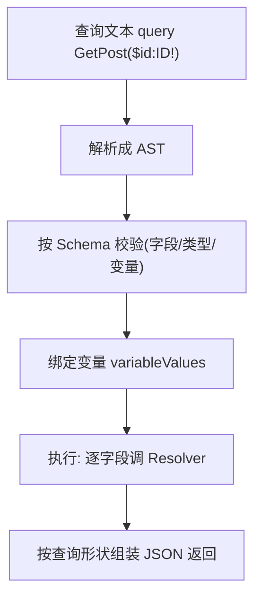
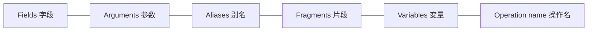

# 03 · 查询 Query（读操作）

> Query 是 GraphQL 的「读」语言：客户端写一段声明式查询，指定要哪些字段、传哪些参数，服务端按形状返回。

## 📖 知识讲解

对照 [graphql.org/learn/queries](https://graphql.org/learn/queries/)，查询的核心构件：

- **字段 Fields**：要什么写什么，可嵌套（`user { posts { title } }`）。
- **参数 Arguments**：给字段传参，`post(id: "p1")`；任何字段都能带参数。
- **别名 Aliases**：同名字段查多次时用别名区分：`first: post(id:"p1")`、`second: post(id:"p2")`。
- **片段 Fragments**：复用一组字段：`fragment postFields on Post { id title }`，用 `...postFields` 展开。
- **变量 Variables**：把入参从查询文本里抽出来（`$id`），运行时用 `variableValues` 传入——让查询文本可缓存、可预编译。
- **操作名 Operation name**：`query GetPost { ... }`，便于调试、日志与缓存 key。
- **指令 Directives**：`@include(if:)` / `@skip(if:)` 条件性地包含字段。

## 🔄 流程图 / 原理图





## 💻 代码说明

`demo.mjs` 用一个 `post(id)` Schema，依次演示四种写法：

1. **字段 + 参数**：`{ post(id:"p1") { title views } }`。
2. **别名**：一次查两篇文章 `first` / `second`。
3. **片段**：抽出 `postFields` 在多处复用。
4. **变量 + 操作名**：`query GetPost($id: ID!)`，`variableValues: { id: 'p2' }`——生产标准写法。

## ▶️ 运行方式

```bash
cd 27-graphql
npm install
npm run 03         # node 03-query/demo.mjs
```

## ⚠️ 常见坑 / 最佳实践

- **生产环境永远用变量**，别把用户输入拼进查询字符串——既防注入，又让查询可被缓存/持久化。
- 别名不只是「改名」：它让你在一次请求里对同一字段用不同参数查多次。
- 片段是治理「重复字段集合」的利器，配合 Fragment Colocation（组件各自声明所需字段）能让数据需求随组件收敛。
- 查询嵌套过深会放大 N+1 与性能风险，服务端应做**深度限制 / 复杂度限制**。

## 🔗 官方文档

- [GraphQL 官方 · Queries and Mutations](https://graphql.org/learn/queries/)
- [GraphQL 官方 · Fragments](https://graphql.org/learn/queries/#fragments)
- [GraphQL 官方 · Variables](https://graphql.org/learn/queries/#variables)
