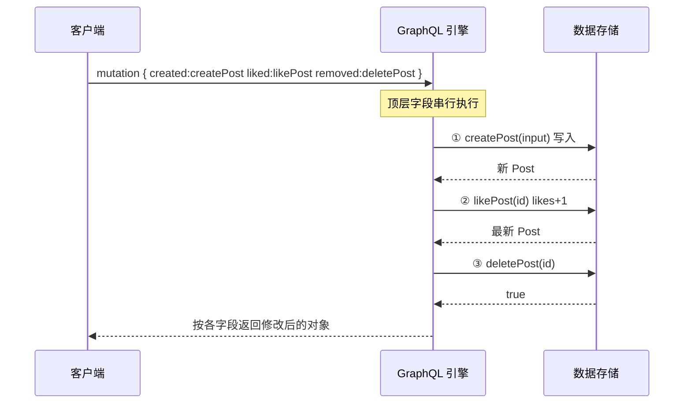

# 04 · 变更 Mutation（写操作）

> Query 负责读，Mutation 负责写（增删改）。Mutation 也有返回值，通常返回「修改后的最新对象」，让客户端一次拿到最新状态。

## 📖 知识讲解

对照 [graphql.org/learn/queries/#mutations](https://graphql.org/learn/queries/#mutations)：

- 所有写操作放在根类型 **`Mutation`** 下：`createPost` / `likePost` / `deletePost`。
- 复杂入参用 **`input` 输入类型**承载：`createPost(input: CreatePostInput!)`，比一堆散参数更整洁、可演进。
- **有返回值**：约定返回被修改后的对象（`Post!`），前端拿到即可更新缓存，省一次查询。
- **顶层 Mutation 字段串行执行**（这是与 Query 的关键区别）：Query 的顶层字段可并行解析，Mutation 顶层字段**保证从上到下依次执行**，避免写-写竞态。注意：只有**顶层**串行，字段内部的子字段仍并行。

工程实践里常用 **payload 模式**：返回 `type XxxPayload { node: Xxx, userErrors: [UserError!]! }`，把「预期内的业务错误」放进数据里，而不是全靠顶层 `errors`。

## 🔄 流程图 / 原理图



## 💻 代码说明

`demo.mjs` 定义 `createPost` / `likePost` / `deletePost` 三个 Mutation，内存 `Map` 当数据库：

- 用别名一次执行四步：`created` → `liked` → `liked2` → `removed`，打印结果可见**执行顺序确定**（`likes` 从 0→1→2）。
- 每个 Mutation 返回修改后的对象，客户端无需再查。
- 结尾再 `{ posts }` 一次，确认 `p1` 已删、`p2` 已新增。

## ▶️ 运行方式

```bash
cd 27-graphql
npm install
npm run 04         # node 04-mutation/demo.mjs
```

## ⚠️ 常见坑 / 最佳实践

- **Query 能不能改数据？** 技术上能，但**约定**读用 Query、写用 Mutation；破坏约定会让缓存、幂等假设失效。
- 记住「只有顶层 Mutation 串行」——若在一个 Mutation 的返回对象里嵌套多个写，顺序不保证。
- 用 `input` 类型而非平铺参数，方便未来加字段而不破坏兼容。
- 返回「修改后的对象」并带上 `id`，Apollo Client 会用它自动更新归一化缓存（见 07 章）。

## 🔗 官方文档

- [GraphQL 官方 · Mutations](https://graphql.org/learn/queries/#mutations)
- [GraphQL 官方 · Multiple fields in mutations（串行执行）](https://graphql.org/learn/queries/#multiple-fields-in-mutations)
- [Apollo · Designing mutations（payload/userErrors 模式）](https://www.apollographql.com/docs/react/data/mutations)
