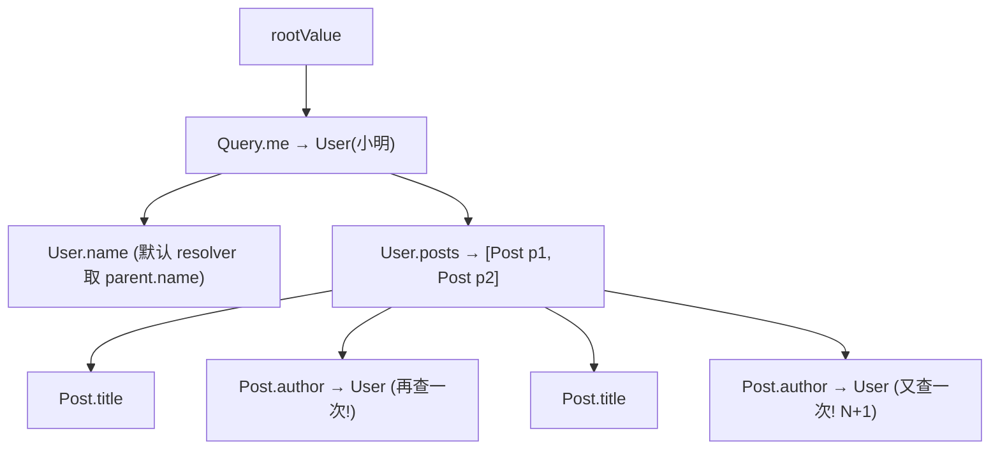
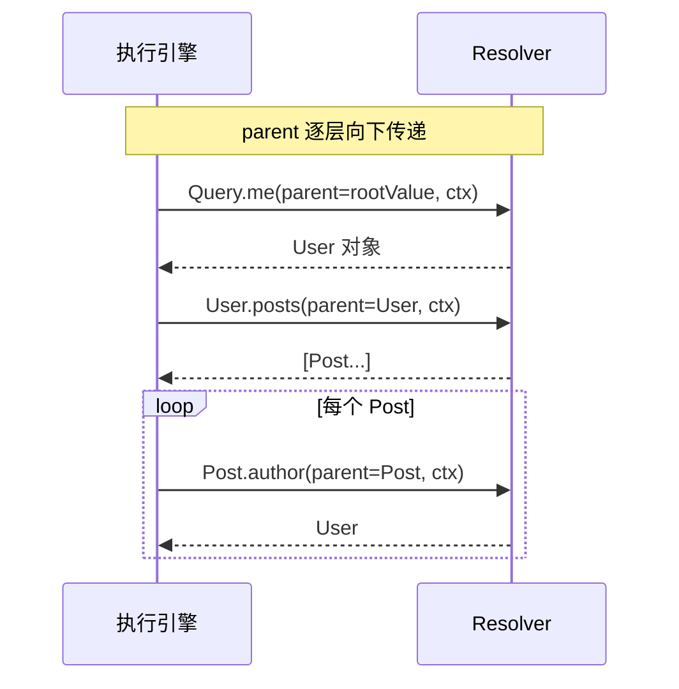

# 05 · 解析器 Resolver（执行原理）

> Resolver 是「字段 → 数据」的函数。GraphQL 执行引擎从根类型出发，沿查询树逐字段调用 Resolver，把每层返回值作为下一层的 parent。

## 📖 知识讲解

对照 [graphql.org/learn/execution](https://graphql.org/learn/execution/)，每个 Resolver 签名固定为四个参数：

```
resolver(parent, args, context, info)
```

- **parent（root/source）**：上一层字段的返回值。根字段的 parent 是 `rootValue`。
- **args**：该字段的参数对象，如 `{ id: 'p1' }`。
- **context**：整个请求共享的对象——放数据库连接、当前登录用户、以及 **DataLoader** 实例。每个请求一份。
- **info**：AST、字段路径、返回类型等执行元信息（高级用法：按需查询、字段级投影）。

**默认 Resolver**：若某字段没写 Resolver，引擎自动取 `parent[fieldName]`（或它是函数则调用之）。所以只有「需要计算/关联」的字段才手写 Resolver。

**执行模型**：查询树深度优先展开；同一层的多个字段并行解析（Mutation 顶层除外）；`[Post!]!` 这种列表字段会对每个元素分别解析下层——**这正是 N+1 的温床**（见 08 章）。

## 🔄 流程图 / 原理图





## 💻 代码说明

`demo.mjs` 用 graphql-js 的 `GraphQLObjectType` 显式定义 `Query/User/Post`，并在每个 Resolver 里 `trace()` 打印调用序号：

- `Query.me` 是根字段，parent 为 `rootValue`。
- `User.posts` 用 `context.db` 查该用户文章。
- `Post.author` 对**每篇文章各调用一次**——运行输出里能数到 `author` 被调了 2 次，这就是 N+1 的雏形。
- `title` / `name` 用默认取 parent 的方式，演示「不是所有字段都要手写 Resolver」。

## ▶️ 运行方式

```bash
cd 27-graphql
npm install
npm run 05         # node 05-resolver/demo.mjs
```

## ⚠️ 常见坑 / 最佳实践

- **context 是放 DataLoader 的地方**，且必须「每请求新建」，否则会跨用户串数据。
- 别在 Resolver 里做重复的 DB 查询——把关联查询交给 DataLoader 批处理（08 章）。
- Resolver 尽量薄：只做「取数据」，业务逻辑下沉到 service 层，便于复用与测试。
- 善用 `info` 做字段级投影（只 SELECT 被请求的列），但别过度工程化。

## 🔗 官方文档

- [GraphQL 官方 · Execution](https://graphql.org/learn/execution/)
- [Apollo · Resolvers](https://www.apollographql.com/docs/apollo-server/data/resolvers)
- [Apollo · The context argument](https://www.apollographql.com/docs/apollo-server/data/context)
