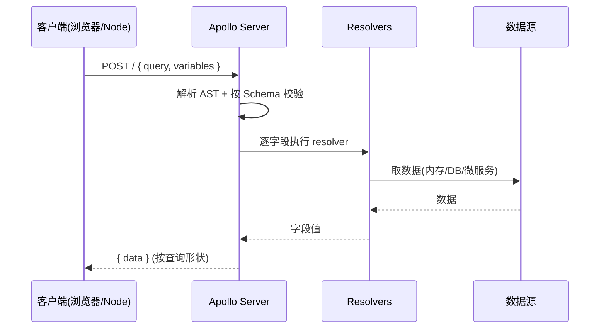

# 06 · Apollo Server（服务端）

> Apollo Server 是最主流的 Node GraphQL 服务端实现。本模块用 Apollo Server v5 的 `startStandaloneServer` 起一个真实的 GraphQL HTTP 服务，并提供 Node / 浏览器两种客户端。

## 📖 知识讲解

对照 [apollographql.com/docs/apollo-server](https://www.apollographql.com/docs/apollo-server/)，一个 Apollo Server 由三块组成：

- **typeDefs**：SDL 字符串定义 Schema（用 `#graphql` 注释可让编辑器高亮）。
- **resolvers**：一个对象，键名与 Schema 的类型/字段**一一对应**（`Query.books`、`Mutation.addBook`）。
- **ApolloServer + 启动器**：
  - `new ApolloServer({ typeDefs, resolvers })` 构建实例。
  - `startStandaloneServer(server, { listen, context })` 起一个内置 HTTP 服务（最省事，适合学习/小服务）。生产常用 `expressMiddleware` 挂到自己的 Express/Fastify 上。

启动后浏览器访问 `http://localhost:4000` 会进入 **Apollo Sandbox**（内置 IDE，基于内省自动补全）。GraphQL 请求本质就是往这个端点 `POST` 一段 `{ query, variables }` JSON。

## 🔄 流程图 / 原理图



## 💻 代码说明

- **`server.mjs`**：`typeDefs` 定义 `Book` / `Query.books` / `Query.book(id)` / `Mutation.addBook`，`resolvers` 用内存数组实现，`startStandaloneServer(..., { port: 4000 })` 启动。
- **`client.mjs`**：用 `graphql-request` 从 Node 打真实 HTTP 请求（查询 + 变更 + 变量），演示最轻量客户端。
- **`index.html`**：**零依赖**，浏览器用原生 `fetch` POST 到 `/`，证明「不需要任何库也能用 GraphQL」（Apollo Server 默认开 CORS）。

## ▶️ 运行方式

```bash
cd 27-graphql
npm install                 # 需要 @apollo/server / graphql / graphql-request

npm run 06                  # 启动服务 → http://localhost:4000 (Apollo Sandbox)
# 另开一个终端：
npm run 06:client           # Node 客户端查询 + 变更
# 或直接浏览器打开 06-apollo-server/index.html （需服务在跑）
```

## ⚠️ 常见坑 / 最佳实践

- **resolvers 的键名必须与 Schema 完全一致**，大小写敏感；漏写会走默认 Resolver 返回 `undefined`。
- `startStandaloneServer` 适合入门；生产要自定义中间件（鉴权、日志、限流）时改用 `expressMiddleware`。
- **context 每请求构建**：在 `startStandaloneServer(server, { context: async ({req}) => ({...}) })` 里注入用户与 DataLoader。
- Apollo Server v4/v5 已移除内置订阅，Subscription 需搭配 `graphql-ws`（见 08 章）。

## 🔗 官方文档

- [Apollo Server · Get started](https://www.apollographql.com/docs/apollo-server/getting-started)
- [Apollo Server · standalone vs expressMiddleware](https://www.apollographql.com/docs/apollo-server/api/standalone)
- [graphql-request](https://github.com/jasonkuhrt/graphql-request)
