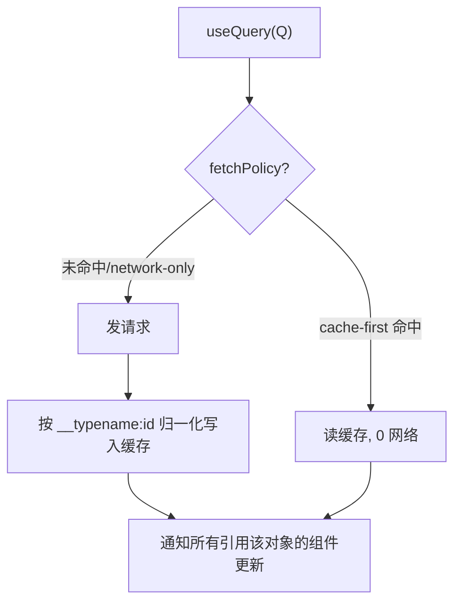
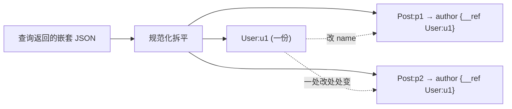

# 07 · Apollo Client（客户端 · 规范化缓存）

> Apollo Client 不只是「发 GraphQL 请求」——它最核心的价值是 **InMemoryCache 规范化缓存**：一处更新、处处同步，相同查询默认不再发网络。

## 📖 知识讲解

对照 [apollographql.com/docs/react/caching](https://www.apollographql.com/docs/react/caching/overview/)：

- **规范化（Normalization）**：Apollo 把返回的对象按 `__typename:id` 生成缓存主键（如 `User:1`），拆成一张**扁平表**；嵌套对象在父对象里只存一个指针（`{ __ref: "User:1" }`）。
- **共享 & 自动更新**：列表页和详情页引用同一个 `User:1`，任意一处更新，所有引用它的视图自动刷新。
- **fetchPolicy（取数策略）**：
  - `cache-first`（默认）：先看缓存，命中就不发网络。
  - `network-only`：强制发网络。
  - `cache-and-network`：先返缓存再发网络更新。
  - `no-cache` / `cache-only`：只网络不缓存 / 只读缓存。
- **写缓存**：Mutation 返回带 `id` 的最新对象，Apollo 自动合并；或用 `update` / `writeFragment` 手动改缓存。

一句话：**Apollo Client = GraphQL 传输层 + 归一化缓存 + 视图绑定（React/Vue hooks）**。

## 🔄 流程图 / 原理图





## 💻 代码说明

- **`client.mjs`（零依赖，直接可跑）**：手写一个迷你 `MiniInMemoryCache`，暴露 Apollo 缓存的内部机制：
  - `write()` 递归归一化，嵌套对象替换成 `{ __ref }`；两篇文章共享同一个 `User:u1`。
  - `read()` 顺着指针重建对象（带 `ancestors` 防环）。
  - 演示：首查发网络 → 再查命中缓存（0 网络）→ 改 `User:u1.name`，`p1/p2` 的 author 一起变。
- **`index.html`（真实 Apollo Client）**：用 CDN 加载 `@apollo/client/core`，连 06 章服务，点两次「cache-first」查询看到第二次不发网络（需联网 + 先启动 06）。

## ▶️ 运行方式

```bash
cd 27-graphql
# ① 原理演示（无需服务、无需安装）：
node 07-apollo-client/client.mjs      # 或 npm run 07

# ② 真实 Apollo Client：
npm install && npm run 06             # 先起服务
# 再用浏览器打开 07-apollo-client/index.html（需联网加载 CDN）
```

## ⚠️ 常见坑 / 最佳实践

- **对象缺 `id`/`__typename` 就无法归一化**，会退化成挂在父查询下的内联数据，更新不同步。可用 `keyFields` 自定义主键。
- 列表增删（`addXxx`/`deleteXxx`）Apollo **不会自动**帮你把新元素塞进某个列表查询，需要 `update` 回调或 `refetchQueries`。
- `cache-and-network` 对「既要快又要新」的列表页最友好。
- 分页要配 `typePolicies` 的 `merge` 函数，否则新旧页会互相覆盖。

## 🔗 官方文档

- [Apollo Client · Caching overview](https://www.apollographql.com/docs/react/caching/overview/)
- [Apollo Client · Fetch policies](https://www.apollographql.com/docs/react/data/queries/#setting-a-fetch-policy)
- [Apollo Client · Cache normalization](https://www.apollographql.com/docs/react/caching/cache-configuration/#customizing-cache-ids)
