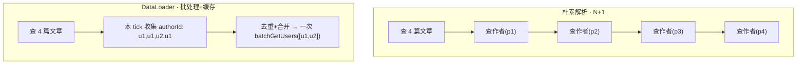
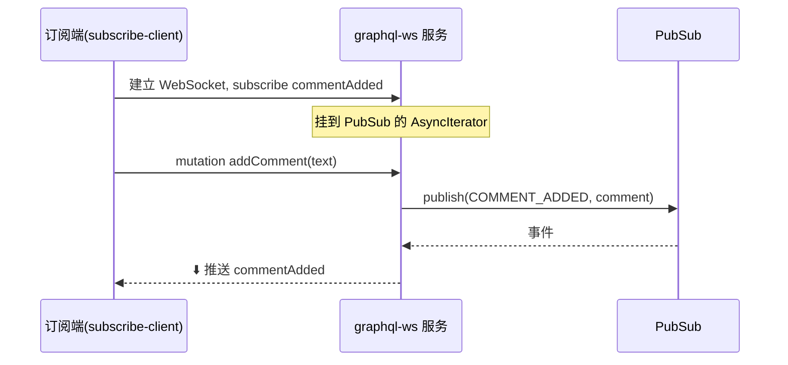

# 08 · 订阅 Subscription · 缓存 · N+1 与 DataLoader

> GraphQL 进阶三件套：用 **Subscription** 做实时推送、用 **DataLoader** 解决 N+1、理解服务端各层缓存。本模块把它们放在一起讲透。

## 📖 知识讲解

### 1) N+1 问题与 DataLoader

嵌套查询里，「查列表（1 次）+ 对每个元素查关联（N 次）」= **N+1** 次数据源调用。DataLoader（[github.com/graphql/dataloader](https://github.com/graphql/dataloader)）两招解决：

- **Batching 批处理**：把「同一个事件循环 tick 内」收集到的所有 key 合并成**一次**批量查询（`batchFn(keys) → results`，顺序一一对应）。
- **Caching 请求级缓存**：同一个请求里，同一个 key 只查一次（memoize）。**每个请求 new 一个 DataLoader**，避免跨请求脏数据。

### 2) Subscription（实时推送）

Query/Mutation 走 HTTP「请求-响应」；Subscription 走 **WebSocket 长连接**推送。现代标准协议是 **graphql-ws**（[github.com/enisdenjo/graphql-ws](https://github.com/enisdenjo/graphql-ws)，取代了废弃的 `subscriptions-transport-ws`）。机制：Subscription 字段的 `subscribe` 返回一个 **AsyncIterator**（常用 `graphql-subscriptions` 的 `PubSub` 提供）；Mutation 里 `pubsub.publish()` 发事件，所有订阅者被推送。

### 3) 缓存的层次

GraphQL 因为走 POST，天然的 HTTP 缓存失效，需要分层补：客户端归一化缓存（07 章）、服务端**响应缓存**、**DataLoader 请求级缓存**、以及数据源层缓存（Redis）。

## 🔄 流程图 / 原理图

N+1 vs DataLoader：



Subscription 时序：



## 💻 代码说明

- **`demo.mjs`（零依赖，直接可跑）**：手写迷你 DataLoader，揭示「攒一批 → 下一微任务一次性批查 → 结果按 key 缓存」。对比开/关它的查询次数：4 篇文章从 **4 次单查** 降到 **1 次批查**，`u1` 重复只查一次。
- **`server.mjs`**：用 `graphql-ws` + `ws` + `graphql-subscriptions` 起一个 WebSocket GraphQL 服务（`ws://localhost:4001/graphql`），含 `Query.comments` / `Mutation.addComment`（发 publish）/ `Subscription.commentAdded`。
- **`subscribe-client.mjs`**：`graphql-ws` 客户端，先订阅 `commentAdded`，再隔 800ms 连发 3 条 `addComment`，打印收到的实时推送。

## ▶️ 运行方式

```bash
cd 27-graphql

# ① N+1 / DataLoader 原理（无需服务、无需安装）：
node 08-subscription-caching-n1/demo.mjs      # 或 npm run 08

# ② 订阅 demo（需安装依赖）：
npm install
npm run 08:server      # 终端 A：启动 WebSocket 服务
npm run 08:sub         # 终端 B：订阅并连发评论，观察实时推送
```

## ⚠️ 常见坑 / 最佳实践

- **DataLoader 必须每请求新建**（放 context），全局单例会串数据、缓存永不失效。
- DataLoader 的 `batchFn` **返回数组顺序、长度必须与 keys 一一对应**，缺失的位置返回 `null`/`Error`。
- 订阅协议认准 **graphql-ws**；老的 `subscriptions-transport-ws` 已废弃不要再用。
- 生产订阅要跨实例广播时，把 `PubSub` 换成 Redis / Kafka 版（`graphql-redis-subscriptions`）。
- Subscription 适合「服务端主动、低频、实时」的场景（通知、聊天、进度）；高频轮询用 polling 反而更简单。

## 🔗 官方文档

- [DataLoader（graphql/dataloader）](https://github.com/graphql/dataloader)
- [Apollo · Subscriptions](https://www.apollographql.com/docs/apollo-server/data/subscriptions)
- [graphql-ws 协议实现](https://github.com/enisdenjo/graphql-ws)
- [Apollo · Server-side caching / responseCachePlugin](https://www.apollographql.com/docs/apollo-server/performance/caching)
