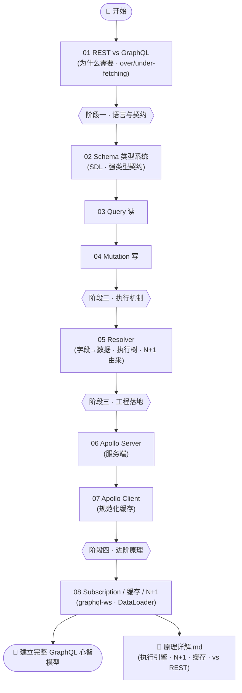
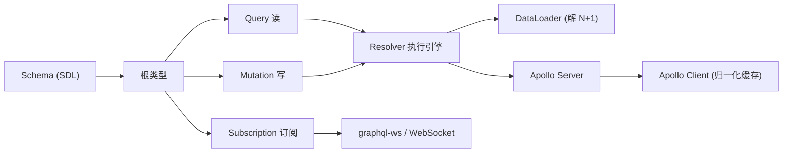

# 27 · GraphQL

> REST 让**服务端**决定「每个端点返回什么」，客户端只能被动接受——多了是 over-fetching，少了要多跑几趟（under-fetching + N+1）。GraphQL 把主动权交给**客户端**：用一份强类型 Schema 约定能力边界，客户端写一段**声明式查询**指定要哪些字段，服务端就精确返回那个形状。本工程从「为什么要 GraphQL」讲起，依次讲透 Schema/类型系统、Query/Mutation、Resolver 执行机制、Apollo Server/Client，直到 Subscription 实时推送与 N+1/DataLoader，全程对照 graphql.org 与 Apollo 官方文档，并配套一篇《原理详解.md》讲透底层机制。

## 📚 这个工程讲什么

GraphQL 要回答一个核心问题：**如何让客户端精确地、一次性地拿到它需要的数据，不多也不少？**

- **声明式数据查询**：查询长什么样，返回就长什么样——字段级别的精确控制。
- **强类型契约**：一份 Schema 同时是文档、校验器和工具链（补全/类型生成）的来源。
- **一个端点，一张数据图**：把分散在多个 REST 端点的资源，建模成一张可任意穿行的图。

对照的权威来源：[graphql.org](https://graphql.org/learn/)（规范与学习指南）、[Apollo 官方文档](https://www.apollographql.com/docs/)（Server/Client 事实标准实现）。

## 🗂 模块索引

| 模块 | 知识点 | 你将学会 | 运行方式 |
| --- | --- | --- | --- |
| [01](./01-rest-vs-graphql/) | REST vs GraphQL | over/under-fetching、N+1、单端点声明式、如何取舍 | `npm run 01` |
| [02](./02-schema-types/) | Schema 与类型系统 | SDL、Scalar/Object/enum/interface/union/input、`!`/`[]`、内省 | `npm run 02` |
| [03](./03-query/) | 查询 Query | 字段/参数/别名/片段/变量/操作名/指令 | `npm run 03` |
| [04](./04-mutation/) | 变更 Mutation | 写操作、input 类型、返回最新对象、顶层串行执行 | `npm run 04` |
| [05](./05-resolver/) | 解析器 Resolver | `(parent,args,context,info)`、默认 Resolver、执行树、N+1 由来 | `npm run 05` |
| [06](./06-apollo-server/) | Apollo Server | typeDefs+resolvers、standaloneServer、Sandbox、Node/浏览器客户端 | `npm run 06` |
| [07](./07-apollo-client/) | Apollo Client | 规范化 InMemoryCache、fetchPolicy、一处改处处变 | `npm run 07` |
| [08](./08-subscription-caching-n1/) | 订阅 / 缓存 / N+1 | graphql-ws 订阅、DataLoader 批处理+缓存、缓存分层 | `npm run 08` |

## 🧭 学习路线

按编号顺序学，整体分四个阶段：**建立认知 → 语言构件 → 服务/客户端 → 进阶原理**。



概念关系：



## ▶️ 运行说明

本工程是 **Node 项目**（ES Module）。大部分模块是 `node xxx.mjs` 的命令行 demo，两个模块另配浏览器页面。

```bash
cd 27-graphql
npm install          # 安装 graphql / @apollo/server / graphql-ws 等依赖（仅首次）

npm run 01           # 01~05：纯 node demo，直接看输出
npm run 06           # 06：启动 Apollo Server → http://localhost:4000 (Sandbox)
npm run 06:client    # 另开终端：Node 客户端
npm run 08:server    # 08：WebSocket 订阅服务
npm run 08:sub       # 另开终端：订阅客户端
```

> 提示：`07-apollo-client/client.mjs` 与 `08-.../demo.mjs` 是**零依赖**演示（手写迷你缓存 / 迷你 DataLoader），即使不 `npm install` 也能直接 `node` 运行，用来看清底层机制。浏览器页面：`06-apollo-server/index.html`（裸 fetch）、`07-apollo-client/index.html`（真实 Apollo Client，需先启动 06 + 联网）。

环境要求：Node.js 18+（推荐 20/22）。

## ⚠️ 学习建议

- **先想清「要不要用」**：GraphQL 不是替代 REST。数据关系复杂、客户端多样、字段诉求多变时它很香；简单 CRUD、强依赖 HTTP/CDN 缓存的公开 API，REST 更省心。先读 01。
- **吃透 05 Resolver 执行模型 + 工程根目录《原理详解.md》**——「执行引擎怎么逐字段跑」「N+1 从哪来、DataLoader 怎么解」「Apollo 缓存怎么归一化」是 GraphQL 的灵魂，也是面试高频。
- 04→05→08 是一条暗线：Mutation 的写、Resolver 的逐字段执行、DataLoader 的批处理，都是同一套执行模型的不同侧面。

## 🔗 权威文档

- [GraphQL 官方 · Learn](https://graphql.org/learn/)
- [GraphQL 规范](https://spec.graphql.org/)
- [Apollo Server 文档](https://www.apollographql.com/docs/apollo-server/)
- [Apollo Client 文档](https://www.apollographql.com/docs/react/)
- [DataLoader](https://github.com/graphql/dataloader) · [graphql-ws](https://github.com/enisdenjo/graphql-ws)
