# GraphQL · 原理详解（How & Why）

> 本文不讲「怎么用某个 API」，而是讲透 GraphQL 的**本质、执行机制与底层原理**：GraphQL 到底是什么、一条查询从文本到 JSON 经历了什么、Resolver 执行引擎如何逐字段展开、N+1 从哪来又怎么用 DataLoader 解、缓存为什么难、以及它与 REST 的根本取舍。配大量 Mermaid 图，对照 [GraphQL 规范](https://spec.graphql.org/)、[graphql.org](https://graphql.org/learn/) 与 [Apollo 官方文档](https://www.apollographql.com/docs/)。

---

## 一、本质：GraphQL = 声明式的数据查询语言

先给一句话定义（对照 [graphql.org](https://graphql.org/learn/)）：

> **GraphQL 是一种 API 查询语言，也是一套用类型系统执行查询的运行时。客户端用一段声明式查询描述「想要什么形状的数据」，服务端按这个形状精确返回，不多也不少。**

关键在「谁决定返回形状」这件事上，GraphQL 与 REST 恰好相反：

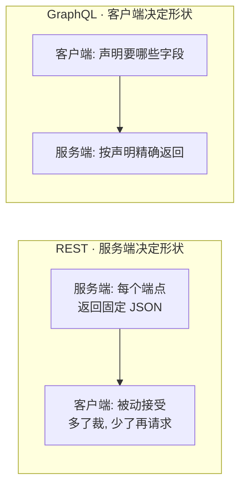

三个本质特征：

1. **声明式（Declarative）**：查询文本本身就是「返回结构的形状」。`{ user { name posts { title } } }` 返回的 JSON 和它长得一模一样。你描述 what，不描述 how。
2. **强类型（Typed）**：一切建立在 Schema 之上。每个字段都有类型，查询在执行前会被**静态校验**——字段拼错、类型不符、变量缺失，在真正取数据之前就被拒绝。
3. **图（Graph）**：数据被建模成一张图，对象通过字段互相连接（`User.posts`、`Post.author`）。一次查询就是**从某个入口出发在图上穿行**，一趟把需要的子图取回来。

> 为什么叫「查询语言」而不是「协议」？因为 GraphQL 规范只定义了**类型系统 + 查询语言 + 执行语义**，不规定传输层。实践中它几乎总是跑在 HTTP `POST /graphql` 上（订阅走 WebSocket），但规范本身与传输无关。

---

## 二、为什么会有 GraphQL：REST 的两个结构性痛点

REST 以「资源 + 端点」为中心，每个端点返回**固定形状**的整条资源。当页面需要的数据与端点的形状不匹配时，就出现两类问题：

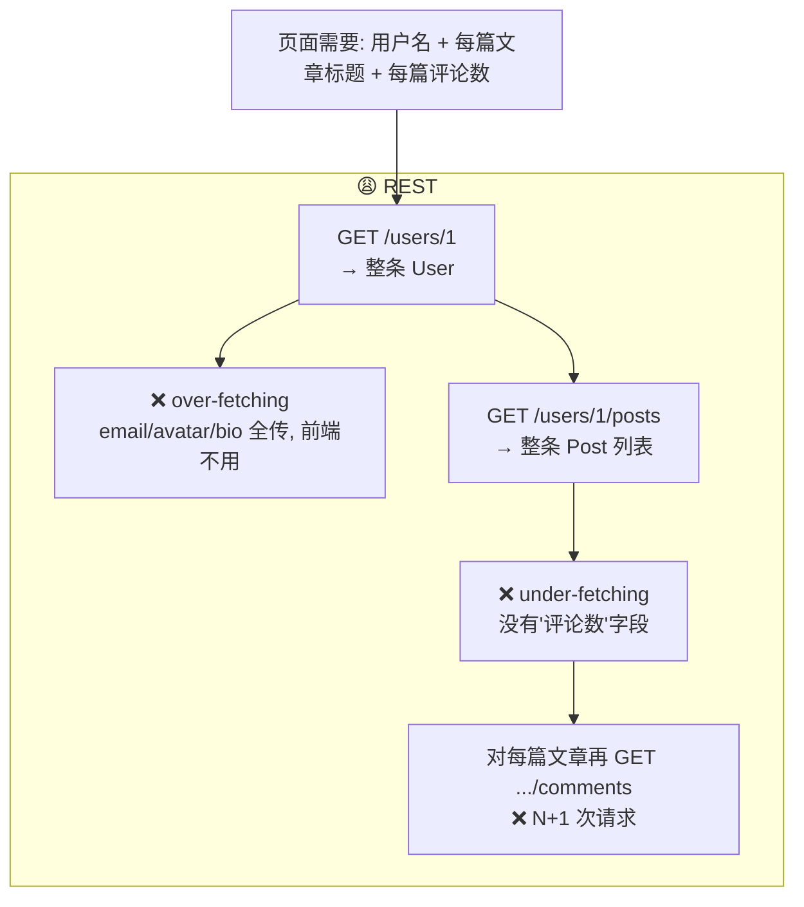

- **over-fetching（过度获取）**：端点把整条资源都吐出来，前端只用几个字段，其余在网络上白跑。移动端弱网尤其致命。
- **under-fetching（获取不足）+ N+1**：想要的数据端点没现成的，得多请求几个端点拼装；渲染「每篇文章的评论数」时甚至要对 N 篇文章各发一次请求 = 1 + N 次往返。

折中方案（BFF、`?fields=`、`?include=`、为每个页面定制端点）都是在「端点形状固定」这个根因上打补丁。GraphQL 直接把「决定形状的权力」交给客户端，从根上消除这类不匹配。

**但要清醒**：GraphQL 并没有消灭 N+1，只是把它从「客户端发 N 次 HTTP」搬到了「服务端 Resolver 跑 N 次查库」——见第五节。取舍见第八节。

---

## 三、类型系统：Schema 为什么是「契约」

Schema 是 GraphQL 的地基。它用 SDL 描述「这个服务能被问什么、每样东西是什么类型」。

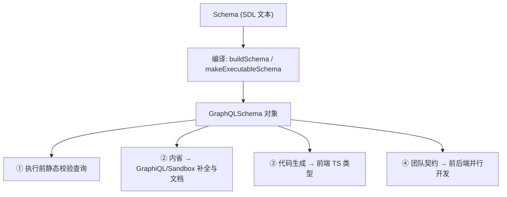

一份 Schema 同时扮演四个角色：**校验器、文档、工具链数据源、团队契约**。这是 GraphQL 相对 REST（OpenAPI 是可选的、常滞后）的结构性优势——类型信息是**强制且内建**的。

几个原理性要点：

- **Non-Null 的错误冒泡**：`String!` 若 Resolver 返回了 `null`，引擎不会返回一个「非法的 null」，而是把这个字段变成错误，向上冒泡到**最近的可空祖先字段**，把那一整块置为 `null` 并记进 `errors`。所以 `!` 是一种「契约强度」的声明，滥用会让局部错误炸掉一大片。
- **内省（Introspection）是 Schema 自我描述**：`__schema` / `__type` 是内建元字段。工具链的补全、文档、类型生成全靠它。生产可关内省以减少攻击面，代价是失去工具能力。
- **input 与 object 分离**：object 类型是「输出」，可带 Resolver、可有循环引用；input 类型是「输入」，只能含标量/枚举/其它 input。二者不能混用，因为一个是「怎么产出」、一个是「怎么传入」，语义完全不同。

---

## 四、执行引擎：一条查询从文本到 JSON

这是 GraphQL 最核心的机制。一条查询的完整生命周期（对照 [规范 · Execution](https://spec.graphql.org/October2021/#sec-Execution)）：

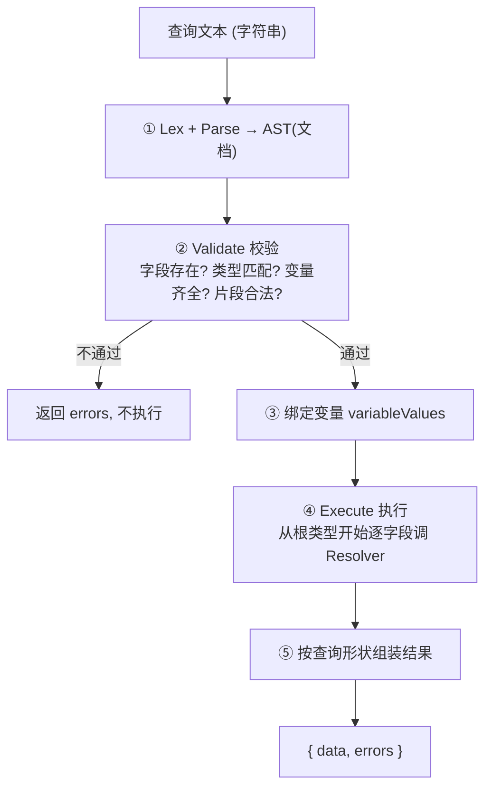

重点在第 ④ 步「执行」。执行引擎把查询树**深度优先**展开，对每个字段调用它的 Resolver，**上一层的返回值成为下一层的 `parent`**：

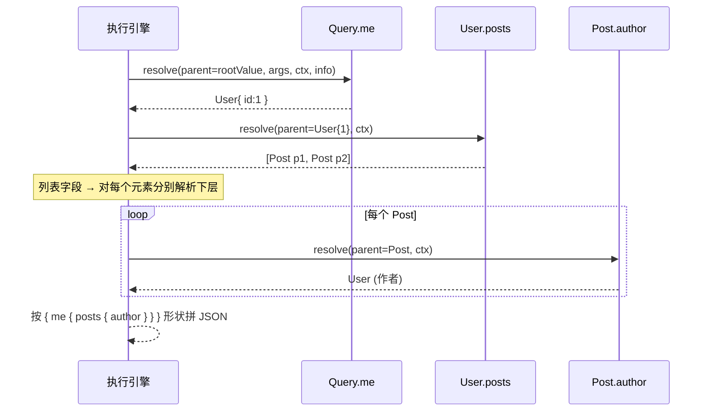

关于 Resolver 的四个参数 `(parent, args, context, info)`：

- **parent**：父字段返回值。这是数据在图上「流动」的载体——`User.posts` 拿到的 `parent` 就是 `Query.me` 返回的那个 User。
- **args**：本字段参数。
- **context**：**每请求一份**的共享对象。放数据库连接、当前登录用户、以及 **DataLoader** 实例。它是跨 Resolver 共享状态的唯一正道。
- **info**：AST 与执行路径等元信息，可做字段级投影等高级优化。

两条容易被忽略的执行规则：

1. **默认 Resolver**：字段没写 Resolver 时，引擎自动取 `parent[fieldName]`（是函数则调用）。所以只有「需要计算/关联」的字段才手写 Resolver，纯数据字段自动搞定。
2. **并行 vs 串行**：Query 的同层字段**并行**解析；但 **Mutation 顶层字段串行**执行（规范强制），以避免写-写竞态。注意只有**顶层**串行，Mutation 返回对象内部的子字段仍并行。

---

## 五、N+1 问题：它从执行模型里天然长出来

看第四节那张时序图：`Post.author` 在循环里被**逐篇调用**。如果每篇文章的 author Resolver 都去查一次数据库，5 篇文章 = 1 次查文章 + 5 次查作者 = **N+1**。这不是谁写错了，而是「逐字段、逐元素解析」这个执行模型的**必然副产物**。

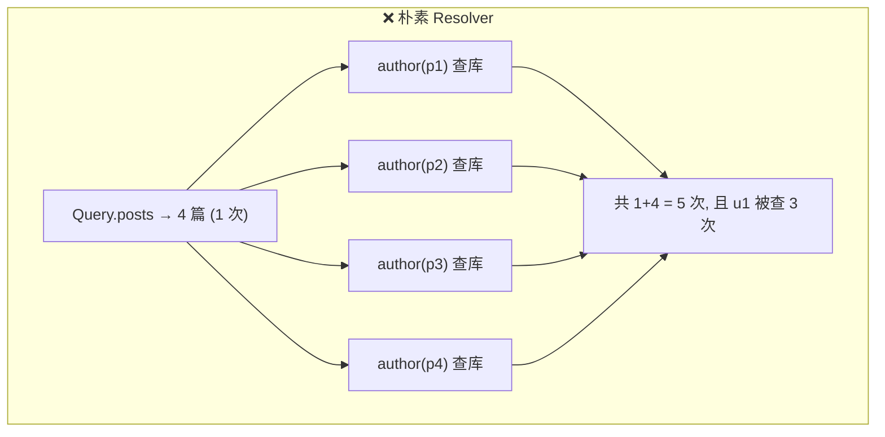

### DataLoader 怎么解：批处理 + 请求级缓存

DataLoader（[github.com/graphql/dataloader](https://github.com/graphql/dataloader)）的核心洞察是：那 N 次 `author` 调用其实**发生在同一个事件循环 tick 内**。既然如此，就别急着查——先把 key 攒起来，等这一 tick 结束，把所有 key **合并成一次批量查询**。

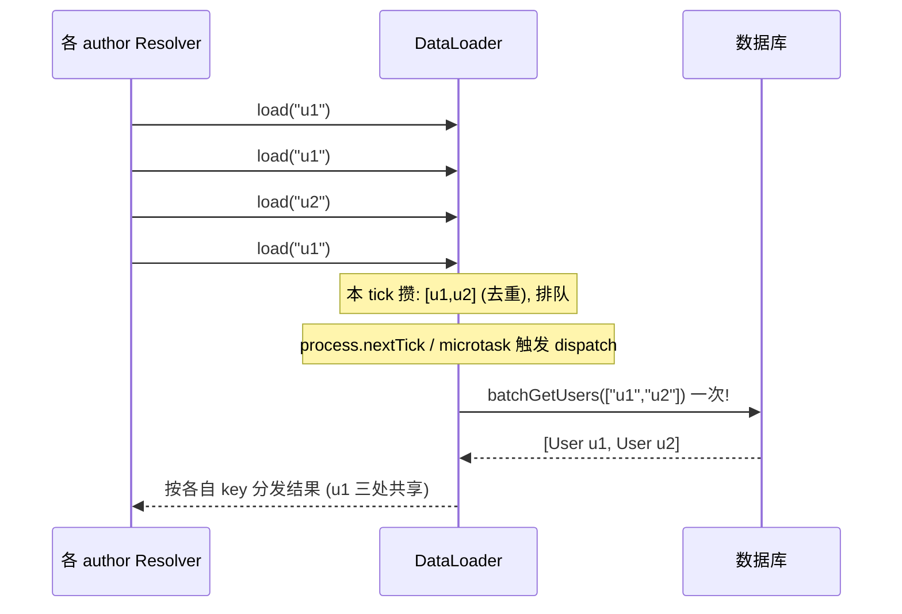

两个机制：

- **Batching**：用微任务（`queueMicrotask`/`process.nextTick`）把「本 tick 内所有 `load(key)`」推迟到 tick 末尾，合并成一次 `batchFn(keys)`。**约束**：`batchFn` 返回的数组必须与 `keys` **顺序一致、长度相等**，缺失位置返回 `null`/`Error`。
- **Caching**：同一个请求内，同一个 key 只查一次（`load` 返回 memoized 的 Promise）。所以 `u1` 出现三次也只入队一次。

> 本工程 `08-.../demo.mjs` 手写了一个迷你 DataLoader，把「攒队列 → 微任务 dispatch → 按 key 分发」的机制完整暴露出来，可零依赖直接 `node` 运行观察。

**关键纪律**：DataLoader 必须**每请求新建**并挂在 `context` 上。若做成全局单例，它的请求级缓存会永不失效，导致跨用户读到脏数据——这是最常见的线上事故。

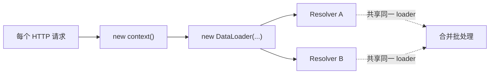

---

## 六、缓存：GraphQL 为什么比 REST 难缓存，以及怎么补

REST 的缓存很自然：`GET /posts/1` 是幂等的、URL 是天然缓存 key，浏览器、CDN、反向代理层层白嫖 HTTP 缓存。GraphQL 打破了这一切：

- 所有请求都是 `POST /graphql`（body 不同、URL 相同）→ **HTTP/CDN 缓存默认失效**。
- 查询形状千变万化 → 没有稳定的资源 URL 作 key。

于是 GraphQL 的缓存被拆成**多层**来补：

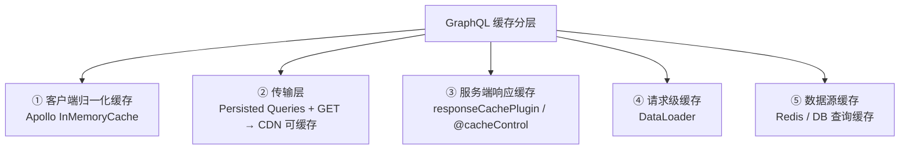

### 客户端归一化缓存（Apollo InMemoryCache）—— 最有分量的一层

Apollo Client 的核心价值不是「发请求」，而是**规范化缓存**。它把返回的嵌套 JSON 按 `__typename:id` 拆成一张**扁平表**，嵌套对象在父级里只留一个指针 `{ __ref: "User:1" }`：

```mermaid
graph LR
    subgraph RESP["查询返回 (嵌套)"]
      P1["Post p1 { author: User u1 }"]
      P2["Post p2 { author: User u1 }"]
    end
    RESP --> NORM["归一化"]
    subgraph CACHE["规范化缓存表 (扁平)"]
      U["User:u1 (只存一份)"]
      K1["Post:p1 → author {__ref User:u1}"]
      K2["Post:p2 → author {__ref User:u1}"]
    end
    NORM --> U & K1 & K2
    U -. 改 User:u1.name .-> UPD["p1/p2 引用它 → 一处改, 处处更新 UI"]
```

由此得到两个「魔法」：

1. **一处改，处处变**：列表页和详情页引用同一个 `User:u1`，任意一处更新，所有视图自动刷新。这就是为什么 **Mutation 返回带 `id` 的最新对象**，UI 就能自动更新——Apollo 用 `id` 找到缓存里那条记录并合并。
2. **cache-first 命中即免网络**：相同查询默认先读缓存。`fetchPolicy` 控制策略：`cache-first`（默认）/`cache-and-network`（先缓存再更新）/`network-only`/`no-cache`/`cache-only`。

> 本工程 `07-.../client.mjs` 手写了迷你 InMemoryCache，把「归一化写入 → 指针读取 → 命中免网络 → 局部更新联动」完整演示，零依赖可运行。

**归一化的前提**：对象必须有 `__typename` + `id`（或自定义 `keyFields`），否则无法归一，退化成内联数据、更新不联动。另一个坑：列表的增/删 Apollo **不会自动**帮你插进某个列表查询，需要 `update` 回调或 `refetchQueries`。

---

## 七、Subscription：为什么要换成 WebSocket

Query/Mutation 是「请求-响应」，一来一回就结束，HTTP 足矣。Subscription 是「服务端在事件发生时**主动、持续**推给客户端」，请求-响应模型撑不住，于是换成 **WebSocket 长连接**。

现代标准协议是 **graphql-ws**（[github.com/enisdenjo/graphql-ws](https://github.com/enisdenjo/graphql-ws)），它取代了已废弃的 `subscriptions-transport-ws`。执行层面，Subscription 字段与 Query/Mutation 的区别在于：它的 `subscribe` 返回一个 **AsyncIterator（事件流）**，而不是一个值。

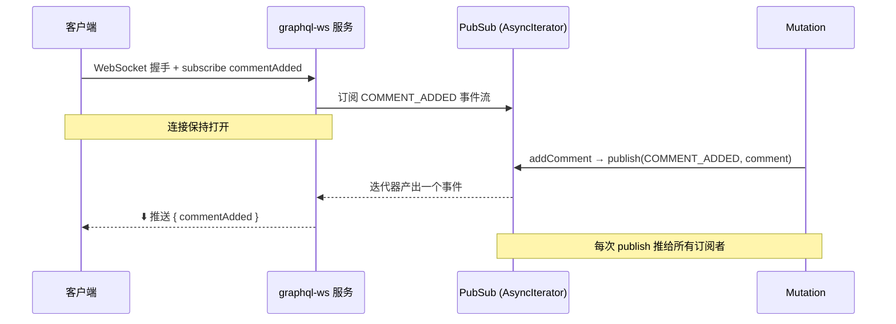

原理拆解：

- **AsyncIterator 是引擎与事件源的接口**：执行引擎每次从迭代器取到一个 payload，就对它跑一遍字段解析，把结果推给客户端。`graphql-subscriptions` 的 `PubSub` 就是把「内存事件」包装成 AsyncIterator 的便捷实现。
- **publish/subscribe 解耦**：Mutation 只管 `publish` 事件，完全不知道有谁在听；订阅端只管 `subscribe`，二者通过事件名（`COMMENT_ADDED`）解耦。
- **生产要跨实例广播**：内存 `PubSub` 只在单进程有效。多实例部署时换成 Redis/Kafka 版（`graphql-redis-subscriptions`），让 A 实例的 publish 能推到连在 B 实例上的订阅者。

> 本工程 `08-.../server.mjs` + `subscribe-client.mjs` 用 graphql-ws 起了一个真实 WebSocket GraphQL 服务：客户端先订阅，再连发 mutation，观察实时推送。

---

## 八、与 REST 的根本取舍：什么时候用，什么时候别用

GraphQL 不是 REST 的升级替代，而是**不同权衡下的选择**。它把复杂度从「网络层的多次往返」转移到了「服务端的执行与治理」。

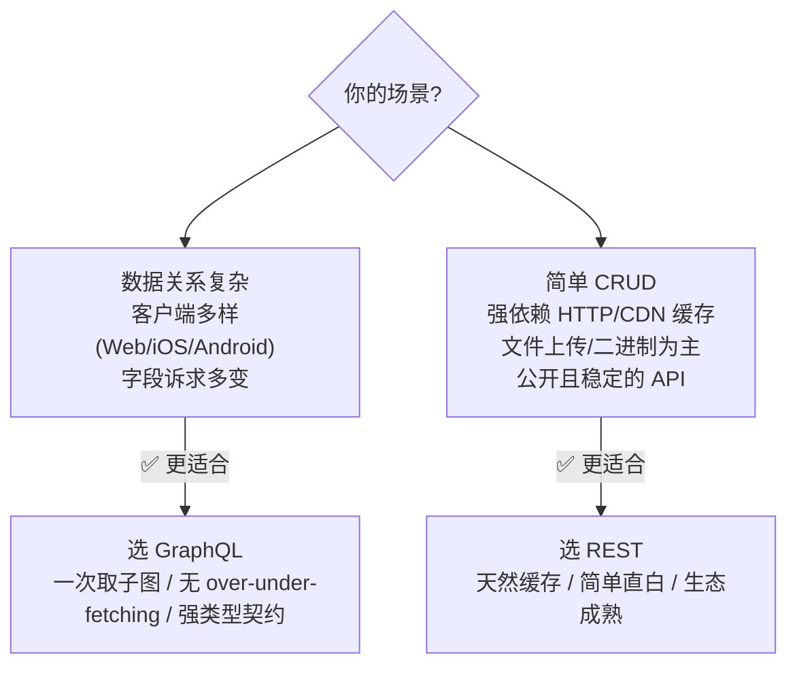

| 维度 | REST | GraphQL |
| --- | --- | --- |
| 谁决定返回形状 | 服务端（端点固定） | 客户端（声明字段） |
| over/under-fetching | 常见 | 基本消除 |
| 端点数量 | 多（每资源多个） | 一个 |
| 类型契约 | 可选（OpenAPI，常滞后） | 内建强制（Schema） |
| HTTP/CDN 缓存 | 天然好用 | 默认失效，需分层补 |
| N+1 | 在客户端（多次请求） | 搬到服务端（Resolver），用 DataLoader 解 |
| 错误模型 | HTTP 状态码 | 200 + `errors` 数组（+ payload 内 userErrors） |
| 学习/运维成本 | 低 | 较高（Schema 设计、限流、限深、鉴权到字段） |

GraphQL 引入的**新复杂度**（也是本文各节在解决的）：

- **N+1** → DataLoader（第五节）
- **缓存失效** → 归一化缓存 + persisted queries + 响应缓存（第六节）
- **恶意查询**（深度/复杂度爆炸）→ 深度限制、复杂度打分、超时、persisted queries 白名单
- **鉴权粒度**下沉到字段级 → 在 Resolver/context 做字段鉴权

> 结论：当「客户端形状诉求多变 + 数据是一张关系图 + 多端复用」时，GraphQL 的收益压过它的复杂度；否则 REST 往往是更务实的选择。二者也常共存：对内用 GraphQL 聚合，对外用 REST 暴露稳定端点。

---

## 九、一图总览：全链路

```mermaid
flowchart LR
    subgraph Client["客户端"]
      QRY["声明式查询 + variables"] --> AC["Apollo Client<br/>归一化缓存"]
    end
    AC -->|POST /graphql| SRV
    subgraph SRV["Apollo Server"]
      PARSE["Parse → Validate(按 Schema)"] --> EXEC["Execute<br/>逐字段 Resolver"]
      EXEC --> DL["DataLoader<br/>批处理+请求级缓存"]
      DL --> DS["数据源 (DB/微服务/Redis)"]
    end
    SRV -->|{ data, errors }| AC
    subgraph RT["实时"]
      WSCONN["graphql-ws WebSocket"]
      EXEC -. Subscription .-> WSCONN
      WSCONN -.推送.-> Client
    end
```

从「客户端声明形状」到「服务端逐字段执行」，再到「DataLoader 收敛数据源调用」「归一化缓存收敛网络请求」「WebSocket 承载实时」——这条链路上的每一环，都是围绕 GraphQL 那个本质在服务：**让客户端精确地、一次性地拿到它需要的数据图。**

---

## 🔗 权威文档

- [GraphQL 规范（GraphQL Specification）](https://spec.graphql.org/)
- [GraphQL 官方 · Learn（Schema/Queries/Execution）](https://graphql.org/learn/)
- [Apollo Server 文档](https://www.apollographql.com/docs/apollo-server/)
- [Apollo Client · Caching](https://www.apollographql.com/docs/react/caching/overview/)
- [DataLoader（graphql/dataloader）](https://github.com/graphql/dataloader)
- [graphql-ws（订阅协议）](https://github.com/enisdenjo/graphql-ws)
- [Principled GraphQL（设计原则）](https://principledgraphql.com/)
