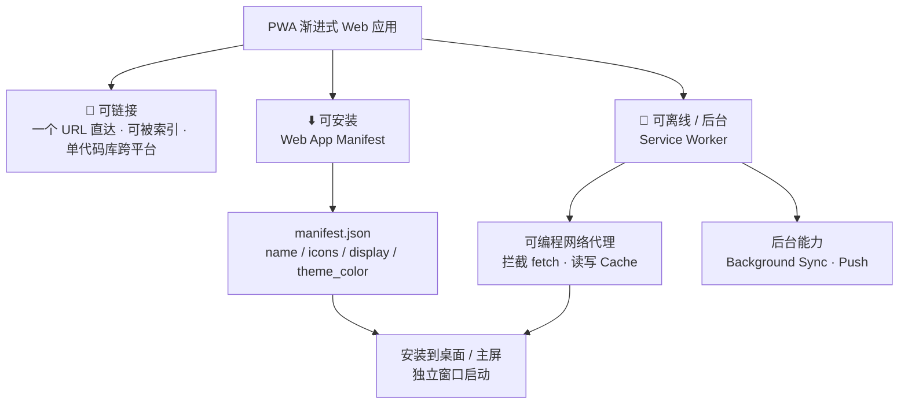

# 01 · PWA 是什么（What is a PWA）

> PWA（Progressive Web App，渐进式 Web 应用）= 用 **Web 平台技术**构建、体验却接近**原生应用**的应用；它兼具网页的「可链接」与原生 App 的「可安装、可离线、能后台运行」。

## 📖 知识讲解

MDN 的权威定义：**"A PWA is an app that's built using web platform technologies, but that provides a user experience like that of a platform-specific app."**（用 Web 平台技术构建、但提供类原生应用体验的应用）。

PWA 不是一门新语言或新框架，而是一组**渐进增强**的能力集合——同一份 HTML/CSS/JS，在旧浏览器里是普通网页，在支持的浏览器里"升级"为可安装、可离线的应用。它靠三块基石实现：

| 能力 | 靠什么实现 | 关键 API |
|------|-----------|----------|
| 🔗 **可链接**（Linkable） | 本身就是网页 | 一个 URL、可被搜索引擎索引、跨平台单代码库 |
| ⬇️ **可安装**（Installable） | Web App Manifest | `manifest.json` + 浏览器安装流程 |
| 📴 **可离线**（Offline-capable） | Service Worker + Cache | `navigator.serviceWorker.register()`、`Cache`、`FetchEvent` |

核心 API / 概念：

- **Web App Manifest**：一份 JSON，描述应用名称、图标、启动方式（`display: standalone`）、主题色，浏览器据此把网页"安装"成桌面应用。
- **Service Worker**：运行在独立线程的**可编程网络代理**，位于「网页 ↔ 浏览器 ↔ 网络」之间，能拦截请求、读写缓存，从而实现离线；只在**安全上下文**（HTTPS 或 `http://localhost`）可用。
- **可安装条件**（Chrome）：有 manifest（含 `name/short_name`、`icons` ≥192px 与 512px、`start_url`、`display` 为 standalone 等）、注册了带 `fetch` 处理的 Service Worker、通过 HTTPS 提供。

易错点：`file://` 直接双击打开时 Service Worker **无法注册**，PWA 能力全部失效——必须用本地 HTTP 服务器（`http://localhost`）。

## 🔄 流程图 / 原理图



## 💻 代码说明

- **`manifest.json`**：声明 `display: standalone`（独立窗口，无浏览器地址栏）、`icons`（含 `maskable` 供 Android 自适应裁切）、`theme_color`。
- **`index.html`** 三段脚本对应三大能力：
  1. `navigator.serviceWorker.register('./sw.js')` —— 注册 SW，页面获得离线能力，实时更新状态灯。
  2. `navigator.onLine` + `online`/`offline` 事件 —— 展示当前网络状态，断网后页面仍能运行即证明"已缓存"。
  3. `beforeinstallprompt` 事件 —— 满足安装条件时触发；`e.preventDefault()` 拦下默认提示，改由自定义按钮调用 `deferredPrompt.prompt()` 弹出安装对话框。
- **`sw.js`**：最小实现——`install` 时把 App Shell（首页、图标、manifest）写入 Cache，`fetch` 时缓存优先返回，实现断网可打开。

## ▶️ 运行方式

Service Worker 必须在 `http://localhost` 或 HTTPS 下运行，**不能用 `file://`**：

```bash
# 在本模块目录（或工程根目录）启动本地服务器，二选一：
npx serve            # 然后访问打印出的 http://localhost:xxxx
python3 -m http.server 8080   # 然后访问 http://localhost:8080
```

打开后：
1. 观察三盏状态灯（SW 已注册 / 在线 / 可安装）。
2. 满足条件后点「安装到桌面」体验安装。
3. DevTools → Network 勾选 **Offline** 再刷新，页面仍能打开 = 离线能力生效。

## ⚠️ 常见坑 / 最佳实践

- ❌ `file://` 双击打开 → SW 报错 `not supported`。✅ 必须走 `http://localhost`。
- `beforeinstallprompt` 只在满足全部可安装条件时触发；已安装、或用不支持的浏览器（如 iOS Safari 走「添加到主屏幕」而非此事件）时不会触发。
- 图标至少提供 **192×192 与 512×512**；本 demo 用 SVG（现代 Chrome 支持），生产环境建议同时提供 PNG 以覆盖更多平台。
- PWA 是**渐进增强**：即便浏览器不支持 SW，也应保证网页基本功能可用。

## 🔗 官方文档

- MDN · Progressive web apps：<https://developer.mozilla.org/en-US/docs/Web/Progressive_web_apps>
- MDN · 让 PWA 可安装：<https://developer.mozilla.org/en-US/docs/Web/Progressive_web_apps/Guides/Making_PWAs_installable>
- web.dev · Progressive Web Apps：<https://web.dev/explore/progressive-web-apps>
