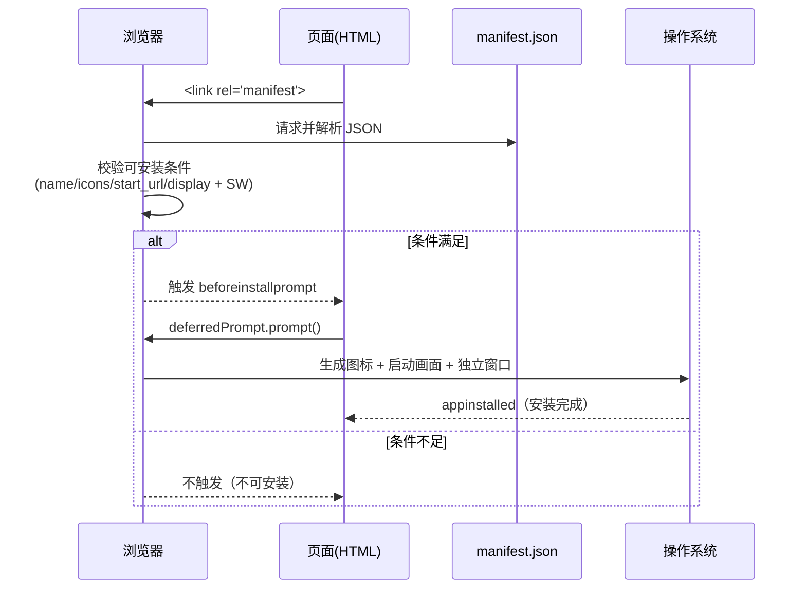

# 02 · Web 应用清单（Web App Manifest）

> `manifest.json` 是一份描述 PWA 的 JSON 文件；浏览器读它来决定应用的**名称、图标、启动方式、窗口模式与配色**，并据此把网页**安装**到桌面 / 主屏。

## 📖 知识讲解

Web App Manifest 用一行 `<link rel="manifest" href="./manifest.json">` 关联到页面。它是 PWA "可安装"的**必要条件**——浏览器根据其中字段生成安装弹窗、启动画面与桌面图标。

核心字段（对照 MDN）：

| 字段 | 作用 | 备注 |
|------|------|------|
| `name` / `short_name` | 完整名 / 短名 | short_name 显示在图标下方 |
| `start_url` | 从图标启动打开的 URL | 常带 `?source=pwa` 便于统计 |
| `scope` | 应用受控 URL 范围 | 超出 scope 的链接在浏览器打开 |
| `display` | 窗口模式 | `standalone`（独立窗口，最常用）/ `fullscreen` / `minimal-ui` / `browser` |
| `theme_color` | 标题栏/地址栏配色 | 与 `<meta name="theme-color">` 呼应 |
| `background_color` | 启动画面背景色 | 资源加载完成前显示 |
| `icons` | 各尺寸图标数组 | **需含 192px 与 512px**；`purpose:"maskable"` 供 Android 自适应裁切 |
| `orientation` | 锁定屏幕方向 | `portrait` / `landscape` |
| `shortcuts` | 长按图标的快捷菜单 | 每项含 name / url / icons |
| `id` | 应用唯一标识 | 决定"同一个应用"的身份，升级不换 id |

**安装到桌面的前提（Chrome 可安装条件）**：① 有效 manifest（含 `name`/`short_name`、合规 `icons`、`start_url`、`display` 非 `browser`）；② 注册了带 `fetch` 处理的 Service Worker；③ HTTPS / localhost 提供。满足后浏览器触发 `beforeinstallprompt` 事件。

## 🔄 流程图 / 原理图



## 💻 代码说明

- **`manifest.json`**：本 demo 演示了 `id`、`scope`、`orientation`、`categories`、`shortcuts` 等进阶字段；`icons` 同时提供 `any` 与 `maskable` 两种 `purpose`。
- **`index.html`**：
  - `fetch('./manifest.json')` 读取并在页面上**可视化**各字段（名字、display、主题色、完整 JSON dump），便于对照理解。
  - 监听 `beforeinstallprompt` → 启用「安装」按钮 → `prompt()` 弹出系统对话框 → `appinstalled` 确认。
- **`sw.js`**：极简 SW，仅为满足"注册了带 fetch 的 Service Worker"这一可安装条件。

## ▶️ 运行方式

```bash
# 本模块目录下启动本地服务器
npx serve            # 或
python3 -m http.server 8080
```

访问 `http://localhost:xxxx/`，然后：
1. 页面顶部预览安装后的名字/图标/配色；
2. 打开 **DevTools → Application → Manifest**，查看解析结果与"Installability"检查；
3. 满足条件后点击「安装应用」。

## ⚠️ 常见坑 / 最佳实践

- `icons` 缺少 512px、或没有 `start_url`、或 `display` 为 `browser` → **不可安装**，`beforeinstallprompt` 不触发。
- `scope` 要覆盖 `start_url`；`start_url` 超出 `scope` 会被浏览器拒绝。
- iOS Safari 不支持 `beforeinstallprompt`，用户通过「分享 → 添加到主屏幕」安装；可另配 `apple-touch-icon` 等 meta 兜底。
- `theme_color` 建议与 HTML 中 `<meta name="theme-color">` 保持一致。
- `maskable` 图标内容要留**安全边距**（约 20%），否则被裁切。

## 🔗 官方文档

- MDN · Web app manifest：<https://developer.mozilla.org/en-US/docs/Web/Manifest>
- MDN · 让 PWA 可安装：<https://developer.mozilla.org/en-US/docs/Web/Progressive_web_apps/Guides/Making_PWAs_installable>
- web.dev · Add a web app manifest：<https://web.dev/articles/add-manifest>
