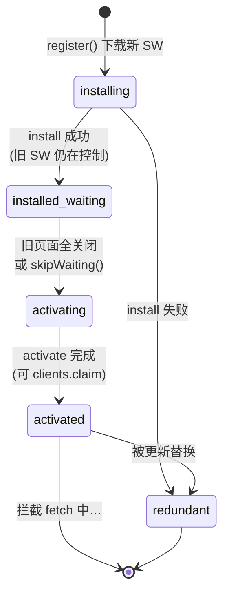
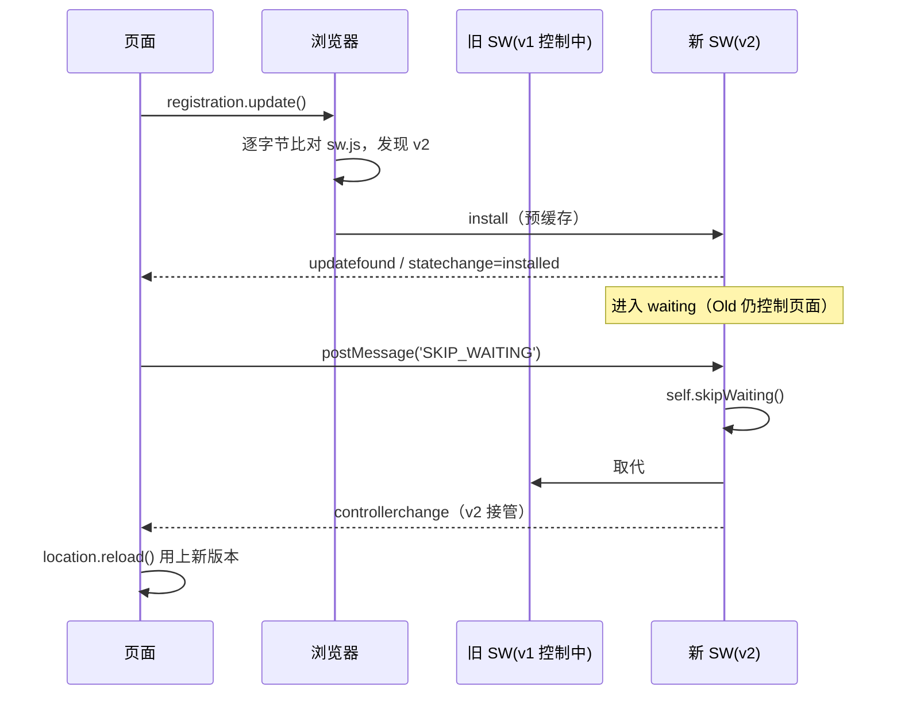

# 03 · Service Worker 生命周期（Service Worker Lifecycle）

> Service Worker 有一套独立于页面的生命周期：`install → (waiting) → activate → 控制页面`。理解它，才能搞清「为什么改了 SW 页面却不更新」「什么时候能安全清缓存」。

## 📖 知识讲解

Service Worker（下称 SW）是运行在**独立线程**、**无 DOM**、**事件驱动**的脚本，只在安全上下文（HTTPS / `localhost`）可用。它的生命周期被浏览器严格管控，核心目标是：**保证同一时刻只有一个 SW 版本在控制页面**，从而避免新旧代码/缓存打架。

关键阶段（对照 MDN Service Worker API）：

| 阶段 | 触发时机 | 典型工作 | 关键 API |
|------|---------|---------|---------|
| **installing** | `register()` 后浏览器下载并解析新 SW | 预缓存 App Shell | `install` 事件 + `event.waitUntil()` |
| **installed / waiting** | install 成功，但**旧 SW 仍在控制页面** | 等待所有旧页面关闭 | `self.skipWaiting()` 可跳过 |
| **activating** | 旧 SW 退出、新 SW 接管前 | 清理旧缓存 | `activate` 事件 + `clients.claim()` |
| **activated** | 激活完成，开始拦截 `fetch` | 处理请求 | `fetch` 事件 |
| **redundant** | 被更新替换或安装失败 | 无 | — |

几个**必须记住的机制**：

- **默认不抢占**：新 SW 装好后进入 `waiting`，要等**所有**受该 SW 控制的标签页都关闭，才会 activate。这就是「改了 SW 刷新却没生效」的根因。
- **`skipWaiting()`**：在 `install` 里或收到消息时调用，让新 SW **跳过 waiting 直接激活**。
- **`clients.claim()`**：在 `activate` 里调用，让**当前已打开、尚未受控**的页面立即被新 SW 接管（否则页面首次打开时不受任何 SW 控制）。
- **`updatefound` / `statechange` / `controllerchange`**：页面侧用来观察更新、以及在控制权切换后**自动刷新**。
- **浏览器如何发现更新**：导航或每约 24h、以及调用 `registration.update()` 时，会**逐字节比对** `sw.js`；只要有差异就下载新版本进入生命周期。

## 🔄 流程图 / 原理图



更新时的「双版本并存」时序：



## 💻 代码说明

- **`sw.js`**：用一个 `VERSION` 常量标识版本；`install/activate/fetch/message` 四个事件里都 `postMessage` 一条日志给页面。特意**没有**在 install 里默认调用 `skipWaiting()`，好让你亲眼看到 `waiting` 阶段。
- **`index.html`**：
  - `navigator.serviceWorker.addEventListener('message')` 接收 SW 推送的生命周期日志并点亮状态条。
  - `reg.addEventListener('updatefound')` + `installing.onstatechange` 观察新 SW 的安装过程。
  - `navigator.serviceWorker.oncontrollerchange` → 新 SW 接管后**自动 `location.reload()`**，这是生产环境常见的「无缝更新」套路。
  - 「跳过等待」按钮向 waiting 中的 SW 发 `SKIP_WAITING` 消息触发 `skipWaiting()`。

## ▶️ 运行方式

```bash
# 本模块目录下启动本地服务器（不能用 file://）
npx serve            # 或
python3 -m http.server 8080
```

1. 打开页面，观察日志从 `install → waiting/activate → fetch` 依次出现；
2. **体验更新**：编辑 `sw.js`，把 `VERSION = 'v1'` 改成 `'v2'` 保存，回到页面点「检查更新」；
3. 新版本进入 **waiting** 后点「跳过等待」，页面会在 `controllerchange` 后自动刷新到 v2；
4. 也可在 DevTools → Application → Service Workers 勾选 **Update on reload** / **Bypass for network** 辅助调试。

## ⚠️ 常见坑 / 最佳实践

- 「改了 SW 不生效」= 新版卡在 **waiting**。开发时用 DevTools 的 *Update on reload*，或在 install 里 `skipWaiting()`。
- 生产环境**不要盲目 `skipWaiting()`**：正在运行的旧页面可能引用旧资源，突然换新会导致资源不匹配报错。稳妥做法是**提示用户「有新版本，点击刷新」**再切换。
- `clients.claim()` 让首屏也能立刻受控，但要注意首访页面在 claim 前发出的请求不会经过 SW。
- 浏览器对 `sw.js` 默认走 HTTP 缓存会拖慢更新——给 `sw.js` 设置 `Cache-Control: no-cache`（现代浏览器已默认对 SW 脚本 max-age 上限 24h）。
- SW 作用域受**脚本所在路径**限制：放根目录才能控制整站；放子目录只能控制该子目录。

## 🔗 官方文档

- MDN · Service Worker API：<https://developer.mozilla.org/zh-CN/docs/Web/API/Service_Worker_API>
- MDN · 使用 Service Worker：<https://developer.mozilla.org/zh-CN/docs/Web/API/Service_Worker_API/Using_Service_Workers>
- web.dev · The service worker lifecycle：<https://web.dev/articles/service-worker-lifecycle>
