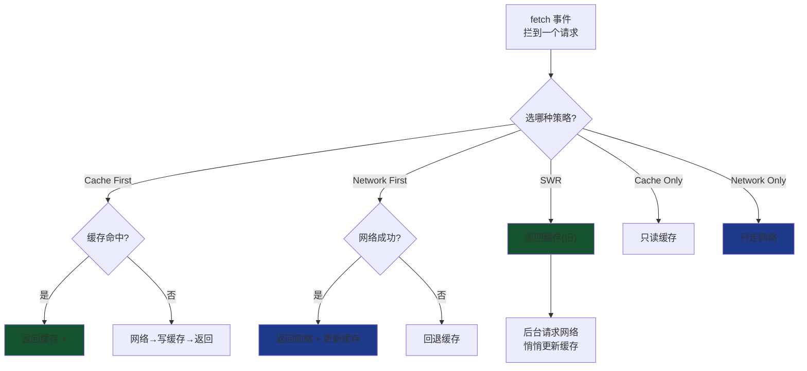
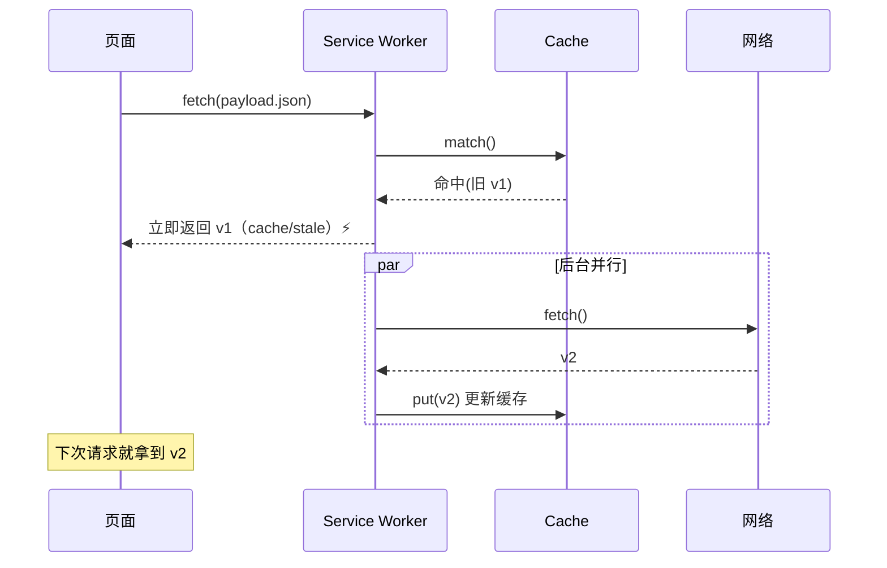

# 04 · 缓存策略（Caching Strategies）

> 在 Service Worker 的 `fetch` 事件里，你要为每类请求回答同一个问题：**「先看缓存还是先走网络？要不要写缓存？离线怎么办？」** 五种经典组合覆盖了绝大多数场景。

## 📖 知识讲解

SW 是**可编程网络代理**：`fetch` 事件把页面发出的每个请求交给你，用 `event.respondWith(aResponse)` 决定返回什么。缓存读写靠 **Cache API**（`caches.open` / `cache.match` / `cache.put` / `cache.addAll`）。策略就是「缓存 × 网络」的不同排列：

| 策略 | 逻辑 | 优点 | 缺点 | 适用 |
|------|------|------|------|------|
| **Cache First**（缓存优先） | 命中缓存直接返回；未命中走网络并回填 | 最快、可离线 | 可能拿到旧内容 | 带 hash 的静态资源、字体、图片、App Shell |
| **Network First**（网络优先） | 先网络（并更新缓存），失败回退缓存 | 内容新鲜、离线兜底 | 网络慢时首字节慢 | 文章、时效性 API、用户数据 |
| **Stale-While-Revalidate** | 立即返回缓存（旧），后台请求网络更新缓存 | 又快又逐渐新 | 首次仍需网络；本次看到的是旧值 | 头像、列表、非关键数据 |
| **Cache Only**（仅缓存） | 只读缓存，从不联网 | 极快、纯离线 | 未预缓存则失败 | 预缓存后的离线 Shell |
| **Network Only**（仅网络） | 只走网络，不碰缓存 | 永远最新 | 离线即失败 | 统计上报、非幂等 POST、支付 |

**心智模型**：Cache First 与 Network First 是「谁优先」的两端；SWR 是二者的折中（返回快 + 后台更新）；Cache Only / Network Only 是两个极端。真实站点通常**按资源类型混用**：HTML 用 Network First、静态资源用 Cache First、API 用 SWR。

## 🔄 流程图 / 原理图



SWR「先快后新」的时序：



## 💻 代码说明

- **`sw.js`** 把五种策略各实现为一个函数，`fetch` 事件读取 URL 上的 `?strategy=` 参数分发；每个响应经 `tag()` 加上自定义头 `X-Cache-Source: cache|network|...`，让页面能判断来源。
  - `cacheFirst`：`cache.match` → 命中即返回，否则 `fetch` + `cache.put`。
  - `networkFirst`：`try fetch/put` → `catch` 回退 `cache.match`。
  - `staleWhileRevalidate`：有缓存就先返回，**同时**发起 `fetch().then(put)` 在后台更新（不 `await`）。
  - `cacheOnly` / `networkOnly`：只走一边，另一边失败返回 504。
- **`index.html`** 为每种策略生成一张卡片，点击时 `fetch('./payload.json?strategy=xxx')`，展示来源徽章 + 耗时 + 数据 `version`。
- App Shell（页面本身与图标）用 Cache First 预缓存，保证**离线也能打开这个演示页**。

## ▶️ 运行方式

```bash
npx serve            # 或 python3 -m http.server 8080
```

1. 各策略先点一次（写入缓存），观察来源多为 `network`、耗时较大；
2. 再点一次，Cache First / SWR / Cache Only 变 `cache`、耗时骤降；
3. DevTools → Network 勾 **Offline** 后重点：Cache First / Cache Only / Network First（回退）仍可用，Network Only 失败；
4. 改 `payload.json` 的 `version` 观察 SWR 的「先旧后新」。

## ⚠️ 常见坑 / 最佳实践

- **Cache API 的 key 默认含查询串**：`a.json?x=1` 与 `a.json?x=2` 是两条缓存。本 demo 正是靠 `?strategy=` 让各策略互不干扰；生产中要用 `ignoreSearch: true` 或规范化 URL 避免缓存爆炸。
- `cache.put(req, res)` 后 **res 的 body 已被消费**，所以必须 `res.clone()` 一份再返回。
- Cache First 若缓存了**不带版本 hash** 的文件会「永远旧」。正确做法：文件名带内容 hash（`app.abc123.js`），或对 HTML 用 Network First。
- 不要缓存 `POST`、`chrome-extension://`、`Range` 请求；`Response` 状态非 200（如 opaque 跨域、206）要谨慎缓存。
- 生产建议用 **Workbox** 声明式配置这些策略（`registerRoute` + `CacheFirst` 等），少写样板、自带缓存过期与容量控制。

## 🔗 官方文档

- MDN · Cache API：<https://developer.mozilla.org/zh-CN/docs/Web/API/Cache>
- web.dev · The Offline Cookbook（缓存策略大全）：<https://web.dev/articles/offline-cookbook>
- Workbox · Caching strategies：<https://developer.chrome.com/docs/workbox/modules/workbox-strategies>
