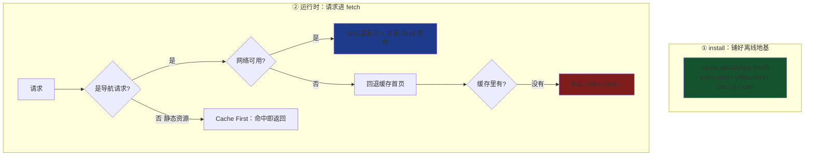
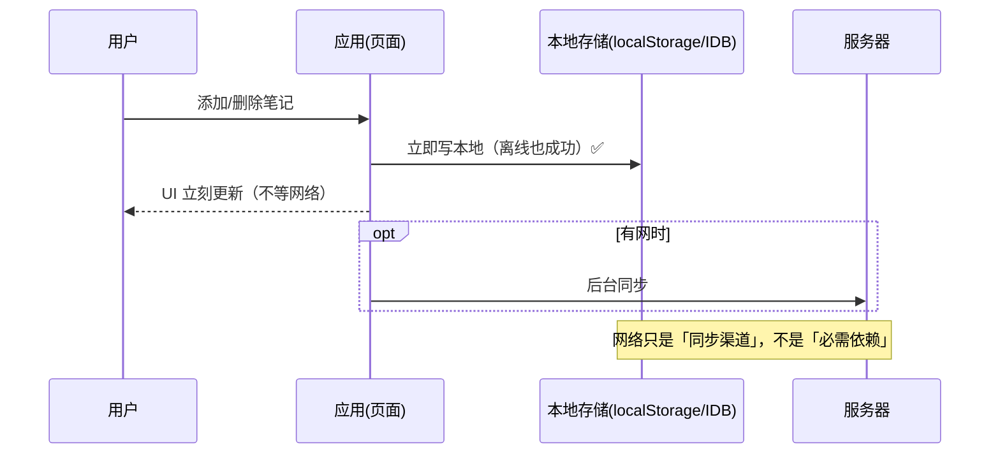

# 05 · 离线优先应用（Offline App）

> 把「离线」当默认状态而非异常：应用先依赖**本地的一份可用副本**渲染与运行，网络只用来同步更新。这就是 **App Shell + 离线优先** 架构。

## 📖 知识讲解

**离线优先（Offline-First）** 的核心思想：不要假设网络永远在。页面加载、交互、数据读写都应先走本地，网络作为「增强」。落地靠三块拼图：

1. **App Shell 模型**：把应用的**静态骨架**（HTML 结构、CSS、JS、图标 Logo）与**动态内容**分离。骨架在 `install` 阶段一次性预缓存，之后每次打开都从缓存秒开，内容再按需填充。
2. **导航请求兜底**：用户刷新或打开页面时发出 `mode === 'navigate'` 的请求。断网时若直接失败，浏览器显示「无法访问」的恐龙页。SW 拦截它，回退到缓存的首页，或一张友好的 `offline.html`。
3. **本地数据持久化**：用户产生的数据存 `localStorage` / **IndexedDB**，离线也能增删改查；有网时再同步到服务器（配合模块 06 的 Background Sync）。

对照 web.dev 的建议：**HTML 导航用 Network First（新鲜 + 离线兜底），静态资源用 Cache First（秒开）**——本 demo 正是这样组合。

判断可离线的关键 API：`navigator.onLine` + `online` / `offline` 事件（只反映「有没有连上网卡」，不保证能到达服务器，仅作 UI 提示）。

## 🔄 流程图 / 原理图



离线优先的数据流（本地为真源）：



## 💻 代码说明

- **`sw.js`**：
  - `install` 里 `cache.addAll(SHELL)` 预缓存 App Shell（含 `offline.html`）。
  - `fetch` 里区分：`req.mode === 'navigate'`（导航）走 **Network First**，`fetch` 失败时 `caches.match('./index.html')`，再退 `offline.html`；其它资源走 **Cache First** 并回填。
  - `activate` 里按 `VERSION` 清理旧缓存。
- **`index.html`**：一个笔记应用，数据存 `localStorage`——**先写本地、UI 立即更新**，不依赖网络。顶部离线横幅监听 `online/offline` 事件，仅作提示、不阻断功能。
- **`offline.html`**：当导航到未缓存页面且断网时展示的友好兜底页（对比浏览器默认恐龙页）。

## ▶️ 运行方式

```bash
npx serve            # 或 python3 -m http.server 8080
```

1. 打开页面，添加几条笔记；
2. DevTools → Network 勾 **Offline**，**刷新页面**——页面照常打开（导航回退缓存），还能继续增删；
3. 地址栏访问一个未缓存路径（如 `.../nope`）验证 `offline.html` 兜底；
4. DevTools → Application → Cache Storage 里能看到预缓存的 App Shell。

## ⚠️ 常见坑 / 最佳实践

- **别把 HTML 用 Cache First 永久缓存**，否则用户永远看不到新版页面。HTML 用 Network First 或 SWR，静态资源（带 hash）才用 Cache First。
- `navigator.onLine === true` **不代表能连上你的服务器**（可能连了 WiFi 但无外网）。真正判断要靠 `fetch` 是否成功。
- 大量/敏感数据用 **IndexedDB** 而非 `localStorage`（后者同步阻塞、约 5MB 上限、只能存字符串）。
- 预缓存清单要随构建产物更新（文件名 hash 变了要重新缓存），生产用 Workbox 的 `precacheAndRoute(self.__WB_MANIFEST)` 自动生成。
- 离线兜底页要**自包含**（内联 CSS、不引外部资源），否则它自己也加载失败。

## 🔗 官方文档

- MDN · 离线与后台操作：<https://developer.mozilla.org/zh-CN/docs/Web/Progressive_web_apps/Guides/Offline_and_background_operation>
- web.dev · The App Shell model：<https://web.dev/articles/app-shell>
- web.dev · Create an offline fallback page：<https://web.dev/articles/offline-fallback-page>
