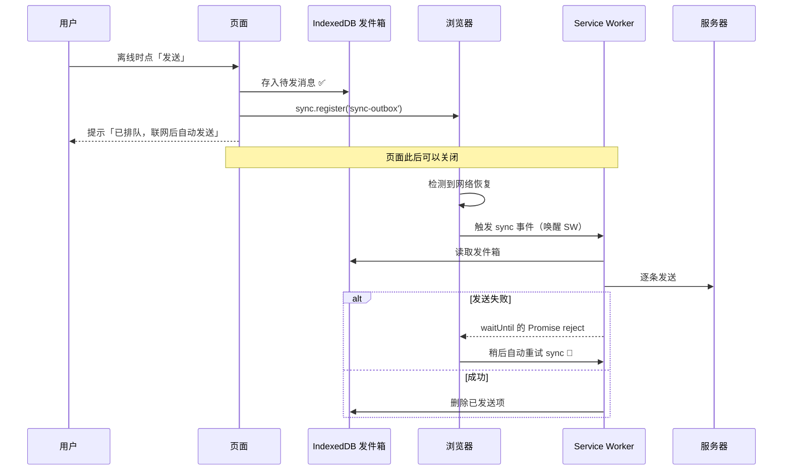
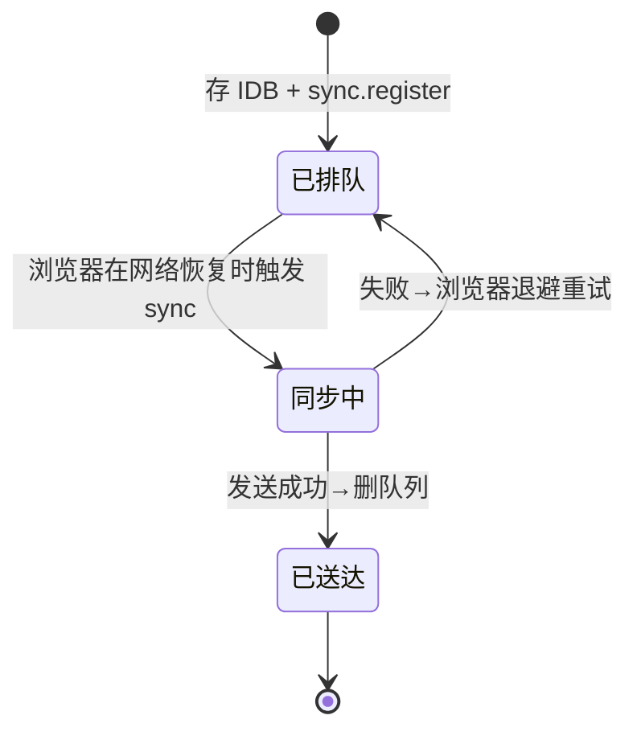

# 06 · 后台同步（Background Sync）

> 用户在离线时点了「发送」，怎么保证这条数据最终一定送达、又不让用户干等？**Background Sync**：把任务排队，交给浏览器在**网络恢复时**（哪怕页面已关）自动重试。

## 📖 知识讲解

普通网页里，离线时的请求会直接失败，只能提示「发送失败请重试」。**Background Sync API** 把「等网络 + 重试」的责任从页面转交给**浏览器 + Service Worker**：

1. 页面把待发数据存进**持久化队列**（IndexedDB，因为 SW 里用不了 `localStorage`）。
2. 页面调用 `registration.sync.register('tag')` 登记一个一次性同步任务。
3. 浏览器在**检测到连接可用**时触发 SW 的 `sync` 事件——**即使触发时页面已经关闭**，SW 也会被唤醒。
4. SW 在 `sync` 事件里 `event.waitUntil(flush())` 真正发送队列。**若 `flush()` 的 Promise reject（例如服务器仍不可达），浏览器会按退避策略自动重试**这个 sync，直到成功或放弃。

两种形态（对照 MDN）：

| API | 触发 | 用途 |
|-----|------|------|
| **Background Sync**（一次性） | 网络恢复后一次 | 补发离线期间的写操作（发消息、点赞、上传） |
| **Periodic Background Sync**（周期性） | 按注册的最小间隔、且设备条件满足 | 后台定期刷新内容（新闻预取、离线缓存更新）；需已安装 PWA + 权限 |

要点：`sync` 事件是**尽力而为**的保证——由浏览器决定何时触发（考虑省电、网络质量）；`tag` 相同的重复 `register` 会合并成一个。它只在**安全上下文**可用，且需 SW 已注册。

## 🔄 流程图 / 原理图





## 💻 代码说明

- **`idb.js`**：页面与 SW **共用**的极简 IndexedDB 封装（`idbAdd/idbGetAll/idbDelete`）。SW 里通过 `importScripts('./idb.js')` 引入。
- **`sw.js`**：
  - `self.addEventListener('sync', ...)` 判断 `event.tag === 'sync-outbox'`，`event.waitUntil(flushOutbox())`。
  - `flushOutbox()` 读发件箱、逐条「发送」（demo 用 `setTimeout` 模拟网络往返，生产换成 `fetch(POST)`）、删除已发送项，并 `postMessage` 进度给页面。
  - 提供 `message` 事件的 `manual-flush` 作为**不支持 Background Sync 时的降级**。
- **`index.html`**：提交时先 `idbAdd` 落地，再 `reg.sync.register('sync-outbox')`；监听 SW 广播刷新发件箱与日志；不支持 `sync` 时监听 `online` 事件手动触发 flush。

## ▶️ 运行方式

```bash
npx serve            # 或 python3 -m http.server 8080
```

1. 打开页面（Chrome/Edge 支持 Background Sync）；
2. DevTools → Network 勾 **Offline**，发送几条消息 → 进入「发件箱」；
3. **取消 Offline** 恢复网络 → 发件箱被后台自动清空，日志显示逐条「已发送」；
4. 也可在 DevTools → Application → **Background Sync** 面板点击手动派发 `sync-outbox` 事件观察。

## ⚠️ 常见坑 / 最佳实践

- **队列必须放持久化存储**（IndexedDB）。放内存或 `localStorage` 都不行：SW 唤醒时页面可能已关，`localStorage` 在 SW 上下文不可访问。
- `sync` 事件的处理要**幂等**：浏览器可能重试，发送前后要能容忍「重复发送/部分发送」，服务端最好用请求 id 去重。
- **不保证即时**：浏览器会挑时机（省电、网络好）触发，不能拿它做实时。要实时用 WebSocket。
- 兼容性：Background Sync 主要是 Chromium 系（Chrome/Edge/Android）；Safari/Firefox 尚不支持——**务必写降级**（在线直接发、或 `online` 事件补发）。
- Periodic Background Sync 需要 PWA **已安装** + 用户信任度（site engagement），且有最小间隔限制，别指望精确定时。

## 🔗 官方文档

- MDN · Background Synchronization API：<https://developer.mozilla.org/en-US/docs/Web/API/Background_Synchronization_API>
- web.dev · Background Sync：<https://web.dev/articles/background-sync>
- web.dev · Periodic Background Sync：<https://web.dev/articles/periodic-background-sync>
