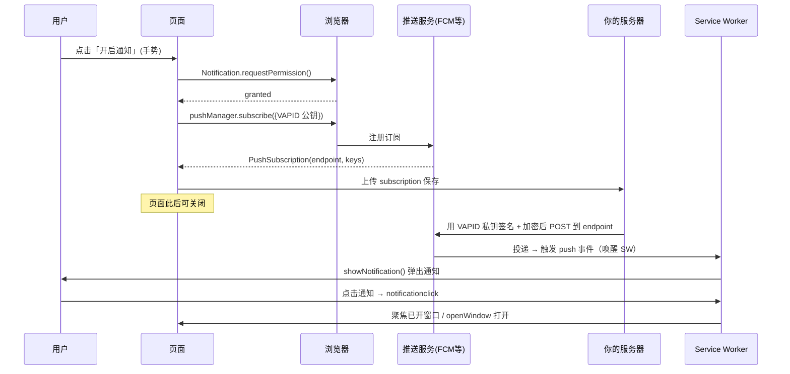
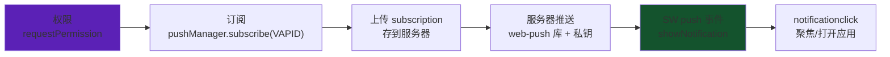

# 07 · 推送通知（Push Notification）

> 让网站像原生 App 一样，在**页面关闭、浏览器最小化**时也能把消息推送到用户设备。它由两套 API 协作：**Notifications API**（显示通知）+ **Push API**（后台接收推送）。

## 📖 知识讲解

先分清两个常被混淆的概念：

- **Notifications API**：负责**显示**一条系统通知（`Notification` / `registration.showNotification()`）。可以纯本地使用，不需要服务器。
- **Push API**：负责在**后台接收**来自服务器的推送消息（`PushManager.subscribe()` + SW 的 `push` 事件）。它才是「关掉页面也能收到」的关键。

完整 Web Push 链路涉及四方：

| 角色 | 职责 |
|------|------|
| **浏览器 / 页面** | 请求权限、`pushManager.subscribe()` 拿到订阅、把订阅发给你的服务器 |
| **推送服务（Push Service）** | 浏览器厂商提供的中转（Chrome=FCM、Firefox=Mozilla）；endpoint 就指向它 |
| **你的应用服务器** | 保存订阅；要推送时用 **VAPID 私钥**签名，向 endpoint 发加密消息 |
| **Service Worker** | 收到推送 → `push` 事件 → `showNotification`；点击 → `notificationclick` |

**VAPID**（Voluntary Application Server Identification）：一对公私钥。公钥作为 `applicationServerKey` 传给 `subscribe()`，私钥留服务器用来签名，证明「这条推送确实来自你」。

三个权限/前提：① 安全上下文（HTTPS/localhost）；② 用户**手势**触发的 `Notification.requestPermission()`；③ 已注册 SW。`subscribe` 时 `userVisibleOnly: true` 是**强制**的——承诺每次推送都给用户可见的通知，防止「静默追踪」。

## 🔄 流程图 / 原理图





## 💻 代码说明

- **`index.html`** 按四步组织：
  1. `Notification.requestPermission()` 请求授权（必须在点击回调里）。
  2. `registration.showNotification()` 弹**本地**通知（无需服务器，验证展示/点击）。
  3. `pushManager.subscribe({ userVisibleOnly:true, applicationServerKey })`，`urlB64ToUint8Array` 把 VAPID 公钥转成所需的 `Uint8Array`；订阅成功后展示 `subscription.toJSON()`（endpoint + keys）。
  4. 说明如何用 DevTools 手动派发 `push` 事件测试。
- **`sw.js`**：
  - `push` 事件：解析负载（JSON/文本/空），`event.waitUntil(showNotification(...))`，带 `actions` 按钮、`tag`（合并同类）、`data.url`（点击目标）。
  - `notificationclick`：`notification.close()`，遍历已有窗口 `focus()`，否则 `clients.openWindow()`——避免重复开标签。

## ▶️ 运行方式

```bash
npx serve            # 或 python3 -m http.server 8080
```

1. 点「请求授权」允许通知；
2. 点「弹出本地通知」，验证展示与点击（本地即可，无需服务器）；
3. 点「订阅推送」查看生成的 `PushSubscription`（需联网到浏览器推送服务）；
4. 测试后台推送：**DevTools → Application → Service Workers → Push** 输入框填文本点 **Push**，触发 `sw.js` 的 `push` 处理弹出通知；
5. 真实端到端推送需自建服务器，用 [`web-push`](https://github.com/web-push-libs/web-push) 库配 VAPID 私钥向 endpoint 发送。

## ⚠️ 常见坑 / 最佳实践

- **别一进页面就弹权限框**：转化率低还惹人烦，且没有用户手势会被拦截。应在用户明确想要通知时再请求，并先用 UI 解释价值。
- 用户**拒绝后无法再用代码弹出**，只能引导他去浏览器设置手动开启。
- iOS 上 Web Push 需 **iOS 16.4+ 且 PWA 已「添加到主屏幕」** 才可用。
- `userVisibleOnly: true` 是强制的；收到 push 却不 `showNotification`，浏览器会警告甚至撤销推送权限。
- 订阅可能**失效**（用户清数据、endpoint 过期）——服务器推送收到 `410 Gone` 要删除该订阅。
- 通知负载要经过端到端加密；自己实现繁琐，**务必用 `web-push` 等成熟库**。

## 🔗 官方文档

- MDN · Push API：<https://developer.mozilla.org/zh-CN/docs/Web/API/Push_API>
- MDN · Notifications API：<https://developer.mozilla.org/zh-CN/docs/Web/API/Notifications_API>
- web.dev · Push notifications overview：<https://web.dev/articles/push-notifications-overview>
