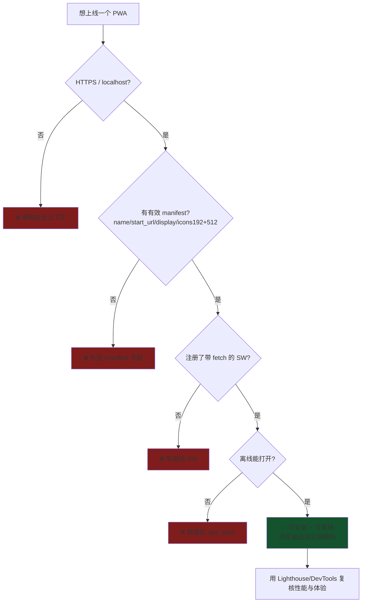
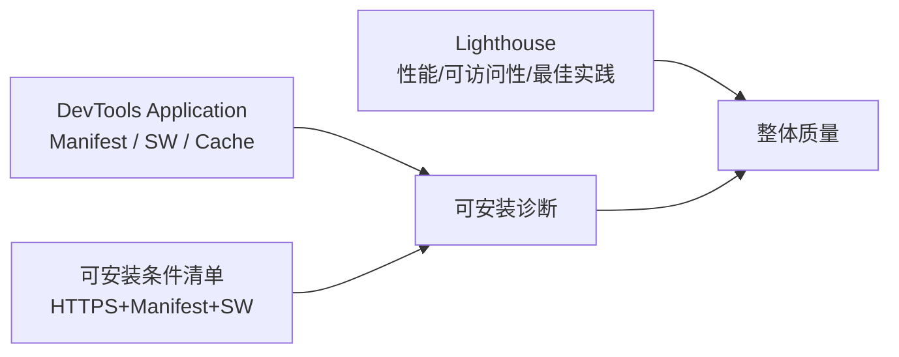

# 08 · PWA 质量审计（PWA Audit）

> 「我的站点算不算合格 PWA、能不能被安装、离线是否真的可用？」——用 **Lighthouse / Chrome DevTools** 审计，配合一份可安装条件清单逐项核对。

## 📖 知识讲解

审计 PWA 主要看两类指标：**能否安装（Installability）** 与 **离线是否可用**，外加通用的性能、可访问性、最佳实践。常用工具：

| 工具 | 位置 | 用途 |
|------|------|------|
| **Lighthouse** | DevTools → Lighthouse 面板 / `npx lighthouse <url>` / PageSpeed Insights | 自动化跑分与问题清单 |
| **Application 面板** | DevTools → Application → Manifest / Service Workers / Cache | 查看解析后的 manifest、Installability 诊断、SW 状态、缓存内容 |
| **Manifest 诊断** | Application → Manifest 顶部的 *Installability* | 直接列出「为什么不能安装」的原因 |

**可安装（Installable）的核心条件**（Chrome 判定，`beforeinstallprompt` 触发前提）：

1. 通过 **HTTPS**（或 `http://localhost`）提供；
2. 关联了有效 **Web App Manifest**：含 `name`/`short_name`、`start_url`、`display` 为 `standalone`/`fullscreen`/`minimal-ui`、`icons` 至少含 **192px 与 512px**；
3. 注册了带 **`fetch` 事件处理**的 Service Worker（提供离线能力）；
4. 图标可加载、`start_url` 在 `scope` 内。

> ⚠️ 关于 Lighthouse 的「PWA 分类」：Lighthouse **12 版起移除了独立的 PWA 评分类别**（原来那组 PWA 专项 audit）。如今「可安装性」主要通过 **Chrome DevTools 的 Application 面板**与浏览器地址栏的安装图标来判断，离线/性能等仍由 Lighthouse 其它类别覆盖。所以本模块强调「**按清单核对 + 用 Application 面板诊断**」，而不是盯着某个 PWA 分数。

本模块的 `index.html` 内置一个**教学版自检器**，用 JS 现场检查上述条件并给出通过率，帮助直观理解每一项。

## 🔄 流程图 / 原理图





## 💻 代码说明

`index.html` 的 `runAudit()` 逐项检查并渲染成得分卡：

- `window.isSecureContext` —— 是否安全上下文；
- `navigator.serviceWorker.getRegistration()` + `navigator.serviceWorker.controller` —— SW 是否注册并控制页面；
- `fetch(link[rel=manifest].href)` 解析 manifest，检查 `name/short_name`、`start_url`、`display`、`icons` 是否含 192/512 与 `maskable`；
- `meta[name=viewport]` / `meta[name=theme-color]`；
- `matchMedia('(display-mode: standalone)')` —— 判断当前是否以已安装形态运行。

得分环用 `conic-gradient` 按通过率着色。`sw.js` 是一个「合格」的最小 SW（预缓存 + `fetch` + 离线兜底），确保本页自身通过「可离线/可安装」项。

## ▶️ 运行方式

```bash
npx serve            # 或 python3 -m http.server 8080
```

1. 打开页面，查看自检得分与逐项 ✅/❌；
2. 跑正式审计：DevTools → **Lighthouse** → 勾选类别 → Analyze；命令行 `npx lighthouse http://localhost:xxxx --view`；
3. 排查安装问题：DevTools → **Application → Manifest**，看顶部 Installability 提示与解析结果；
4. 若满足条件，浏览器地址栏会出现「安装」图标，或触发 `beforeinstallprompt`。

## ⚠️ 常见坑 / 最佳实践

- 不再有「PWA 满分」这一说（Lighthouse 12 移除 PWA 类别）——**以 Application 面板的 Installability 与真实安装体验为准**。
- 最容易漏：**缺 512px 图标**、`display: browser`、SW 没有 `fetch` 处理 → 都会导致「不可安装」。
- `file://` 下所有检查必然失败；务必用 `localhost` 或 HTTPS。
- Lighthouse 建议用**无痕窗口/干净环境**跑，避免扩展与缓存干扰；性能分受机器负载影响，多跑几次取中位。
- 通过审计只是起点，还要关注**首屏性能（LCP/CLS/INP）** 与更新体验——这些才是用户实际感知。

## 🔗 官方文档

- web.dev · What makes a good PWA（可安装/离线标准）：<https://web.dev/articles/pwa-checklist>
- Chrome · Lighthouse 概览：<https://developer.chrome.com/docs/lighthouse/overview>
- MDN · 让 PWA 可安装：<https://developer.mozilla.org/zh-CN/docs/Web/Progressive_web_apps/Guides/Making_PWAs_installable>
