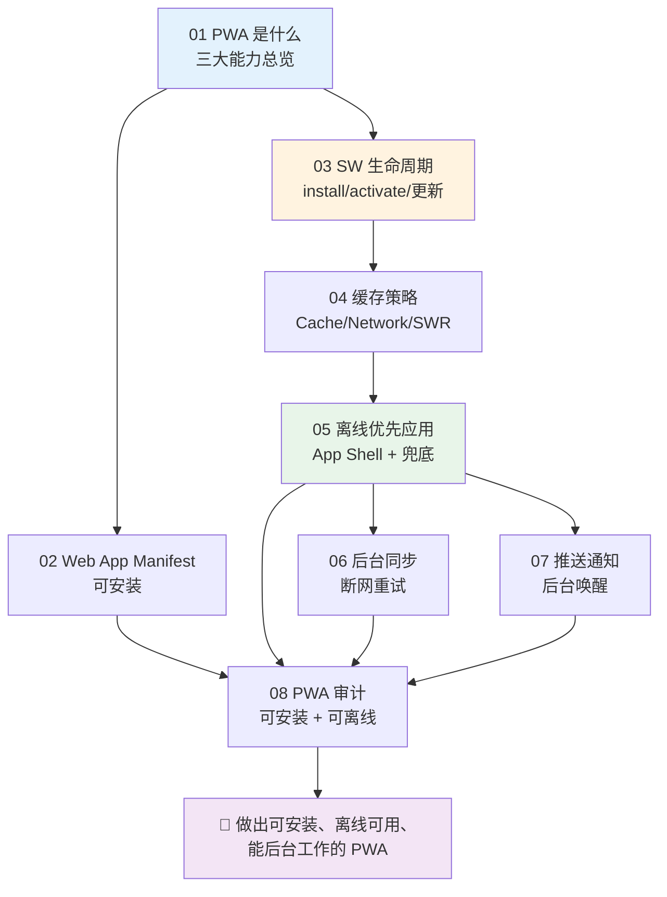
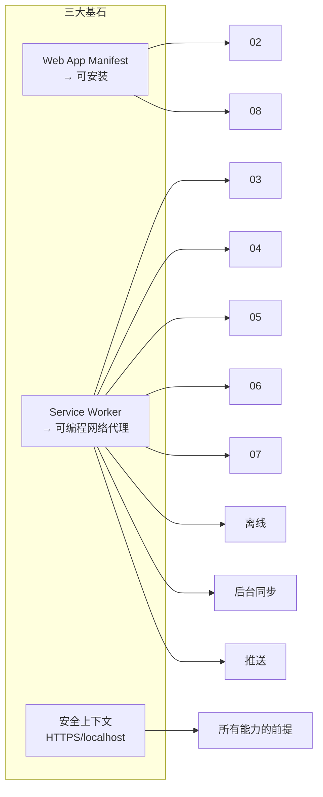

# 28 · 渐进式 Web 应用（PWA · Progressive Web Apps）

> 用一套 Web 代码，做出「可安装到桌面、断网也能用、能后台同步与推送」的应用。本工程属于**「框架/工程」类**：**可运行 demo 与原理文档并重**——每个模块都能在 `localhost` 直接打开体验，配套一篇《[原理详解.md](./原理详解.md)》把 **Service Worker 作为可编程网络代理**这条主线讲透。全部对照 MDN / web.dev 权威文档整理。

---

## 📚 模块索引

| 模块 | 知识点 | 核心内容 | 类型 |
| --- | --- | --- | --- |
| [01-what-is-pwa](./01-what-is-pwa/) | PWA 是什么 📊 | 可链接/可安装/可离线三大能力、渐进增强 | demo |
| [02-web-app-manifest](./02-web-app-manifest/) | Web App Manifest 📊 | manifest 字段、安装条件、beforeinstallprompt | demo |
| [03-service-worker-lifecycle](./03-service-worker-lifecycle/) | SW 生命周期 📊 | install/waiting/activate、skipWaiting、更新流程 | demo |
| [04-caching-strategies](./04-caching-strategies/) | 缓存策略 📊 | Cache/Network First、SWR、Cache/Network Only 选型 | demo |
| [05-offline-app](./05-offline-app/) | 离线优先应用 📊 | App Shell 模型、导航兜底、offline.html | demo |
| [06-background-sync](./06-background-sync/) | 后台同步 📊 | IndexedDB 发件箱、sync 事件、断网重试 | demo |
| [07-push-notification](./07-push-notification/) | 推送通知 📊 | Notifications + Push API、VAPID、push/notificationclick | demo |
| [08-pwa-audit](./08-pwa-audit/) | PWA 审计 📊 | Lighthouse/DevTools、可安装条件、页内自检 | demo |

📊 = 含重点原理图 / 时序图。**建议先跑通 01/02 建立直觉，再读 [原理详解.md](./原理详解.md) 建立体系，最后逐模块深入 03–08。**

---

## 🗺️ 学习路线



三大基石与模块的对应关系：



---

## ▶️ 运行说明

所有模块都是**免构建、纯静态**，浏览器直接打开即可——但 **Service Worker 必须在 `http://localhost` 或 HTTPS 下运行**，不能用 `file://`。

```bash
# 在某个模块目录下，或在 28-pwa 根目录，启动本地服务器（二选一）：
npx serve                     # 然后访问打印出的 http://localhost:xxxx
python3 -m http.server 8080   # 然后访问 http://localhost:8080
```

- 环境：任意现代 Chromium 浏览器（Chrome / Edge）体验最完整；调试主战场是 **DevTools → Application**（Manifest / Service Workers / Cache Storage / Background Sync）与 **Network（Offline 勾选）**。
- 不需要 `npm install`：本工程刻意零依赖，所有能力用浏览器原生 API 实现。
- 部分能力有兼容性差异：Background Sync / Periodic Sync 主要在 Chromium；iOS 的安装与推送需较新版本 + 已添加到主屏。各模块 README 的「常见坑」有说明。

| 模块 | 体验要点 |
| --- | --- |
| 01 / 02 | 观察安装条件、点安装到桌面 |
| 03 | 改 `sw.js` 的 VERSION 看更新流程（waiting → skipWaiting） |
| 04 | 各策略点两次 + 勾 Offline 对比来源 |
| 05 | 勾 Offline 后刷新仍可用、访问未缓存路径看 offline.html |
| 06 | Offline 下发消息入发件箱，恢复网络自动同步 |
| 07 | 授权 → 本地通知 → 订阅；DevTools 手动派发 push |
| 08 | 看页内自检得分，再跑 Lighthouse / Application 面板 |

---

## 📖 配套原理长文

👉 **[原理详解.md](./原理详解.md)** —— 本工程核心交付物。围绕「**Service Worker 是一个运行在浏览器里的可编程网络代理**」这一本质，串起：SW 生命周期与线程模型 → Cache API 与缓存策略选型 → App Shell 与离线优先架构 → Background Sync / Push 的后台唤醒机制 → 安装与更新体验，配 12+ 张 Mermaid 图、与「HTTP 缓存 / AppCache / 原生 App」的对比，以及常见误区。

---

> 📌 所有内容对照 [MDN · Progressive web apps](https://developer.mozilla.org/zh-CN/docs/Web/Progressive_web_apps)、[MDN · Service Worker API](https://developer.mozilla.org/zh-CN/docs/Web/API/Service_Worker_API)、[web.dev · Learn PWA](https://web.dev/learn/pwa) 等权威资料整理，各模块 README 末尾附具体链接。
