# PWA 原理详解 · Service Worker 作为「可编程网络代理」

> 本文是 28-pwa 工程的核心交付物。不讲「怎么调 API」，而是讲透 **why / how / 底层机制**：为什么 PWA 能离线、Service Worker 到底是什么、缓存策略如何选型、离线优先架构怎么搭、后台同步与推送靠什么在页面关闭后还能工作。配 12+ 张 Mermaid 图，并与相邻方案对比、点出常见误区。

## 目录

1. [一句话本质：PWA = Web + 一个可编程网络代理](#一)
2. [Service Worker 是什么：线程模型与安全约束](#二)
3. [生命周期：为什么「改了不生效」](#三)
4. [Cache API 与缓存策略选型](#四)
5. [离线优先架构：App Shell 模型](#五)
6. [后台能力：Background Sync 与 Push 的「唤醒」机制](#六)
7. [安装与更新：从网页到桌面应用](#七)
8. [与相邻方案对比](#八)
9. [常见误区速查](#九)
10. [权威文档索引](#十)

---

<a name="一"></a>
## 一、一句话本质：PWA = Web + 一个可编程网络代理

传统网页的请求链路是「页面 → 浏览器网络栈 → 服务器」，页面对这条链路**没有任何控制权**：断网就白屏，缓存全凭 HTTP 头和浏览器脸色。

PWA 做的事，本质上是**在页面和网络之间插入一段你自己写的 JavaScript**——这段代码就是 **Service Worker（SW）**。它像一个**代理服务器**，只不过运行在浏览器里、由前端工程师编程控制：

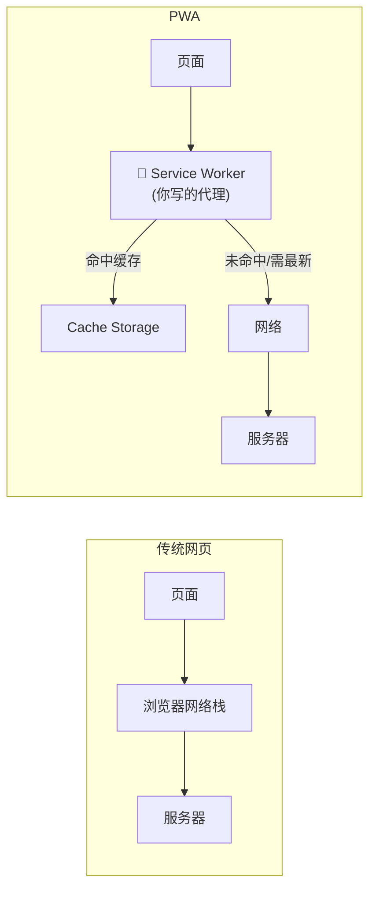

一旦你能拦截每一个请求、并拥有一块可编程的缓存（Cache API）与持久存储（IndexedDB），"离线可用、秒开、后台同步、推送"就都成了**这段代理代码的自然推论**。PWA 的三大能力因此可以这样归因：

| 能力 | 归因 |
| --- | --- |
| 可安装 | Web App Manifest 告诉浏览器「把我当应用」 |
| 可离线 / 秒开 | SW 拦截请求 + Cache API 返回本地副本 |
| 后台同步 / 推送 | SW 是**独立于页面的常驻脚本**，能被浏览器在页面关闭后唤醒 |

**记住这条主线**：本文后面所有机制，都是「一个可编程网络代理 + 一个能被后台唤醒的独立线程」这两点的展开。

---

<a name="二"></a>
## 二、Service Worker 是什么：线程模型与安全约束

SW 不是「跑在页面里的脚本」。它是一个 **Worker**——独立的 JavaScript 执行环境，有几条硬性特征，理解它们才不会踩坑：

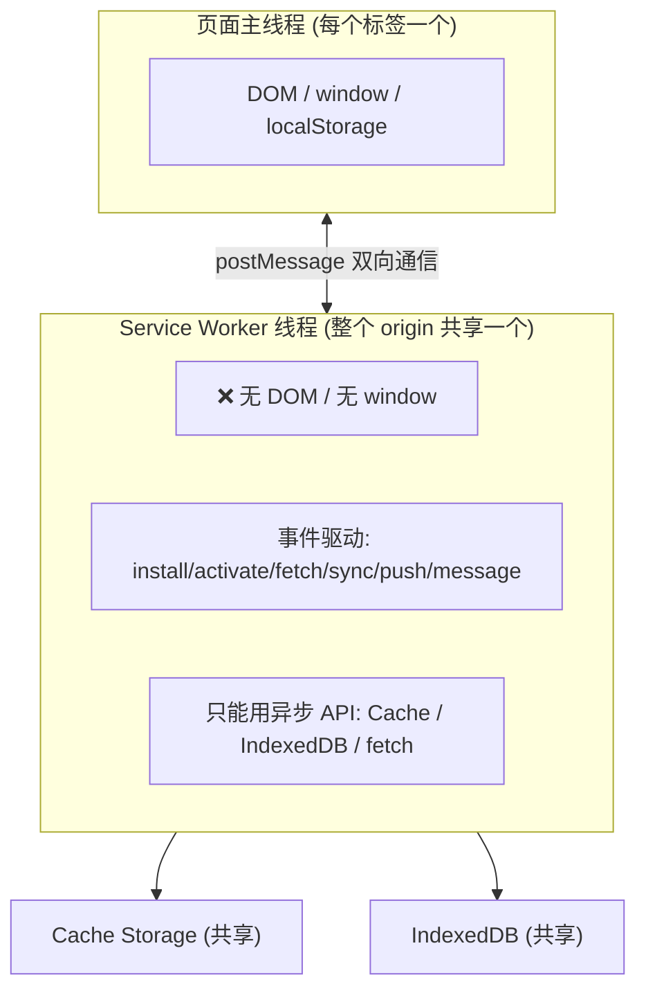

- **无 DOM、无 `window`**：SW 里不能碰页面元素，也用不了 `localStorage`（它是同步的、且绑在 window）。要持久化只能用**异步的 IndexedDB**。这就是模块 06 用 IndexedDB 存发件箱的原因。
- **事件驱动、随时被杀**：SW 不常驻内存。浏览器在没有事件时会**终止**它以省电,有事件（fetch/push/sync）时再**重新启动**。所以 SW 里**不能用全局变量存状态**——重启后就没了;状态要放 Cache / IndexedDB。
- **一个 origin 共享一个 SW**：它控制作用域（scope）内的**所有**标签页,天然适合做「全站统一的网络策略」。
- **只在安全上下文可用**：HTTPS 或 `http://localhost`。因为 SW 能拦截并伪造任意响应,若允许在 HTTP（可被中间人篡改）下运行,等于给攻击者发了一把「劫持整站」的钥匙。这是安全底线,不是浏览器故意刁难。
- **作用域受脚本路径限制**：`/sw.js` 能控制整站;`/app/sw.js` 只能控制 `/app/`。代理只能管它「站得住」的范围。

> 与页面通信靠 `postMessage`：页面 → SW 用 `registration.active.postMessage()`,SW → 页面用 `client.postMessage()`。模块 03/06/07 都用它把 SW 的后台动作「广播」回页面 UI。

---

<a name="三"></a>
## 三、生命周期：为什么「改了不生效」

SW 最反直觉的地方是它的**更新模型**。设计目标只有一个:**保证任一时刻只有一个版本在控制页面**,避免新旧代码/缓存打架导致「半新半旧」的诡异 bug。

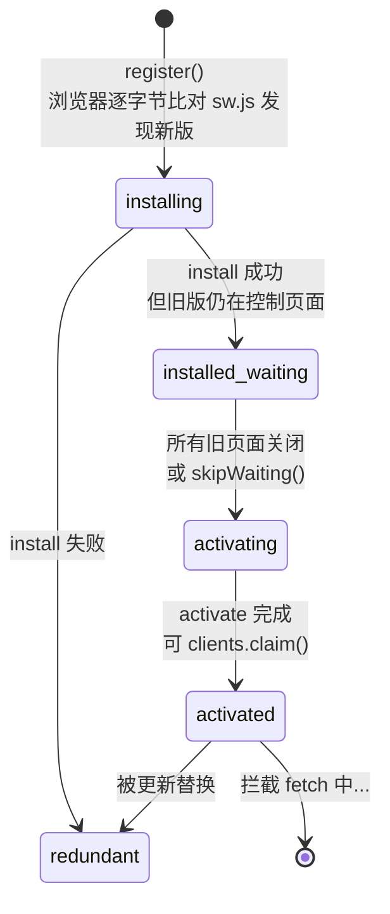

关键在 **waiting** 这一步:新 SW 装好后**不会立刻接管**,而是排队等待——直到所有由旧 SW 控制的标签页都关闭。这正是「我明明改了 `sw.js`,刷新却没变化」的根因:你的旧标签页还开着,新版卡在 waiting。

三个「打破默认」的开关:

| API | 作用 | 代价 |
| --- | --- | --- |
| `self.skipWaiting()` | 新 SW 跳过 waiting 立即激活 | 正在运行的旧页面可能引用旧资源→不匹配报错 |
| `self.clients.claim()` | 激活后立即接管**已打开**的页面 | 首屏在 claim 前发的请求不经过 SW |
| `registration.update()` | 手动检查更新 | — |

生产环境**推荐的无缝更新套路**(而非粗暴 skipWaiting):

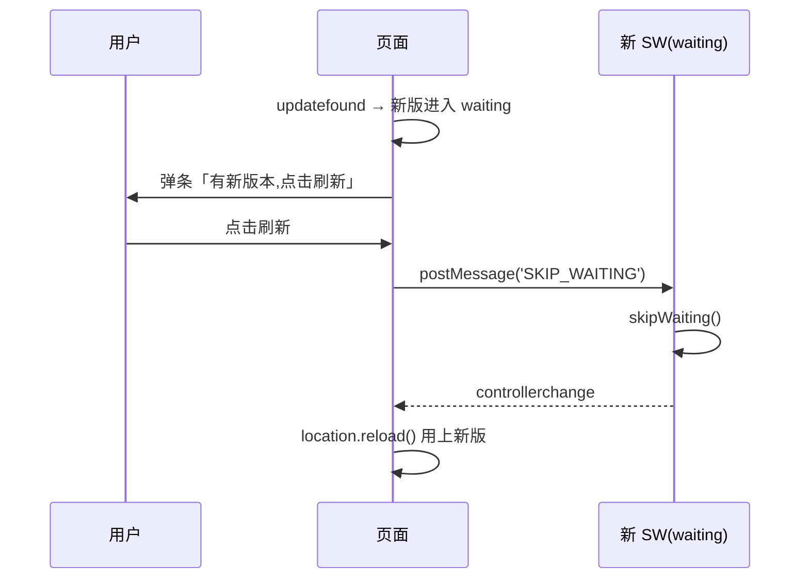

把「何时切新版」的决定权交给用户(或至少在安全时机),避免正在填表单的用户被资源不匹配搞崩。模块 03 完整演示了这套流程。

---

<a name="四"></a>
## 四、Cache API 与缓存策略选型

**Cache API ≠ HTTP 缓存**。HTTP 缓存由响应头(`Cache-Control`/`ETag`)驱动、浏览器自动管理、你无法编程干预命中逻辑;**Cache API 是一块你完全掌控的键值仓库**,key 是 `Request`、value 是 `Response`,存取全靠代码:

```js
const cache = await caches.open('v1');
await cache.addAll(['/','/app.js']);   // 写
const res = await cache.match(request); // 读
```

有了它,「先查缓存还是先走网络」就是你在 `fetch` 事件里的一行 `if`。五种经典策略本质是「缓存 × 网络」的排列:

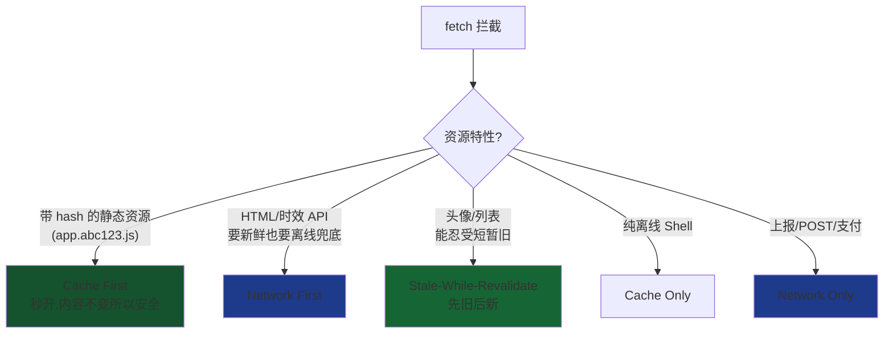

**选型心法**——问自己两个问题:

1. **这资源变不变?** 不变(带内容 hash)→ Cache First,永远秒开。会变 → 别用 Cache First,否则用户永远看旧的。
2. **旧内容能不能先顶一下?** 能忍受一瞬旧 → SWR(体验最好:快 + 逐渐新)。必须最新 → Network First。绝不能缓存(非幂等/隐私)→ Network Only。

真实站点是**分层混用**的:

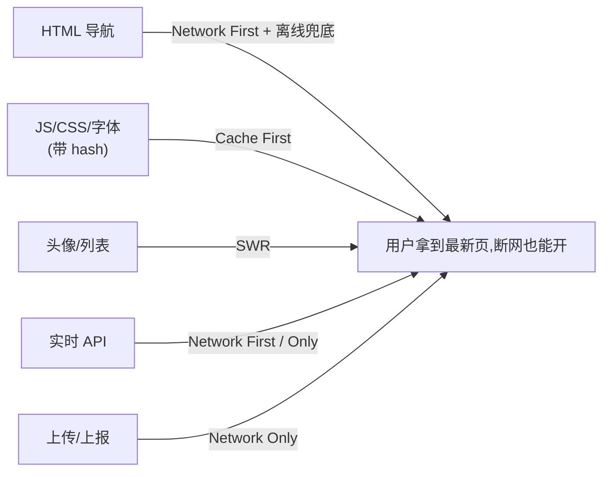

**易错点**:Cache API 的 key 默认**区分查询串**,`a.json?x=1` 和 `a.json?x=2` 是两条缓存,不留意会导致缓存爆炸;用 `cache.match(req, { ignoreSearch:true })` 或规范化 URL。另外 `cache.put(req, res)` 会消费 `res` 的 body,必须 `res.clone()`。模块 04 有五种策略的完整可跑实现。

---

<a name="五"></a>
## 五、离线优先架构:App Shell 模型

「离线优先(Offline-First)」是一种**架构立场**:不把网络当默认可用,而把**本地的一份副本当第一数据源**,网络只用来同步更新。落地的经典模式是 **App Shell**:

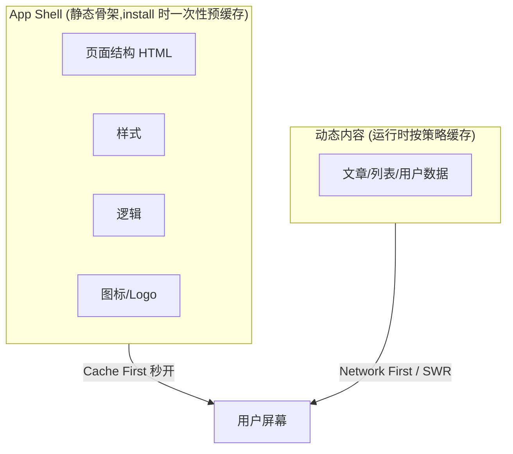

把「几乎不变的骨架」与「经常变的内容」分开,骨架预缓存后**每次打开都是本地秒开、离线也在**,内容再按需填充。这带来两条工程收益:首屏快(不等网络画骨架)、离线可用(骨架恒在)。

导航请求(打开/刷新页面)是离线体验的关键分叉点:

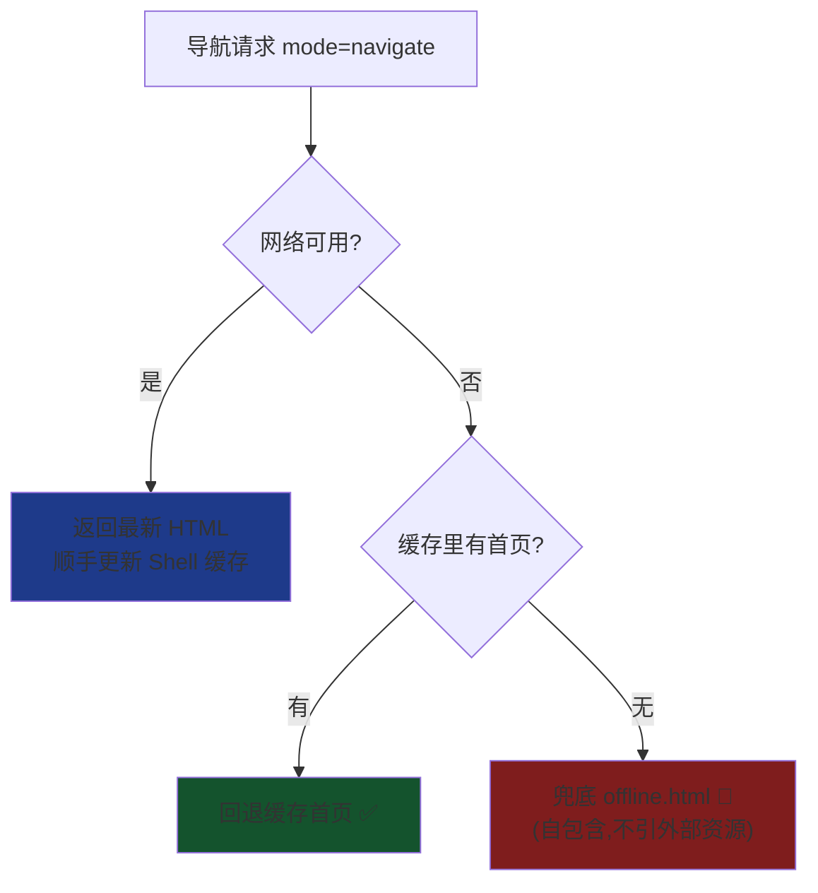

数据层同理——**先写本地,再谈同步**:

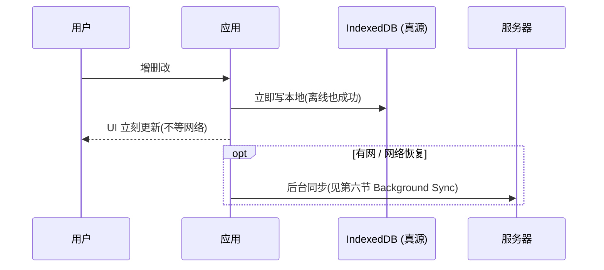

模块 05 是一个完整的离线笔记应用:App Shell 预缓存 + `localStorage` 本地数据 + `offline.html` 兜底,断网刷新照常可用。

---

<a name="六"></a>
## 六、后台能力:Background Sync 与 Push 的「唤醒」机制

前面说 SW 是「独立于页面的常驻脚本」。它真正的杀手锏在于:**页面关闭后,浏览器仍能在特定事件到来时把 SW 唤醒**。这让 Web 拥有了过去只有原生 App 才有的两种后台能力。

### 6.1 Background Sync:可靠的「离线补发」

问题:用户离线时点了「发送」,普通网页只能报错。Background Sync 把「等网络 + 重试」的责任转交给浏览器:

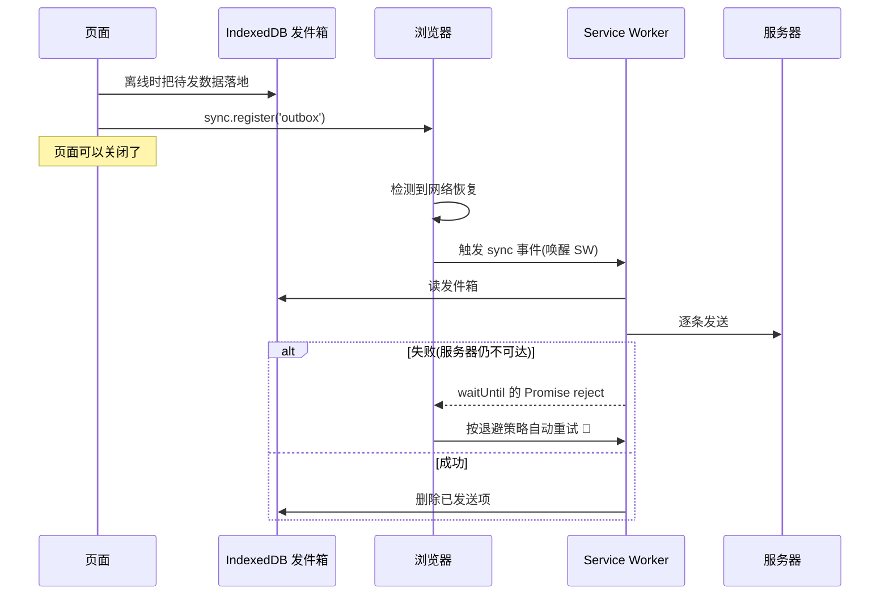

核心是 `event.waitUntil(promise)`:**若 promise reject,浏览器会自动重试这次 sync**,直到成功或放弃。这提供了「最终一定送达」的**尽力而为保证**。代价:不保证即时(浏览器挑省电/网络好的时机),且 `sync` 处理必须**幂等**(可能重试→服务端要去重)。模块 06 演示了完整的发件箱流程。

### 6.2 Push:服务器主动「叫醒」客户端

Push 让**服务器**能在页面关闭时把消息推到设备。它需要一个中间人——浏览器厂商的**推送服务(Push Service)**:

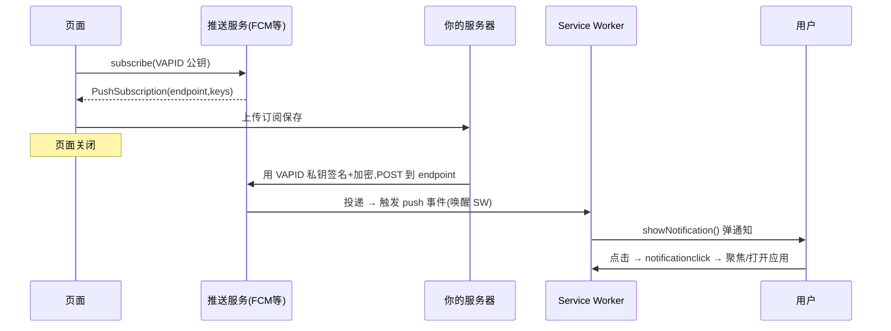

几个关键点:

- **endpoint 指向推送服务**,不是你的服务器。你的服务器只是「把加密消息交给推送服务代发」。
- **VAPID** 是一对公私钥:公钥给 `subscribe`,私钥留服务器签名,向推送服务证明「这条推送确实来自订阅时那个应用」。
- **`userVisibleOnly: true` 是强制的**:承诺每次推送都给用户可见通知,防止 Web 被拿来做无声后台追踪。收到 push 却不弹通知,浏览器会警告乃至撤权。

Push 与 Sync 的共性,就是**「SW 能被浏览器在页面之外唤醒」**——这是 PWA 后台能力的统一底层机制。模块 07 演示了权限、订阅、`push`、`notificationclick` 全链路(并说明如何用 DevTools 手动派发 push 测试)。

---

<a name="七"></a>
## 七、安装与更新:从网页到桌面应用

「可安装」不是把网页存成快捷方式那么简单。浏览器要确认这是个**够格当应用**的站点,才提供安装:

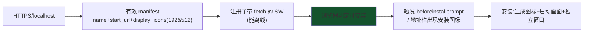

- **Manifest** 是「身份证」:告诉浏览器应用叫什么、图标是什么、以什么窗口模式(`standalone` 独立窗口)启动、主题色是什么。缺 512px 图标、`display: browser`、没 `start_url` 都会让「可安装」失败(模块 02/08)。
- **`beforeinstallprompt`**:满足条件时触发,`preventDefault()` 拦下默认提示、存下事件,改由你的自定义按钮调 `prompt()`——这样能控制**何时、以何种 UI** 引导安装,提升转化。
- **安装后**用 `matchMedia('(display-mode: standalone)')` 可判断是否以已安装形态运行,据此隐藏「安装」按钮等。

关于**审计**:Lighthouse **12 版起移除了独立的 PWA 评分类别**,如今可安装性主要看 **DevTools → Application → Manifest 的 Installability 诊断**与真实安装体验,而非某个「PWA 分数」。核对清单(HTTPS + 合规 manifest + 带 fetch 的 SW + 离线可用)比追分更实在。模块 08 用一个页内自检器把这些条件逐项可视化。

---

<a name="八"></a>
## 八、与相邻方案对比

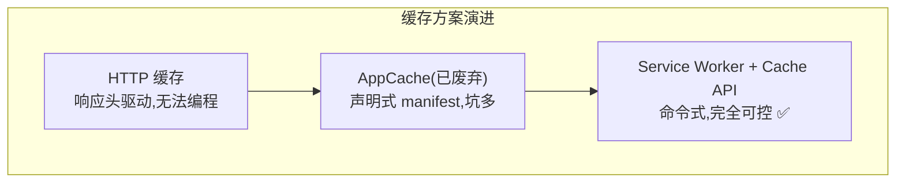

| 维度 | HTTP 缓存 | AppCache(废弃) | Service Worker | 原生 App |
| --- | --- | --- | --- | --- |
| 缓存控制 | 响应头,浏览器决定 | 声明式,难调试 | **命令式,任意逻辑** | 完全自控 |
| 离线导航兜底 | ❌ | 勉强 | ✅ 可编程 | ✅ |
| 后台同步/推送 | ❌ | ❌ | ✅ | ✅ |
| 安装/分发 | 无 | 无 | 免商店,一个 URL | 应用商店审核 |
| 更新 | 即时 | 反直觉、易坏 | 生命周期可控 | 商店审核、需用户更新 |
| 设备能力 | 受限 | 受限 | 逐步增强(蓝牙/文件/推送) | 最全 |

**为什么 SW 取代了 AppCache**:AppCache 用一份声明式 manifest 描述要缓存什么,但它的更新逻辑反直觉、`fallback` 行为怪异、出错难排查,被称为「充满陷阱」。SW 把控制权彻底交给代码——**你写多少逻辑,就有多少能力**,这也是它值得多花力气理解的原因。

**PWA vs 原生**:原生仍在设备能力(底层硬件、后台自由度)上领先;但 PWA 以「免安装商店、一份代码跨平台、一个 URL 可链接可索引、更新即时」取胜。选型不是二选一,而是看**分发成本、更新频率、所需设备能力**的权衡。

---

<a name="九"></a>
## 九、常见误区速查

- **「`file://` 双击就能测 PWA」** ❌ SW 只在 HTTPS/localhost 注册。必须起本地服务器。
- **「改了 sw.js 刷新就生效」** ❌ 新版卡在 waiting,要等旧页全关或 skipWaiting。开发时勾 DevTools 的 *Update on reload*。
- **「Cache First 缓存一切最快」** ❌ 对会变的 HTML 用 Cache First = 用户永远看旧版。HTML 用 Network First,只有带 hash 的静态资源才 Cache First。
- **「SW 里用 localStorage 存队列」** ❌ SW 无 window、localStorage 不可用,且 SW 随时被杀。持久状态用 IndexedDB / Cache。
- **「全局变量能在 SW 里存状态」** ❌ SW 无事件时被终止,重启后全局变量清零。
- **「`navigator.onLine === true` 就能连服务器」** ❌ 它只表示连了网卡,不代表能到达你的后端。真判断靠 fetch 是否成功。
- **「一进页面就弹通知权限」** ❌ 转化低、招人烦、无手势会被拦。用户明确想要时再请求。
- **「Background Sync 能做精确定时」** ❌ 它是尽力而为,浏览器挑时机触发。要实时用 WebSocket,要定时也无精确保证。
- **「追 Lighthouse 的 PWA 满分」** ❌ 该类别已在 Lighthouse 12 移除。以 Application 面板的可安装诊断和真实体验为准。
- **「cache.put 后直接返回 res」** ❌ body 已被消费,必须 `res.clone()`。

---

<a name="十"></a>
## 十、权威文档索引

- MDN · Progressive web apps:<https://developer.mozilla.org/zh-CN/docs/Web/Progressive_web_apps>
- MDN · Service Worker API:<https://developer.mozilla.org/zh-CN/docs/Web/API/Service_Worker_API>
- MDN · 使用 Service Worker:<https://developer.mozilla.org/zh-CN/docs/Web/API/Service_Worker_API/Using_Service_Workers>
- MDN · Cache API:<https://developer.mozilla.org/zh-CN/docs/Web/API/Cache>
- MDN · Web app manifest:<https://developer.mozilla.org/zh-CN/docs/Web/Manifest>
- MDN · Push API / Notifications API:<https://developer.mozilla.org/zh-CN/docs/Web/API/Push_API>
- MDN · Background Synchronization API:<https://developer.mozilla.org/en-US/docs/Web/API/Background_Synchronization_API>
- web.dev · Learn PWA:<https://web.dev/learn/pwa>
- web.dev · The Offline Cookbook(缓存策略):<https://web.dev/articles/offline-cookbook>
- web.dev · The service worker lifecycle:<https://web.dev/articles/service-worker-lifecycle>
- Chrome · Workbox(生产级 SW 工具):<https://developer.chrome.com/docs/workbox>
